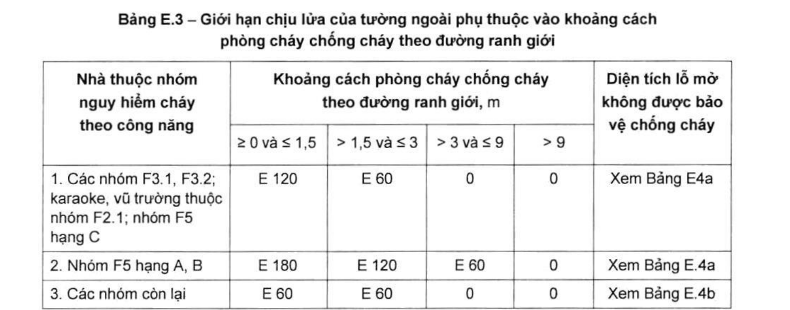
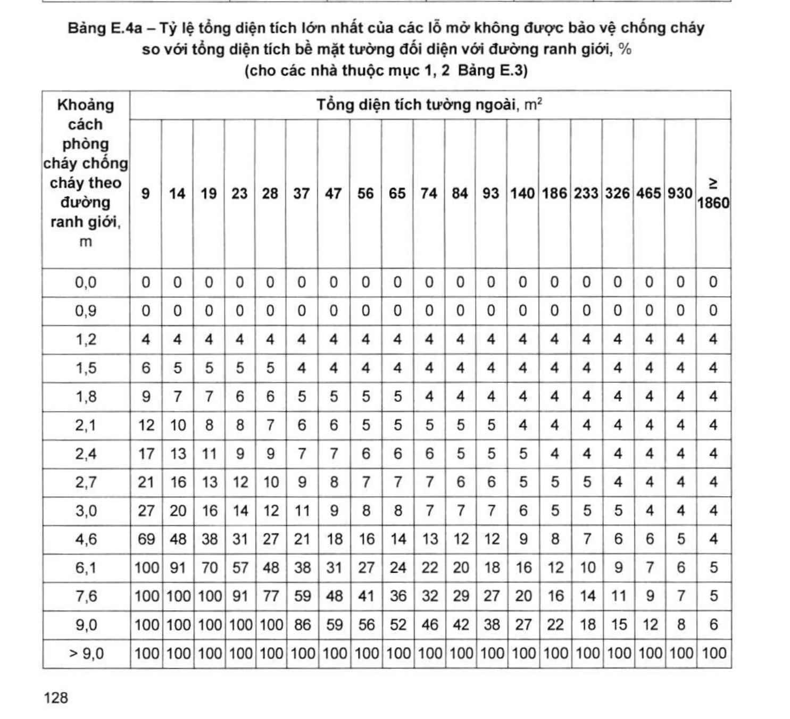
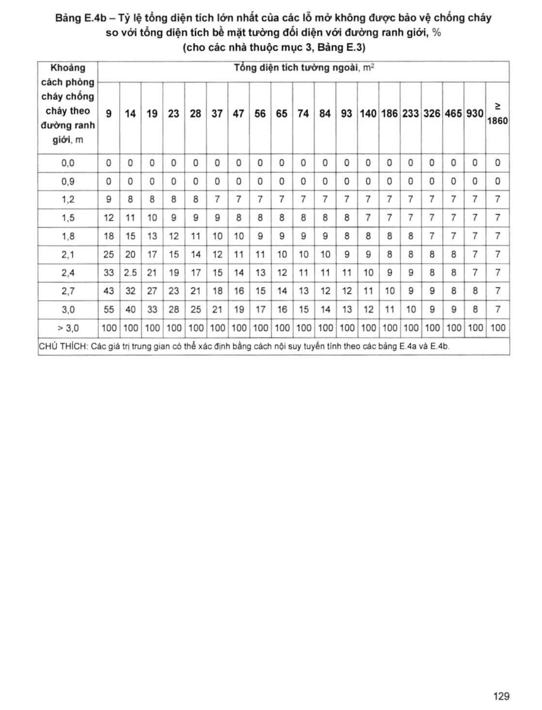

> **Trích dẫn:** mục E.3 QCVN 06:2022/BXD

# E.3 Xác định diện tích lỗ mở không được bảo vệ chống cháy của tường ngoài và giới hạn chịu lửa tương ứng của phần tường ngoài phải bảo vệ chống cháy

## E.3 Xác định diện tích lỗ mở không được bảo vệ chống cháy của tường ngoài và giới hạn chịu lửa tương ứng của phần tường ngoài phải bảo vệ chống cháy

**E.3.1** Khoảng cách phòng cháy chống cháy theo đường ranh giới được quy định trong phần này để xác định tỉ lệ diện tích tường ngoài không được bảo vệ chống cháy và giới hạn chịu lửa của tường ngoài.

**E.3.2** Khoảng cách phòng cháy chống cháy theo đường ranh giới là chiều rộng của khoảng không gian hở và không thay đổi, đo theo phương ngang vuông góc 90° từ tường ngoài nhà tới đường ranh giới của khu đất liền kề, hoặc tới đường trung tuyến của đường giao thông tiếp giáp, hoặc tới một đường quy ước giữa tường ngoài của các nhà liền kề trong cùng một khu đất.

Đường quy ước được xác định như sau:

- Nếu một nhà đã có sẵn thì đường quy ước sẽ song song và cách mặt ngoài của nhà có sẵn một khoảng cách tương ứng với tổng diện tích mặt ngoài không được bảo vệ và giới hạn chịu lửa tường ngoài của nhà này (xem các bảng E.3, E.4a và E.4b);
- Nếu cả hai nhà đều xây mới thì đường quy ước là đường phù hợp với diện tích mặt ngoài không được bảo vệ và giới hạn chịu lửa tường ngoài của cả hai nhà.
- Nếu mặt ngoài nhà có hình dáng không đều thì đường phân định được xác định theo phương án an toàn nhất từ các mặt phẳng tường ngoài khác nhau.

> CHÚ THÍCH: Phần không được bảo vệ chống cháy của tường ngoài thường là các phần sau:
>
> a) Các cửa (cửa đi, cửa sổ, và cửa tương tự) không đáp ứng yêu cầu là các cửa ngăn cháy trong tường ngăn cháy;
>
> b) Các phần tường có giới hạn chịu lửa thấp hơn giới hạn chịu lửa của tường ngăn cháy tương ứng;
>
> c) Các phần tường mà bề mặt ngoài có sử dụng các vật liệu có tính nguy hiểm cháy bằng và cao hơn các nhóm Ch1 và LT1.

**E.3.3** Tỷ lệ tổng diện tích lớn nhất của các lỗ mở không được bảo vệ chống cháy so với tổng diện tích bề mặt tường đối diện với đường ranh giới được xác định theo các bảng E.4a và E.4b. Giới hạn chịu lửa của phần tường được bảo vệ chống cháy được quy định tại Bảng E.3.

> CHÚ THÍCH: Trong mọi trường hợp, phải tuân thủ cả yêu cầu chống cháy lan theo mặt ngoài nhà tại 4.32, 4.33.

**Bảng E.3 – Giới hạn chịu lửa của tường ngoài phụ thuộc vào khoảng cách phòng cháy chống cháy theo đường ranh giới**

*Khoảng cách phòng cháy chống cháy theo đường ranh giới, m:*

| Nhà thuộc nhóm nguy hiểm cháy theo công năng | ≥ 0 và ≤ 1,5 | > 1,5 và ≤ 3 | > 3 và ≤ 9 | > 9 | Diện tích lỗ mở không được bảo vệ chống cháy |
|---|---|---|---|---|---|
| 1. Các nhóm F3.1, F3.2; karaoke, vũ trường thuộc nhóm F2.1; nhóm F5 hạng C | E 120 | E 60 | 0 | 0 | Xem Bảng E.4a |
| 2. Nhóm F5 hạng A, B | E 180 | E 120 | E 60 | 0 | Xem Bảng E.4a |
| 3. Các nhóm còn lại | E 60 | E 60 | 0 | 0 | Xem Bảng E.4b |

**Bảng E.4a – Tỷ lệ tổng diện tích lớn nhất của các lỗ mở không được bảo vệ chống cháy so với tổng diện tích bề mặt tường đối diện với đường ranh giới, %** *(cho các nhà thuộc mục 1, 2 Bảng E.3)*

*Cột = Tổng diện tích tường ngoài, m². Hàng = Khoảng cách phòng cháy chống cháy theo đường ranh giới, m.*

| KC \ Dtích | 9 | 14 | 19 | 23 | 28 | 37 | 47 | 56 | 65 | 74 | 84 | 93 | 140 | 186 | 233 | 326 | 465 | 930 | ≥ 1860 |
|---|---|---|---|---|---|---|---|---|---|---|---|---|---|---|---|---|---|---|---|
| **0,0** | 0 | 0 | 0 | 0 | 0 | 0 | 0 | 0 | 0 | 0 | 0 | 0 | 0 | 0 | 0 | 0 | 0 | 0 | 0 |
| **0,9** | 0 | 0 | 0 | 0 | 0 | 0 | 0 | 0 | 0 | 0 | 0 | 0 | 0 | 0 | 0 | 0 | 0 | 0 | 0 |
| **1,2** | 4 | 4 | 4 | 4 | 4 | 4 | 4 | 4 | 4 | 4 | 4 | 4 | 4 | 4 | 4 | 4 | 4 | 4 | 4 |
| **1,5** | 6 | 5 | 5 | 5 | 5 | 4 | 4 | 4 | 4 | 4 | 4 | 4 | 4 | 4 | 4 | 4 | 4 | 4 | 4 |
| **1,8** | 9 | 7 | 7 | 6 | 6 | 5 | 5 | 5 | 5 | 4 | 4 | 4 | 4 | 4 | 4 | 4 | 4 | 4 | 4 |
| **2,1** | 12 | 10 | 8 | 8 | 7 | 6 | 6 | 5 | 5 | 5 | 5 | 5 | 4 | 4 | 4 | 4 | 4 | 4 | 4 |
| **2,4** | 17 | 13 | 11 | 9 | 9 | 7 | 7 | 6 | 6 | 6 | 5 | 5 | 5 | 4 | 4 | 4 | 4 | 4 | 4 |
| **2,7** | 21 | 16 | 13 | 12 | 10 | 9 | 8 | 7 | 7 | 7 | 6 | 6 | 5 | 5 | 5 | 4 | 4 | 4 | 4 |
| **3,0** | 27 | 20 | 16 | 14 | 12 | 11 | 9 | 8 | 8 | 7 | 7 | 7 | 6 | 5 | 5 | 5 | 4 | 4 | 4 |
| **4,6** | 69 | 48 | 38 | 31 | 27 | 21 | 18 | 16 | 14 | 13 | 12 | 12 | 9 | 8 | 7 | 6 | 6 | 5 | 4 |
| **6,1** | 100 | 91 | 70 | 57 | 48 | 38 | 31 | 27 | 24 | 22 | 20 | 18 | 16 | 12 | 10 | 9 | 7 | 6 | 5 |
| **7,6** | 100 | 100 | 100 | 91 | 77 | 59 | 48 | 41 | 36 | 32 | 29 | 27 | 20 | 16 | 14 | 11 | 9 | 7 | 5 |
| **9,0** | 100 | 100 | 100 | 100 | 100 | 86 | 59 | 56 | 52 | 46 | 42 | 38 | 27 | 22 | 18 | 15 | 12 | 8 | 6 |
| **> 9,0** | 100 | 100 | 100 | 100 | 100 | 100 | 100 | 100 | 100 | 100 | 100 | 100 | 100 | 100 | 100 | 100 | 100 | 100 | 100 |

**Bảng E.4b – Tỷ lệ tổng diện tích lớn nhất của các lỗ mở không được bảo vệ chống cháy so với tổng diện tích bề mặt tường đối diện với đường ranh giới, %** *(cho các nhà thuộc mục 3, Bảng E.3)*

*Cột = Tổng diện tích tường ngoài, m². Hàng = Khoảng cách phòng cháy chống cháy theo đường ranh giới, m.*

| KC \ Dtích | 9 | 14 | 19 | 23 | 28 | 37 | 47 | 56 | 65 | 74 | 84 | 93 | 140 | 186 | 233 | 326 | 465 | 930 | ≥ 1860 |
|---|---|---|---|---|---|---|---|---|---|---|---|---|---|---|---|---|---|---|---|
| **0,0** | 0 | 0 | 0 | 0 | 0 | 0 | 0 | 0 | 0 | 0 | 0 | 0 | 0 | 0 | 0 | 0 | 0 | 0 | 0 |
| **0,9** | 0 | 0 | 0 | 0 | 0 | 0 | 0 | 0 | 0 | 0 | 0 | 0 | 0 | 0 | 0 | 0 | 0 | 0 | 0 |
| **1,2** | 9 | 8 | 8 | 8 | 8 | 7 | 7 | 7 | 7 | 7 | 7 | 7 | 7 | 7 | 7 | 7 | 7 | 7 | 7 |
| **1,5** | 12 | 11 | 10 | 9 | 9 | 9 | 8 | 8 | 8 | 8 | 8 | 8 | 7 | 7 | 7 | 7 | 7 | 7 | 7 |
| **1,8** | 18 | 15 | 13 | 12 | 11 | 10 | 10 | 9 | 9 | 9 | 9 | 8 | 8 | 8 | 8 | 7 | 7 | 7 | 7 |
| **2,1** | 25 | 20 | 17 | 15 | 14 | 12 | 11 | 11 | 10 | 10 | 10 | 9 | 9 | 8 | 8 | 8 | 8 | 7 | 7 |
| **2,4** | 33 | 25 ^*)^ | 21 | 19 | 17 | 15 | 14 | 13 | 12 | 11 | 11 | 11 | 10 | 9 | 9 | 8 | 8 | 7 | 7 |
| **2,7** | 43 | 32 | 27 | 23 | 21 | 18 | 16 | 15 | 14 | 13 | 12 | 12 | 11 | 10 | 9 | 9 | 8 | 8 | 7 |
| **3,0** | 55 | 40 | 33 | 28 | 25 | 21 | 19 | 17 | 16 | 15 | 14 | 13 | 12 | 11 | 10 | 9 | 9 | 8 | 7 |
| **> 3,0** | 100 | 100 | 100 | 100 | 100 | 100 | 100 | 100 | 100 | 100 | 100 | 100 | 100 | 100 | 100 | 100 | 100 | 100 | 100 |

> CHÚ THÍCH: Các giá trị trung gian có thể xác định bằng cách nội suy tuyến tính theo các bảng E.4a và E.4b.
>
> ^*)^ **GHI CHÚ CỦA BẢN SỐ HÓA (không thuộc văn bản gốc):** ô này trên bản scan in là "2.5". Giá trị đó không nhất quán với cột (hàng trên là 20, hàng dưới là 32) nên gần như chắc chắn là **25** bị lỗi in/quét. Khi cần con số chính xác cho hồ sơ pháp lý, phải đối chiếu lại bản công báo gốc.
