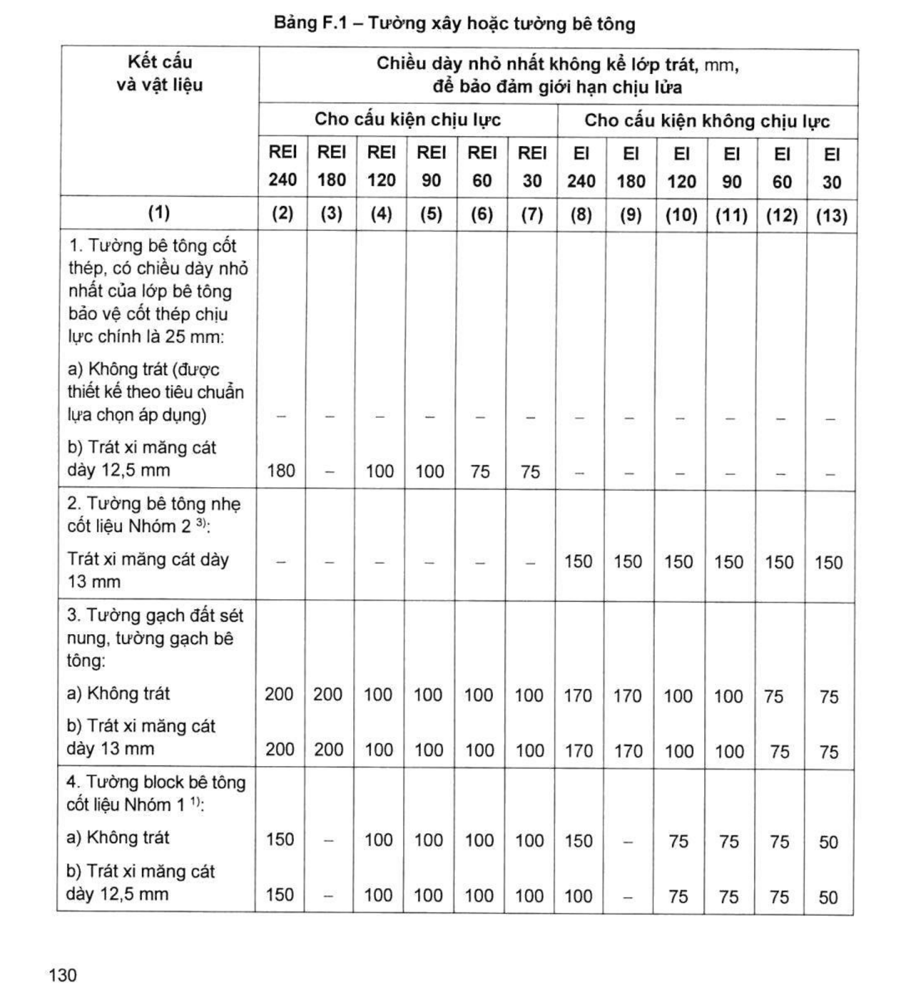
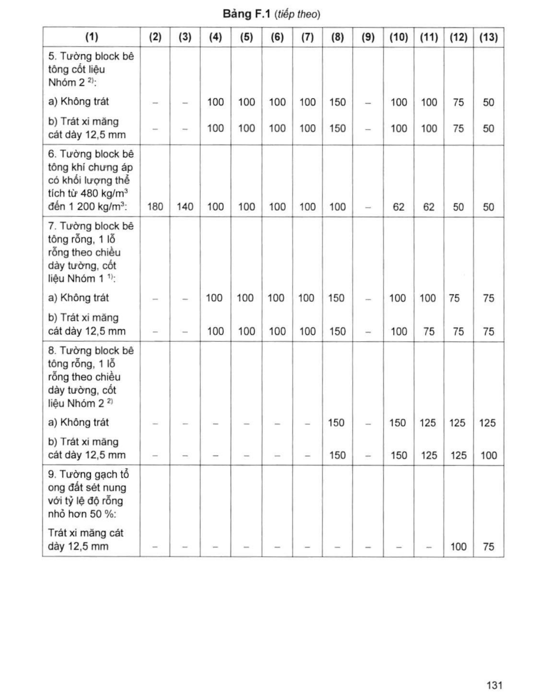
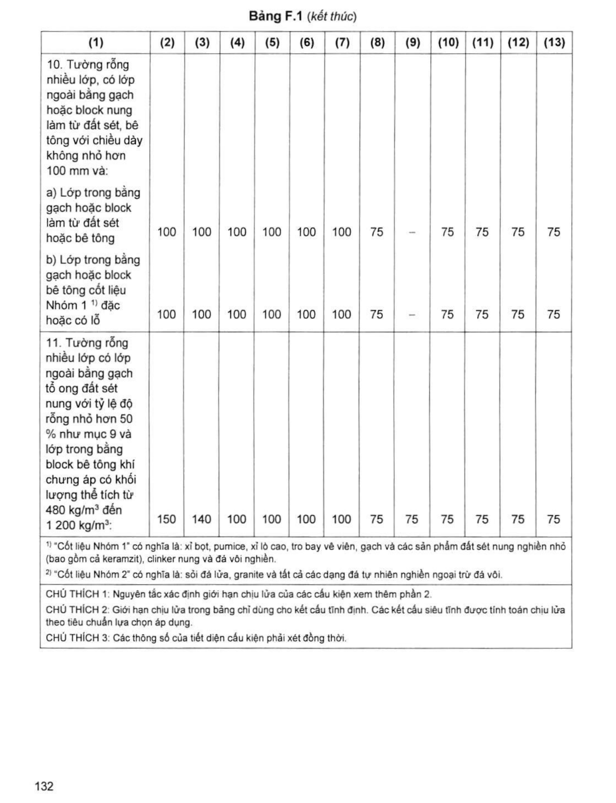
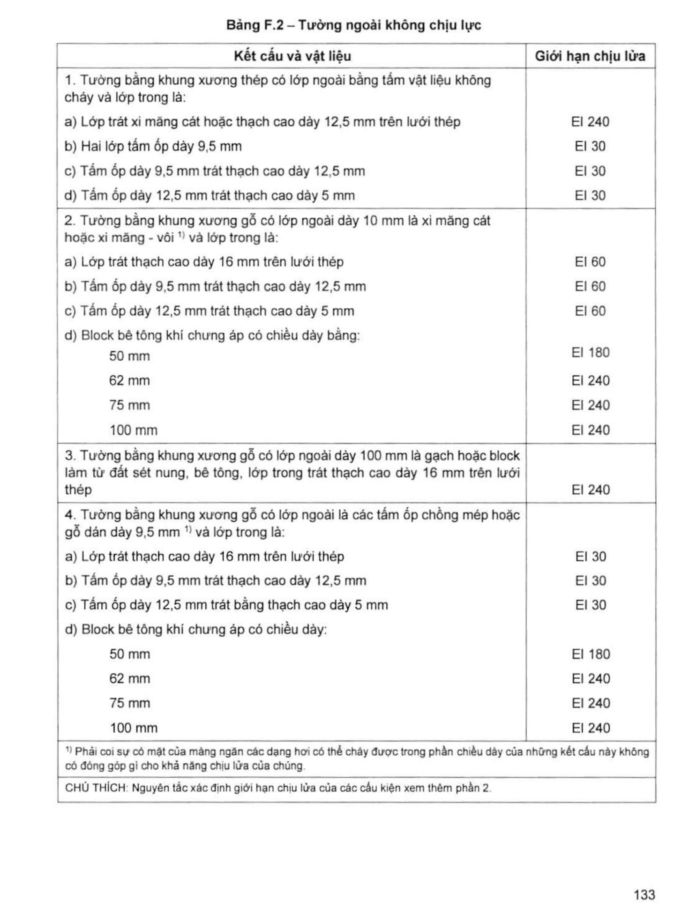

> **Trích dẫn:** mục F.1 QCVN 06:2022/BXD

# F.1 Cấu kiện tường

## F.1 Cấu kiện tường

**Bảng F.1 – Tường xây hoặc tường bê tông**

*Chiều dày nhỏ nhất không kể lớp trát, mm, để bảo đảm giới hạn chịu lửa:*

| Kết cấu và vật liệu | REI 240 | REI 180 | REI 120 | REI 90 | REI 60 | REI 30 | EI 240 | EI 180 | EI 120 | EI 90 | EI 60 | EI 30 |
|---|---|---|---|---|---|---|---|---|---|---|---|---|
| (1) | (2) | (3) | (4) | (5) | (6) | (7) | (8) | (9) | (10) | (11) | (12) | (13) |
| **1. Tường bê tông cốt thép, có chiều dày nhỏ nhất của lớp bê tông bảo vệ cốt thép chịu lực chính là 25 mm:** | | | | | | | | | | | | |
| a) Không trát (được thiết kế theo tiêu chuẩn lựa chọn áp dụng) | – | – | – | – | – | – | – | – | – | – | – | – |
| b) Trát xi măng cát dày 12,5 mm | 180 | – | 100 | 100 | 75 | 75 | – | – | – | – | – | – |
| **2. Tường bê tông nhẹ cốt liệu Nhóm 2** ^3)^ | | | | | | | | | | | | |
| Trát xi măng cát dày 13 mm | – | – | – | – | – | – | 150 | 150 | 150 | 150 | 150 | 150 |
| **3. Tường gạch đất sét nung, tường gạch bê tông:** | | | | | | | | | | | | |
| a) Không trát | 200 | 200 | 100 | 100 | 100 | 100 | 170 | 170 | 100 | 100 | 75 | 75 |
| b) Trát xi măng cát dày 13 mm | 200 | 200 | 100 | 100 | 100 | 100 | 170 | 170 | 100 | 100 | 75 | 75 |
| **4. Tường block bê tông cốt liệu Nhóm 1** ^1)^ | | | | | | | | | | | | |
| a) Không trát | 150 | – | 100 | 100 | 100 | 100 | 150 | – | 75 | 75 | 75 | 50 |
| b) Trát xi măng cát dày 12,5 mm | 150 | – | 100 | 100 | 100 | 100 | 100 | – | 75 | 75 | 75 | 50 |
| **5. Tường block bê tông cốt liệu Nhóm 2** ^2)^ | | | | | | | | | | | | |
| a) Không trát | – | – | 100 | 100 | 100 | 100 | 150 | – | 100 | 100 | 75 | 50 |
| b) Trát xi măng cát dày 12,5 mm | – | – | 100 | 100 | 100 | 100 | 150 | – | 100 | 100 | 75 | 50 |
| **6. Tường block bê tông khí chưng áp có khối lượng thể tích từ 480 kg/m³ đến 1 200 kg/m³** | 180 | 140 | 100 | 100 | 100 | 100 | 100 | – | 62 | 62 | 50 | 50 |
| **7. Tường block bê tông rỗng, 1 lỗ rỗng theo chiều dày tường, cốt liệu Nhóm 1** ^1)^ | | | | | | | | | | | | |
| a) Không trát | – | – | 100 | 100 | 100 | 100 | 150 | – | 100 | 100 | 75 | 75 |
| b) Trát xi măng cát dày 12,5 mm | – | – | 100 | 100 | 100 | 100 | 150 | – | 100 | 75 | 75 | 75 |
| **8. Tường block bê tông rỗng, 1 lỗ rỗng theo chiều dày tường, cốt liệu Nhóm 2** ^2)^ | | | | | | | | | | | | |
| a) Không trát | – | – | – | – | – | – | 150 | – | 150 | 125 | 125 | 125 |
| b) Trát xi măng cát dày 12,5 mm | – | – | – | – | – | – | 150 | – | 150 | 125 | 125 | 100 |
| **9. Tường gạch tổ ong đất sét nung với tỷ lệ độ rỗng nhỏ hơn 50 %** | | | | | | | | | | | | |
| Trát xi măng cát dày 12,5 mm | – | – | – | – | – | – | – | – | – | – | 100 | 75 |
| **10. Tường rỗng nhiều lớp, có lớp ngoài bằng gạch hoặc block nung làm từ đất sét, bê tông với chiều dày không nhỏ hơn 100 mm và:** | | | | | | | | | | | | |
| a) Lớp trong bằng gạch hoặc block làm từ đất sét hoặc bê tông | 100 | 100 | 100 | 100 | 100 | 100 | 75 | – | 75 | 75 | 75 | 75 |
| b) Lớp trong bằng gạch hoặc block bê tông cốt liệu Nhóm 1 ^1)^ đặc hoặc có lỗ | 100 | 100 | 100 | 100 | 100 | 100 | 75 | – | 75 | 75 | 75 | 75 |
| **11. Tường rỗng nhiều lớp có lớp ngoài bằng gạch tổ ong đất sét nung với tỷ lệ độ rỗng nhỏ hơn 50 % như mục 9 và lớp trong bằng block bê tông khí chưng áp có khối lượng thể tích từ 480 kg/m³ đến 1 200 kg/m³** | 150 | 140 | 100 | 100 | 100 | 100 | 75 | 75 | 75 | 75 | 75 | 75 |

> ^1)^ "Cốt liệu Nhóm 1" có nghĩa là: xỉ bọt, pumice, xỉ lò cao, tro bay vê viên, gạch và các sản phẩm đất sét nung nghiền nhỏ (bao gồm cả keramzit), clinker nung và đá vôi nghiền.
>
> ^2)^ "Cốt liệu Nhóm 2" có nghĩa là: sỏi đá lửa, granite và tất cả các dạng đá tự nhiên nghiền ngoại trừ đá vôi.
>
> CHÚ THÍCH 1: Nguyên tắc xác định giới hạn chịu lửa của các cấu kiện xem thêm phần 2.
>
> CHÚ THÍCH 2: Giới hạn chịu lửa trong bảng chỉ dùng cho kết cấu tĩnh định. Các kết cấu siêu tĩnh được tính toán chịu lửa theo tiêu chuẩn lựa chọn áp dụng.
>
> CHÚ THÍCH 3: Các thông số của tiết diện cấu kiện phải xét đồng thời.

**Bảng F.2 – Tường ngoài không chịu lực**

| Kết cấu và vật liệu | Giới hạn chịu lửa |
|---|---|
| **1. Tường bằng khung xương thép có lớp ngoài bằng tấm vật liệu không cháy và lớp trong là:** | |
| a) Lớp trát xi măng cát hoặc thạch cao dày 12,5 mm trên lưới thép | EI 240 |
| b) Hai lớp tấm ốp dày 9,5 mm | EI 30 |
| c) Tấm ốp dày 9,5 mm trát thạch cao dày 12,5 mm | EI 30 |
| d) Tấm ốp dày 12,5 mm trát thạch cao dày 5 mm | EI 30 |
| **2. Tường bằng khung xương gỗ có lớp ngoài dày 10 mm là xi măng cát hoặc xi măng - vôi** ^1)^ **và lớp trong là:** | |
| a) Lớp trát thạch cao dày 16 mm trên lưới thép | EI 60 |
| b) Tấm ốp dày 9,5 mm trát thạch cao dày 12,5 mm | EI 60 |
| c) Tấm ốp dày 12,5 mm trát thạch cao dày 5 mm | EI 60 |
| d) Block bê tông khí chưng áp có chiều dày bằng: 50 mm | EI 180 |
| d) … 62 mm | EI 240 |
| d) … 75 mm | EI 240 |
| d) … 100 mm | EI 240 |
| **3. Tường bằng khung xương gỗ có lớp ngoài dày 100 mm là gạch hoặc block làm từ đất sét nung, bê tông, lớp trong trát thạch cao dày 16 mm trên lưới thép** | EI 240 |
| **4. Tường bằng khung xương gỗ có lớp ngoài là các tấm ốp chồng mép hoặc gỗ dán dày 9,5 mm** ^1)^ **và lớp trong là:** | |
| a) Lớp trát thạch cao dày 16 mm trên lưới thép | EI 30 |
| b) Tấm ốp dày 9,5 mm trát thạch cao dày 12,5 mm | EI 30 |
| c) Tấm ốp dày 12,5 mm trát bằng thạch cao dày 5 mm | EI 30 |
| d) Block bê tông khí chưng áp có chiều dày: 50 mm | EI 180 |
| d) … 62 mm | EI 240 |
| d) … 75 mm | EI 240 |
| d) … 100 mm | EI 240 |

> ^1)^ Phải coi sự có mặt của màng ngăn các dạng hơi có thể cháy được trong phần chiều dày của những kết cấu này không có đóng góp gì cho khả năng chịu lửa của chúng.
>
> CHÚ THÍCH: Nguyên tắc xác định giới hạn chịu lửa của các cấu kiện xem thêm phần 2.
