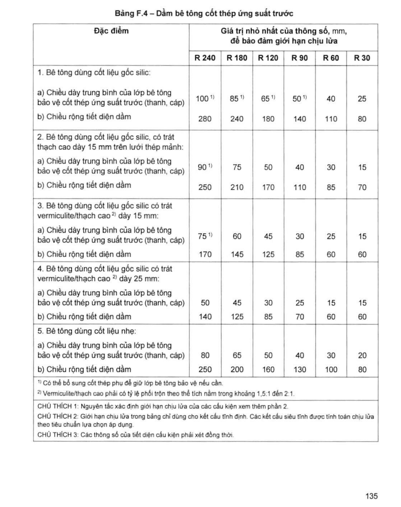

> **Trích dẫn:** mục F.3 QCVN 06:2022/BXD

# F.3 Dầm bê tông cốt thép ứng suất trước

## F.3 Dầm bê tông cốt thép ứng suất trước

**Bảng F.4 – Dầm bê tông cốt thép ứng suất trước**

*Giá trị nhỏ nhất của thông số, mm, để bảo đảm giới hạn chịu lửa:*

| Đặc điểm | R 240 | R 180 | R 120 | R 90 | R 60 | R 30 |
|---|---|---|---|---|---|---|
| **1. Bê tông dùng cốt liệu gốc silic:** | | | | | | |
| a) Chiều dày trung bình của lớp bê tông bảo vệ cốt thép ứng suất trước (thanh, cáp) | 100 ^1)^ | 85 ^1)^ | 65 ^1)^ | 50 ^1)^ | 40 | 25 |
| b) Chiều rộng tiết diện dầm | 280 | 240 | 180 | 140 | 110 | 80 |
| **2. Bê tông dùng cốt liệu gốc silic, có trát thạch cao dày 15 mm trên lưới thép mảnh:** | | | | | | |
| a) Chiều dày trung bình của lớp bê tông bảo vệ cốt thép ứng suất trước (thanh, cáp) | 90 ^1)^ | 75 | 50 | 40 | 30 | 15 |
| b) Chiều rộng tiết diện dầm | 250 | 210 | 170 | 110 | 85 | 70 |
| **3. Bê tông dùng cốt liệu gốc silic có trát vermiculite/thạch cao** ^2)^ **dày 15 mm:** | | | | | | |
| a) Chiều dày trung bình của lớp bê tông bảo vệ cốt thép ứng suất trước (thanh, cáp) | 75 ^1)^ | 60 | 45 | 30 | 25 | 15 |
| b) Chiều rộng tiết diện dầm | 170 | 145 | 125 | 85 | 60 | 60 |
| **4. Bê tông dùng cốt liệu gốc silic có trát vermiculite/thạch cao** ^2)^ **dày 25 mm:** | | | | | | |
| a) Chiều dày trung bình của lớp bê tông bảo vệ cốt thép ứng suất trước (thanh, cáp) | 50 | 45 | 30 | 25 | 15 | 15 |
| b) Chiều rộng tiết diện dầm | 140 | 125 | 85 | 70 | 60 | 60 |
| **5. Bê tông dùng cốt liệu nhẹ:** | | | | | | |
| a) Chiều dày trung bình của lớp bê tông bảo vệ cốt thép ứng suất trước (thanh, cáp) | 80 | 65 | 50 | 40 | 30 | 20 |
| b) Chiều rộng tiết diện dầm | 250 | 200 | 160 | 130 | 100 | 80 |

> ^1)^ Có thể bổ sung cốt thép phụ để giữ lớp bê tông bảo vệ nếu cần.
>
> ^2)^ Vermiculite/thạch cao phải có tỷ lệ phối trộn theo thể tích nằm trong khoảng 1,5:1 đến 2:1.
>
> CHÚ THÍCH 1: Nguyên tắc xác định giới hạn chịu lửa của các cấu kiện xem thêm phần 2.
>
> CHÚ THÍCH 2: Giới hạn chịu lửa trong bảng chỉ dùng cho kết cấu tĩnh định. Các kết cấu siêu tĩnh được tính toán chịu lửa theo tiêu chuẩn lựa chọn áp dụng.
>
> CHÚ THÍCH 3: Các thông số của tiết diện cấu kiện phải xét đồng thời.
