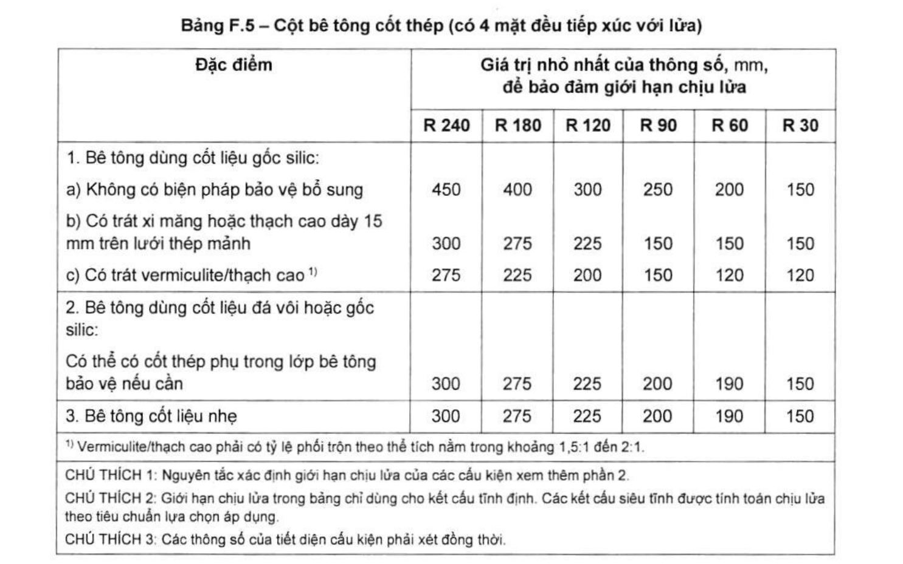
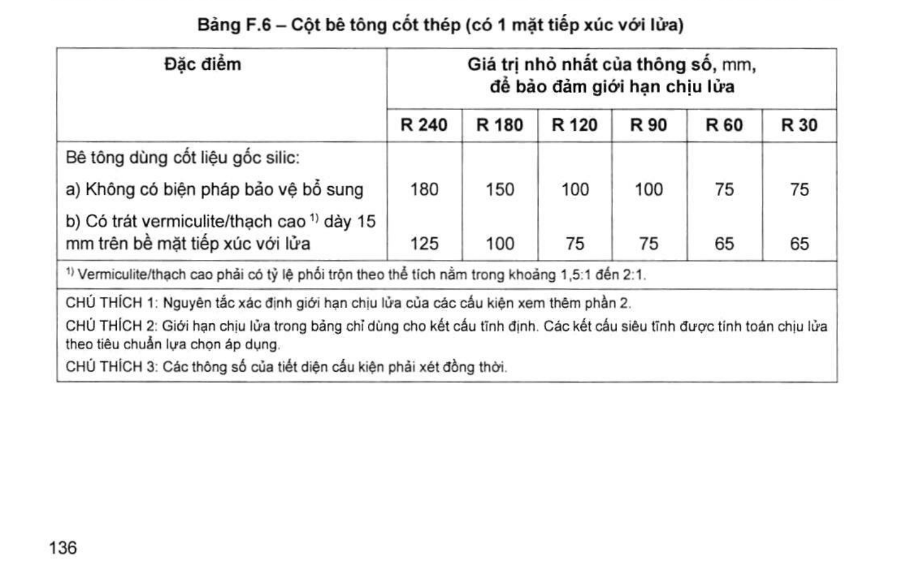

> **Trích dẫn:** mục F.4 QCVN 06:2022/BXD

# F.4 Cột bê tông cốt thép

## F.4 Cột bê tông cốt thép

**Bảng F.5 – Cột bê tông cốt thép (có 4 mặt đều tiếp xúc với lửa)**

*Giá trị nhỏ nhất của thông số, mm, để bảo đảm giới hạn chịu lửa:*

| Đặc điểm | R 240 | R 180 | R 120 | R 90 | R 60 | R 30 |
|---|---|---|---|---|---|---|
| **1. Bê tông dùng cốt liệu gốc silic:** | | | | | | |
| a) Không có biện pháp bảo vệ bổ sung | 450 | 400 | 300 | 250 | 200 | 150 |
| b) Có trát xi măng hoặc thạch cao dày 15 mm trên lưới thép mảnh | 300 | 275 | 225 | 150 | 150 | 150 |
| c) Có trát vermiculite/thạch cao ^1)^ | 275 | 225 | 200 | 150 | 120 | 120 |
| **2. Bê tông dùng cốt liệu đá vôi hoặc gốc silic:** Có thể có cốt thép phụ trong lớp bê tông bảo vệ nếu cần | 300 | 275 | 225 | 200 | 190 | 150 |
| **3. Bê tông cốt liệu nhẹ** | 300 | 275 | 225 | 200 | 190 | 150 |

> ^1)^ Vermiculite/thạch cao phải có tỷ lệ phối trộn theo thể tích nằm trong khoảng 1,5:1 đến 2:1.
>
> CHÚ THÍCH 1: Nguyên tắc xác định giới hạn chịu lửa của các cấu kiện xem thêm phần 2.
>
> CHÚ THÍCH 2: Giới hạn chịu lửa trong bảng chỉ dùng cho kết cấu tĩnh định. Các kết cấu siêu tĩnh được tính toán chịu lửa theo tiêu chuẩn lựa chọn áp dụng.
>
> CHÚ THÍCH 3: Các thông số của tiết diện cấu kiện phải xét đồng thời.

**Bảng F.6 – Cột bê tông cốt thép (có 1 mặt tiếp xúc với lửa)**

*Giá trị nhỏ nhất của thông số, mm, để bảo đảm giới hạn chịu lửa:*

| Đặc điểm | R 240 | R 180 | R 120 | R 90 | R 60 | R 30 |
|---|---|---|---|---|---|---|
| **Bê tông dùng cốt liệu gốc silic:** | | | | | | |
| a) Không có biện pháp bảo vệ bổ sung | 180 | 150 | 100 | 100 | 75 | 75 |
| b) Có trát vermiculite/thạch cao ^1)^ dày 15 mm trên bề mặt tiếp xúc với lửa | 125 | 100 | 75 | 75 | 65 | 65 |

> ^1)^ Vermiculite/thạch cao phải có tỷ lệ phối trộn theo thể tích nằm trong khoảng 1,5:1 đến 2:1.
>
> CHÚ THÍCH 1: Nguyên tắc xác định giới hạn chịu lửa của các cấu kiện xem thêm phần 2.
>
> CHÚ THÍCH 2: Giới hạn chịu lửa trong bảng chỉ dùng cho kết cấu tĩnh định. Các kết cấu siêu tĩnh được tính toán chịu lửa theo tiêu chuẩn lựa chọn áp dụng.
>
> CHÚ THÍCH 3: Các thông số của tiết diện cấu kiện phải xét đồng thời.
