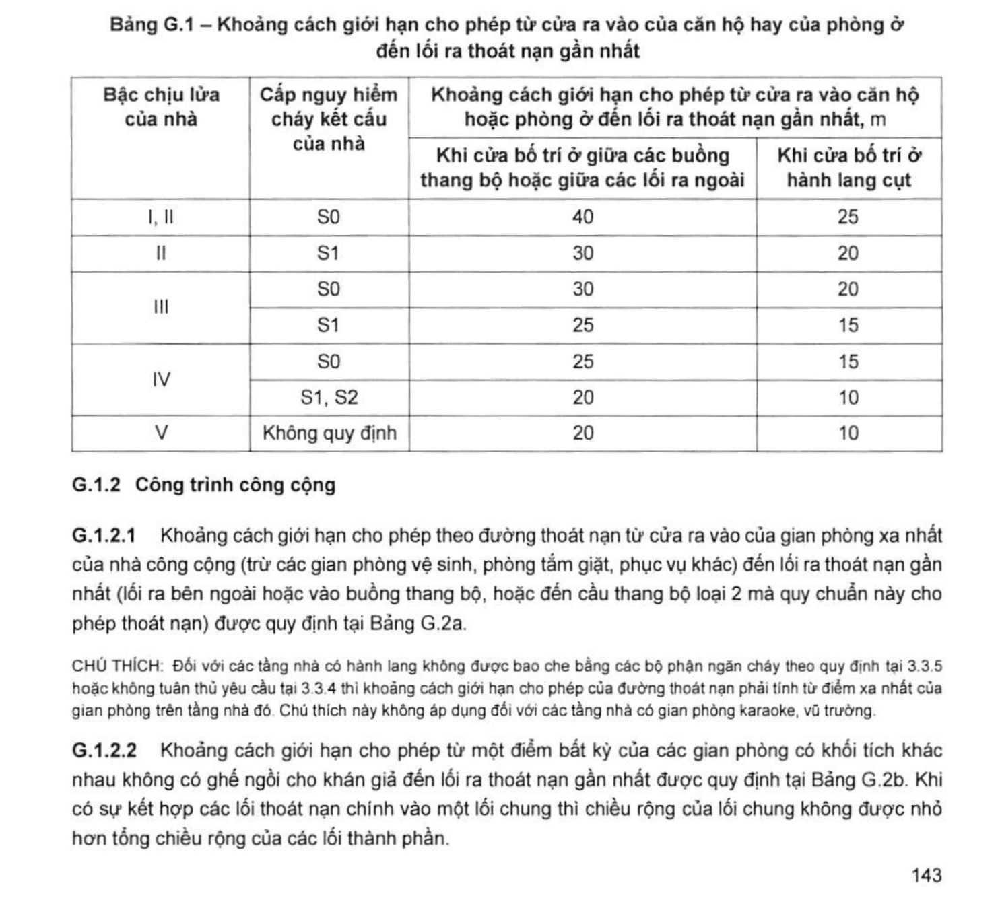
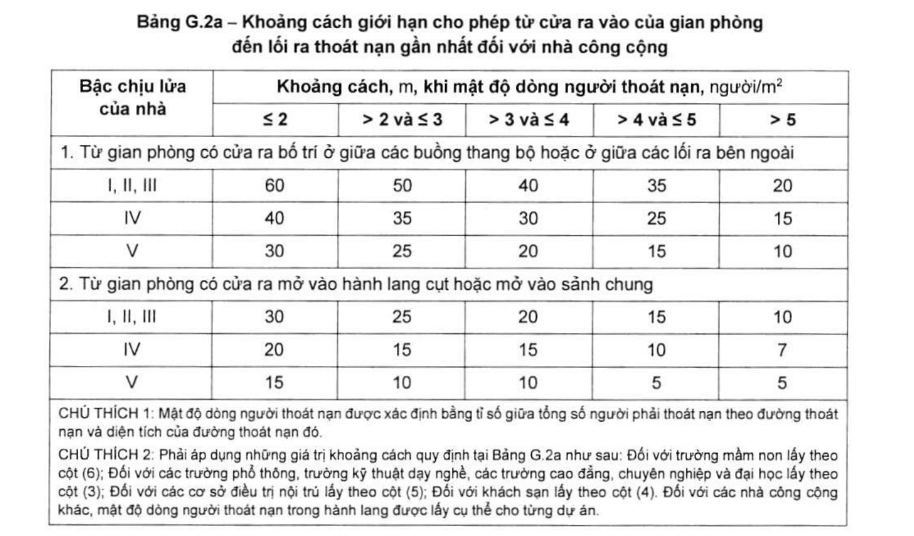
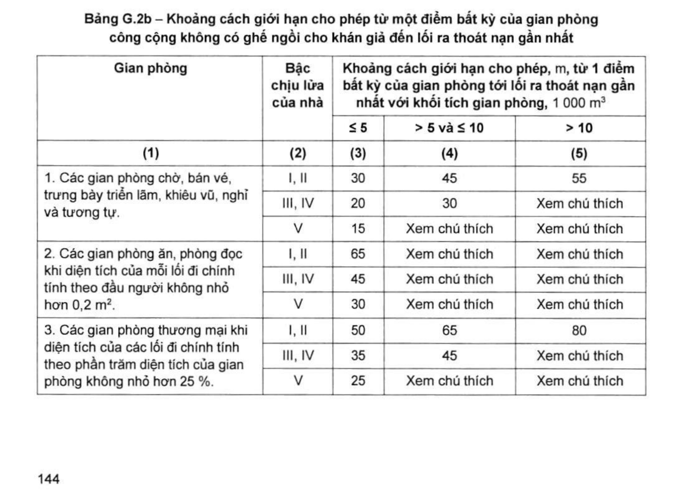
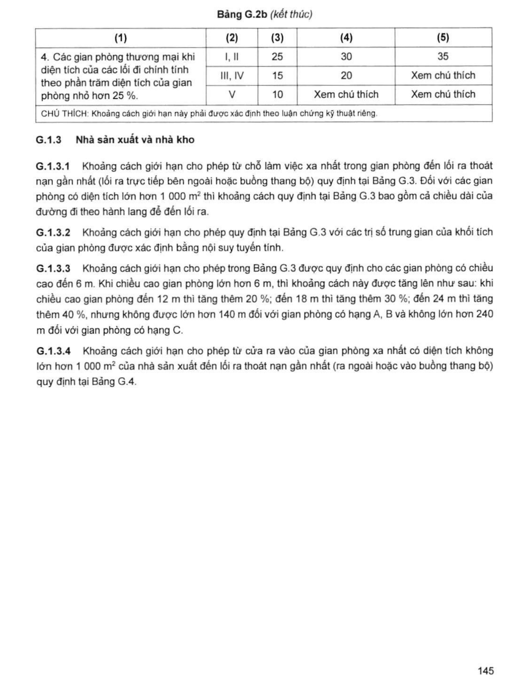
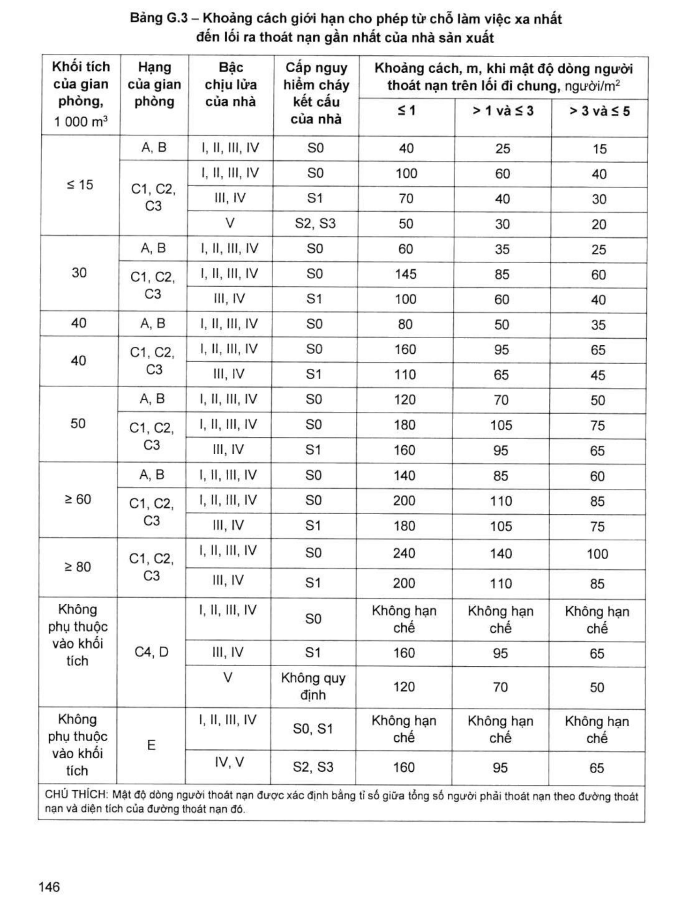
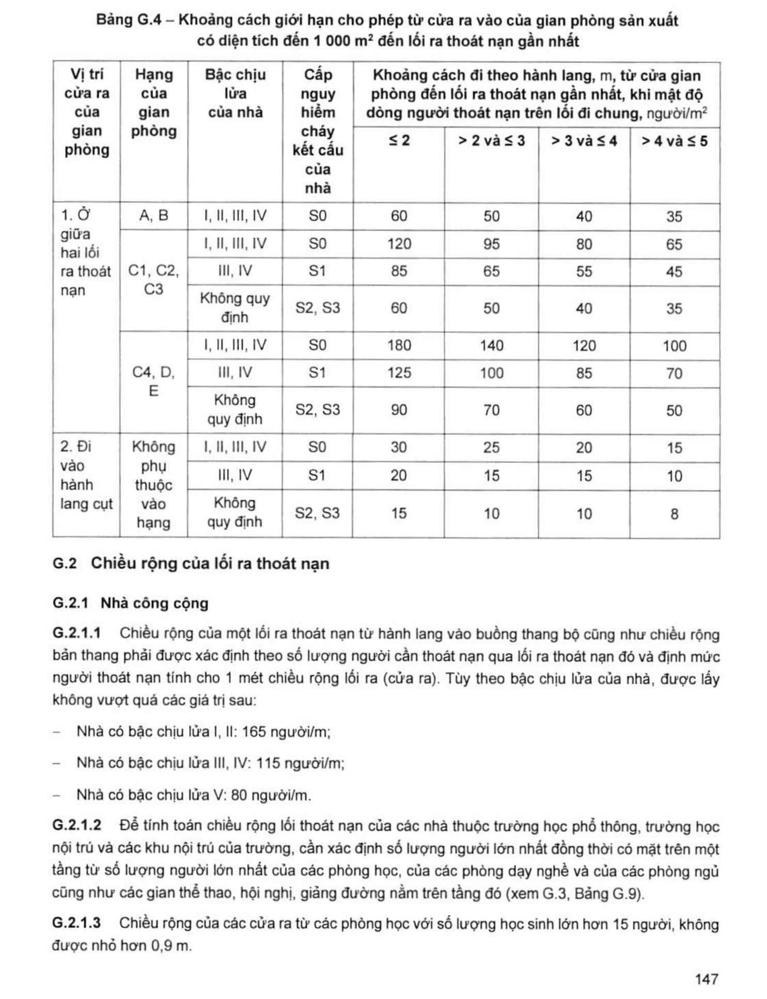

> **Trích dẫn:** mục G.1 QCVN 06:2022/BXD

# G.1 Khoảng cách giới hạn cho phép từ chỗ xa nhất (có người sinh hoạt, làm việc) đến lối ra thoát nạn gần nhất

## G.1 Khoảng cách giới hạn cho phép từ chỗ xa nhất (có người sinh hoạt, làm việc) đến lối ra thoát nạn gần nhất

### G.1.1 Nhà ở

Khoảng cách giới hạn cho phép từ cửa ra vào của căn hộ (nhà nhóm F1.3) hoặc của phòng ở (nhà nhóm F1.2) đến lối ra thoát nạn gần nhất (buồng thang bộ hoặc lối ra bên ngoài) được quy định tại Bảng G.1.

**Bảng G.1 – Khoảng cách giới hạn cho phép từ cửa ra vào của căn hộ hay của phòng ở đến lối ra thoát nạn gần nhất**

*Khoảng cách giới hạn cho phép từ cửa ra vào căn hộ hoặc phòng ở đến lối ra thoát nạn gần nhất, m:*

| Bậc chịu lửa của nhà | Cấp nguy hiểm cháy kết cấu của nhà | Khi cửa bố trí ở giữa các buồng thang bộ hoặc giữa các lối ra ngoài | Khi cửa bố trí ở hành lang cụt |
|---|---|---|---|
| I, II | S0 | **40** | **25** |
| II | S1 | 30 | 20 |
| III | S0 | 30 | 20 |
| III | S1 | 25 | 15 |
| IV | S0 | 25 | 15 |
| IV | S1, S2 | 20 | 10 |
| V | Không quy định | 20 | 10 |

### G.1.2 Công trình công cộng

**G.1.2.1** Khoảng cách giới hạn cho phép theo đường thoát nạn từ cửa ra vào của gian phòng xa nhất của nhà công cộng (trừ các gian phòng vệ sinh, phòng tắm giặt, phục vụ khác) đến lối ra thoát nạn gần nhất (lối ra bên ngoài hoặc vào buồng thang bộ, hoặc đến cầu thang bộ loại 2 mà quy chuẩn này cho phép thoát nạn) được quy định tại Bảng G.2a.

> CHÚ THÍCH: Đối với các tầng nhà có hành lang không được bao che bằng các bộ phận ngăn cháy theo quy định tại 3.3.5 hoặc không tuân thủ yêu cầu tại 3.3.4 thì khoảng cách giới hạn cho phép của đường thoát nạn phải tính từ điểm xa nhất của gian phòng trên tầng nhà đó. Chú thích này không áp dụng đối với các tầng nhà có gian phòng karaoke, vũ trường.

**G.1.2.2** Khoảng cách giới hạn cho phép từ một điểm bất kỳ của các gian phòng có khối tích khác nhau không có ghế ngồi cho khán giả đến lối ra thoát nạn gần nhất được quy định tại Bảng G.2b. Khi có sự kết hợp các lối thoát nạn chính vào một lối chung thì chiều rộng của lối chung không được nhỏ hơn tổng chiều rộng của các lối thành phần.

**Bảng G.2a – Khoảng cách giới hạn cho phép từ cửa ra vào của gian phòng đến lối ra thoát nạn gần nhất đối với nhà công cộng**

*Khoảng cách, m, khi mật độ dòng người thoát nạn, người/m²:*

| Bậc chịu lửa của nhà | ≤ 2 | > 2 và ≤ 3 | > 3 và ≤ 4 | > 4 và ≤ 5 | > 5 |
|---|---|---|---|---|---|
| **1. Từ gian phòng có cửa ra bố trí ở giữa các buồng thang bộ hoặc ở giữa các lối ra bên ngoài** | | | | | |
| I, II, III | 60 | 50 | 40 | 35 | 20 |
| IV | 40 | 35 | 30 | 25 | 15 |
| V | 30 | 25 | 20 | 15 | 10 |
| **2. Từ gian phòng có cửa ra mở vào hành lang cụt hoặc mở vào sảnh chung** | | | | | |
| I, II, III | 30 | 25 | 20 | 15 | 10 |
| IV | 20 | 15 | 15 | 10 | 7 |
| V | 15 | 10 | 10 | 5 | 5 |

> CHÚ THÍCH 1: Mật độ dòng người thoát nạn được xác định bằng tỉ số giữa tổng số người phải thoát nạn theo đường thoát nạn và diện tích của đường thoát nạn đó.
>
> CHÚ THÍCH 2: Phải áp dụng những giá trị khoảng cách quy định tại Bảng G.2a như sau: Đối với **trường mầm non** lấy theo cột (6); Đối với các **trường phổ thông, trường kỹ thuật dạy nghề, các trường cao đẳng, chuyên nghiệp và đại học** lấy theo cột (3); Đối với các **cơ sở điều trị nội trú** lấy theo cột (5); Đối với **khách sạn** lấy theo cột (4). Đối với các nhà công cộng khác, mật độ dòng người thoát nạn trong hành lang được lấy cụ thể cho từng dự án.

*(Đánh số cột trong CHÚ THÍCH 2 tính cả cột "Bậc chịu lửa": cột (2) = "≤ 2", cột (3) = "> 2 và ≤ 3", cột (4) = "> 3 và ≤ 4", cột (5) = "> 4 và ≤ 5", cột (6) = "> 5".)*

**Bảng G.2b – Khoảng cách giới hạn cho phép từ một điểm bất kỳ của gian phòng công cộng không có ghế ngồi cho khán giả đến lối ra thoát nạn gần nhất**

*Khoảng cách giới hạn cho phép, m, từ 1 điểm bất kỳ của gian phòng tới lối ra thoát nạn gần nhất với khối tích gian phòng, 1 000 m³:*

| Gian phòng | Bậc chịu lửa của nhà | ≤ 5 | > 5 và ≤ 10 | > 10 |
|---|---|---|---|---|
| (1) | (2) | (3) | (4) | (5) |
| **1. Các gian phòng chờ, bán vé, trưng bày triển lãm, khiêu vũ, nghỉ và tương tự** | I, II | 30 | 45 | 55 |
| | III, IV | 20 | 30 | Xem chú thích |
| | V | 15 | Xem chú thích | Xem chú thích |
| **2. Các gian phòng ăn, phòng đọc khi diện tích của mỗi lối đi chính tính theo đầu người không nhỏ hơn 0,2 m²** | I, II | 65 | Xem chú thích | Xem chú thích |
| | III, IV | 45 | Xem chú thích | Xem chú thích |
| | V | 30 | Xem chú thích | Xem chú thích |
| **3. Các gian phòng thương mại khi diện tích của các lối đi chính tính theo phần trăm diện tích của gian phòng không nhỏ hơn 25 %** | I, II | 50 | 65 | 80 |
| | III, IV | 35 | 45 | Xem chú thích |
| | V | 25 | Xem chú thích | Xem chú thích |
| **4. Các gian phòng thương mại khi diện tích của các lối đi chính tính theo phần trăm diện tích của gian phòng nhỏ hơn 25 %** | I, II | 25 | 30 | 35 |
| | III, IV | 15 | 20 | Xem chú thích |
| | V | 10 | Xem chú thích | Xem chú thích |

> CHÚ THÍCH: Khoảng cách giới hạn này phải được xác định theo luận chứng kỹ thuật riêng.

### G.1.3 Nhà sản xuất và nhà kho

**G.1.3.1** Khoảng cách giới hạn cho phép từ chỗ làm việc xa nhất trong gian phòng đến lối ra thoát nạn gần nhất (lối ra trực tiếp bên ngoài hoặc buồng thang bộ) quy định tại Bảng G.3. Đối với các gian phòng có diện tích lớn hơn **1 000 m²** thì khoảng cách quy định tại Bảng G.3 bao gồm cả chiều dài của đường đi theo hành lang để đến lối ra.

**G.1.3.2** Khoảng cách giới hạn cho phép quy định tại Bảng G.3 với các trị số trung gian của khối tích của gian phòng được xác định bằng **nội suy tuyến tính**.

**G.1.3.3** Khoảng cách giới hạn cho phép trong Bảng G.3 được quy định cho các gian phòng có chiều cao đến **6 m**. Khi chiều cao gian phòng lớn hơn 6 m, thì khoảng cách này được tăng lên như sau: khi chiều cao gian phòng đến 12 m thì tăng thêm **20 %**; đến 18 m thì tăng thêm **30 %**; đến 24 m thì tăng thêm **40 %**, nhưng không được lớn hơn **140 m** đối với gian phòng có hạng A, B và không lớn hơn **240 m** đối với gian phòng có hạng C.

**G.1.3.4** Khoảng cách giới hạn cho phép từ cửa ra vào của gian phòng xa nhất có diện tích không lớn hơn 1 000 m² của nhà sản xuất đến lối ra thoát nạn gần nhất (ra ngoài hoặc vào buồng thang bộ) quy định tại Bảng G.4.

**Bảng G.3 – Khoảng cách giới hạn cho phép từ chỗ làm việc xa nhất đến lối ra thoát nạn gần nhất của nhà sản xuất**

*Khoảng cách, m, khi mật độ dòng người thoát nạn trên lối đi chung, người/m²:*

| Khối tích của gian phòng, 1 000 m³ | Hạng của gian phòng | Bậc chịu lửa của nhà | Cấp nguy hiểm cháy kết cấu của nhà | ≤ 1 | > 1 và ≤ 3 | > 3 và ≤ 5 |
|---|---|---|---|---|---|---|
| **≤ 15** | A, B | I, II, III, IV | S0 | 40 | 25 | 15 |
| ≤ 15 | C1, C2, C3 | I, II, III, IV | S0 | 100 | 60 | 40 |
| ≤ 15 | C1, C2, C3 | III, IV | S1 | 70 | 40 | 30 |
| ≤ 15 | C1, C2, C3 | V | S2, S3 | 50 | 30 | 20 |
| **30** | A, B | I, II, III, IV | S0 | 60 | 35 | 25 |
| 30 | C1, C2, C3 | I, II, III, IV | S0 | 145 | 85 | 60 |
| 30 | C1, C2, C3 | III, IV | S1 | 100 | 60 | 40 |
| **40** | A, B | I, II, III, IV | S0 | 80 | 50 | 35 |
| 40 | C1, C2, C3 | I, II, III, IV | S0 | 160 | 95 | 65 |
| 40 | C1, C2, C3 | III, IV | S1 | 110 | 65 | 45 |
| **50** | A, B | I, II, III, IV | S0 | 120 | 70 | 50 |
| 50 | C1, C2, C3 | I, II, III, IV | S0 | 180 | 105 | 75 |
| 50 | C1, C2, C3 | III, IV | S1 | 160 | 95 | 65 |
| **≥ 60** | A, B | I, II, III, IV | S0 | 140 | 85 | 60 |
| ≥ 60 | C1, C2, C3 | I, II, III, IV | S0 | 200 | 110 | 85 |
| ≥ 60 | C1, C2, C3 | III, IV | S1 | 180 | 105 | 75 |
| **≥ 80** | C1, C2, C3 | I, II, III, IV | S0 | 240 | 140 | 100 |
| ≥ 80 | C1, C2, C3 | III, IV | S1 | 200 | 110 | 85 |
| **Không phụ thuộc vào khối tích** | C4, D | I, II, III, IV | S0 | Không hạn chế | Không hạn chế | Không hạn chế |
| Không phụ thuộc vào khối tích | C4, D | III, IV | S1 | 160 | 95 | 65 |
| Không phụ thuộc vào khối tích | C4, D | V | Không quy định | 120 | 70 | 50 |
| **Không phụ thuộc vào khối tích** | E | I, II, III, IV | S0, S1 | Không hạn chế | Không hạn chế | Không hạn chế |
| Không phụ thuộc vào khối tích | E | IV, V | S2, S3 | 160 | 95 | 65 |

> CHÚ THÍCH: Mật độ dòng người thoát nạn được xác định bằng tỉ số giữa tổng số người phải thoát nạn theo đường thoát nạn và diện tích của đường thoát nạn đó.

**Bảng G.4 – Khoảng cách giới hạn cho phép từ cửa ra vào của gian phòng sản xuất có diện tích đến 1 000 m² đến lối ra thoát nạn gần nhất**

*Khoảng cách đi theo hành lang, m, từ cửa gian phòng đến lối ra thoát nạn gần nhất, khi mật độ dòng người thoát nạn trên lối đi chung, người/m²:*

| Vị trí cửa ra của gian phòng | Hạng của gian phòng | Bậc chịu lửa của nhà | Cấp nguy hiểm cháy kết cấu của nhà | ≤ 2 | > 2 và ≤ 3 | > 3 và ≤ 4 | > 4 và ≤ 5 |
|---|---|---|---|---|---|---|---|
| **1. Ở giữa hai lối ra thoát nạn** | A, B | I, II, III, IV | S0 | 60 | 50 | 40 | 35 |
| | C1, C2, C3 | I, II, III, IV | S0 | 120 | 95 | 80 | 65 |
| | C1, C2, C3 | III, IV | S1 | 85 | 65 | 55 | 45 |
| | C1, C2, C3 | Không quy định | S2, S3 | 60 | 50 | 40 | 35 |
| | C4, D, E | I, II, III, IV | S0 | 180 | 140 | 120 | 100 |
| | C4, D, E | III, IV | S1 | 125 | 100 | 85 | 70 |
| | C4, D, E | Không quy định | S2, S3 | 90 | 70 | 60 | 50 |
| **2. Đi vào hành lang cụt** | Không phụ thuộc vào hạng | I, II, III, IV | S0 | 30 | 25 | 20 | 15 |
| | Không phụ thuộc vào hạng | III, IV | S1 | 20 | 15 | 15 | 10 |
| | Không phụ thuộc vào hạng | Không quy định | S2, S3 | 15 | 10 | 10 | 8 |
