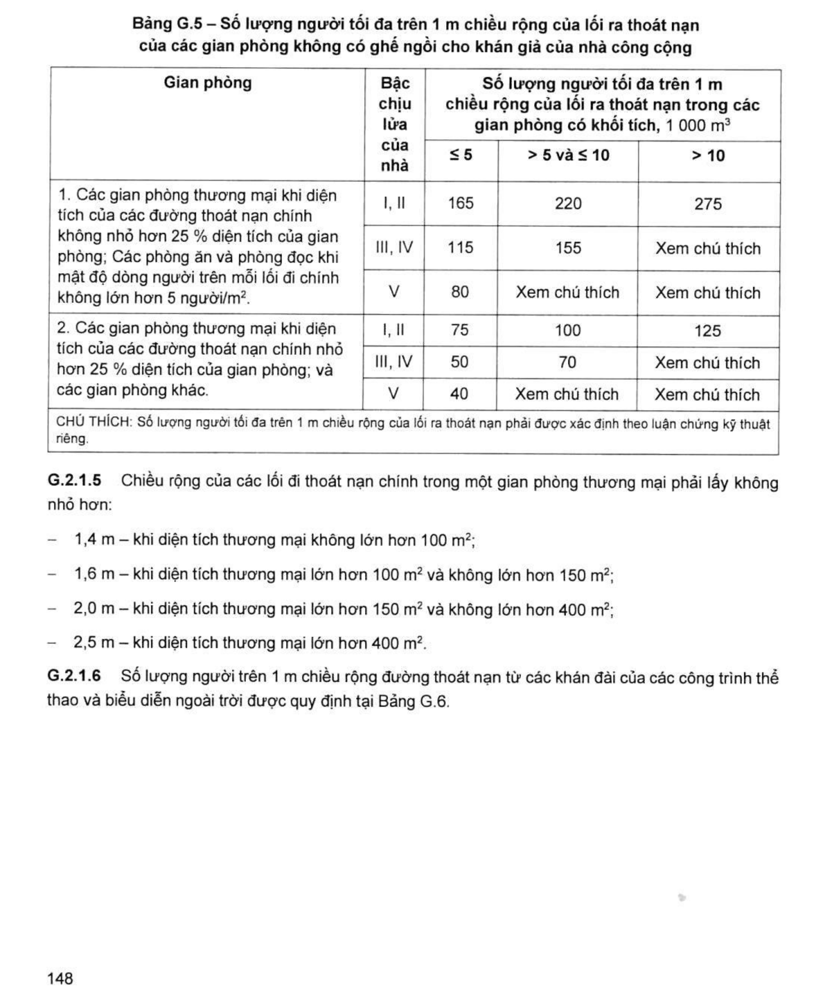
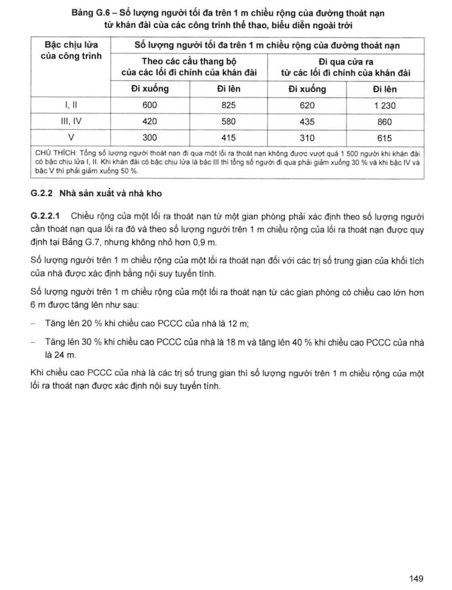
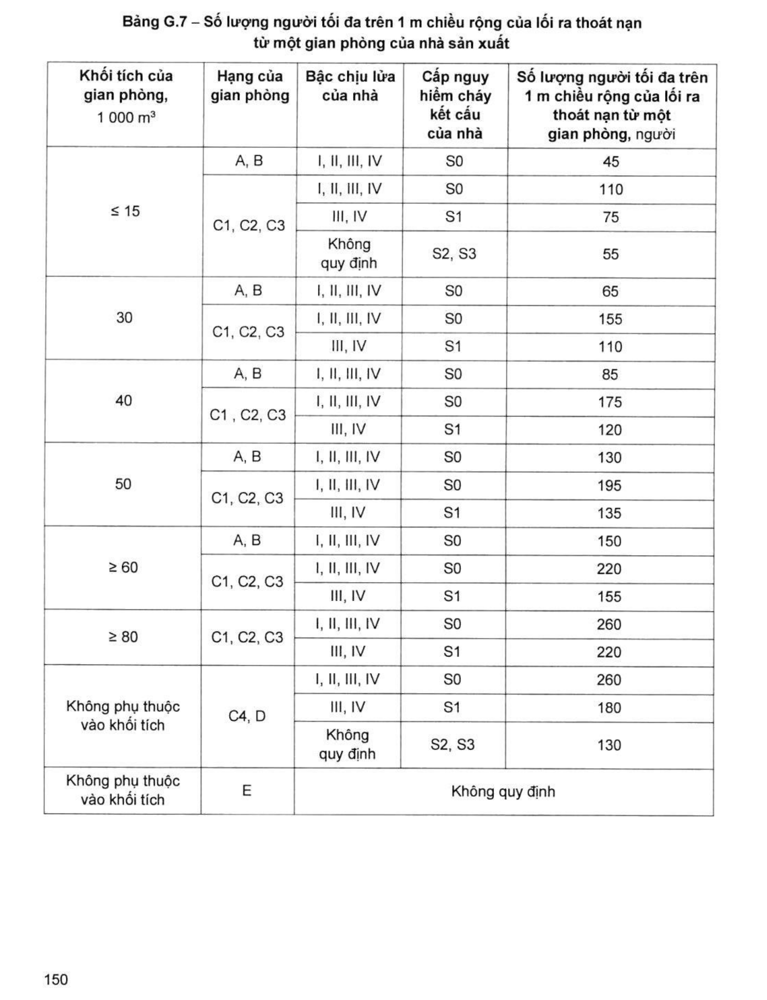
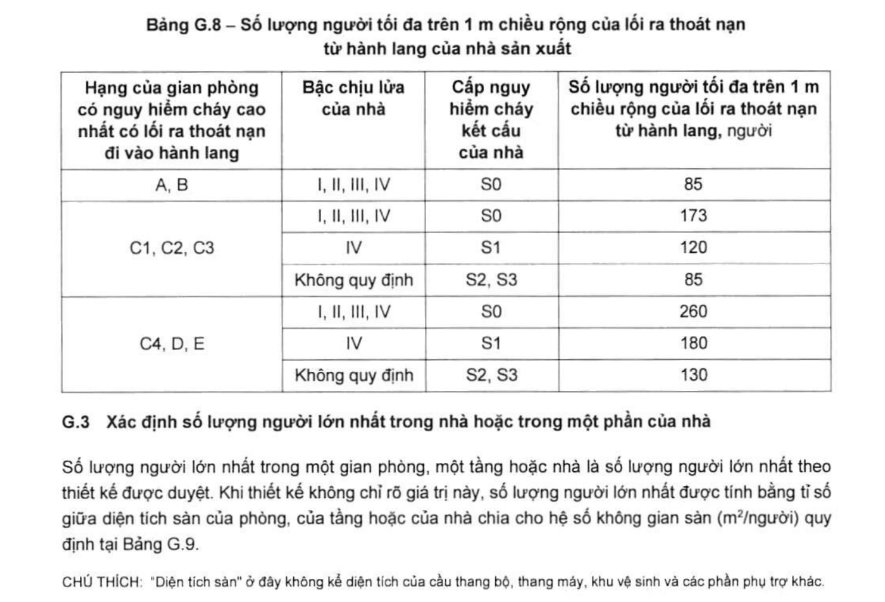

> **Trích dẫn:** mục G.2 QCVN 06:2022/BXD

# G.2 Chiều rộng của lối ra thoát nạn

## G.2 Chiều rộng của lối ra thoát nạn

### G.2.1 Nhà công cộng

**G.2.1.1** Chiều rộng của một lối ra thoát nạn từ hành lang vào buồng thang bộ cũng như chiều rộng bản thang phải được xác định theo số lượng người cần thoát nạn qua lối ra thoát nạn đó và định mức người thoát nạn tính cho 1 mét chiều rộng lối ra (cửa ra). Tùy theo bậc chịu lửa của nhà, được lấy không vượt quá các giá trị sau:

- Nhà có bậc chịu lửa **I, II: 165 người/m**;
- Nhà có bậc chịu lửa **III, IV: 115 người/m**;
- Nhà có bậc chịu lửa **V: 80 người/m**.

**G.2.1.2** Để tính toán chiều rộng lối thoát nạn của các nhà thuộc trường học phổ thông, trường học nội trú và các khu nội trú của trường, cần xác định số lượng người lớn nhất đồng thời có mặt trên một tầng từ số lượng người lớn nhất của các phòng học, của các phòng dạy nghề và của các phòng ngủ cũng như các gian thể thao, hội nghị, giảng đường nằm trên tầng đó (xem G.3, Bảng G.9).

**G.2.1.3** Chiều rộng của các cửa ra từ các phòng học với số lượng học sinh lớn hơn 15 người, không được nhỏ hơn **0,9 m**.

**G.2.1.4** Chiều rộng của một lối ra thoát nạn từ các gian phòng không có ghế ngồi cho khán giả phải xác định theo số lượng người cần thoát nạn qua lối ra đó theo Bảng G.5, nhưng không được nhỏ hơn **1,2 m** ở các gian phòng có sức chứa hơn 50 người.

**Bảng G.5 – Số lượng người tối đa trên 1 m chiều rộng của lối ra thoát nạn của các gian phòng không có ghế ngồi cho khán giả của nhà công cộng**

*Số lượng người tối đa trên 1 m chiều rộng của lối ra thoát nạn trong các gian phòng có khối tích, 1 000 m³:*

| Gian phòng | Bậc chịu lửa của nhà | ≤ 5 | > 5 và ≤ 10 | > 10 |
|---|---|---|---|---|
| **1. Các gian phòng thương mại khi diện tích của các đường thoát nạn chính không nhỏ hơn 25 % diện tích của gian phòng; Các phòng ăn và phòng đọc khi mật độ dòng người trên mỗi lối đi chính không lớn hơn 5 người/m².** | I, II | 165 | 220 | 275 |
| | III, IV | 115 | 155 | Xem chú thích |
| | V | 80 | Xem chú thích | Xem chú thích |
| **2. Các gian phòng thương mại khi diện tích của các đường thoát nạn chính nhỏ hơn 25 % diện tích của gian phòng; và các gian phòng khác.** | I, II | 75 | 100 | 125 |
| | III, IV | 50 | 70 | Xem chú thích |
| | V | 40 | Xem chú thích | Xem chú thích |

> CHÚ THÍCH: Số lượng người tối đa trên 1 m chiều rộng của lối ra thoát nạn phải được xác định theo luận chứng kỹ thuật riêng.

**G.2.1.5** Chiều rộng của các lối đi thoát nạn chính trong một gian phòng thương mại phải lấy không nhỏ hơn:

- **1,4 m** – khi diện tích thương mại không lớn hơn 100 m²;
- **1,6 m** – khi diện tích thương mại lớn hơn 100 m² và không lớn hơn 150 m²;
- **2,0 m** – khi diện tích thương mại lớn hơn 150 m² và không lớn hơn 400 m²;
- **2,5 m** – khi diện tích thương mại lớn hơn 400 m².

**G.2.1.6** Số lượng người trên 1 m chiều rộng đường thoát nạn từ các khán đài của các công trình thể thao và biểu diễn ngoài trời được quy định tại Bảng G.6.

**Bảng G.6 – Số lượng người tối đa trên 1 m chiều rộng của đường thoát nạn từ khán đài của các công trình thể thao, biểu diễn ngoài trời**

*Số lượng người tối đa trên 1 m chiều rộng của đường thoát nạn:*

| Bậc chịu lửa của công trình | Theo cầu thang bộ của lối đi chính khán đài — Đi xuống | Theo cầu thang bộ — Đi lên | Đi qua cửa ra từ lối đi chính khán đài — Đi xuống | Đi qua cửa ra — Đi lên |
|---|---|---|---|---|
| I, II | 600 | 825 | 620 | 1 230 |
| III, IV | 420 | 580 | 435 | 860 |
| V | 300 | 415 | 310 | 615 |

> CHÚ THÍCH: Tổng số lượng người thoát nạn đi qua một lối ra thoát nạn không được vượt quá **1 500 người** khi khán đài có bậc chịu lửa I, II. Khi khán đài có bậc chịu lửa là bậc III thì tổng số người đi qua phải giảm xuống 30 % và khi bậc IV và bậc V thì phải giảm xuống 50 %.

### G.2.2 Nhà sản xuất và nhà kho

**G.2.2.1** Chiều rộng của một lối ra thoát nạn từ một gian phòng phải xác định theo số lượng người cần thoát nạn qua lối ra đó và theo số lượng người trên 1 m chiều rộng của lối ra thoát nạn được quy định tại Bảng G.7, nhưng không nhỏ hơn **0,9 m**.

Số lượng người trên 1 m chiều rộng của một lối ra thoát nạn đối với các trị số trung gian của khối tích của nhà được xác định bằng nội suy tuyến tính.

Số lượng người trên 1 m chiều rộng của một lối ra thoát nạn từ các gian phòng có chiều cao lớn hơn 6 m được tăng lên như sau:

- Tăng lên **20 %** khi chiều cao PCCC của nhà là 12 m;
- Tăng lên **30 %** khi chiều cao PCCC của nhà là 18 m và tăng lên **40 %** khi chiều cao PCCC của nhà là 24 m.

Khi chiều cao PCCC của nhà là các trị số trung gian thì số lượng người trên 1 m chiều rộng của một lối ra thoát nạn được xác định nội suy tuyến tính.

**Bảng G.7 – Số lượng người tối đa trên 1 m chiều rộng của lối ra thoát nạn từ một gian phòng của nhà sản xuất**

| Khối tích của gian phòng, 1 000 m³ | Hạng của gian phòng | Bậc chịu lửa của nhà | Cấp nguy hiểm cháy kết cấu của nhà | Số lượng người tối đa trên 1 m chiều rộng của lối ra thoát nạn từ một gian phòng, người |
|---|---|---|---|---|
| **≤ 15** | A, B | I, II, III, IV | S0 | 45 |
| ≤ 15 | C1, C2, C3 | I, II, III, IV | S0 | 110 |
| ≤ 15 | C1, C2, C3 | III, IV | S1 | 75 |
| ≤ 15 | C1, C2, C3 | Không quy định | S2, S3 | 55 |
| **30** | A, B | I, II, III, IV | S0 | 65 |
| 30 | C1, C2, C3 | I, II, III, IV | S0 | 155 |
| 30 | C1, C2, C3 | III, IV | S1 | 110 |
| **40** | A, B | I, II, III, IV | S0 | 85 |
| 40 | C1, C2, C3 | I, II, III, IV | S0 | 175 |
| 40 | C1, C2, C3 | III, IV | S1 | 120 |
| **50** | A, B | I, II, III, IV | S0 | 130 |
| 50 | C1, C2, C3 | I, II, III, IV | S0 | 195 |
| 50 | C1, C2, C3 | III, IV | S1 | 135 |
| **≥ 60** | A, B | I, II, III, IV | S0 | 150 |
| ≥ 60 | C1, C2, C3 | I, II, III, IV | S0 | 220 |
| ≥ 60 | C1, C2, C3 | III, IV | S1 | 155 |
| **≥ 80** | C1, C2, C3 | I, II, III, IV | S0 | 260 |
| ≥ 80 | C1, C2, C3 | III, IV | S1 | 220 |
| **Không phụ thuộc vào khối tích** | C4, D | I, II, III, IV | S0 | 260 |
| Không phụ thuộc vào khối tích | C4, D | III, IV | S1 | 180 |
| Không phụ thuộc vào khối tích | C4, D | Không quy định | S2, S3 | 130 |
| **Không phụ thuộc vào khối tích** | E | Không quy định | Không quy định | Không quy định |

**G.2.2.2** Chiều rộng của một lối ra thoát nạn từ hành lang ra bên ngoài hoặc vào một buồng thang bộ, phải xác định theo tổng số người cần thoát nạn qua lối ra đó và theo định mức số người trên 1 m chiều rộng của lối ra thoát nạn được quy định tại Bảng G.8 nhưng không nhỏ hơn **0,9 m**.

**Bảng G.8 – Số lượng người tối đa trên 1 m chiều rộng của lối ra thoát nạn từ hành lang của nhà sản xuất**

| Hạng của gian phòng có nguy hiểm cháy cao nhất có lối ra thoát nạn đi vào hành lang | Bậc chịu lửa của nhà | Cấp nguy hiểm cháy kết cấu của nhà | Số lượng người tối đa trên 1 m chiều rộng của lối ra thoát nạn từ hành lang, người |
|---|---|---|---|
| A, B | I, II, III, IV | S0 | 85 |
| C1, C2, C3 | I, II, III, IV | S0 | 173 |
| C1, C2, C3 | IV | S1 | 120 |
| C1, C2, C3 | Không quy định | S2, S3 | 85 |
| C4, D, E | I, II, III, IV | S0 | 260 |
| C4, D, E | IV | S1 | 180 |
| C4, D, E | Không quy định | S2, S3 | 130 |
