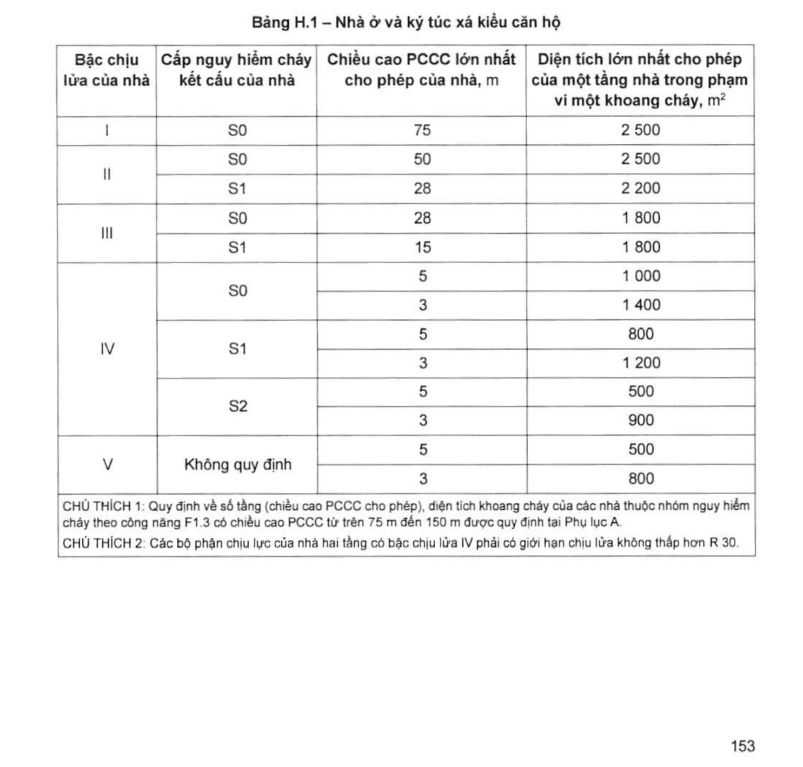

> **Trích dẫn:** mục H.1 QCVN 06:2022/BXD

# H.1 Nhà ở và ký túc xá kiểu căn hộ

## H.1 Nhà ở và ký túc xá kiểu căn hộ

Bậc chịu lửa, cấp nguy hiểm cháy kết cấu, chiều cao PCCC lớn nhất cho phép của nhà và diện tích một tầng trong phạm vi một khoang cháy đối với nhà ở và ký túc xá dạng căn hộ được quy định tại Bảng H.1.

**Bảng H.1 – Nhà ở và ký túc xá kiểu căn hộ**

| Bậc chịu lửa của nhà | Cấp nguy hiểm cháy kết cấu của nhà | Chiều cao PCCC lớn nhất cho phép của nhà, m | Diện tích lớn nhất cho phép của một tầng nhà trong phạm vi một khoang cháy, m² |
|---|---|---|---|
| **I** | S0 | 75 | 2 500 |
| **II** | S0 | 50 | 2 500 |
| II | S1 | 28 | 2 200 |
| **III** | S0 | 28 | 1 800 |
| III | S1 | 15 | 1 800 |
| **IV** | S0 | 5 | 1 000 |
| IV | S0 | 3 | 1 400 |
| IV | S1 | 5 | 800 |
| IV | S1 | 3 | 1 200 |
| IV | S2 | 5 | 500 |
| IV | S2 | 3 | 900 |
| **V** | Không quy định | 5 | 500 |
| V | Không quy định | 3 | 800 |

> CHÚ THÍCH 1: Quy định về số tầng (chiều cao PCCC cho phép), diện tích khoang cháy của các nhà thuộc nhóm nguy hiểm cháy theo công năng F1.3 có chiều cao PCCC từ trên 75 m đến 150 m được quy định tại Phụ lục A.
>
> CHÚ THÍCH 2: Các bộ phận chịu lực của nhà hai tầng có bậc chịu lửa IV phải có giới hạn chịu lửa không thấp hơn R 30.
