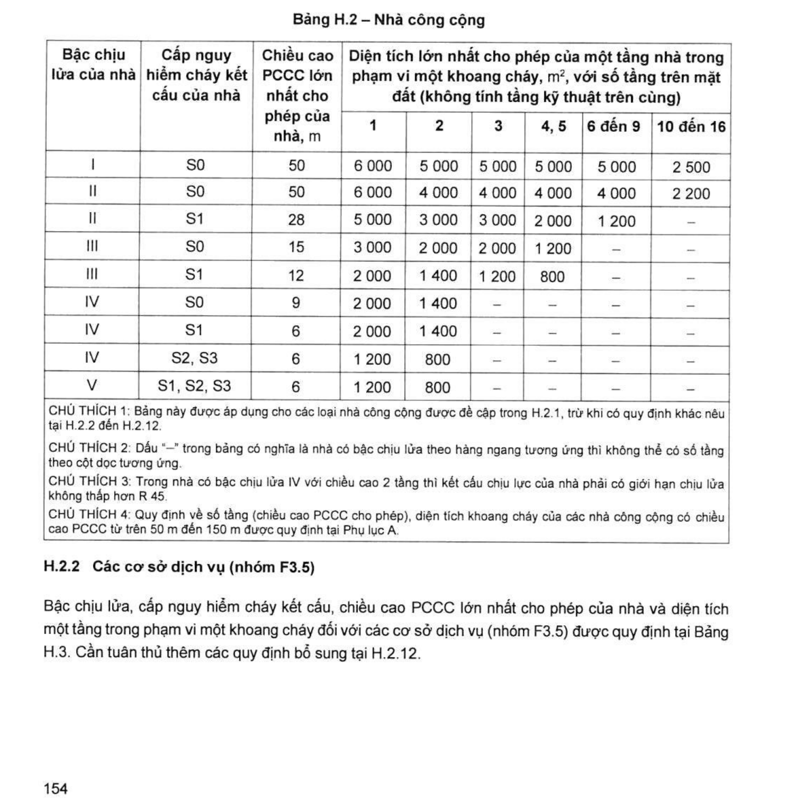
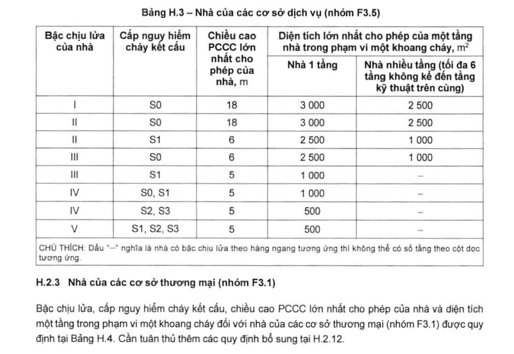
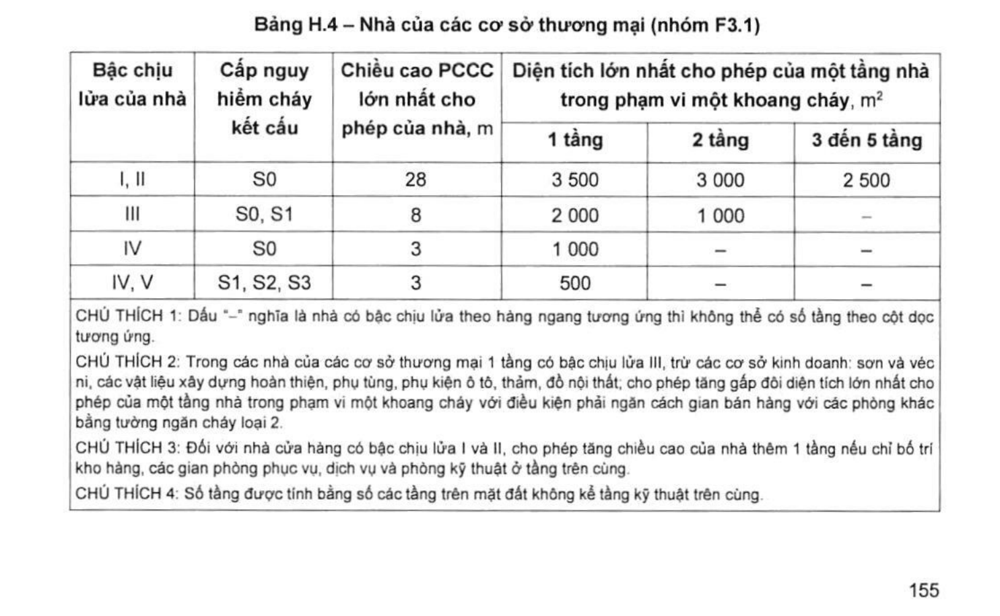
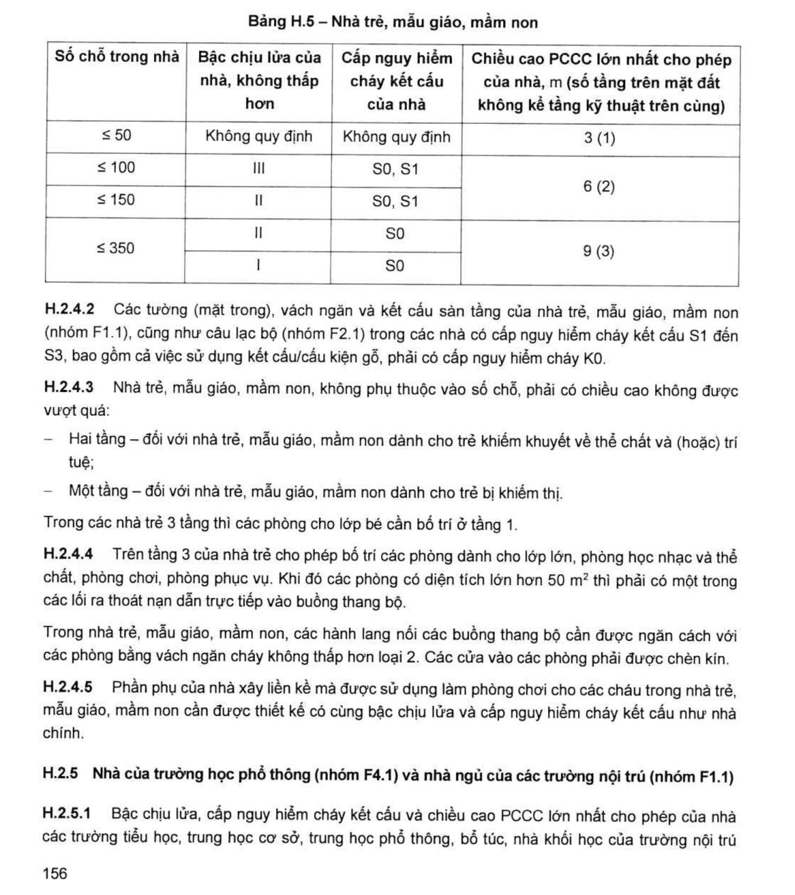
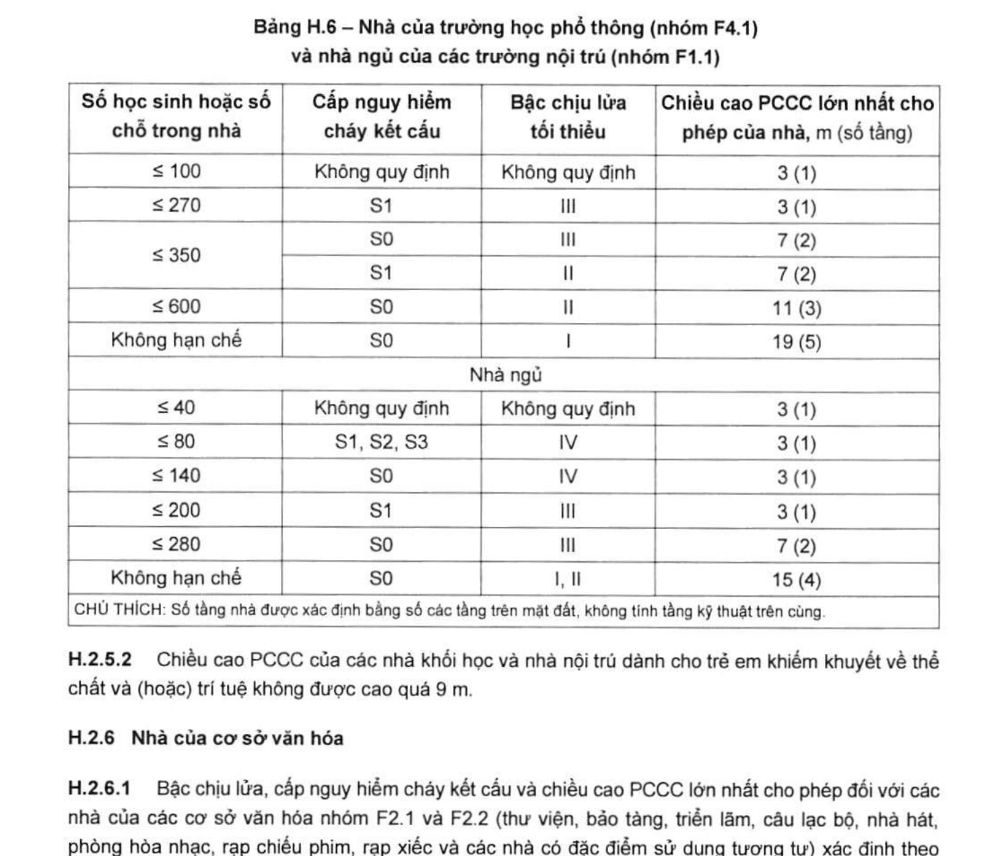
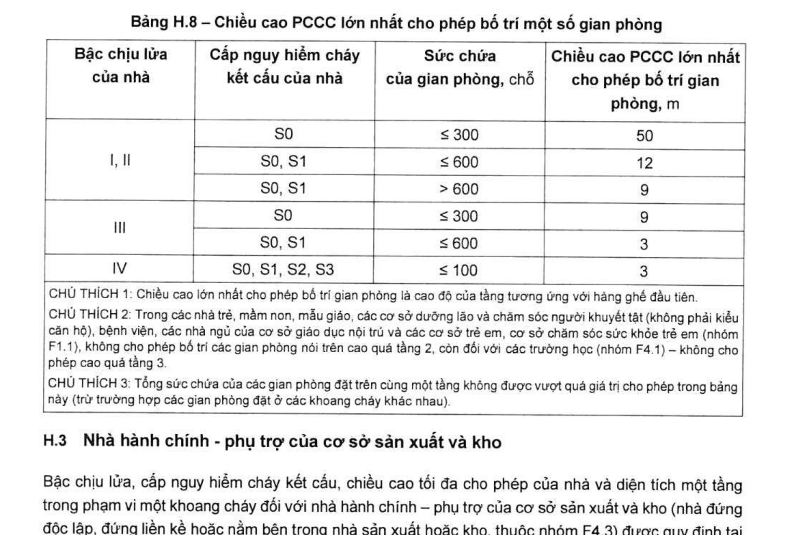

> **Trích dẫn:** mục H.2 QCVN 06:2022/BXD

# H.2 Nhà công cộng

## H.2 Nhà công cộng

### H.2.1 Quy định chung

Bậc chịu lửa, cấp nguy hiểm cháy kết cấu, chiều cao PCCC lớn nhất cho phép của nhà và diện tích một tầng trong phạm vi một khoang cháy đối với nhà công cộng, bao gồm cả khách sạn và nhà căn hộ cho thuê (apartment) (trừ ký túc xá và khách sạn kiểu căn hộ như nhà ở) được quy định tại Bảng H.2.

Cần tuân thủ thêm các quy định bổ sung tại H.2.2 đến H.2.12 đối với các nhà công cộng theo nhóm nguy hiểm cháy theo công năng tương ứng.

**Bảng H.2 – Nhà công cộng**

*Diện tích lớn nhất cho phép của một tầng nhà trong phạm vi một khoang cháy, m², với số tầng trên mặt đất (không tính tầng kỹ thuật trên cùng):*

| Bậc chịu lửa của nhà | Cấp nguy hiểm cháy kết cấu của nhà | Chiều cao PCCC lớn nhất cho phép của nhà, m | 1 tầng | 2 tầng | 3 tầng | 4, 5 tầng | 6 đến 9 tầng | 10 đến 16 tầng |
|---|---|---|---|---|---|---|---|---|
| **I** | S0 | 50 | 6 000 | 5 000 | 5 000 | 5 000 | 5 000 | 2 500 |
| **II** | S0 | 50 | 6 000 | 4 000 | 4 000 | 4 000 | 4 000 | 2 200 |
| II | S1 | 28 | 5 000 | 3 000 | 3 000 | 2 000 | 1 200 | – |
| **III** | S0 | 15 | 3 000 | 2 000 | 2 000 | 1 200 | – | – |
| III | S1 | 12 | 2 000 | 1 400 | 1 200 | 800 | – | – |
| **IV** | S0 | 9 | 2 000 | 1 400 | – | – | – | – |
| IV | S1 | 6 | 2 000 | 1 400 | – | – | – | – |
| IV | S2, S3 | 6 | 1 200 | 800 | – | – | – | – |
| **V** | S1, S2, S3 | 6 | 1 200 | 800 | – | – | – | – |

> CHÚ THÍCH 1: Bảng này được áp dụng cho các loại nhà công cộng được đề cập trong H.2.1, trừ khi có quy định khác nêu tại H.2.2 đến H.2.12.
>
> CHÚ THÍCH 2: Dấu "–" trong bảng có nghĩa là nhà có bậc chịu lửa theo hàng ngang tương ứng thì không thể có số tầng theo cột dọc tương ứng.
>
> CHÚ THÍCH 3: Trong nhà có bậc chịu lửa IV với chiều cao 2 tầng thì kết cấu chịu lực của nhà phải có giới hạn chịu lửa không thấp hơn R 45.
>
> CHÚ THÍCH 4: Quy định về số tầng (chiều cao PCCC cho phép), diện tích khoang cháy của các nhà công cộng có chiều cao PCCC từ trên 50 m đến 150 m được quy định tại Phụ lục A.

### H.2.2 Các cơ sở dịch vụ (nhóm F3.5)

Bậc chịu lửa, cấp nguy hiểm cháy kết cấu, chiều cao PCCC lớn nhất cho phép của nhà và diện tích một tầng trong phạm vi một khoang cháy đối với các cơ sở dịch vụ (nhóm F3.5) được quy định tại Bảng H.3. Cần tuân thủ thêm các quy định bổ sung tại H.2.12.

**Bảng H.3 – Nhà của các cơ sở dịch vụ (nhóm F3.5)**

*Diện tích lớn nhất cho phép của một tầng nhà trong phạm vi một khoang cháy, m²:*

| Bậc chịu lửa của nhà | Cấp nguy hiểm cháy kết cấu | Chiều cao PCCC lớn nhất cho phép của nhà, m | Nhà 1 tầng | Nhà nhiều tầng (tối đa 6 tầng không kể đến tầng kỹ thuật trên cùng) |
|---|---|---|---|---|
| I | S0 | 18 | 3 000 | 2 500 |
| II | S0 | 18 | 3 000 | 2 500 |
| II | S1 | 6 | 2 500 | 1 000 |
| III | S0 | 6 | 2 500 | 1 000 |
| III | S1 | 5 | 1 000 | – |
| IV | S0, S1 | 5 | 1 000 | – |
| IV | S2, S3 | 5 | 500 | – |
| V | S1, S2, S3 | 5 | 500 | – |

> CHÚ THÍCH: Dấu "–" nghĩa là nhà có bậc chịu lửa theo hàng ngang tương ứng thì không thể có số tầng theo cột dọc tương ứng.

### H.2.3 Nhà của các cơ sở thương mại (nhóm F3.1)

Bậc chịu lửa, cấp nguy hiểm cháy kết cấu, chiều cao PCCC lớn nhất cho phép của nhà và diện tích một tầng trong phạm vi một khoang cháy đối với nhà của các cơ sở thương mại (nhóm F3.1) được quy định tại Bảng H.4. Cần tuân thủ thêm các quy định bổ sung tại H.2.12.

**Bảng H.4 – Nhà của các cơ sở thương mại (nhóm F3.1)**

*Diện tích lớn nhất cho phép của một tầng nhà trong phạm vi một khoang cháy, m²:*

| Bậc chịu lửa của nhà | Cấp nguy hiểm cháy kết cấu | Chiều cao PCCC lớn nhất cho phép của nhà, m | 1 tầng | 2 tầng | 3 đến 5 tầng |
|---|---|---|---|---|---|
| I, II | S0 | 28 | 3 500 | 3 000 | 2 500 |
| III | S0, S1 | 8 | 2 000 | 1 000 | – |
| IV | S0 | 3 | 1 000 | – | – |
| IV, V | S1, S2, S3 | 3 | 500 | – | – |

> CHÚ THÍCH 1: Dấu "–" nghĩa là nhà có bậc chịu lửa theo hàng ngang tương ứng thì không thể có số tầng theo cột dọc tương ứng.
>
> CHÚ THÍCH 2: Trong các nhà của các cơ sở thương mại 1 tầng có bậc chịu lửa III, trừ các cơ sở kinh doanh: sơn và véc ni, các vật liệu xây dựng hoàn thiện, phụ tùng, phụ kiện ô tô, thảm, đồ nội thất; cho phép tăng gấp đôi diện tích lớn nhất cho phép của một tầng nhà trong phạm vi một khoang cháy với điều kiện phải ngăn cách gian bán hàng với các phòng khác bằng tường ngăn cháy loại 2.
>
> CHÚ THÍCH 3: Đối với nhà cửa hàng có bậc chịu lửa I và II, cho phép tăng chiều cao của nhà thêm 1 tầng nếu chỉ bố trí kho hàng, các gian phòng phục vụ, dịch vụ và phòng kỹ thuật ở tầng trên cùng.
>
> CHÚ THÍCH 4: Số tầng được tính bằng số các tầng trên mặt đất không kể tầng kỹ thuật trên cùng.

### H.2.4 Nhà trẻ, mẫu giáo, mầm non

**H.2.4.1** Bậc chịu lửa, cấp nguy hiểm cháy kết cấu, chiều cao PCCC lớn nhất cho phép của nhà (khoang cháy) của nhà trẻ, mẫu giáo, mầm non thông thường (nhóm F1.1) được quy định tại Bảng H.5 phụ thuộc vào số chỗ tối đa trong nhà. Cần tuân thủ các quy định bổ sung đối với các nhà nhóm này và các yêu cầu nêu tại H.2.12.

**Bảng H.5 – Nhà trẻ, mẫu giáo, mầm non**

| Số chỗ trong nhà | Bậc chịu lửa của nhà, không thấp hơn | Cấp nguy hiểm cháy kết cấu của nhà | Chiều cao PCCC lớn nhất cho phép của nhà, m (số tầng trên mặt đất không kể tầng kỹ thuật trên cùng) |
|---|---|---|---|
| ≤ 50 | Không quy định | Không quy định | **3 (1 tầng)** |
| ≤ 100 | III | S0, S1 | **6 (2 tầng)** |
| ≤ 150 | II | S0, S1 | **6 (2 tầng)** |
| ≤ 350 | II | S0 | **9 (3 tầng)** |
| ≤ 350 | I | S0 | **9 (3 tầng)** |

**H.2.4.2** Các tường (mặt trong), vách ngăn và kết cấu sàn tầng của nhà trẻ, mẫu giáo, mầm non (nhóm F1.1), cũng như câu lạc bộ (nhóm F2.1) trong các nhà có cấp nguy hiểm cháy kết cấu S1 đến S3, bao gồm cả việc sử dụng kết cấu/cấu kiện gỗ, phải có cấp nguy hiểm cháy **K0**.

**H.2.4.3** Nhà trẻ, mẫu giáo, mầm non, không phụ thuộc vào số chỗ, phải có chiều cao không được vượt quá:

- **Hai tầng** – đối với nhà trẻ, mẫu giáo, mầm non dành cho trẻ khiếm khuyết về thể chất và (hoặc) trí tuệ;
- **Một tầng** – đối với nhà trẻ, mẫu giáo, mầm non dành cho trẻ bị khiếm thị.

Trong các nhà trẻ 3 tầng thì các phòng cho lớp bé cần bố trí ở tầng 1.

**H.2.4.4** Trên tầng 3 của nhà trẻ cho phép bố trí các phòng dành cho lớp lớn, phòng học nhạc và thể chất, phòng chơi, phòng phục vụ. Khi đó các phòng có diện tích lớn hơn **50 m²** thì phải có một trong các lối ra thoát nạn dẫn trực tiếp vào buồng thang bộ.

Trong nhà trẻ, mẫu giáo, mầm non, các hành lang nối các buồng thang bộ cần được ngăn cách với các phòng bằng vách ngăn cháy không thấp hơn loại 2. Các cửa vào các phòng phải được chèn kín.

**H.2.4.5** Phần phụ của nhà xây liền kề mà được sử dụng làm phòng chơi cho các cháu trong nhà trẻ, mẫu giáo, mầm non cần được thiết kế có cùng bậc chịu lửa và cấp nguy hiểm cháy kết cấu như nhà chính.

### H.2.5 Nhà của trường học phổ thông (nhóm F4.1) và nhà ngủ của các trường nội trú (nhóm F1.1)

**H.2.5.1** Bậc chịu lửa, cấp nguy hiểm cháy kết cấu và chiều cao PCCC lớn nhất cho phép của nhà các trường tiểu học, trung học cơ sở, trung học phổ thông, bổ túc, nhà khối học của trường nội trú (nhóm F4.1), nhà ngủ của trường nội trú (F1.1) được xác định theo Bảng H.6. Diện tích lớn nhất cho phép của một tầng trong phạm vi một khoang cháy của những nhà này được xác định theo Bảng H.2. Cần tuân thủ các quy định bổ sung đối với các nhà nhóm này và các yêu cầu nêu tại H.2.12.

**Bảng H.6 – Nhà của trường học phổ thông (nhóm F4.1) và nhà ngủ của các trường nội trú (nhóm F1.1)**

| Số học sinh hoặc số chỗ trong nhà | Cấp nguy hiểm cháy kết cấu | Bậc chịu lửa tối thiểu | Chiều cao PCCC lớn nhất cho phép của nhà, m (số tầng) |
|---|---|---|---|
| **Nhà khối học** | | | |
| ≤ 100 | Không quy định | Không quy định | 3 (1 tầng) |
| ≤ 270 | S1 | III | 3 (1 tầng) |
| ≤ 350 | S0 | III | 7 (2 tầng) |
| ≤ 350 | S1 | II | 7 (2 tầng) |
| ≤ 600 | S0 | II | 11 (3 tầng) |
| Không hạn chế | S0 | I | 19 (5 tầng) |
| **Nhà ngủ** | | | |
| ≤ 40 | Không quy định | Không quy định | 3 (1 tầng) |
| ≤ 80 | S1, S2, S3 | IV | 3 (1 tầng) |
| ≤ 140 | S0 | IV | 3 (1 tầng) |
| ≤ 200 | S1 | III | 3 (1 tầng) |
| ≤ 280 | S0 | III | 7 (2 tầng) |
| Không hạn chế | S0 | I, II | 15 (4 tầng) |

> CHÚ THÍCH: Số tầng nhà được xác định bằng số các tầng trên mặt đất, không tính tầng kỹ thuật trên cùng.

**H.2.5.2** Chiều cao PCCC của các nhà khối học và nhà nội trú dành cho trẻ em khiếm khuyết về thể chất và (hoặc) trí tuệ không được cao quá **9 m**.

### H.2.6 Nhà của cơ sở văn hóa

**H.2.6.1** Bậc chịu lửa, cấp nguy hiểm cháy kết cấu và chiều cao PCCC lớn nhất cho phép đối với các nhà của các cơ sở văn hóa nhóm F2.1 và F2.2 (thư viện, bảo tàng, triển lãm, câu lạc bộ, nhà hát, phòng hòa nhạc, rạp chiếu phim, rạp xiếc và các nhà có đặc điểm sử dụng tương tự) xác định theo Bảng H.7 phụ thuộc vào sức chứa của nhà hoặc gian phòng.

**H.2.6.2** Cần tuân thủ các quy định bổ sung đối với các nhà thuộc nhóm này và các quy định tại H.2.12.

**H.2.6.3** Khi xác định sức chứa của gian phòng thì cần cộng tổng số chỗ cố định và tạm thời.

Khi rạp chiếu phim có một số phòng chiếu phim thì tổng sức chứa của các phòng này không được vượt quá giá trị quy định tại Bảng H.7.

**H.2.6.4** Kết cấu chịu lực của mái (giàn, dầm và kết cấu đỡ mái tương tự khác) trên sân khấu và các gian phòng của nhà hát, câu lạc bộ và các công trình thể thao có bậc chịu lửa từ I đến III cần có giới hạn chịu lửa không thấp hơn **R 45**.

**Bảng H.7 – Nhà của các cơ sở văn hóa (nhóm F2.1 và F2.2)** *(thư viện, bảo tàng, triển lãm, câu lạc bộ, nhà hát, phòng hòa nhạc, rạp chiếu phim, rạp xiếc và các nhà có đặc điểm sử dụng tương tự)*

| Nhóm nguy hiểm cháy theo công năng của nhà, công trình | Bậc chịu lửa | Cấp nguy hiểm cháy kết cấu | Chiều cao PCCC lớn nhất cho phép của nhà, m (số tầng trên mặt đất không kể tầng kỹ thuật trên cùng) | Sức chứa của gian phòng hoặc công trình, chỗ |
|---|---|---|---|---|
| **F2.1** | I | S0 | 50 | Không hạn chế |
| F2.1 | II | S0 | 9 (3 tầng) | ≤ 800 |
| F2.1 | II | S1 | 6 (2 tầng) | ≤ 600 |
| F2.1 | III | S0 | 3 (1 tầng) | ≤ 400 |
| F2.1 | IV, V | S0, S1, S2, S3 | 3 (1 tầng) | ≤ 300 |
| **F2.2** | I | S0 | 50 | Không hạn chế |
| F2.2 | II | S0 | 50 | ≤ 800 |
| F2.2 | II | S1 | 28 | ≤ 600 |
| F2.2 | III | S0 | 9 (3 tầng) | ≤ 400 |
| F2.2 | III | S1 | 6 (2 tầng) | ≤ 300 |
| F2.2 | IV, V | S0, S1, S2, S3 | 3 (1 tầng) | ≤ 300 |

> CHÚ THÍCH 1: Trong các nhà nhóm F2.1 chiều cao lớn nhất được phép bố trí gian phòng, được xác định bởi cao độ của tầng tại vị trí hàng ghế đầu tiên, không được vượt quá 9 m đối với các gian có sức chứa trên 600 chỗ. Trong các nhà có bậc chịu lửa I và cấp nguy hiểm cháy kết cấu S0 cho phép bố trí các gian có sức chứa đến 300 chỗ ở chiều cao lớn hơn 28 m.
>
> CHÚ THÍCH 2: Trong các nhà nhóm F2.2, không được bố trí các sàn nhảy có sức chứa lớn hơn 400 người cũng như các gian phòng có công năng khác với sức chứa lớn hơn 600 người ở chiều cao PCCC của tầng tương ứng lớn hơn 9 m. Trong nhà có bậc chịu lửa I và cấp nguy hiểm cháy kết cấu S0, cho phép bố trí các gian sức chứa đến 300 chỗ ở chiều cao lớn hơn 28 m, nhưng phải tuân thủ yêu cầu tại A.2.4.
>
> CHÚ THÍCH 3: Khi kết hợp rạp chiếu phim hoạt động quanh năm với rạp chiếu phim hoạt động mùa vụ với bậc chịu lửa khác nhau thì các rạp này phải được ngăn cách với nhau bằng tường ngăn cháy loại 2.

### H.2.7 Nhà và công trình thể thao

**H.2.7.1** Trong các gian thi đấu thể thao, sân trượt băng trong nhà, bể bơi trong nhà (kể cả có ghế ngồi cho khán giả hoặc không có ghế ngồi) cũng như trong các gian phòng huấn luyện bơi lội, các khu vực huấn luyện bắn súng trong nhà (kể cả đặt ở dưới khán đài hoặc xây trong các nhà công cộng khác), nếu diện tích của gian lớn hơn giá trị quy định tại Bảng H.2 thì cần bố trí tường ngăn cháy giữa gian này và các phòng khác.

**H.2.7.2** Các khán đài sức chứa bất kỳ của các công trình nhóm F2.3 phải có bậc chịu lửa I và cấp nguy hiểm cháy kết cấu S0 nếu có sử dụng không gian bên dưới khán đài để bố trí các gian phòng phụ trợ từ hai tầng trở lên.

**H.2.7.3** Sàn tầng dưới khán đài phải là sàn ngăn cháy loại 2.

**H.2.7.4** Khi các gian phòng phụ trợ chỉ có một tầng dưới khán đài hoặc khi số lượng các hàng ghế khán giả trên khán đài lớn hơn 20 thì kết cấu chịu lực của khán đài phải có giới hạn chịu lửa không thấp hơn **R 45**, cấp nguy hiểm cháy **K0**, và sàn tầng dưới khán đài phải là sàn ngăn cháy loại 3.

**H.2.7.5** Các kết cấu chịu lực của khán đài công trình thể thao (nhóm F2.3) không sử dụng không gian dưới khán đài và có số lượng hàng ghế lớn hơn 5 và không quá 20 thì phải được làm từ vật liệu không cháy với giới hạn chịu lửa không thấp hơn **R 15**, còn với số lượng hàng ghế trên 20 thì phải có giới hạn chịu lửa không thấp hơn **R 45**, cấp nguy hiểm cháy K0. Khi đó, không cho phép để các chất cháy và vật liệu cháy bên dưới khán đài. Trong các công trình thể thao trong nhà (kín), kết cấu chịu lực của các khán đài cố định với sức chứa hơn 600 người phải có giới hạn chịu lửa không thấp hơn **R 60**, cấp nguy hiểm cháy K0; từ 300 người đến 600 người – **R 45** và K0; dưới 300 người – **R 15** và K0 hoặc K1. Khi đó, các sàn dưới khán đài phải là sàn ngăn cháy loại 2 khi khán đài có sức chứa hơn 600 người, loại 3 với sức chứa từ 300 người đến 600 người và loại 4 với sức chứa dưới 300 người.

**H.2.7.6** Giới hạn chịu lửa của các kết cấu khán đài tạm (di động) phải không thấp hơn **R 15** không phụ thuộc sức chứa.

**H.2.7.7** Các yêu cầu trên không áp dụng cho các chỗ ngồi khán giả tạm thời được bố trí trên sân thi đấu khi sân thi đấu biến hình.

### H.2.8 Nhà ga hành khách

**H.2.8.1** Trong các nhà ga hành khách có bậc chịu lửa I và II và cấp nguy hiểm cháy kết cấu S0, thay cho việc phân chia nhà thành các khoang cháy bằng tường ngăn cháy loại 1, cho phép phân chia khoang cháy thành các phân khoang cháy với cùng diện tích như trong Bảng H.2 (với các nhóm gian phòng có cùng nhóm nguy hiểm cháy theo công năng) bằng các **màn nước ngăn cháy (drencher)**, hoặc bằng các **màn ngăn cháy có giới hạn chịu lửa không nhỏ hơn E 60**. Khi đó, các màn ngăn cháy và màn nước ngăn cháy nêu trên phải được lắp đặt ở vùng không có tải trọng cháy trên một chiều rộng không nhỏ hơn **4 m** về cả hai phía của màn ngăn cháy và màn nước ngăn cháy.

**H.2.8.2** Trong các **nhà ga sân bay** có bậc chịu lửa I, diện tích sàn giữa các tường ngăn cháy (khoang cháy) có thể **tăng lên đến 10 000 m²** khi không có tầng hầm hoặc nếu có tầng hầm thì trong tầng hầm (tầng nửa hầm) không có các kho và các dạng phòng khác có chứa các vật liệu cháy (ngoại trừ gian giữ đồ và mũ áo của nhân viên, các gian phòng có hạng nguy hiểm cháy C4 và E). Khi đó, lối đi lại từ các phòng để dụng cụ vệ sinh đặt trong tầng hầm và tầng nửa hầm lên tầng 1 có thể đi theo các buồng thang bộ hở, nếu đi từ các gian giữ đồ phải đi theo các cầu thang bộ riêng nằm trong buồng thang kín. Các gian phòng giữ đồ (ngoại trừ những gian phòng có trang bị các hộc gửi tự động) và gian phòng giữ mũ áo phải được ngăn cách với những phần khác của tầng hầm bằng các vách ngăn cháy loại 1 và được trang bị hệ thống chữa cháy tự động, còn các trạm điều độ - chỉ huy phải được ngăn cách bằng các vách ngăn cháy loại 1.

**H.2.8.3** Trong các **nhà ga sân bay và nhà ga hành khách có bậc chịu lửa I và cấp nguy hiểm cháy kết cấu S0, không hạn chế diện tích sàn giữa các tường ngăn cháy** nếu được trang bị các hệ thống chữa cháy tự động.

### H.2.9 Bệnh viện

**H.2.9.1** Nhà bệnh viện (nhóm F1.1) cần được bố trí trong các nhà đứng độc lập hoặc trong khoang cháy riêng với chiều cao PCCC không quá **28 m**. Nhà bệnh viện cao từ 2 tầng trở lên phải có bậc chịu lửa I hoặc II và cấp nguy hiểm cháy kết cấu S0.

**H.2.9.2** Các nhà bệnh viện 1 tầng cho phép có bậc chịu lửa III và cấp nguy hiểm cháy kết cấu không thấp hơn S1, khi đó diện tích lớn nhất cho phép của một tầng trong phạm vi một khoang cháy không vượt quá **2 000 m²** đối với nhà có cấp nguy hiểm cháy kết cấu S0 và không quá **1 200 m²** đối với nhà cấp S1. Khi đó các tường, vách ngăn và sàn, bao gồm cả có sử dụng kết cấu gỗ, phải có cấp nguy hiểm cháy K0.

**H.2.9.3** Nhà nội trú của bệnh viện có chiều cao đến 3 tầng cần được chia thành các phân khoang cháy với diện tích không quá **1 000 m²** bằng các vách ngăn cháy loại 1. Nhà nội trú có chiều cao hơn 3 tầng và nhà nội trú có cấp nguy hiểm cháy kết cấu S1 cần được chia thành các phân khoang cháy với diện tích không quá **800 m²** bằng các vách ngăn cháy loại 1.

**H.2.9.4** Các nhà chữa bệnh dành cho bệnh nhân tâm thần và các nhà chữa bệnh của trạm y tế có chiều cao PCCC không được quá **9 m**, bậc chịu lửa không thấp hơn II và cấp nguy hiểm cháy kết cấu S0.

**H.2.9.5** Nhà dưỡng lão và chăm sóc người khuyết tật cần được thiết kế phù hợp với các yêu cầu an toàn cháy như bệnh viện.

### H.2.10 Nhà khám chữa bệnh đa khoa (nhóm F3.4)

**H.2.10.1** Chiều cao PCCC của nhà khám bệnh đa khoa ngoại trú (nhóm F3.4) tối đa **28 m**. Bậc chịu lửa của nhà từ 2 tầng trở lên không được thấp hơn bậc II, cấp nguy hiểm cháy kết cấu không thấp hơn S0.

**H.2.10.2** Các cơ sở y tế không có nội trú cho phép đặt trong các nhà một tầng có bậc chịu lửa III và cấp nguy hiểm cháy kết cấu không thấp hơn S1, khi đó diện tích lớn nhất cho phép của một tầng trong phạm vi một khoang cháy không lớn hơn **3 000 m²** đối với nhà có cấp S0 và không lớn hơn **2 000 m²** đối với nhà có cấp S1. Khi đó các tường và cách ngăn chia hành lang và tiền sảnh với các phòng lân cận, bao gồm cả việc sử dụng kết cấu gỗ, phải có cấp nguy hiểm cháy K0.

**H.2.10.3** Các gian phòng khám đa khoa ngoại trú (nhóm F3.4) cho phép đặt trong các phần phụ của nhà có bậc chịu lửa II và cấp nguy hiểm cháy kết cấu không thấp hơn S0. Các phòng này không được đặt ở độ cao quá **28 m**.

### H.2.11 Nhà ngủ của cơ sở điều dưỡng

**H.2.11.1** Các nhà ngủ của cơ sở điều dưỡng không được cao quá **28 m**.

**H.2.11.2** Đối với nhà ngủ của cơ sở điều dưỡng cao hơn 2 tầng, bậc chịu lửa phải không thấp hơn bậc II, cấp nguy hiểm cháy kết cấu S0.

**H.2.11.3** Các nhà ngủ hai tầng của cơ sở điều dưỡng cho phép có bậc chịu lửa III và cấp nguy hiểm cháy kết cấu S0.

**H.2.11.4** Số chỗ trong các nhà ngủ của cơ sở điều dưỡng với bậc chịu lửa I và II và cấp nguy hiểm cháy kết cấu S0 không được vượt quá **1 000**, bậc III và cấp S0 – không quá **150**, các bậc chịu lửa còn lại – không quá **50**.

**H.2.11.5** Các gian phòng ngủ dành cho gia đình có trẻ em trong nhà ngủ của cơ sở điều dưỡng cần được bố trí trong các tòa nhà độc lập hoặc các phần nhà riêng được ngăn cách bởi vách ngăn cháy loại 1, chiều cao không quá 6 tầng và có lối ra thoát nạn riêng biệt với các phần nhà khác. Khi đó, các gian phòng ngủ phải có lối ra khẩn cấp phù hợp với một trong những yêu cầu sau:

- Lối ra phải dẫn ra ban công hoặc lô gia với vách tường đặc không nhỏ hơn **1,2 m** từ mép ngoài ban công (lô gia) đến lỗ mở cửa sổ (cửa đi bằng kính) hoặc không nhỏ hơn **1,6 m** giữa các cửa kính đi ra ban công (lô gia);
- Lối ra phải dẫn ra lối đi chuyển tiếp rộng tối thiểu **0,6 m** dẫn sang phần nhà khác liền kề;
- Lối ra phải dẫn ra ban công hoặc lô gia có trang bị thang ngoài nối liền các ban công và lô gia từng tầng.

### H.2.12 Các quy định bổ sung đối với các nhà công cộng thuộc H.2

**H.2.12.1** Trong các nhà công cộng đề cập ở trên (H.2.1 đến H.2.11) có bậc chịu lửa I đến III, kết cấu chịu lực của mái các phần phụ xây liền kề nhà (có thể có một phần nằm trong nhà chính, một phần nằm ngoài nhà chính) phải có giới hạn chịu lửa không thấp hơn **R 45** và cấp nguy hiểm cháy K0.

**H.2.12.2** Trong các nhà có bậc chịu lửa I và II và cấp nguy hiểm cháy kết cấu S0, khi toàn nhà có trang bị hệ thống chữa cháy tự động thì diện tích khoang cháy quy định tại các bảng từ H.2 đến H.4 được phép **tăng lên không quá 2 lần**.

**H.2.12.3** Nếu trong phạm vi khoang cháy của nhà 1 tầng tại các bảng từ H.2 đến H.4 có một phần nhà 2 tầng với diện tích chiếm không quá **15 %** diện tích xây dựng của nhà thì khoang cháy đó vẫn được coi như nhà 1 tầng.

**H.2.12.4** Những phần phụ của nhà chính như mái che gắn vào nhà chính (mái hiên, mái che phần diện tích sát chân nhà), sân trời, hành lang ngoài và tương tự được phép lấy bậc chịu lửa thấp hơn 1 bậc so với bậc chịu lửa của nhà chính. Khi đó, cấp nguy hiểm cháy kết cấu của các phần phụ này không được thấp hơn cấp nguy hiểm cháy kết cấu của nhà chính. Trong trường hợp này, bậc chịu lửa của nhà có mái che gắn vào nhà chính, sân trời, hành lang ngoài lấy bằng bậc chịu lửa của nhà chính, và diện tích một tầng trong phạm vi một khoang cháy được tính toán bao gồm cả diện tích các phần phụ này.

**H.2.12.5** Trong các gian tiền sảnh và phòng chờ có diện tích lớn hơn giá trị quy định tại Bảng H.2, cho phép thay thế tường ngăn cháy bằng vách ngăn cháy xuyên sáng loại 2.

**H.2.12.6** Các tường (mặt tường), vách và trần bằng gỗ của nhà có bậc chịu lửa V sử dụng làm nhà trẻ, trường phổ thông, trường nội trú, cơ sở khám bệnh và điều trị ngoại trú, các trại chăm sóc sức khỏe cho trẻ em và các câu lạc bộ (ngoại trừ các nhà câu lạc bộ 1 tầng có tường ốp đá) phải được bảo vệ chống cháy.

**H.2.12.7** Trong các **nhà ga hành khách** và các nhà hay phòng có công năng tương tự với không gian rộng lớn (trung tâm thương mại, sảnh thông tầng), nếu không thể bố trí được các tường ngăn cháy thì cho phép thay thế tường ngăn cháy bằng thiết bị tạo **màn nước drencher** bố trí thành **2 dải cách nhau 0,5 m** và với cường độ phun không nhỏ hơn **1 L/s cho mỗi mét chiều dài** màn nước (tính chung cho cả 2 dải). Khoảng thời gian duy trì màn nước ít nhất là **1 giờ**. Ngoài ra, phải có giải pháp ngăn chặn lan truyền khói giữa các khoang cháy.

**H.2.12.8** Nhà thư viện không được cao quá **28 m**.

**H.2.12.9** Chiều cao PCCC lớn nhất cho phép bố trí các gian giảng đường, khán phòng, phòng hội nghị, hội thảo, gian tập thể thao không có khán giả và các gian phòng khác có công năng tương tự trong nhà có công năng bất kỳ được quy định tại Bảng H.8 có kể đến bậc chịu lửa, cấp nguy hiểm cháy kết cấu của nhà và sức chứa của gian.

**Bảng H.8 – Chiều cao PCCC lớn nhất cho phép bố trí một số gian phòng**

| Bậc chịu lửa của nhà | Cấp nguy hiểm cháy kết cấu của nhà | Sức chứa của gian phòng, chỗ | Chiều cao PCCC lớn nhất cho phép bố trí gian phòng, m |
|---|---|---|---|
| I, II | S0 | ≤ 300 | 50 |
| I, II | S0, S1 | ≤ 600 | 12 |
| I, II | S0, S1 | > 600 | 9 |
| III | S0 | ≤ 300 | 9 |
| III | S0, S1 | ≤ 600 | 3 |
| IV | S0, S1, S2, S3 | ≤ 100 | 3 |

> CHÚ THÍCH 1: Chiều cao lớn nhất cho phép bố trí gian phòng là cao độ của tầng tương ứng với hàng ghế đầu tiên.
>
> CHÚ THÍCH 2: Trong các nhà trẻ, mầm non, mẫu giáo, các cơ sở dưỡng lão và chăm sóc người khuyết tật (không phải kiểu căn hộ), bệnh viện, các nhà ngủ của cơ sở giáo dục nội trú và các cơ sở trẻ em, cơ sở chăm sóc sức khỏe trẻ em (nhóm F1.1), không cho phép bố trí các gian phòng nói trên cao quá tầng 2, còn đối với các trường học (nhóm F4.1) – không cho phép cao quá tầng 3.
>
> CHÚ THÍCH 3: Tổng sức chứa của các gian phòng đặt trên cùng một tầng không được vượt quá giá trị cho phép trong bảng này (trừ trường hợp các gian phòng đặt ở các khoang cháy khác nhau).
