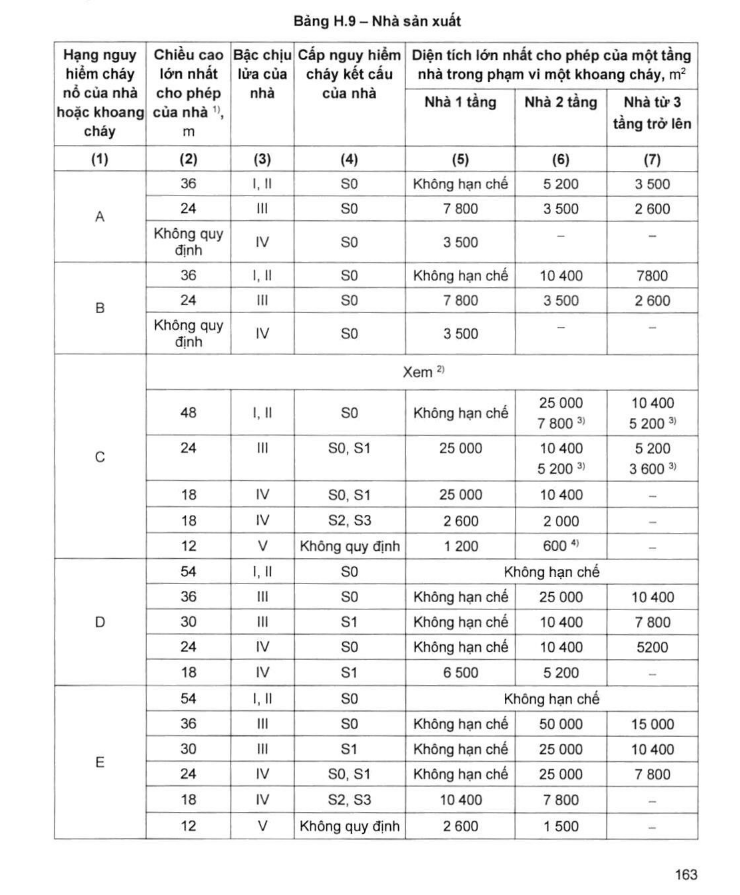
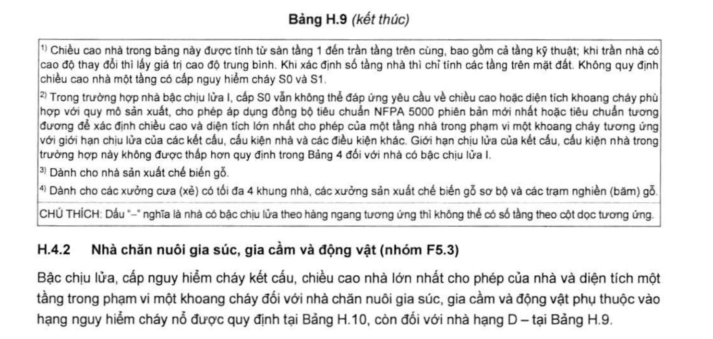
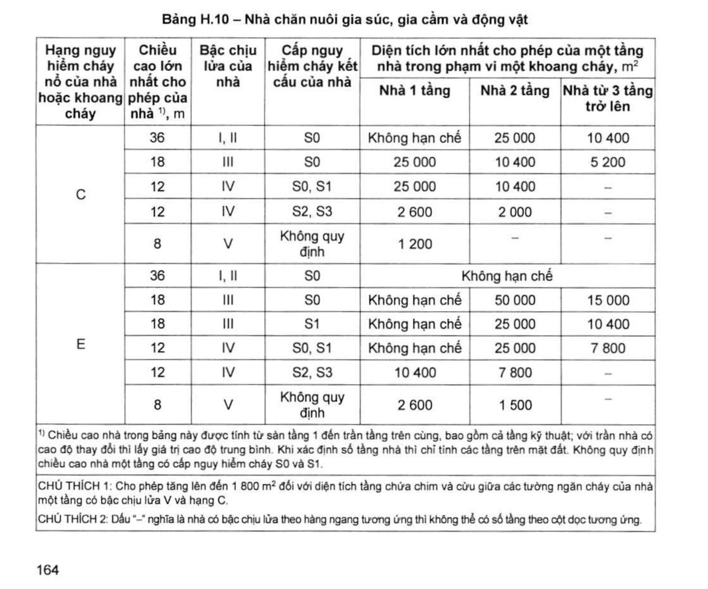

> **Trích dẫn:** mục H.4 QCVN 06:2022/BXD

# H.4 Nhà sản xuất và nhà chăn nuôi gia súc, gia cầm và động vật

## H.4 Nhà sản xuất và nhà chăn nuôi gia súc, gia cầm và động vật

### H.4.1 Nhà sản xuất

Bậc chịu lửa, cấp nguy hiểm cháy kết cấu, chiều cao lớn nhất cho phép của nhà và diện tích một tầng trong phạm vi một khoang cháy đối với nhà sản xuất phụ thuộc vào hạng nguy hiểm cháy và cháy nổ được quy định tại Bảng H.9.

Số tầng nhà, diện tích một tầng trong phạm vi một khoang cháy của nhà sản xuất xác định theo A.2.1, Phụ lục A và H.6, Phụ lục H. Khi có các lỗ mở công nghệ trên các sàn giữa các tầng thì tổng diện tích các tầng này không được vượt quá diện tích tầng quy định tại Bảng H.9.

Khi trang bị chữa cháy tự động toàn nhà cho nhà sản xuất, cho phép **tăng gấp 2 lần** các diện tích sàn trong phạm vi một khoang cháy quy định tại Bảng H.9, trừ nhà có bậc chịu lửa IV và V.

Đối với nhà thuộc hạng nguy hiểm cháy nổ C có các gian phòng hạng C1 với tổng diện tích lớn hơn ½ diện tích tầng tương ứng thì diện tích một tầng trong phạm vi một khoang cháy quy định tại Bảng H.9 phải **giảm đi 25 %**.

**Bảng H.9 – Nhà sản xuất**

*Diện tích lớn nhất cho phép của một tầng nhà trong phạm vi một khoang cháy, m²:*

| Hạng nguy hiểm cháy nổ của nhà hoặc khoang cháy | Chiều cao lớn nhất cho phép của nhà ^1)^, m | Bậc chịu lửa của nhà | Cấp nguy hiểm cháy kết cấu của nhà | Nhà 1 tầng | Nhà 2 tầng | Nhà từ 3 tầng trở lên |
|---|---|---|---|---|---|---|
| (1) | (2) | (3) | (4) | (5) | (6) | (7) |
| **A** | 36 | I, II | S0 | Không hạn chế | 5 200 | 3 500 |
| A | 24 | III | S0 | 7 800 | 3 500 | 2 600 |
| A | Không quy định | IV | S0 | 3 500 | – | – |
| **B** | 36 | I, II | S0 | Không hạn chế | 10 400 | 7 800 |
| B | 24 | III | S0 | 7 800 | 3 500 | 2 600 |
| B | Không quy định | IV | S0 | 3 500 | – | – |
| **C** *(xem ^2)^)* | 48 | I, II | S0 | Không hạn chế | 25 000 7 800 ^3)^ | 10 400 5 200 ^3)^ |
| C | 24 | III | S0, S1 | 25 000 | 10 400 5 200 ^3)^ | 5 200 3 600 ^3)^ |
| C | 18 | IV | S0, S1 | 25 000 | 10 400 | – |
| C | 18 | IV | S2, S3 | 2 600 | 2 000 | – |
| C | 12 | V | Không quy định | 1 200 | 600 ^4)^ | – |
| **D** | 54 | I, II | S0 | Không hạn chế | Không hạn chế | Không hạn chế |
| D | 36 | III | S0 | Không hạn chế | 25 000 | 10 400 |
| D | 30 | III | S1 | Không hạn chế | 10 400 | 7 800 |
| D | 24 | IV | S0 | Không hạn chế | 10 400 | 5 200 |
| D | 18 | IV | S1 | 6 500 | 5 200 | – |
| **E** | 54 | I, II | S0 | Không hạn chế | Không hạn chế | Không hạn chế |
| E | 36 | III | S0 | Không hạn chế | 50 000 | 15 000 |
| E | 30 | III | S1 | Không hạn chế | 25 000 | 10 400 |
| E | 24 | IV | S0, S1 | Không hạn chế | 25 000 | 7 800 |
| E | 18 | IV | S2, S3 | 10 400 | 7 800 | – |
| E | 12 | V | Không quy định | 2 600 | 1 500 | – |

> ^1)^ Chiều cao nhà trong bảng này được tính từ sàn tầng 1 đến trần tầng trên cùng, bao gồm cả tầng kỹ thuật; khi trần nhà có cao độ thay đổi thì lấy giá trị cao độ trung bình. Khi xác định số tầng nhà thì chỉ tính các tầng trên mặt đất. Không quy định chiều cao nhà một tầng có cấp nguy hiểm cháy S0 và S1.
>
> ^2)^ Trong trường hợp nhà bậc chịu lửa I, cấp S0 vẫn không thể đáp ứng yêu cầu về chiều cao hoặc diện tích khoang cháy phù hợp với quy mô sản xuất, cho phép áp dụng đồng bộ tiêu chuẩn **NFPA 5000** phiên bản mới nhất hoặc tiêu chuẩn tương đương để xác định chiều cao và diện tích lớn nhất cho phép của một tầng nhà trong phạm vi một khoang cháy tương ứng với giới hạn chịu lửa của các kết cấu, cấu kiện nhà và các điều kiện khác. Giới hạn chịu lửa của kết cấu, cấu kiện nhà trong trường hợp này không được thấp hơn quy định trong Bảng 4 đối với nhà có bậc chịu lửa I.
>
> ^3)^ Dành cho nhà sản xuất chế biến gỗ.
>
> ^4)^ Dành cho các xưởng cưa (xẻ) có tối đa 4 khung nhà, các xưởng sản xuất chế biến gỗ sơ bộ và các trạm nghiền (băm) gỗ.
>
> CHÚ THÍCH: Dấu "–" nghĩa là nhà có bậc chịu lửa theo hàng ngang tương ứng thì không thể có số tầng theo cột dọc tương ứng.

### H.4.2 Nhà chăn nuôi gia súc, gia cầm và động vật (nhóm F5.3)

Bậc chịu lửa, cấp nguy hiểm cháy kết cấu, chiều cao nhà lớn nhất cho phép của nhà và diện tích một tầng trong phạm vi một khoang cháy đối với nhà chăn nuôi gia súc, gia cầm và động vật phụ thuộc vào hạng nguy hiểm cháy nổ được quy định tại Bảng H.10, còn đối với nhà hạng D – tại Bảng H.9.

**Bảng H.10 – Nhà chăn nuôi gia súc, gia cầm và động vật**

*Diện tích lớn nhất cho phép của một tầng nhà trong phạm vi một khoang cháy, m²:*

| Hạng nguy hiểm cháy nổ của nhà hoặc khoang cháy | Chiều cao lớn nhất cho phép của nhà ^1)^, m | Bậc chịu lửa của nhà | Cấp nguy hiểm cháy kết cấu của nhà | Nhà 1 tầng | Nhà 2 tầng | Nhà từ 3 tầng trở lên |
|---|---|---|---|---|---|---|
| **C** | 36 | I, II | S0 | Không hạn chế | 25 000 | 10 400 |
| C | 18 | III | S0 | 25 000 | 10 400 | 5 200 |
| C | 12 | IV | S0, S1 | 25 000 | 10 400 | – |
| C | 12 | IV | S2, S3 | 2 600 | 2 000 | – |
| C | 8 | V | Không quy định | 1 200 | – | – |
| **E** | 36 | I, II | S0 | Không hạn chế | Không hạn chế | Không hạn chế |
| E | 18 | III | S0 | Không hạn chế | 50 000 | 15 000 |
| E | 18 | III | S1 | Không hạn chế | 25 000 | 10 400 |
| E | 12 | IV | S0, S1 | Không hạn chế | 25 000 | 7 800 |
| E | 12 | IV | S2, S3 | 10 400 | 7 800 | – |
| E | 8 | V | Không quy định | 2 600 | 1 500 | – |

> ^1)^ Chiều cao nhà trong bảng này được tính từ sàn tầng 1 đến trần tầng trên cùng, bao gồm cả tầng kỹ thuật; với trần nhà có cao độ thay đổi thì lấy giá trị cao độ trung bình. Khi xác định số tầng nhà thì chỉ tính các tầng trên mặt đất. Không quy định chiều cao nhà một tầng có cấp nguy hiểm cháy S0 và S1.
>
> CHÚ THÍCH 1: Cho phép tăng lên đến 1 800 m² đối với diện tích tầng chứa chim và cừu giữa các tường ngăn cháy của nhà một tầng có bậc chịu lửa V và hạng C.
>
> CHÚ THÍCH 2: Dấu "–" nghĩa là nhà có bậc chịu lửa theo hàng ngang tương ứng thì không thể có số tầng theo cột dọc tương ứng.
