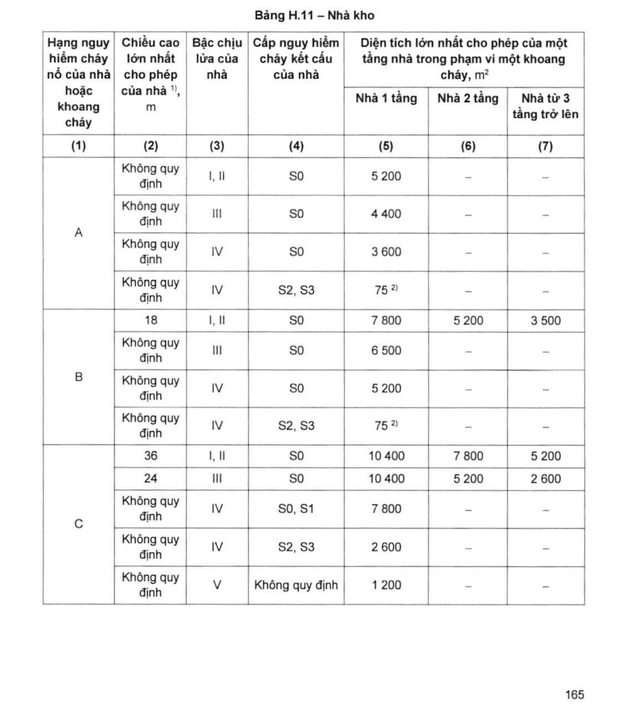
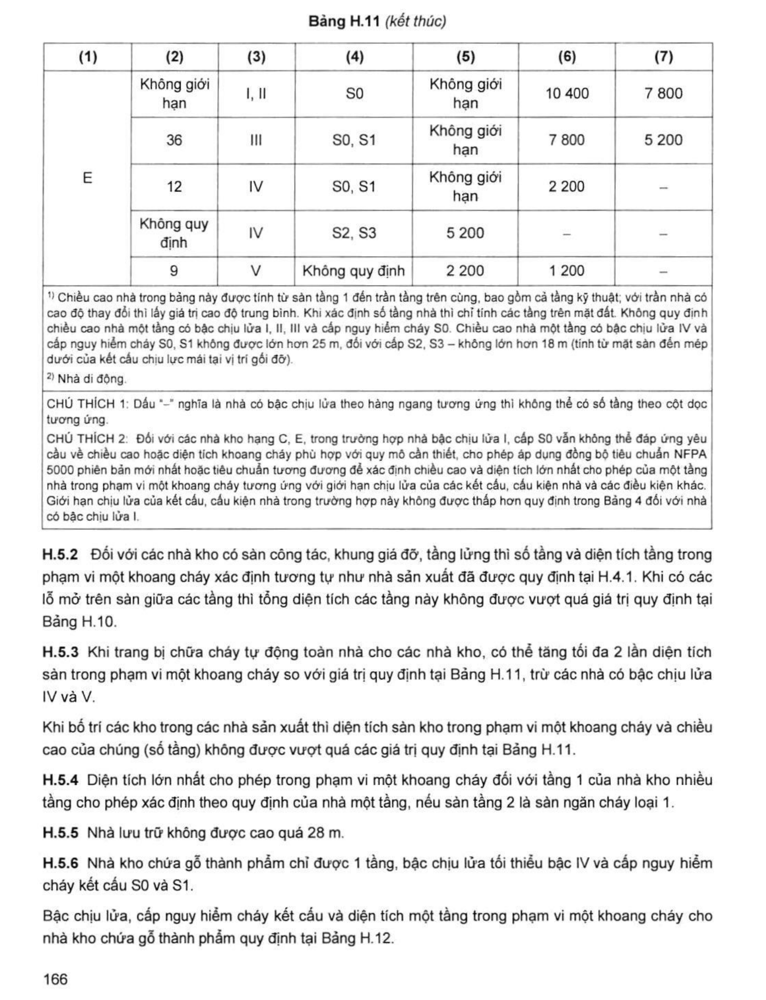
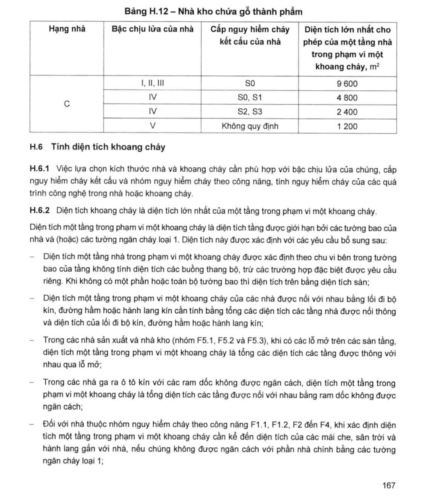

> **Trích dẫn:** mục H.5 QCVN 06:2022/BXD

# H.5 Nhà kho

## H.5 Nhà kho

**H.5.1** Bậc chịu lửa, cấp nguy hiểm cháy kết cấu, chiều cao lớn nhất cho phép của nhà và diện tích một tầng trong phạm vi một khoang cháy đối với nhà kho (nhóm F5.2) phụ thuộc vào hạng nguy hiểm cháy nổ được quy định tại Bảng H.11.

**Bảng H.11 – Nhà kho**

*Diện tích lớn nhất cho phép của một tầng nhà trong phạm vi một khoang cháy, m²:*

| Hạng nguy hiểm cháy nổ của nhà hoặc khoang cháy | Chiều cao lớn nhất cho phép của nhà ^1)^, m | Bậc chịu lửa của nhà | Cấp nguy hiểm cháy kết cấu của nhà | Nhà 1 tầng | Nhà 2 tầng | Nhà từ 3 tầng trở lên |
|---|---|---|---|---|---|---|
| (1) | (2) | (3) | (4) | (5) | (6) | (7) |
| **A** | Không quy định | I, II | S0 | 5 200 | – | – |
| A | Không quy định | III | S0 | 4 400 | – | – |
| A | Không quy định | IV | S0 | 3 600 | – | – |
| A | Không quy định | IV | S2, S3 | 75 ^2)^ | – | – |
| **B** | 18 | I, II | S0 | 7 800 | 5 200 | 3 500 |
| B | Không quy định | III | S0 | 6 500 | – | – |
| B | Không quy định | IV | S0 | 5 200 | – | – |
| B | Không quy định | IV | S2, S3 | 75 ^2)^ | – | – |
| **C** | 36 | I, II | S0 | 10 400 | 7 800 | 5 200 |
| C | 24 | III | S0 | 10 400 | 5 200 | 2 600 |
| C | Không quy định | IV | S0, S1 | 7 800 | – | – |
| C | Không quy định | IV | S2, S3 | 2 600 | – | – |
| C | Không quy định | V | Không quy định | 1 200 | – | – |
| **E** | Không giới hạn | I, II | S0 | Không giới hạn | 10 400 | 7 800 |
| E | 36 | III | S0, S1 | Không giới hạn | 7 800 | 5 200 |
| E | 12 | IV | S0, S1 | Không giới hạn | 2 200 | – |
| E | Không quy định | IV | S2, S3 | 5 200 | – | – |
| E | 9 | V | Không quy định | 2 200 | 1 200 | – |

> ^1)^ Chiều cao nhà trong bảng này được tính từ sàn tầng 1 đến trần tầng trên cùng, bao gồm cả tầng kỹ thuật; với trần nhà có cao độ thay đổi thì lấy giá trị cao độ trung bình. Khi xác định số tầng nhà thì chỉ tính các tầng trên mặt đất. Không quy định chiều cao nhà một tầng có bậc chịu lửa I, II, III và cấp nguy hiểm cháy S0. Chiều cao nhà một tầng có bậc chịu lửa IV và cấp nguy hiểm cháy S0, S1 không được lớn hơn 25 m, đối với cấp S2, S3 – không lớn hơn 18 m (tính từ mặt sàn đến mép dưới của kết cấu chịu lực mái tại vị trí gối đỡ).
>
> ^2)^ Nhà di động.
>
> CHÚ THÍCH 1: Dấu "–" nghĩa là nhà có bậc chịu lửa theo hàng ngang tương ứng thì không thể có số tầng theo cột dọc tương ứng.
>
> CHÚ THÍCH 2: Đối với các nhà kho hạng C, E, trong trường hợp nhà bậc chịu lửa I, cấp S0 vẫn không thể đáp ứng yêu cầu về chiều cao hoặc diện tích khoang cháy phù hợp với quy mô cần thiết, cho phép áp dụng đồng bộ tiêu chuẩn **NFPA 5000** phiên bản mới nhất hoặc tiêu chuẩn tương đương để xác định chiều cao và diện tích lớn nhất cho phép của một tầng nhà trong phạm vi một khoang cháy tương ứng với giới hạn chịu lửa của các kết cấu, cấu kiện nhà và các điều kiện khác. Giới hạn chịu lửa của kết cấu, cấu kiện nhà trong trường hợp này không được thấp hơn quy định trong Bảng 4 đối với nhà có bậc chịu lửa I.

**H.5.2** Đối với các nhà kho có sàn công tác, khung giá đỡ, tầng lửng thì số tầng và diện tích tầng trong phạm vi một khoang cháy xác định tương tự như nhà sản xuất đã được quy định tại H.4.1. Khi có các lỗ mở trên sàn giữa các tầng thì tổng diện tích các tầng này không được vượt quá giá trị quy định tại Bảng H.10.

**H.5.3** Khi trang bị chữa cháy tự động toàn nhà cho các nhà kho, có thể **tăng tối đa 2 lần** diện tích sàn trong phạm vi một khoang cháy so với giá trị quy định tại Bảng H.11, trừ các nhà có bậc chịu lửa IV và V.

Khi bố trí các kho trong các nhà sản xuất thì diện tích sàn kho trong phạm vi một khoang cháy và chiều cao của chúng (số tầng) không được vượt quá các giá trị quy định tại Bảng H.11.

**H.5.4** Diện tích lớn nhất cho phép trong phạm vi một khoang cháy đối với tầng 1 của nhà kho nhiều tầng cho phép xác định theo quy định của nhà một tầng, nếu sàn tầng 2 là sàn ngăn cháy loại 1.

**H.5.5** Nhà lưu trữ không được cao quá **28 m**.

**H.5.6** Nhà kho chứa gỗ thành phẩm chỉ được 1 tầng, bậc chịu lửa tối thiểu bậc IV và cấp nguy hiểm cháy kết cấu S0 và S1.

Bậc chịu lửa, cấp nguy hiểm cháy kết cấu và diện tích một tầng trong phạm vi một khoang cháy cho nhà kho chứa gỗ thành phẩm quy định tại Bảng H.12.

Khi trang bị chữa cháy tự động cho nhà kho chứa gỗ thành phẩm thì cho phép tăng tối đa 2 lần giá trị diện tích một tầng trong phạm vi một khoang cháy quy định tại Bảng H.12, trừ nhà có bậc chịu lửa IV với cấp nguy hiểm cháy kết cấu bất kỳ và nhà có bậc chịu lửa V. Trong trường hợp này, cường độ và diện tích để tính toán lượng nước tiêu hao hoặc chất tạo bọt cần tăng thêm **10 %**.

**Bảng H.12 – Nhà kho chứa gỗ thành phẩm**

| Hạng nhà | Bậc chịu lửa của nhà | Cấp nguy hiểm cháy kết cấu của nhà | Diện tích lớn nhất cho phép của một tầng nhà trong phạm vi một khoang cháy, m² |
|---|---|---|---|
| **C** | I, II, III | S0 | 9 600 |
| C | IV | S0, S1 | 4 800 |
| C | IV | S2, S3 | 2 400 |
| C | V | Không quy định | 1 200 |
