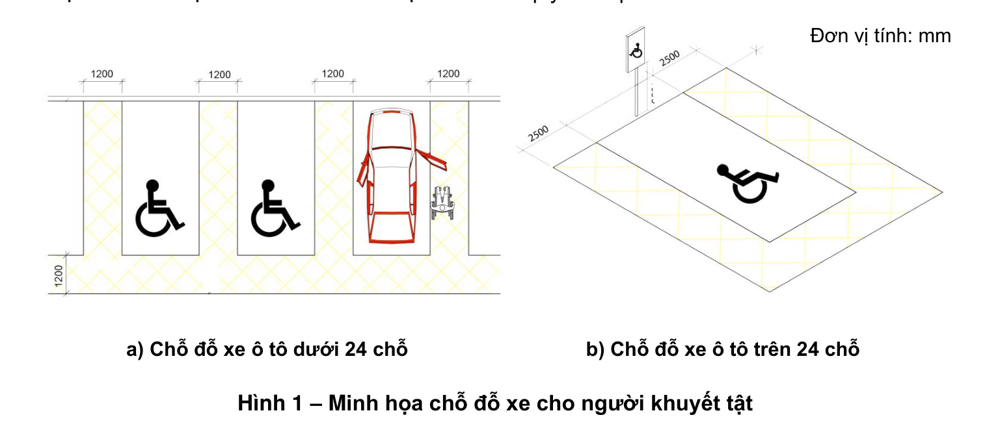
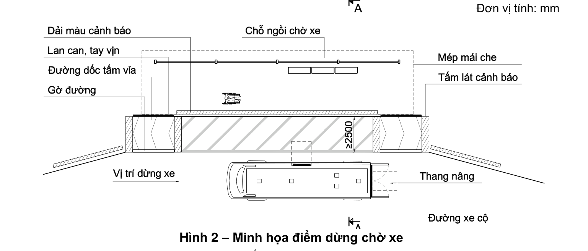
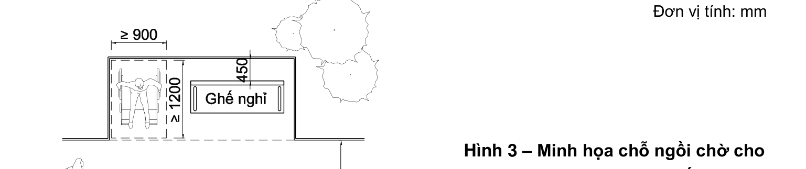

> **Trích dẫn:** mục 2.1 QCVN 10:2024/BXD

# 2.1 Bãi đỗ xe và điểm dừng chờ xe

**2.1.1** Trong bãi đỗ xe công cộng và bãi đỗ xe của các tòa nhà phải có chỗ đỗ xe cho người gặp khó khăn khi tiếp cận. Số lượng tính toán chỗ đỗ xe phải tuân theo quy định trong Bảng 1.

**Bảng 1 – Số lượng chỗ đỗ xe cho người gặp khó khăn khi tiếp cận trong bãi đỗ xe**

*Đơn vị tính: Chỗ*

| Tổng số chỗ đỗ xe | Số lượng tối thiểu cho người gặp khó khăn khi tiếp cận |
|---|---|
| Trên 5 đến 50 | 1 |
| Từ 51 đến 100 | 2 |
| Từ 101 đến 150 | 3 |
| Từ 151 đến 200 | 4 |
| Trên 200 | 5 + 1 chỗ cho mỗi lần thêm 100 xe |

> CHÚ THÍCH:
>
> 1) Diện tích chỗ đỗ xe bao gồm đường nội bộ trong gara/bãi đỗ xe, tuân thủ quy định tại QCVN 01:2021/BXD.
> 2) Nếu bãi đỗ xe có không quá 5 chỗ thì không cần thiết kế chỗ đỗ xe cho người gặp khó khăn khi tiếp cận.
> 3) Bên cạnh chỗ đỗ xe ô tô dành cho người gặp khó khăn khi tiếp cận phải có khoảng không gian có chiều rộng thông thủy đảm bảo:
>    - Không nhỏ hơn 1 200 mm đối với chỗ đỗ xe ô tô dưới 24 chỗ; (Xem hình 1a)
>    - Không nhỏ hơn 2 500 mm đối với chỗ đỗ xe ô tô trên 24 chỗ. (Xem hình 1b)

**2.1.2** Vị trí chỗ đỗ xe cho người gặp khó khăn khi tiếp cận phải được bố trí gần đường vào, lối vào công trình. Đối với các bãi đỗ xe công cộng thì chỗ đỗ xe cho người gặp khó khăn khi tiếp cận phải gần với đường dành cho người đi bộ.

**2.1.3** Tại các điểm dừng chờ xe khi có sự thay đổi cao độ phải bố trí vệt dốc hay đường dốc và đặt các tấm lát nổi hoặc đánh dấu bằng các màu sắc tương phản trên đường chờ để người gặp khó khăn khi tiếp cận đến được các phương tiện giao thông (xem Hình 2).

**2.1.4** Tại các điểm dừng chờ xe phải bố trí chỗ ngồi cho người gặp khó khăn khi tiếp cận và có không gian dành cho người đi xe lăn (xem Hình 3).

**2.1.5** Tại khu vực dành cho người gặp khó khăn khi tiếp cận phải có biển báo, biển chỉ dẫn hoặc các dấu hiệu cảnh báo có thể nhận biết theo quy ước quốc tế.

**Hình 1 – Minh họa chỗ đỗ xe cho người khuyết tật** — *a) Chỗ đỗ xe ô tô dưới 24 chỗ; b) Chỗ đỗ xe ô tô trên 24 chỗ. Đơn vị tính: mm*

**Hình 2 – Minh họa điểm dừng chờ xe** — *Đơn vị tính: mm*

**Hình 3 – Minh họa chỗ ngồi chờ cho người gặp khó khăn khi tiếp cận tại các điểm dừng chờ xe** — *Đơn vị tính: mm*
