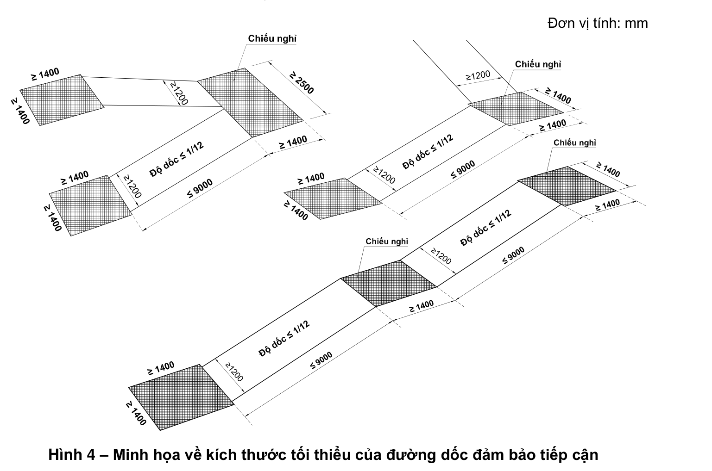
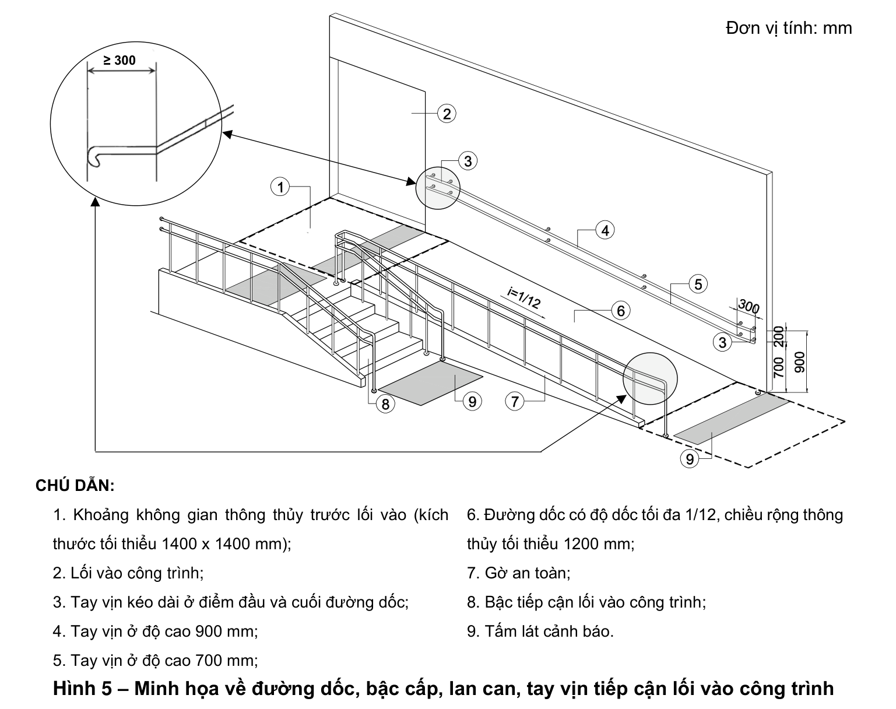
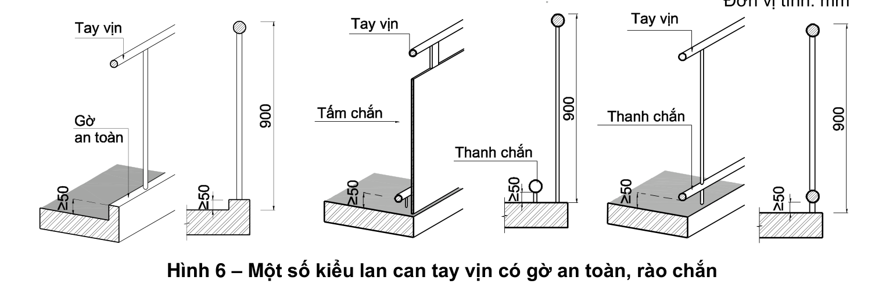
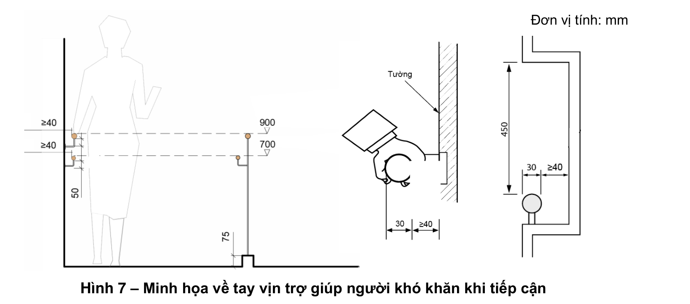
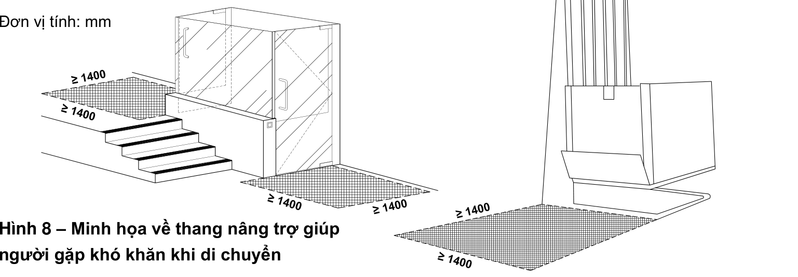

> **Trích dẫn:** mục 2.2 QCVN 10:2024/BXD

# 2.2 Đường, lối vào công trình

**2.2.1** Trong một khuôn viên, công trình hoặc một hạng mục công trình, ít nhất phải có một đường, lối vào công trình đảm bảo tiếp cận sử dụng. Và phải có biển báo, biển chỉ dẫn để có thể nhận biết.

**2.2.2** Đường, lối vào công trình đảm bảo tiếp cận sử dụng phải bằng phẳng, không trơn trượt và phải bố trí đường dốc khi có sự thay đổi cao độ.

**2.2.3** Khi thiết kế đường dốc phải tuân theo các quy định sau (xem Hình 4):

- Độ dốc: không lớn hơn 1/12;
- Chiều rộng thông thủy đường dốc: không nhỏ hơn 1 200 mm;
- Chiều dài đường dốc: không lớn hơn 9 000 mm; khi lớn hơn 9 000 mm phải bố trí chiếu nghỉ;
- Chiều dài chiếu nghỉ: không nhỏ hơn 1 400 mm;
- Tại điểm bắt đầu và kết thúc đường dốc phải có không gian có kích thước không nhỏ hơn 1 400 mm x 1 400 mm để xe lăn có thể di chuyển được;
- Bề mặt đường dốc phải cứng, không được ghồ ghề và không trơn trượt.

**Hình 4 – Minh họa về kích thước tối thiểu của đường dốc đảm bảo tiếp cận** — *Đơn vị tính: mm*

**2.2.4** Hai bên đường dốc phải bố trí lan can, tay vịn liên tục. Nếu một bên đường dốc có khoảng trống thì phía chân lan can, tay vịn phải bố trí gờ an toàn hoặc bố trí rào chắn (xem Hình 5; 6).

- Tay vịn phải được lắp đặt ở độ cao 900 mm so với mặt sàn/nền hoàn thiện. Nếu bố trí tay vịn hai tầng thì tay vịn phía dưới phải lắp đặt ở độ cao 700 mm so với mặt sàn/nền hoàn thiện.
- Ở điểm đầu và điểm cuối đường dốc, tay vịn phải được kéo dài thêm một đoạn, chiều dài không nhỏ hơn 300 mm (xem Hình 5). Khoảng cách giữa tay vịn và bức tường gắn không nhỏ hơn 40 mm (xem Hình 7).

**Hình 5 – Minh họa về đường dốc, bậc cấp, lan can, tay vịn tiếp cận lối vào công trình** — *Đơn vị tính: mm*

> **CHÚ DẪN của Hình 5:**
>
> 1. Khoảng không gian thông thủy trước lối vào (kích thước tối thiểu 1400 x 1400 mm);
> 2. Lối vào công trình;
> 3. Tay vịn kéo dài ở điểm đầu và cuối đường dốc;
> 4. Tay vịn ở độ cao 900 mm;
> 5. Tay vịn ở độ cao 700 mm;
> 6. Đường dốc có độ dốc tối đa 1/12, chiều rộng thông thủy tối thiểu 1200 mm;
> 7. Gờ an toàn;
> 8. Bậc tiếp cận lối vào công trình;
> 9. Tấm lát cảnh báo.

**Hình 6 – Một số kiểu lan can tay vịn có gờ an toàn, rào chắn** — *Đơn vị tính: mm*

**Hình 7 – Minh họa về tay vịn trợ giúp người khó khăn khi tiếp cận** — *Đơn vị tính: mm*

**2.2.5** Đối với lối vào có bố trí bậc tiếp cận phải tuân theo các quy định sau:

- Chiều cao bậc: không lớn hơn 150 mm;
- Bề rộng mặt bậc: không nhỏ hơn 300 mm;
- Không dùng bậc thang hở; không làm mũi bậc;
- Khi bố trí nhiều hơn 3 bậc thì phải bố trí lắp đặt tay vịn hai bên tuân theo quy định tại 2.2.4 (xem Hình 5).

**2.2.6** Trường hợp có cửa trên lối vào cho người gặp khó khăn khi tiếp cận thì không được làm ngưỡng cửa và không sử dụng cửa quay.

**2.2.7** Tại lối vào phải lắp đặt biển báo, có hệ thống thông báo bằng âm thanh và tấm lát có dấu hiệu chỉ hướng tiếp cận đến thang máy và các dịch vụ dành cho người gặp khó khăn khi tiếp cận.

**2.2.8** Đối với những công trình do yêu cầu bảo tồn hoặc công trình có lối vào công trình không đảm bảo tiếp cận và không đủ điều kiện bố trí đường dốc, thì phải bố trí các thiết bị hỗ trợ di động (thang nâng hoặc đường dốc di động) (xem Hình 8).

**Hình 8 – Minh họa về thang nâng trợ giúp người gặp khó khăn khi di chuyển** — *Đơn vị tính: mm*
