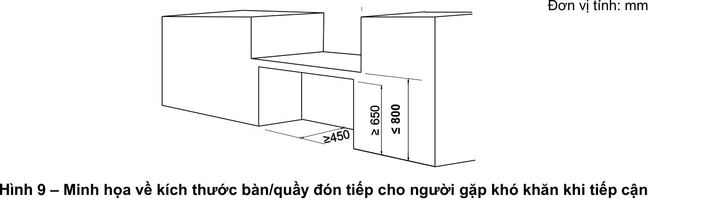
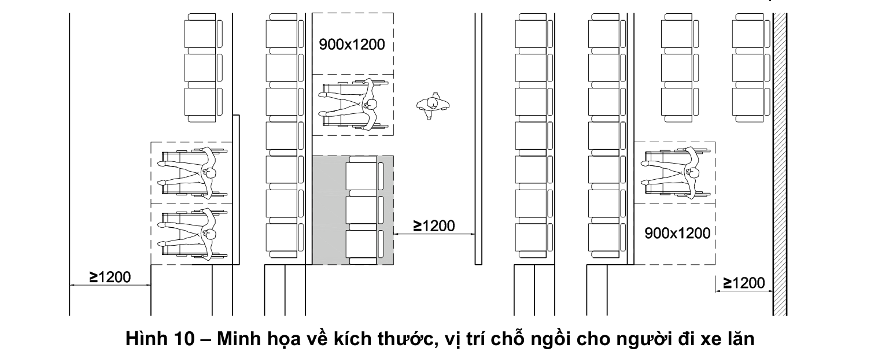
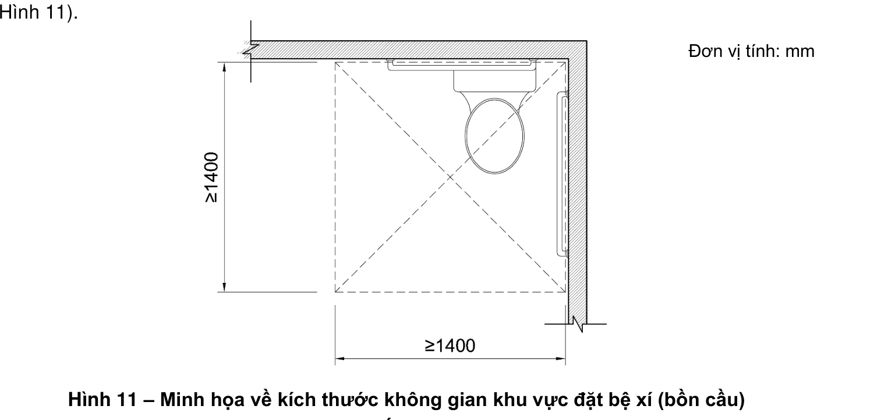
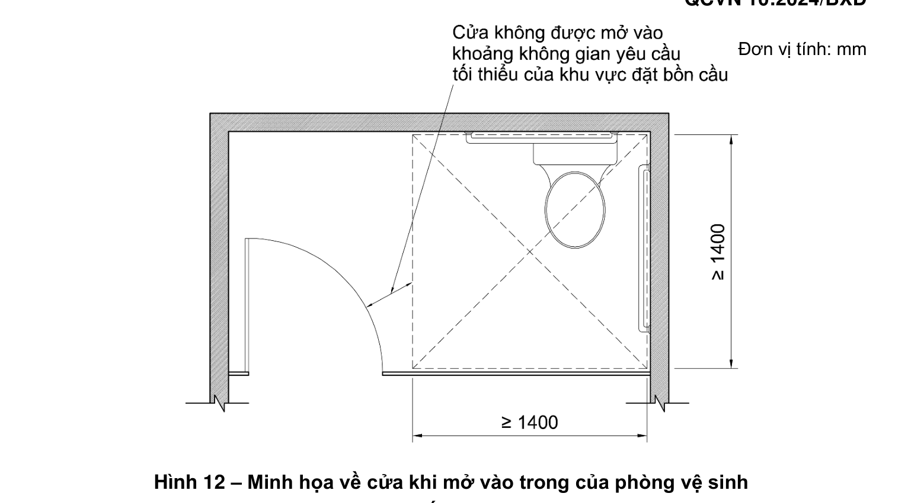
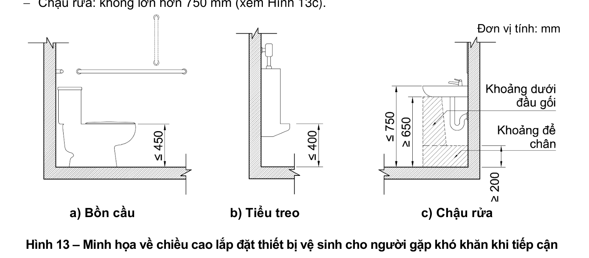
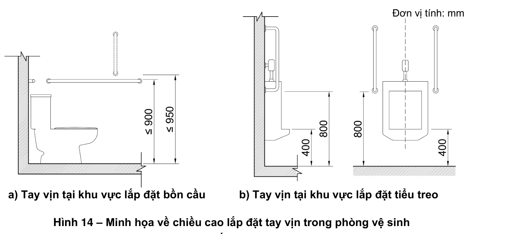

> **Trích dẫn:** mục 2.5 QCVN 10:2024/BXD

# 2.5 Các không gian công cộng trong công trình

#### 2.5.1 Nơi đón tiếp/giao tiếp

**2.5.1.1** Tại các khu vực như nơi ngồi chờ, chỗ xếp hàng để làm thủ tục đăng ký hay thanh toán, quầy bán hàng, nơi đổi tiền, rút tiền, trạm điện thoại công cộng, khu vực vui chơi giải trí, dịch vụ ăn uống hoặc tại các bề mặt làm việc trong các công trình công cộng phải đảm bảo tiếp cận sử dụng.

**2.5.1.2** Phải có ít nhất một nơi đón tiếp/giao tiếp dành cho người gặp khó khăn khi tiếp cận ứng với mỗi một loại dịch vụ. Và phải bố trí các biển báo, bảng chỉ dẫn bằng các ký hiệu, biểu tượng hoặc có hệ thống thông báo bằng âm thanh theo quy ước quốc tế.

**2.5.1.3** Khi bố trí bàn/quầy đón tiếp/giao tiếp thì phải có khoảng trống để chân phía dưới mặt bàn/quầy để người đi xe lăn có thể tiếp cận được. Kích thước bàn/quầy đón tiếp/giao tiếp phải tuân theo các quy định sau (xem Hình 9):

- Chiều cao từ mặt sàn/nền hoàn thiện đến mặt bàn/quầy: không lớn hơn 800 mm;
- Chiều cao thông thủy khoảng trống phía dưới mặt bàn/quầy: không nhỏ hơn 650 mm;
- Chiều sâu khoảng trống để chân: không nhỏ hơn 450 mm.

**Hình 9 – Minh họa về kích thước bàn/quầy đón tiếp cho người gặp khó khăn khi tiếp cận** — *Đơn vị tính: mm*

#### 2.5.2 Chỗ ngồi

**2.5.2.1** Trong các công trình có phòng khán giả, phòng học, phòng họp, phòng chờ, cửa hàng, sân vận động phải bố trí chỗ ngồi thuận tiện cho người đi xe lăn (xem Hình 9).

**2.5.2.2** Vị trí chỗ ngồi dành cho người đi xe lăn phải ở gần lối ra vào, đảm bảo thuận tiện và dễ dàng thoát người khi có sự cố (xem Hình 10).

**2.5.2.3** Kích thước thông thủy không gian tối thiểu cho một vị trí xe lăn: 900 mm x 1 200 mm (xem Hình 10).

**2.5.2.4** Số lượng chỗ dành tối thiểu cho người đi xe lăn phải tuân theo quy định trong Bảng 2.

**Bảng 2 – Số chỗ dành cho người đi xe lăn**

*Đơn vị tính: Chỗ*

| Quy mô chỗ ngồi | Số lượng chỗ tối thiểu dành cho người đi xe lăn |
|---|---|
| 1. Dưới 30 | 1 |
| 2. Từ 31 đến 50 | 2 |
| 3. Từ 51 đến 100 | 3 |
| 4. Từ 101 đến 300 | 5 |
| 5. Từ 301 đến 600 | 6 |
| 6. Trên 600 | 6 + 1 cho mỗi một lần thêm 200 chỗ ngồi |

**Hình 10 – Minh họa về kích thước, vị trí chỗ ngồi cho người đi xe lăn** — *Đơn vị tính: mm*

#### 2.5.3 Phòng khám và phòng chăm sóc bệnh nhân trong các cơ sở khám, chữa bệnh

**2.5.3.1** Các phòng khám và phòng chăm sóc bệnh nhân trong các cơ sở khám, chữa bệnh phải đáp ứng có số phòng đảm bảo tiếp cận sử dụng tuân thủ theo các quy định sau:

- Bệnh viện, trung tâm y tế, phòng khám đa khoa: **10 %** tổng số phòng bệnh, phòng khám;
- Trung tâm chỉnh hình và phục hồi chức năng: **100 %** số phòng lưu, phòng khám;
- Trung tâm điều dưỡng: **50 %** số buồng phòng.

**2.5.3.2** Trong phòng khám và phòng chăm sóc bệnh nhân phải dành khoảng không gian có kích thước tối thiểu 1 400 mm x 1 400 mm để di chuyển xe lăn.

**2.5.3.3** Phải bố trí tay vịn dọc theo hai bên hành lang, lối đi tới phòng khám và phòng chăm sóc bệnh nhân. Chiều cao lắp đặt tay vịn tuân theo quy định tại 2.2.4.

#### 2.5.4 Buồng phòng trong khách sạn, nhà nghỉ

**2.5.4.1** Đối với khách sạn, nhà nghỉ dưới 100 phòng phải có ít nhất **5 %** số phòng đảm bảo tiếp cận sử dụng. Nếu có trên 100 phòng, thì cứ có thêm 50 phòng thì phải có thêm 01 phòng đảm bảo tiếp cận sử dụng.

> CHÚ THÍCH: Trường hợp 5 % số phòng nhỏ hơn 1 thì số phòng đảm bảo tiếp cận sử dụng tối thiểu là 01 phòng.

**2.5.4.2** Trong phòng ngủ dành cho người đi xe lăn phải dành khoảng không gian có kích thước tối thiểu 1 400 mm x 1 400 mm về một phía của giường ngủ để di chuyển xe lăn.

**2.5.4.3** Đối với công trình không có thang máy, các phòng dành cho người gặp khó khăn khi tiếp cận phải bố trí ở dưới tầng trệt (tầng 1).

#### 2.5.5 Khu vệ sinh

**2.5.5.1** Trong các công trình công cộng, phải có tối thiểu **01 phòng vệ sinh** đảm bảo tiếp cận sử dụng và không nhỏ hơn **5 %** tổng số phòng vệ sinh.

> CHÚ THÍCH: Phòng vệ sinh đảm bảo tiếp cận sử dụng dùng cho tất cả các đối tượng đã nêu tại 1.1.1 và không phân biệt giới tính.

**2.5.5.2** Đối với khu vệ sinh chung, bố trí tối thiểu cứ **6 tiểu treo phải có 1 tiểu** dành cho người gặp khó khăn khi tiếp cận. Có thể bố trí phòng/buồng vệ sinh đảm bảo tiếp cận sử dụng khi trong khu vệ sinh chung có đủ không gian diện tích đảm bảo theo quy định tại quy chuẩn này.

**2.5.5.3** Trong các khu vệ sinh, nếu thiết kế có khu vực thay tã/bỉm cho trẻ sơ sinh, phải nghiên cứu bố trí sao cho phù hợp, tránh ảnh hưởng tới các không gian sử dụng khác.

**2.5.5.4** Trong phòng/buồng vệ sinh đảm bảo tiếp cận sử dụng, khu vực đặt bệ xí (bồn cầu) phải có khoảng không gian thông thuỷ tối thiểu 1 400 mm x 1 400 mm để di chuyển xe lăn (xem Hình 11).

**Hình 11 – Minh họa về kích thước không gian khu vực đặt bệ xí (bồn cầu) đảm bảo tiếp cận sử dụng** — *Đơn vị tính: mm*

**2.5.5.5** Chiều rộng thông thủy của cửa phòng vệ sinh không nhỏ hơn 800 mm và phải tuân theo các quy định sau:

- Cửa mở ra ngoài không được cản trở lối thoát hiểm;
- Cửa mở vào trong, không được ảnh hưởng đến khoảng không gian yêu cầu tối thiểu của khu vực đặt bệ xí (bồn cầu) (xem Hình 12).

**Hình 12 – Minh họa về cửa khi mở vào trong của phòng vệ sinh đảm bảo tiếp cận sử dụng** — *Đơn vị tính: mm*

**2.5.5.6** Chiều cao lắp đặt thiết bị vệ sinh dành cho người gặp khó khăn khi tiếp cận tính từ mặt sàn/nền hoàn thiện phải tuân theo các quy định sau:

- **Bệ xí (bồn cầu):** không lớn hơn 450 mm (xem Hình 13a);
- **Tiểu treo:** không lớn hơn 400 mm (xem Hình 13b);
- **Chậu rửa:** không lớn hơn 750 mm (xem Hình 13c).

**Hình 13 – Minh họa về chiều cao lắp đặt thiết bị vệ sinh cho người gặp khó khăn khi tiếp cận** — *a) Bồn cầu; b) Tiểu treo; c) Chậu rửa. Đơn vị tính: mm*

**2.5.5.7** Chiều cao lắp đặt tay vịn trong khu vực lắp đặt bệ xí (bồn cầu) tính từ mặt sàn/nền hoàn thiện không lớn hơn 900 mm đối với tay vịn nằm ngang. Trường hợp thiết kế lắp đặt tay vịn đứng thì điểm thấp nhất của tay vịn không lớn hơn 950 mm (xem Hình 14a).

- Khu vực tiểu treo: điểm thấp nhất của tay vịn không lớn hơn 800 mm (xem Hình 14b).

**Hình 14 – Minh họa về chiều cao lắp đặt tay vịn trong phòng vệ sinh** — *a) Tay vịn tại khu vực lắp đặt bồn cầu; b) Tay vịn tại khu vực lắp đặt tiểu treo. Đơn vị tính: mm*

**2.5.5.8** Bề mặt sàn khu vệ sinh không được trơn trượt.

**2.5.5.9** Trong phòng vệ sinh đảm bảo tiếp cận sử dụng phải bố trí lắp đặt hệ thống chuông báo khẩn cấp, trợ giúp cho người gặp khó khăn khi tiếp cận trong trường hợp gặp sự cố. Chiều cao lắp đặt nút bấm chuông báo khẩn cấp tính từ mặt sàn/nền hoàn thiện không lớn hơn 400 mm.

**2.5.5.10** Khu vệ sinh dành cho người gặp khó khăn khi tiếp cận phải có biển báo, biển chỉ dẫn và có hệ thống thông báo bằng âm thanh theo quy ước quốc tế.
