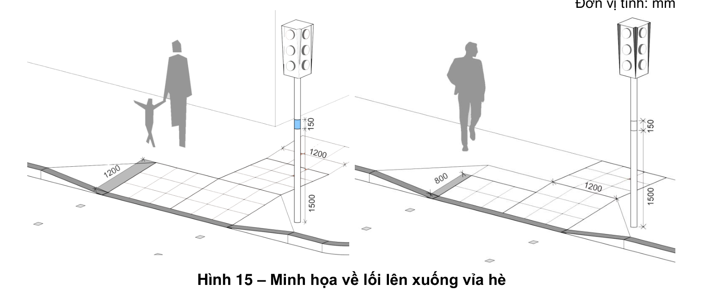
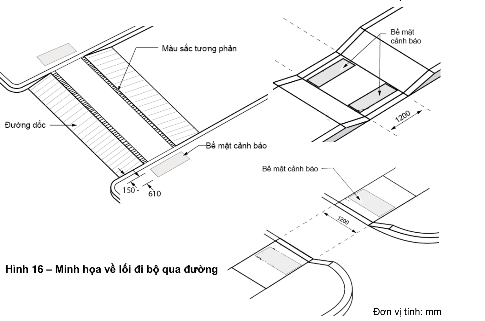
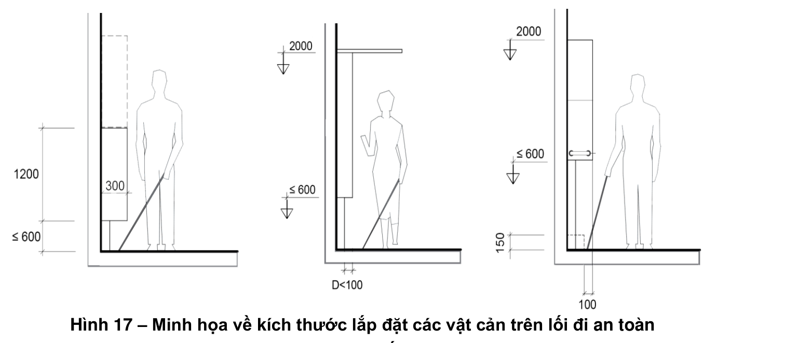
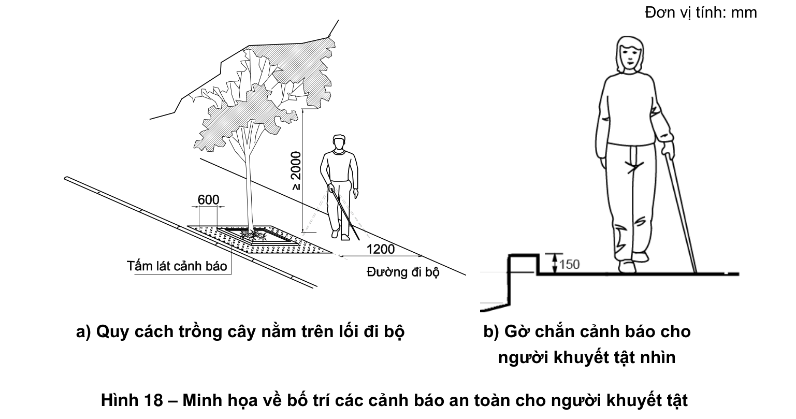
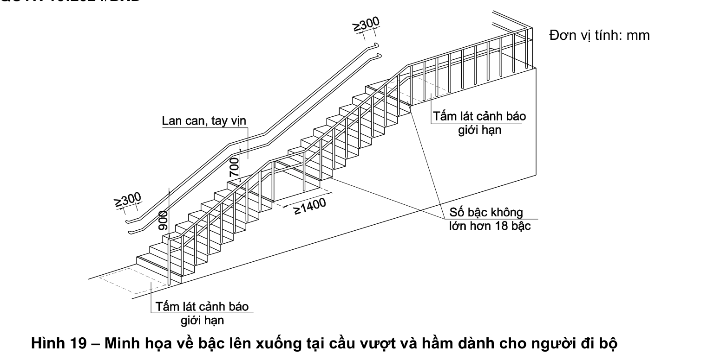

> **Trích dẫn:** mục 2.7 QCVN 10:2024/BXD

# 2.7 Đường và hè phố

**2.7.1** Tại các nơi giao cắt khác cao độ như các lối sang đường, lối lên xuống hè phố phải làm đường dốc, vệt dốc tuân theo quy định tại 2.2.3 (xem Hình 15).

**2.7.2** Tại nơi giao giữa lối đi bộ và đường dành cho các phương tiện giao thông, lối sang đường dành cho người đi bộ hoặc tại lối vào công trình phải bố trí tấm lát cảnh báo giao cắt. Lối đi bộ sang đường phải đảm bảo không có sự thay đổi cao độ (xem Hình 16).

**2.7.3** Các tiện nghi trên đường phố như: "điểm chờ xe buýt, ghế nghỉ, cột điện, đèn đường, cọc tiêu, biển báo, trạm điện thoại công cộng, hòm thư, trạm rút tiền tự động, bồn hoa, cây xanh, thùng rác công cộng" không được gây cản trở cho người gặp khó khăn khi tiếp cận và được cảnh báo bằng các tấm lát nổi và đánh dấu bằng các màu sắc tương phản để người khuyết tật nhìn có thể nhận biết.

**Hình 15 – Minh họa về lối lên xuống vỉa hè** — *Đơn vị tính: mm*

**2.7.4** Các chướng ngại vật đứng độc lập như: "biển quảng cáo, thùng thư, điện thoại công cộng" phải được bố trí bên ngoài phần đường dành cho người đi bộ. Cạnh dưới cách mặt đất không lớn hơn 600 mm, độ nhô ra tối đa là 100 mm và chiều cao thông thủy trên lối đi là 2 000 mm để người khuyết tật nhìn tránh bị va đập (xem Hình 17).

**Hình 16 – Minh họa về lối đi bộ qua đường** — *Đơn vị tính: mm*

**Hình 17 – Minh họa về kích thước lắp đặt các vật cản trên lối đi an toàn cho người khuyết tật nhìn** — *Đơn vị tính: mm*

**2.7.5** Đối với cây xanh nằm trên lối đi, phải có giải pháp cảnh báo cho người khuyết tật nhìn bằng các biện pháp thay đổi bề mặt vật liệu lát nền xung quanh khu vực trồng cây, làm gờ nổi cao tối thiểu 100 mm hoặc rào chắn xung quanh ô trồng cây. Cắt tỉa các cành cây thấp hơn 2 000 mm (xem Hình 18a).

**2.7.6** Mép ngoài của đường đi bộ và đường đi xung quanh ao, hồ trong công viên phải có dấu hiệu cảnh báo hoặc gờ chắn cao tối thiểu 150 mm để đảm bảo an toàn cho người khuyết tật nhìn (xem Hình 18b).

**Hình 18 – Minh họa về bố trí các cảnh báo an toàn cho người khuyết tật nhìn trên đường đi bộ** — *a) Quy cách trồng cây nằm trên lối đi bộ; b) Gờ chắn cảnh báo cho người khuyết tật nhìn. Đơn vị tính: mm*

**2.7.7** Đối với công trình đang thi công xây dựng mới, cải tạo, sửa chữa nằm kề cận với đường dành cho người đi bộ phải có rào chắn bảo vệ cao từ 1 000 mm đến 1 200 mm, được dựng chắc chắn để không bị đổ khi va đập vào và phải được chiếu sáng đầy đủ vào ban đêm. Giàn giáo và các biện pháp bảo vệ phải không gây nguy hiểm cho người khuyết tật nhìn.

**2.7.8** Đối với cầu vượt và đường hầm có phần đường dành cho người đi bộ nếu có từ 3 bậc trở lên phải tuân theo các quy định sau (xem Hình 19):

- Chiều cao bậc không lớn hơn 150 mm, chiều rộng mặt bậc không nhỏ hơn 300 mm;
- Mỗi đoạn có tối đa 18 bậc. Nếu có nhiều hơn 18 bậc phải bố trí chiếu nghỉ;
- Chiều rộng mặt chiếu nghỉ không nhỏ hơn 1 400 mm;
- Hai bên đường đi có bậc phải bố trí tay vịn tuân theo quy định tại 2.2.4.

**Hình 19 – Minh họa về bậc lên xuống tại cầu vượt và hầm dành cho người đi bộ** — *Đơn vị tính: mm*

**2.7.9** Lối ra vào cầu vượt và đường hầm có phần đường dành cho người đi bộ nếu có sự thay đổi độ cao đột ngột phải có đường dốc tuân theo quy định tại 2.2.3.

**2.7.10** Bề mặt phần đường dành cho người đi bộ trên cầu vượt và trong đường hầm không được trơn trượt.

**2.7.11** Tại điểm bắt đầu và kết thúc cầu vượt và đường dốc trong đường hầm phải có biện pháp để cảnh báo người khuyết tật nhìn bằng các tấm lát nổi cảnh báo giới hạn hoặc đánh dấu bằng các màu sắc tương phản.

**2.7.12** Tại các nơi giao của đường dành cho các phương tiện giao thông, lối vào đường hầm và vị trí lên xuống cầu vượt cần phải có tín hiệu đèn giao thông, biển báo, biển chỉ dẫn và có thêm các tín hiệu bằng âm thanh hoặc chữ nổi Braille để chỉ dẫn người khuyết tật nhìn nhận biết khi qua đường.
