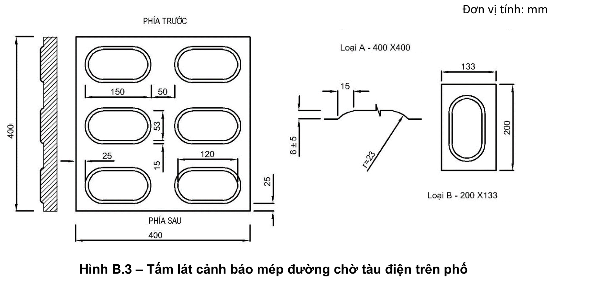
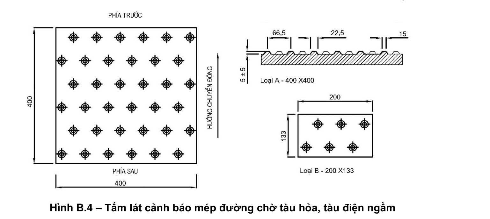

> **Trích dẫn:** mục B.2 QCVN 10:2024/BXD

# B.2 Tấm lát cảnh báo mép đường chờ tại các bến đỗ

## B.2 Tấm lát cảnh báo mép đường chờ tại các bến đỗ

**Hình B.3 – Tấm lát cảnh báo mép đường chờ tàu điện trên phố** — *Đơn vị tính: mm*

- **Tấm lát cảnh báo mép đường chờ tàu điện trên phố** (xem Hình B.3): Dùng để cảnh báo cho người khiếm thị giới hạn mép đường chờ tại ga tàu điện nổi trên phố (ga có đường ray chạy trên đường phố, người đi bộ có thể đi ngang qua hoặc đi dọc đường ray mà không có sự giới hạn, hạn chế hay có hàng rào bảo vệ).

**Hình B.4 – Tấm lát cảnh báo mép đường chờ tàu hỏa, tàu điện ngầm** — *Đơn vị tính: mm*

- **Tấm lát cảnh báo mép đường chờ tàu hỏa, tàu điện ngầm** (xem Hình B.4): Dùng để cảnh báo cho người khiếm thị giới hạn mép đường chờ tại ga tàu hoả, ga tàu điện ngầm.
