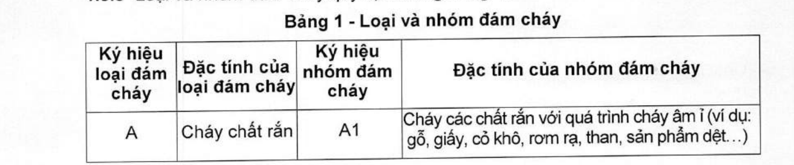
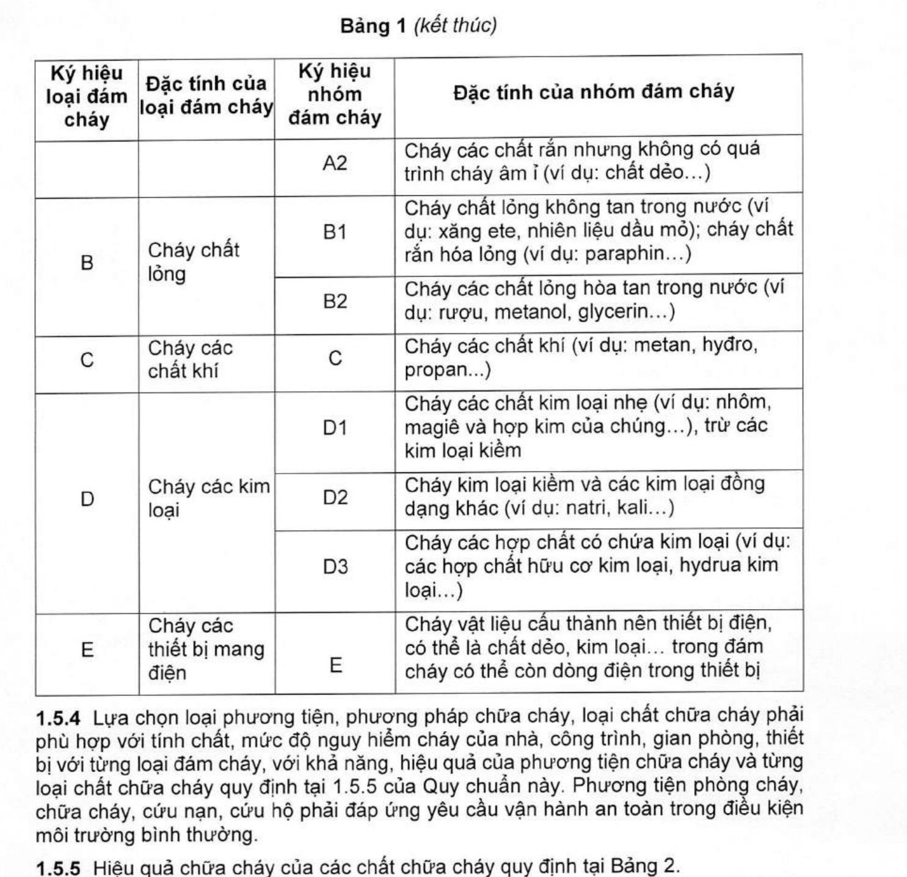
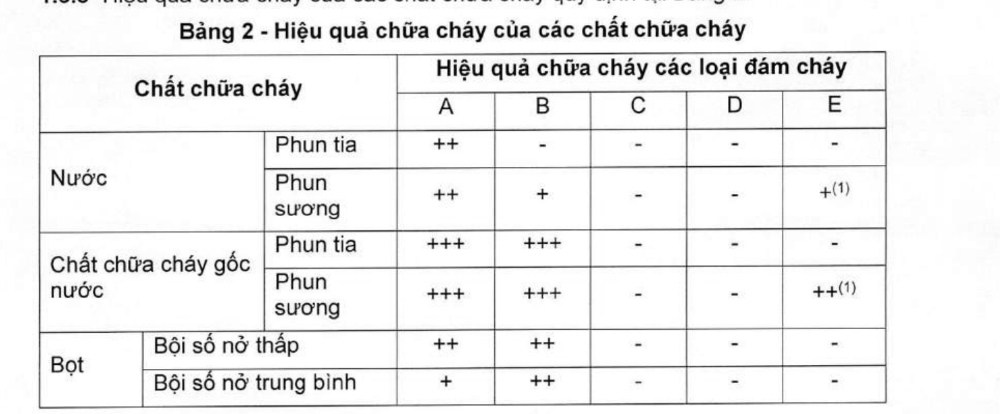
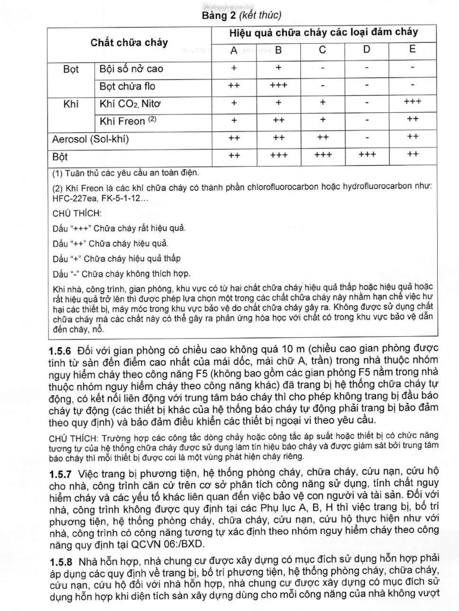

> **Trích dẫn:** mục 1.5 QCVN 10:2025/BCA

# 1.5 Yêu cầu chung

**1.5.1** Nhà, công trình, hạ tầng kỹ thuật về phòng cháy, chữa cháy của khu đô thị, khu nhà ở, khu dân cư, khu công nghiệp, cụm công nghiệp, khu du lịch, khu nghiên cứu, đào tạo, khu thể dục, thể thao không phụ thuộc vào chủ sở hữu và đơn vị chủ quản phải trang bị các phương tiện, hệ thống phòng cháy, chữa cháy, cứu nạn, cứu hộ theo quy định của Quy chuẩn này.

**1.5.2** Nhà, công trình, gian phòng dựa trên tính nguy hiểm cháy theo công năng được phân thành các nhóm F1, F2, F3, F4, F5 theo quy định tại QCVN 06:/BXD; nhà, công trình và gian phòng có công năng sản xuất, kho (nhóm F5) theo tính nguy hiểm cháy và cháy nổ được phân thành các hạng A, B, C, D, E theo quy định tại QCVN 06:/BXD. Phân loại kỹ thuật về cháy (bậc chịu lửa, giải pháp ngăn cháy...) của nhà và công trình xác định theo quy định tại QCVN 06:/BXD.

**1.5.3** Loại và nhóm đám cháy quy định trong Bảng 1.

**Bảng 1 - Loại và nhóm đám cháy**

| Ký hiệu loại đám cháy | Đặc tính của loại đám cháy | Ký hiệu nhóm đám cháy | Đặc tính của nhóm đám cháy |
|---|---|---|---|
| A | Cháy chất rắn | A1 | Cháy các chất rắn với quá trình cháy âm ỉ (ví dụ: gỗ, giấy, cỏ khô, rơm rạ, than, sản phẩm dệt...) |
| A | Cháy chất rắn | A2 | Cháy các chất rắn nhưng không có quá trình cháy âm ỉ (ví dụ: chất dẻo...) |
| B | Cháy chất lỏng | B1 | Cháy chất lỏng không tan trong nước (ví dụ: xăng ete, nhiên liệu dầu mỏ); cháy chất rắn hóa lỏng (ví dụ: paraphin...) |
| B | Cháy chất lỏng | B2 | Cháy các chất lỏng hòa tan trong nước (ví dụ: rượu, metanol, glycerin...) |
| C | Cháy các chất khí | C | Cháy các chất khí (ví dụ: metan, hyđro, propan...) |
| D | Cháy các kim loại | D1 | Cháy các chất kim loại nhẹ (ví dụ: nhôm, magiê và hợp kim của chúng...), trừ các kim loại kiềm |
| D | Cháy các kim loại | D2 | Cháy kim loại kiềm và các kim loại đồng dạng khác (ví dụ: natri, kali...) |
| D | Cháy các kim loại | D3 | Cháy các hợp chất có chứa kim loại (ví dụ: các hợp chất hữu cơ kim loại, hydrua kim loại...) |
| E | Cháy các thiết bị mang điện | E | Cháy vật liệu cấu thành nên thiết bị điện, có thể là chất dẻo, kim loại... trong đám cháy có thể còn dòng điện trong thiết bị |

**1.5.4** Lựa chọn loại phương tiện, phương pháp chữa cháy, loại chất chữa cháy phải phù hợp với tính chất, mức độ nguy hiểm cháy của nhà, công trình, gian phòng, thiết bị với từng loại đám cháy, với khả năng, hiệu quả của phương tiện chữa cháy và từng loại chất chữa cháy quy định tại 1.5.5 của Quy chuẩn này. Phương tiện phòng cháy, chữa cháy, cứu nạn, cứu hộ phải đáp ứng yêu cầu vận hành an toàn trong điều kiện môi trường bình thường.

**1.5.5** Hiệu quả chữa cháy của các chất chữa cháy quy định tại Bảng 2.

**Bảng 2 - Hiệu quả chữa cháy của các chất chữa cháy**

| Chất chữa cháy | | A | B | C | D | E |
|---|---|---|---|---|---|---|
| Nước | Phun tia | ++ | - | - | - | - |
| Nước | Phun sương | ++ | + | - | - | +⁽¹⁾ |
| Chất chữa cháy gốc nước | Phun tia | +++ | +++ | - | - | - |
| Chất chữa cháy gốc nước | Phun sương | +++ | +++ | - | - | ++⁽¹⁾ |
| Bọt | Bội số nở thấp | ++ | ++ | - | - | - |
| Bọt | Bội số nở trung bình | + | ++ | - | - | - |
| Bọt | Bội số nở cao | + | + | - | - | - |
| Bọt | Bọt chứa flo | ++ | +++ | - | - | - |
| Khí | Khí CO₂, Nitơ | + | + | + | - | +++ |
| Khí | Khí Freon ⁽²⁾ | + | ++ | + | - | ++ |
| Aerosol (Sol-khí) | | ++ | ++ | ++ | - | ++ |
| Bột | | ++ | +++ | +++ | +++ | ++ |

⁽¹⁾ Tuân thủ các yêu cầu an toàn điện.

⁽²⁾ Khí Freon là các khí chữa cháy có thành phần chlorofluorocarbon hoặc hydrofluorocarbon như: HFC-227ea, FK-5-1-12...

> CHÚ THÍCH:
>
> Dấu "+++" Chữa cháy rất hiệu quả.
> Dấu "++" Chữa cháy hiệu quả.
> Dấu "+" Chữa cháy hiệu quả thấp.
> Dấu "-" Chữa cháy không thích hợp.
>
> Khi nhà, công trình, gian phòng, khu vực có từ hai chất chữa cháy hiệu quả thấp hoặc hiệu quả hoặc rất hiệu quả trở lên thì được phép lựa chọn một trong các chất chữa cháy này nhằm hạn chế việc hư hại các thiết bị, máy móc trong khu vực bảo vệ do chất chữa cháy gây ra. Không được sử dụng chất chữa cháy mà các chất này có thể gây ra phản ứng hóa học với chất có trong khu vực bảo vệ dẫn đến cháy, nổ.

**1.5.6** Đối với gian phòng có chiều cao không quá 10 m (chiều cao gian phòng được tính từ sàn đến điểm cao nhất của mái dốc, mái chữ A, trần) trong nhà thuộc nhóm nguy hiểm cháy theo công năng F5 (không bao gồm các gian phòng F5 nằm trong nhà thuộc nhóm nguy hiểm cháy theo công năng khác) đã trang bị hệ thống chữa cháy tự động, có kết nối liên động với trung tâm báo cháy thì cho phép không trang bị đầu báo cháy tự động (các thiết bị khác của hệ thống báo cháy tự động phải trang bị bảo đảm theo quy định) và bảo đảm điều khiển các thiết bị ngoại vi theo yêu cầu.

> CHÚ THÍCH: Trường hợp các công tắc dòng chảy hoặc công tắc áp suất hoặc thiết bị có chức năng tương tự của hệ thống chữa cháy được sử dụng làm tín hiệu báo cháy và được giám sát bởi trung tâm báo cháy thì mỗi thiết bị được coi là một vùng phát hiện cháy riêng.

**1.5.7** Việc trang bị phương tiện, hệ thống phòng cháy, chữa cháy, cứu nạn, cứu hộ cho nhà, công trình căn cứ trên cơ sở phân tích công năng sử dụng, tính chất nguy hiểm cháy và các yếu tố khác liên quan đến việc bảo vệ con người và tài sản. Đối với nhà, công trình không được quy định tại các Phụ lục A, B, H thì việc trang bị, bố trí phương tiện, hệ thống phòng cháy, chữa cháy, cứu nạn, cứu hộ thực hiện như với nhà, công trình có công năng tương tự xác định theo nhóm nguy hiểm cháy theo công năng quy định tại QCVN 06:/BXD.

**1.5.8** Nhà hỗn hợp, nhà chung cư được xây dựng có mục đích sử dụng hỗn hợp phải áp dụng các quy định về trang bị, bố trí phương tiện, hệ thống phòng cháy, chữa cháy, cứu nạn, cứu hộ đối với nhà hỗn hợp, nhà chung cư được xây dựng có mục đích sử dụng hỗn hợp khi diện tích sàn xây dựng dùng cho mỗi công năng của nhà không vượt quá 70 % tổng diện tích sàn xây dựng của nhà (không bao gồm các diện tích sàn dùng cho hệ thống kỹ thuật, phòng cháy, chữa cháy, gian lánh nạn và đỗ xe);

Nhà hỗn hợp, nhà chung cư được xây dựng có mục đích sử dụng hỗn hợp phải áp dụng các quy định về trang bị, bố trí phương tiện, hệ thống phòng cháy, chữa cháy, cứu nạn, cứu hộ theo công năng mà có diện tích sàn xây dựng dùng cho công năng đó của nhà vượt quá 70 % tổng diện tích sàn xây dựng của nhà (không bao gồm các diện tích sàn dùng cho hệ thống kỹ thuật, phòng cháy, chữa cháy, gian lánh nạn và đỗ xe).

**1.5.9** Khi xác định yêu cầu trang bị hệ thống chữa cháy tự động và/hoặc hệ thống báo cháy tự động trước tiên cần xác định yêu cầu trang bị cho toàn bộ nhà (Bảng A.1), sau đó cho từng hạng mục/khu vực (Bảng A.2) và gian phòng trong nhà (Bảng A.3), cũng như thiết bị nằm trong phạm vi của công trình (Bảng A.4). Đối với nhà có phần ngầm và phần trên mặt đất được ngăn thành các khoang được ngăn cháy độc lập với nhau và lối ra thoát nạn riêng thì xem xét việc trang bị phương tiện phòng cháy, chữa cháy cho từng phần theo quy định của Quy chuẩn này.

**1.5.10** Đối với nhà bậc chịu lửa I, II, III không được phân chia hoặc được phân chia thành các gian phòng bởi các kết cấu xây dựng: tường ngăn cháy, sàn ngăn cháy có giới hạn chịu lửa thấp hơn REI 45, vách ngăn cháy có giới hạn chịu lửa thấp hơn EI 45; đối với nhà bậc chịu lửa IV, V không được phân chia hoặc được phân chia thành các gian phòng bởi các kết cấu xây dựng: tường, sàn có giới hạn chịu lửa thấp hơn REI 15, vách có giới hạn chịu lửa thấp hơn EI 15 thì trang bị hệ thống báo cháy tự động và/hoặc hệ thống chữa cháy tự động tương ứng với gian phòng theo Bảng A.3.

**1.5.11** Nhà, công trình, hạng mục/khu vực, gian phòng có quy mô quy định tại Phụ lục A phải trang bị hệ thống chữa cháy tự động và/hoặc hệ thống báo cháy tự động cho toàn bộ nhà, công trình, gian phòng, trừ quy định tại 1.5.12 và các khu vực sau:

- Khu vực có quy trình ướt, hồ bơi, phòng tắm, phòng rửa, phòng vệ sinh;
- Gian phòng hạng nguy hiểm cháy E; gian phòng hạng nguy hiểm cháy C4 (trừ các gian phòng trong nhà nhóm nguy hiểm cháy theo công năng nhóm F1.1, F1.2, F2.1, F4.1, F4.2);
- Hành lang bên;
- Cầu thang bộ, buồng thang bộ;
- Khoang đệm ngăn cháy;
- Khu vực không có nguy hiểm về cháy.

> CHÚ THÍCH: Khu vực không có nguy hiểm về cháy là khu vực không có chất, vật liệu cháy được hoặc không có nguồn phát sinh nhiệt để gây cháy (ví dụ: trục đường ống nước, bể nước...).

**1.5.12** Cho phép chỉ bố trí đầu phun sprinkler của hệ thống chữa cháy tự động bằng nước tại cửa căn hộ (lắp đặt tại vị trí bên trong căn hộ) đối với căn hộ của nhà nhóm F1.3 khi chiều cao PCCC của nhà không quá 100 m.

**1.5.13** Bảo dưỡng phương tiện, hệ thống phòng cháy, chữa cháy, cứu nạn, cứu hộ:

- Bảo dưỡng thực hiện ít nhất một năm một lần đối với: hệ thống báo cháy tự động, thiết bị báo cháy độc lập; phương tiện chiếu sáng sự cố và chỉ dẫn thoát nạn, hệ thống loa thông báo và hướng dẫn thoát nạn; hệ thống cấp nước chữa cháy ngoài nhà; hệ thống họng nước chữa cháy trong nhà; hệ thống, thiết bị chữa cháy tự động.
- Bình chữa cháy được bảo dưỡng ít nhất sáu tháng một lần.
- Nội dung, cách thức bảo dưỡng phương tiện, hệ thống phòng cháy, chữa cháy, cứu nạn, cứu hộ được thực hiện theo quy định của pháp luật về phòng cháy, chữa cháy và cứu nạn, cứu hộ và các tiêu chuẩn, quy chuẩn kỹ thuật hiện hành liên quan.
- Đối với phương tiện, hệ thống phòng cháy, chữa cháy, cứu nạn, cứu hộ có quy định về thời hạn bảo dưỡng trong các tiêu chuẩn, quy chuẩn kỹ thuật ít hơn thời hạn quy định tại Quy chuẩn này thì thực hiện theo quy định của tiêu chuẩn, quy chuẩn kỹ thuật có liên quan; trường hợp có quy định về thời hạn bảo dưỡng nhiều hơn thời hạn quy định tại Quy chuẩn này thì thực hiện theo quy định của Quy chuẩn này.
