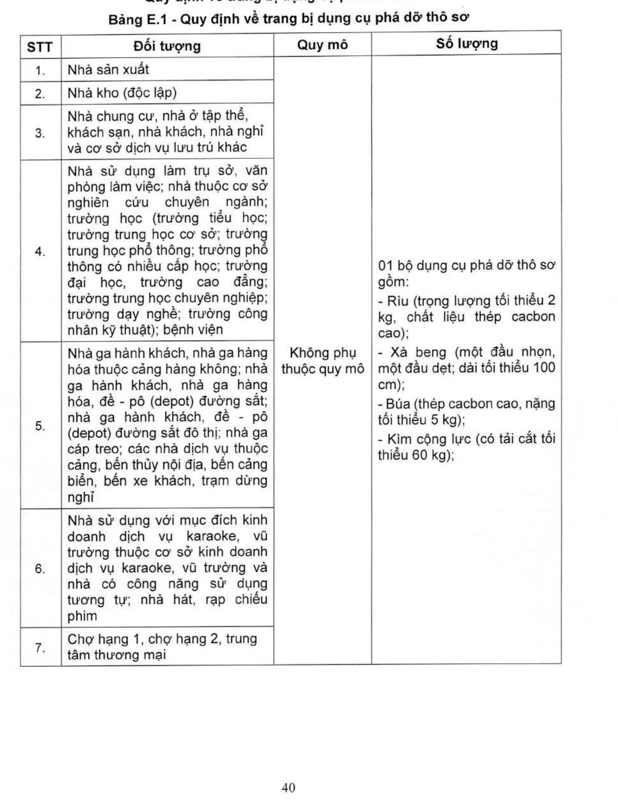

> **Trích dẫn:** Bảng E.1 - Quy định về trang bị dụng cụ phá dỡ thô sơ, Phụ lục E QCVN 10:2025/BCA

## Bảng E.1 - Quy định về trang bị dụng cụ phá dỡ thô sơ

| STT | Đối tượng | Quy mô | Số lượng |
|---|---|---|---|
| 1 | Nhà sản xuất | Không phụ thuộc quy mô | 01 bộ dụng cụ phá dỡ thô sơ (xem thành phần bên dưới) |
| 2 | Nhà kho (độc lập) | Không phụ thuộc quy mô | 01 bộ |
| 3 | Nhà chung cư, nhà ở tập thể, khách sạn, nhà khách, nhà nghỉ và cơ sở dịch vụ lưu trú khác | Không phụ thuộc quy mô | 01 bộ |
| 4 | Nhà sử dụng làm trụ sở, văn phòng làm việc; nhà thuộc cơ sở nghiên cứu chuyên ngành; trường học (trường tiểu học; trường trung học cơ sở; trường trung học phổ thông; trường phổ thông có nhiều cấp học; trường đại học, trường cao đẳng; trường trung học chuyên nghiệp; trường dạy nghề; trường công nhân kỹ thuật); bệnh viện | Không phụ thuộc quy mô | 01 bộ |
| 5 | Nhà ga hành khách, nhà ga hàng hóa thuộc cảng hàng không; nhà ga hành khách, nhà ga hàng hóa, đề-pô (depot) đường sắt; nhà ga hành khách, đề-pô (depot) đường sắt đô thị; nhà ga cáp treo; các nhà dịch vụ thuộc cảng, bến thủy nội địa, bến cảng biển, bến xe khách, trạm dừng nghỉ | Không phụ thuộc quy mô | 01 bộ |
| 6 | Nhà sử dụng với mục đích kinh doanh dịch vụ karaoke, vũ trường thuộc cơ sở kinh doanh dịch vụ karaoke, vũ trường và nhà có công năng sử dụng tương tự; nhà hát, rạp chiếu phim | Không phụ thuộc quy mô | 01 bộ |
| 7 | Chợ hạng 1, chợ hạng 2, trung tâm thương mại | Không phụ thuộc quy mô | 01 bộ |

**Thành phần 01 bộ dụng cụ phá dỡ thô sơ:**

- **Rìu** (trọng lượng tối thiểu 2 kg, chất liệu thép cacbon cao);
- **Xà beng** (một đầu nhọn, một đầu dẹt; dài tối thiểu 100 cm);
- **Búa** (thép cacbon cao, nặng tối thiểu 5 kg);
- **Kìm cộng lực** (có tải cắt tối thiểu 60 kg).
