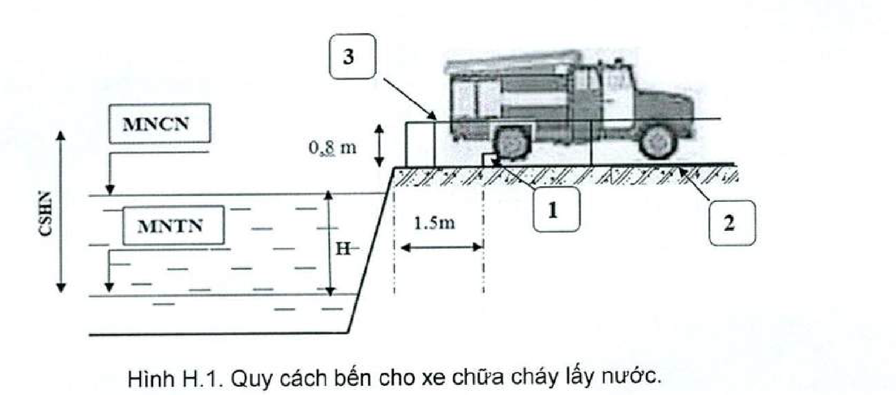
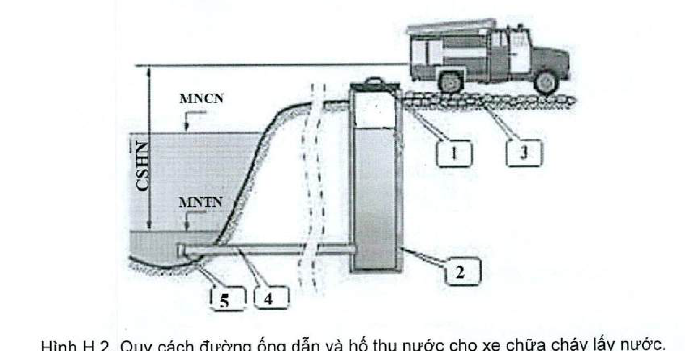

> **Trích dẫn:** mục H.1 QCVN 10:2025/BCA

# H.1 Yêu cầu thiết kế, lắp đặt hệ thống cấp nước chữa cháy ngoài nhà

## H.1 Yêu cầu thiết kế, lắp đặt hệ thống cấp nước chữa cháy ngoài nhà

### H.1.1 Áp suất của hệ thống cấp nước chữa cháy ngoài nhà

**H.1.1.1** Hệ thống đường ống cấp nước chữa cháy có thể là đường ống áp suất cao hoặc áp suất thấp. Trong đường ống cấp nước chữa cháy có áp suất cao thì áp suất cần thiết để chữa cháy là do máy bơm chữa cháy cố định tạo nên; khi duy trì áp suất cao thì phải tính toán bảo đảm áp suất làm việc của hệ thống đường ống. Đối với đường ống áp suất cao, các máy bơm chữa cháy phải bảo đảm hoạt động không trễ hơn 5 phút sau khi có tín hiệu báo cháy.

**H.1.1.2** Áp suất tự do tối thiểu trong đường ống nước chữa cháy áp suất thấp (đo ở vị trí cao độ bằng với mặt đất) khi chữa cháy phải không nhỏ hơn 10 m cột nước. Áp suất tự do tối thiểu trong mạng đường ống chữa cháy áp suất cao phải bảo đảm độ cao tia nước đặc không nhỏ hơn 10 m cột nước khi lưu lượng yêu cầu chữa cháy tối đa và lăng chữa cháy ở điểm cao nhất của nhà. Áp suất tự do trong mạng đường ống kết hợp sinh hoạt hoặc sản xuất không nhỏ hơn 10 m cột nước và không lớn hơn 60 m cột nước. Để phù hợp với điều kiện kinh tế - kỹ thuật, được phép lựa chọn thiết kế, trang bị hệ thống áp suất thấp hoặc hệ thống áp suất cao.

### H.1.2 Lưu lượng nước cho chữa cháy ngoài nhà

**H.1.2.1** Lưu lượng nước cho chữa cháy ngoài nhà (tính cho 1 đám cháy) và số đám cháy đồng thời trong một khu dân cư tính cho mạng đường ống chính nối vòng lấy theo Bảng H.1.

**H.1.2.2** Lưu lượng nước cho chữa cháy ngoài nhà (cho 1 đám cháy) cho nhà thuộc nhóm nguy hiểm cháy theo công năng F1, F2, F3, F4 tính toán cho đường ống kết hợp và đường ống phân phối của mạng đường ống, cũng như mạng đường ống trong 1 cụm nhỏ (1 xóm, 1 dãy nhà và tương tự) lấy theo giá trị lớn nhất của Bảng H.2.

**H.1.2.3** Lưu lượng nước cho chữa cháy ngoài nhà cho nhà có nhóm nguy hiểm cháy theo công năng F5, tính cho 1 đám cháy, lấy theo nhà có yêu cầu giá trị lớn nhất như Bảng H.3 và Bảng H.4.

> CHÚ THÍCH 1: Khi tính toán lưu lượng nước chữa cháy cho 2 đám cháy thì lấy giá trị bằng cho 2 nhà có yêu cầu lưu lượng lớn nhất.
>
> CHÚ THÍCH 2: Lưu lượng nước cho chữa cháy ngoài nhà cho các nhà phụ trợ nằm độc lập lấy theo Bảng H.2 giống như cho nhà có nhóm nguy hiểm cháy theo công năng F2, F3, F4, còn nếu nằm trong các nhà sản xuất thì tính theo khối tích chung của nhà sản xuất và lấy theo Bảng H.3.
>
> CHÚ THÍCH 3: Lưu lượng nước cho chữa cháy ngoài nhà cho nhà phục vụ nông nghiệp và phát triển nông thôn có bậc chịu lửa I, II với khối tích không lớn hơn 5 000 m³ hạng nguy hiểm cháy D, E lấy bằng 5 L/s.
>
> CHÚ THÍCH 4: Lưu lượng nước cho chữa cháy ngoài nhà cho trạm truyền thanh, truyền hình không phụ thuộc khối tích của trạm và số lượng người sống trong khu vực đặt các trạm này, phải lấy không nhỏ hơn 15 L/s, ngay cả khi Bảng H.3 và Bảng H.4 quy định lưu lượng thấp hơn giá trị này.
>
> CHÚ THÍCH 5: Đối với nhà có bậc chịu lửa II làm bằng kết cấu gỗ thì lưu lượng nước cho chữa cháy ngoài nhà lấy lớn hơn 5 L/s so với Bảng H.3 và Bảng H.4.
>
> CHÚ THÍCH 6: Lưu lượng nước cho chữa cháy ngoài nhà cho nhà và khu vực kho lạnh bảo quản thực phẩm thì lấy giống nhà có hạng nguy hiểm cháy C.
>
> CHÚ THÍCH 7: Lưu lượng nước cho chữa cháy ngoài nhà cho cơ sở lưu trữ công-ten-nơ có hàng hóa phụ thuộc vào số lượng công-ten-nơ, được lấy như sau:
> - Từ 30 đến 50 công-ten-nơ: lấy 15 L/s;
> - Từ 51 đến 100 công-ten-nơ: lấy 20 L/s;
> - Từ 101 đến 300 công-ten-nơ: lấy 25 L/s;
> - Từ 301 đến 1 000 công-ten-nơ: lấy 40 L/s;
> - Từ 1 001 đến 1 500 công-ten-nơ: lấy 60 L/s;
> - Từ 1 501 đến 2 000 công-ten-nơ: lấy 80 L/s;
> - Nhiều hơn 2 000 công-ten-nơ: lấy 100 L/s.
>
> CHÚ THÍCH 8: Lưu lượng nước cho chữa cháy ngoài nhà cho nhà kho cố định chứa vật liệu nổ, tiền chất thuốc nổ công nghiệp, vũ khí, công cụ hỗ trợ; hầm giao thông đường bộ; trạm biến áp; được lấy tối thiểu 10 L/s.
>
> CHÚ THÍCH 9: Lưu lượng nước cho chữa cháy ngoài nhà cho nhà máy nhiệt điện, nhà máy lọc dầu; nhà máy lọc, hóa dầu; nhà máy chế biến khí; nhà máy sản xuất nhiên liệu sinh học; kho chứa dầu mỏ, sản phẩm dầu mỏ; kho chứa khí hóa lỏng; cảng xuất, nhập dầu mỏ và sản phẩm dầu mỏ được lấy theo tiêu chuẩn, quy chuẩn lựa chọn áp dụng.

**Bảng H.1 – Lưu lượng nước từ mạng đường ống cho chữa cháy ngoài nhà trong các khu dân cư**

| Dân số (× 1 000 người) | Số đám cháy đồng thời | Lưu lượng cho 1 đám cháy, L/s — Xây dựng nhà không quá 2 tầng, không phụ thuộc bậc chịu lửa | Lưu lượng cho 1 đám cháy, L/s — Xây dựng nhà từ 3 tầng trở lên, không phụ thuộc bậc chịu lửa |
|---|---|---|---|
| ≤ 1 | 1 | 5 | 10 |
| > 1 và ≤ 5 | 1 | 10 | 10 |
| > 5 và ≤ 10 | 1 | 10 | 15 |
| > 10 và ≤ 25 | 2 | 10 | 15 |
| > 25 và ≤ 50 | 2 | 20 | 25 |
| > 50 và ≤ 100 | 2 | 25 | 35 |
| > 100 và ≤ 200 | 3 | 40 | 40 |
| > 200 và ≤ 300 | 3 | 55 | 55 |
| > 300 và ≤ 400 | 3 | 70 | 70 |
| > 400 và ≤ 500 | 3 | 80 | 80 |
| > 500 và ≤ 600 | 3 | 85 | 85 |
| > 600 và ≤ 700 | 3 | 90 | 90 |
| > 700 và ≤ 800 | 3 | 95 | 95 |
| > 800 và ≤ 1 000 | 3 | 100 | 100 |
| > 1 000 | 5 | 110 | 110 |

> **Chú thích của Bảng H.1:**
>
> CHÚ THÍCH 1: Lưu lượng nước cho chữa cháy ngoài nhà trong khu dân cư phải không nhỏ hơn lưu lượng nước chữa cháy cho nhà theo Bảng H.2.
>
> CHÚ THÍCH 2: Khi thực hiện cấp nước theo vùng, lưu lượng nước cho chữa cháy ngoài nhà và số đám cháy đồng thời theo từng vùng được lấy phụ thuộc vào số dân sống trong vùng.
>
> CHÚ THÍCH 3: Đối với hệ thống các cụm đường ống nhóm (chung), số đám cháy đồng thời lấy phụ thuộc vào tổng số dân trong các cụm có kết nối với hệ thống đường ống. Lưu lượng nước để hồi phục lượng nước chữa cháy theo cụm đường ống nhóm được xác định bằng tổng lượng nước cho khu dân cư (tương ứng với số đám cháy đồng thời) tối đa để chữa cháy tuân theo quy định tại H.1.3.3 và H.1.3.4.
>
> CHÚ THÍCH 4: Số đám cháy tính toán đồng thời trong khu dân cư phải bao gồm cả các đám cháy của nhà sản xuất và nhà kho trong khu dân cư đó. Khi đó lưu lượng nước tính toán bao gồm cả lưu lượng nước để chữa cháy tương ứng cho các nhà đó, nhưng không nhỏ hơn giá trị trong Bảng H.1.

**Bảng H.2 - Lưu lượng nước cho chữa cháy ngoài nhà của nhà thuộc nhóm nguy hiểm cháy theo công năng F1, F2, F3, F4**

*Lưu lượng nước cho chữa cháy ngoài nhà không phụ thuộc bậc chịu lửa tính cho 1 đám cháy, L/s, theo khối tích nhà (× 1 000 m³)*

| Loại nhà | ≤ 1 | > 1 và ≤ 5 | > 5 và ≤ 25 | > 25 và ≤ 50 | > 50 |
|---|---|---|---|---|---|
| **1. Nhà nhóm F1.3, F1.4 có một hoặc nhiều đơn nguyên với số tầng:** | | | | | |
| — ≤ 3 | 10 ⁽¹⁾ | 10 ⁽¹⁾ | 15 | 15 | 20 |
| — > 3 và ≤ 12 | 10 | 15 | 15 | 20 | 20 |
| — > 12 và ≤ 16 | – | 20 | 20 | 25 | 25 |
| — > 16 | – | 20 | 25 | 25 | 30 |
| **2. Nhà nhóm F1.1, F1.2, F2, F3 và F4 với số tầng:** | | | | | |
| — ≤ 3 | 10 ⁽¹⁾ | 10 ⁽¹⁾ | 15 | 20 | 25 |
| — > 3 và ≤ 12 | 10 | 15 | 20 | 25 | 30 |
| — > 12 và ≤ 16 | – | 20 | 25 | 30 | 35 |
| — > 16 | – | 25 | 30 | 30 | 35 |

⁽¹⁾ Đối với nhà thuộc khu vực nông thôn lấy lưu lượng nước cho 1 đám cháy là 5 L/s.

> **Chú thích của Bảng H.2:**
>
> CHÚ THÍCH 1: Nếu hiệu suất của mạng đường ống ngoài nhà không đủ để truyền lưu lượng nước tính toán cho chữa cháy hoặc khi liên kết ống vào với mạng đường ống cụt thì cần phải xem xét lắp đặt bồn, bể với thể tích phải bảo đảm lưu lượng nước cho chữa cháy ngoài nhà trong 3 h.
>
> CHÚ THÍCH 2: Trong khu dân cư không có đường ống nước chữa cháy thì phải có bồn, bể nước bảo đảm chữa cháy trong 3 h.

**Bảng H.3 - Lưu lượng nước cho chữa cháy ngoài nhà cho nhà nhóm F5 có lỗ mở trên mái không phụ thuộc vào chiều rộng của nhà, cũng như nhà không có lỗ mở trên mái có chiều rộng nhà không lớn hơn 60 m**

*Lưu lượng nước cho chữa cháy ngoài nhà tính cho 1 đám cháy, L/s, theo khối tích nhà (× 1 000 m³)*

| Bậc chịu lửa | Cấp nguy hiểm cháy kết cấu | Hạng nguy hiểm cháy và cháy nổ | ≤ 3 | > 3 và ≤ 5 | > 5 và ≤ 20 | > 20 và ≤ 50 | > 50 và ≤ 200 | > 200 và ≤ 400 | > 400 và ≤ 600 | > 600 |
|---|---|---|---|---|---|---|---|---|---|---|
| I và II | S0, S1 | D, E | 10 | 10 | 10 | 10 | 15 | 20 | 25 | 35 |
| I và II | S0, S1 | A, B, C | 10 | 10 | 15 | 20 | 30 | 35 | 40 | 50 |
| III | S0, S1 | D, E | 10 | 10 | 15 | 25 | 35 | 40 | 45 | – |
| III | S0 | A, B, C | 10 | 15 | 20 | 30 | 45 | 60 | 75 | – |
| IV | S0, S1 | D, E | 10 | 15 | 20 | 30 | 40 | 50 | 60 | – |
| IV | S0, S1 | A, B, C | 15 | 20 | 25 | 40 | 60 | 80 | 100 | – |
| IV | S2, S3 | E | 10 | 15 | 20 | 30 | 45 | – | – | – |
| IV | S2, S3 | A, B, C | 15 | 20 | 25 | 40 | 65 | – | – | – |
| V | – | E | 10 | 15 | 20 | 30 | 55 | – | – | – |
| V | – | C | 15 | 20 | 25 | 40 | 70 | – | – | – |

**Bảng H.4 - Lưu lượng nước cho chữa cháy ngoài nhà cho nhà nhóm F5 không có lỗ mở trên mái có chiều rộng nhà trên 60 m**

*Lưu lượng nước chữa cháy ngoài nhà tính cho 1 đám cháy, L/s, theo khối tích nhà (× 1 000 m³)*

| Bậc chịu lửa | Cấp nguy hiểm cháy kết cấu | Hạng nguy hiểm cháy và cháy nổ | ≤ 50 | > 50 và ≤ 100 | > 100 và ≤ 200 | > 200 và ≤ 300 | > 300 và ≤ 400 | > 400 và ≤ 500 | > 500 và ≤ 600 | > 600 và ≤ 700 | > 700 |
|---|---|---|---|---|---|---|---|---|---|---|---|
| I và II | S0, S1 | A, B, C | 20 | 30 | 40 | 50 | 60 | 70 | 80 | 90 | 100 |
| I và II | S0 | D, E | 10 | 15 | 20 | 25 | 30 | 35 | 40 | 45 | 50 |
| III | S0, S1 | A, B, C | 40 | 50 | 60 | 60 | 70 | 80 | 90 | 100 | 110 |
| III | S0, S1 | D, E | 20 | 35 | 40 | 40 | 45 | 45 | 50 | 50 | 60 |
| IV | S0, S1 | A, B, C | 50 | 60 | 65 | 70 | 80 | 90 | – | – | – |
| IV | S0, S1 | D, E | 35 | 45 | 55 | 60 | 65 | 70 | 75 | 80 | 90 |
| IV | S2, S3 | E | 40 | 50 | 60 | – | – | – | – | – | – |

> CHÚ THÍCH: Lỗ mở trên mái là các lỗ mở để thông gió hoặc lấy sáng đặt trên kết cấu mái của nhà (nóc gió, cửa trời; lỗ thường xuyên mở; lỗ mở khi có cháy; ô kính; tấm lợp lấy sáng hoặc các lỗ mở tương tự) có diện tích không nhỏ hơn 2,5 % diện tích xây dựng của nhà đó.

**H.1.2.4** Lưu lượng nước cho chữa cháy ngoài nhà cho nhà được ngăn chia bằng tường ngăn cháy thì lấy theo phần của nhà, nơi yêu cầu lưu lượng lớn nhất.

**H.1.2.5** Lưu lượng nước cho chữa cháy ngoài nhà cho nhà được ngăn cách bằng vách ngăn cháy được xác định theo khối tích chung của nhà và theo hạng cao nhất của hạng nguy hiểm cháy và cháy nổ.

**H.1.2.6** Lưu lượng nước chữa cháy phải được bảo đảm ngay cả khi lưu lượng cho các nhu cầu khác là lớn nhất, cụ thể phải tính đến:

- Nước sinh hoạt;
- Hộ kinh doanh cá thể;
- Cơ sở sản xuất công nghiệp và nông nghiệp, nơi mà yêu cầu chất lượng nước uống hoặc mục đích kinh tế không phù hợp để làm đường ống riêng;
- Trạm xử lý nước, mạng đường ống và kênh dẫn và tương tự;
- Trong trường hợp điều kiện công nghệ cho phép, có thể sử dụng một phần nước sản xuất để chữa cháy, khi đó cần kết nối trụ nước trên mạng đường ống sản xuất với trụ nước trên mạng đường ống chữa cháy bảo đảm lưu lượng nước chữa cháy cần thiết.

**H.1.2.7** Các hệ thống cấp nước chữa cháy ngoài nhà của cơ sở (đường ống dẫn nước, trạm bơm, bồn, bể dự trữ nước chữa cháy) phải bảo đảm độ tin cậy để không bị ngừng cấp nước quá 10 min và không bị giảm lưu lượng nước quá 30 % lưu lượng nước tính toán trong 3 ngày.

### H.1.3 Số đám cháy tính toán đồng thời

**H.1.3.1** Số đám cháy tính toán đồng thời cho một cơ sở công nghiệp hoặc nông nghiệp phải được lấy theo diện tích của cơ sở đó, cụ thể như sau:

- Nếu diện tích đến 150 ha lấy là 1 đám cháy;
- Nếu diện tích trên 150 ha lấy là 2 đám cháy.

Số đám cháy tính toán đồng thời tại một khu vực kho dạng hở hoặc kín chứa vật liệu từ gỗ, lấy như sau: diện tích kho đến 50 ha lấy là 1 đám cháy; diện tích trên 50 ha lấy là 2 đám cháy.

> CHÚ THÍCH: Diện tích của cơ sở để tính toán cho hệ thống cấp nước chữa cháy ngoài nhà là diện tích khu đất của cơ sở (không bao gồm khu đất rừng, khu đất công viên cây xanh, khu đất trồng cây nông nghiệp hay các khu đất tương tự mà trên đó không có công trình xây dựng).

**H.1.3.2** Khi kết hợp đường ống chữa cháy của khu dân cư và cơ sở công nghiệp nằm ngoài khu dân cư thì số đám cháy tính toán đồng thời tính như sau:

- Khi diện tích của cơ sở công nghiệp đến 150 ha và dân số của khu dân cư đến 10 000 người, lấy là 1 đám cháy (lấy lưu lượng nước theo bên lớn hơn); tương tự với số dân từ 10 000 đến 25 000 người, lấy là 2 đám cháy (1 đám cháy cho cơ sở công nghiệp và 1 đám cháy cho khu dân cư);
- Khi diện tích của cơ sở công nghiệp trên 150 ha và số dân đến 25 000 người, lấy là 2 đám cháy (2 đám cháy tính cho khu vực cơ sở công nghiệp hoặc 2 đám cháy tính cho khu dân cư, lấy theo lưu lượng nước yêu cầu của bên lớn hơn);
- Khi số dân trong khu dân cư lớn hơn 25 000 người, lấy là 2 đám cháy, trong đó lưu lượng nước của 1 đám cháy được xác định bằng tổng của lưu lượng yêu cầu lớn hơn (tính cho cơ sở công nghiệp hoặc khu dân cư) và 50 % lưu lượng yêu cầu nhỏ hơn (tính cho cơ sở công nghiệp hoặc khu dân cư).

**H.1.3.3** Thời gian chữa cháy phải lấy là **3 h**, ngoại trừ những quy định dưới đây:

- Đối với nhà bậc chịu lửa I, II với kết cấu và lớp cách nhiệt làm từ vật liệu không cháy có các khu vực thuộc hạng nguy hiểm cháy D và E lấy là **2 h**;
- Đối với công trình nhà trẻ, trường mẫu giáo, mầm non và cơ sở giáo dục mầm non khác theo quy định của pháp luật về giáo dục, nhà thuộc nhóm nguy hiểm cháy theo công năng F4.1, F4.3 ở khu vực nông thôn, có bậc chịu lửa I, II với kết cấu và lớp cách nhiệt làm từ vật liệu không cháy cao không quá 3 tầng, diện tích xây dựng đến 500 m² lấy là **1 h**;
- Đối với công trình nhà trẻ, trường mẫu giáo, mầm non và cơ sở giáo dục mầm non khác theo quy định của pháp luật về giáo dục, nhà thuộc nhóm nguy hiểm cháy theo công năng F4.1, F4.3 ở khu vực nông thôn, có bậc chịu lửa I, II với kết cấu và lớp cách nhiệt làm từ vật liệu không cháy cao không quá 3 tầng, diện tích xây dựng đến 500 m² thì cho phép sử dụng hệ thống họng nước chữa cháy bên trong để thay thế cho hệ thống cấp nước chữa cháy ngoài nhà;
- Đối với kho dạng hở chứa vật liệu từ gỗ - không nhỏ hơn **5 h**;
- Đối với các nhà có yêu cầu về lưu lượng cho cấp nước chữa cháy ngoài nhà quy định tại Bảng H.2, Bảng H.3, Bảng H.4 đến 15 L/s (cho nhà nhóm F1, F2, F3, F4) và đến 20 L/s (cho nhà nhóm F5) thì thời gian chữa cháy của chúng lấy là **1 h**.

**H.1.3.4** Thời gian lớn nhất để phục hồi nước dự trữ chữa cháy không lớn hơn:

- **24 h** - đối với khu dân cư trên 5 000 người hoặc cơ sở công nghiệp có các nhà thuộc hạng nguy hiểm cháy và cháy nổ A, B, C.
- **36 h** - đối với cơ sở công nghiệp có các nhà thuộc hạng nguy hiểm cháy D và E.
- **72 h** - đối với các khu dân cư đến 5 000 người hoặc cơ sở nông nghiệp.

> CHÚ THÍCH 1: Đối với cơ sở công nghiệp có yêu cầu về lưu lượng nước cho chữa cháy ngoài nhà đến 20 L/s thì cho phép tăng thời gian phục hồi nước chữa cháy lên đến:
> - 48 h - đối với các nhà thuộc hạng nguy hiểm cháy D và E.
> - 36 h - đối với các nhà thuộc hạng nguy hiểm cháy C.
>
> CHÚ THÍCH 2: Khi không thể bảo đảm phục hồi lượng nước dự trữ cho chữa cháy theo thời gian quy định thì cần cung cấp thêm lượng nước bổ sung dự trữ cho chữa cháy ΔW, tính theo công thức:
>
> **ΔW = W(K − 1) / K**
>
> trong đó:
> - ΔW là lượng nước dự trữ bổ sung, tính bằng mét khối (m³);
> - W là lượng nước dự trữ cho chữa cháy, tính bằng mét khối (m³);
> - K là tỉ số giữa thời gian phục hồi lượng nước chữa cháy theo thực tế và thời gian phục hồi lượng nước chữa cháy theo yêu cầu quy định tại H.1.3.4.

### H.1.4 Yêu cầu an toàn cháy đối với mạng đường ống

**H.1.4.1** Khi lắp đặt từ 2 đường ống cấp trở lên phải lắp đặt van chuyển đổi giữa chúng khi đó trong trường hợp ngắt 1 đường cấp hoặc 1 phần của nó thì việc chữa cháy vẫn bảo đảm 100 %.

**H.1.4.2** Mạng đường ống dẫn nước chữa cháy phải là mạng vòng. Cho phép làm các đường ống cụt khi cấp nước cho chữa cháy hoặc sinh hoạt - chữa cháy khi chiều dài đường ống không lớn hơn 200 m mà không phụ thuộc vào lưu lượng nước chữa cháy yêu cầu.

Không cho phép nối vòng mạng đường ống ngoài nhà bằng mạng đường ống bên trong nhà và công trình.

Ở các khu dân cư đến 5 000 người và yêu cầu về lưu lượng nước cho chữa cháy ngoài nhà đến 10 L/s hoặc số họng nước chữa cháy trong nhà cho mỗi nhà đến 12 họng thì cho phép dùng mạng cụt chiều dài trên 200 m nếu có xây dựng bồn bể, tháp nước áp lực hoặc bể điều tiết dành cho mạng cụt, trong đó có chứa toàn bộ lượng nước cho chữa cháy.

**H.1.4.3** Đường ống phải được phân chia thành các đoạn bằng các van khóa bảo đảm để khi sửa chữa sẽ không ngắt nhiều hơn 05 trụ cấp nước chữa cháy.

**H.1.4.4** Các van trên các đường ống với mọi đường kính khi điều khiển từ xa hoặc tự động phải là loại van điều khiển bằng điện.

Cho phép sử dụng van khí nén, thủy lực hoặc điện từ.

Khi không điều khiển từ xa hoặc tự động thì van khóa đường kính đến 400 mm có thể là loại khóa bằng tay, với đường kính lớn hơn 400 mm là khóa điện hoặc thủy lực; trong các trường hợp luận chứng riêng cho phép lắp van đường kính trên 400 mm khóa bằng tay.

Trong mọi trường hợp đều phải cho phép mở và đóng được bằng tay.

**H.1.4.5** Đường kính của đường ống cấp và mạng sau đường ống cấp phải được tính toán trên cơ sở sau:

- Theo yếu tố kỹ thuật, kinh tế;
- Các điều kiện làm việc khi ngắt sự cố từng đoạn riêng.

Đường kính ống dẫn nước chữa cháy ngoài nhà cho khu dân cư và cơ sở sản xuất không được nhỏ hơn **100 mm**, đối với khu vực nông thôn – không được nhỏ hơn **75 mm**.

**H.1.4.6** Các trụ cấp nước chữa cháy phải được bố trí ở khoảng cách không lớn hơn **2,5 m** đến mép đường, nhưng không gần hơn **1 m** đến tường ngôi nhà; cho phép bố trí trụ nước (trụ ngầm) nằm ở đường giao thông.

**H.1.4.7** Các nhà, công trình được quy định tại mục 1 đến mục 9 Phụ lục C phải bố trí các trụ cấp nước chữa cháy bảo đảm bán kính phục vụ theo phương ngang không lớn hơn **400 m** tính đến mọi điểm của nhà. Đối với các nhà, công trình có yêu cầu lưu lượng từ 25 L/s trở lên thì phải có tối thiểu **02 trụ** bảo đảm bán kính phục vụ không lớn hơn 400 m tính đến mọi điểm của nhà.

Các công trình được quy định tại mục 10 của Phụ lục C phải bố trí trụ cấp nước chữa cháy ngoài nhà dọc theo đường giao thông bảo đảm khoảng cách tối đa giữa các trụ là **150 m**.

> CHÚ THÍCH: Trên mạng đường ống cho các điểm dân cư đến 500 người cho phép thay thế các trụ cấp nước chữa cháy loại 3 cửa bằng đoạn đường ống đứng DN 80 mm có lắp họng nước.
>
> Đối với các công trình thiết kế hệ thống cấp nước chữa cháy ngoài nhà loại áp suất cao cho phép thay thế trụ cấp nước chữa cháy bằng họng nước chữa cháy loại 2 cửa DN65.

### H.1.5 Các yêu cầu đối với bồn, bể trữ nước cho chữa cháy ngoài nhà

**H.1.5.1** Bồn, bể cấp nước theo công năng phải bao gồm cho điều tiết, chữa cháy, sự cố và nước mồi.

**H.1.5.2** Nếu việc lấy nước chữa cháy trực tiếp từ các nguồn cấp nước không phù hợp với điều kiện kinh tế, kỹ thuật thì trong mọi trường hợp, các bồn, bể trữ nước phải bảo đảm có đủ lượng nước chữa cháy theo tính toán.

**H.1.5.3** Thể tích nước chữa cháy trong bồn, bể phải được tính toán để bảo đảm:

- Thực hiện việc cấp nước chữa cháy từ trụ nước ngoài nhà và các hệ thống chữa cháy khác;
- Cung cấp cho các thiết bị chữa cháy chuyên dụng (sprinkler, drencher và tương tự) không có bể riêng;
- Lượng nước tối đa cho sinh hoạt và sản xuất trong suốt quá trình chữa cháy.

**H.1.5.4** Các ao, hồ, sông, bể nước... để cho xe chữa cháy hút nước phải có lối tiếp cận và có bến lấy nước với bề mặt bảo đảm tải trọng dành cho xe chữa cháy.

Khi xác định thể tích nước chữa cháy trong các bồn, bể thì cho phép tính cả việc nạp thêm vào bồn, bể trong thời gian chữa cháy nếu nó có hệ thống cấp nước bảo đảm quy định tại H.1.2.7.

**Hình H.1 — Quy cách bến cho xe chữa cháy lấy nước**

> *(Bản gốc: QCVN 10:2025/BCA, trang 52. Các thông số quy định như sau)*
>
> CHÚ DẪN:
> - **(1)** Trụ chống trôi xe có chiều cao h ≥ 0,25 m. Trụ cách mép ngoài của bến tối thiểu 1,5 m.
> - **(2)** Bề mặt bến đỗ chịu được tải trọng của xe chữa cháy, có bề mặt bằng phẳng. Nếu bề mặt nghiêng thì độ dốc không được quá 1:15.
> - **(3)** Rào chắn cao 0,8 m.
> - **CSHN**: Chiều sâu hút nước của xe chữa cháy tại bến ≤ 7 m.
> - **MNCN**: Mực nước cao nhất.
> - **MNTN**: Mực nước thấp nhất ≤ 5 m so với bề mặt bến.
> - **H**: Chênh lệch mực nước giữa MNCN và MNTN tối thiểu là 0,7 m.

**H.1.5.5** Khi cấp nước theo 1 đường ống cấp thì phải dự phòng thêm lượng nước bổ sung cho chữa cháy, quy định tại H.1.5.3.

Cho phép không cần tính đến lượng nước bổ sung cho chữa cháy khi chiều dài của một đường ống cấp không lớn hơn 500 m đối với khu dân cư có số dân đến 5 000 người, cũng như cho các đối tượng với yêu cầu về lưu lượng nước cho chữa cháy ngoài nhà không lớn hơn 40 L/s.

**H.1.5.6** Tổng số bồn, bể cho chữa cháy trong một mạng ống phải không nhỏ hơn 2 (không áp dụng đối với bồn, bể dành cho cấp nước ngoài nhà của công trình độc lập).

Giữa các bồn, bể trong mạng ống, mực nước thấp nhất và cao nhất của nước chữa cháy phải tương ứng như nhau.

Khi ngắt một bồn, bể thì lượng nước trữ để chữa cháy trong các bồn, bể còn lại phải không nhỏ hơn 50 % của lượng nước yêu cầu cho chữa cháy.

**H.1.5.7** Lượng nước chữa cháy của bồn, bể và hồ nước nhân tạo xác định trên cơ sở tính toán lượng nước tiêu thụ và thời gian chữa cháy theo quy định tại H.1.2.2, H.1.2.3, H.1.2.4, H.1.2.5, H.1.2.6 và H.1.3.3.

> CHÚ THÍCH: Tính toán thể tích nước chữa cháy của hồ nhân tạo hở phải tính đến khả năng bốc hơi và đóng băng của nước.

**H.1.5.8** Để tăng phạm vi phục vụ, cho phép lắp đặt các đường ống cụt có chiều dài không quá 200 m từ bồn, bể và hồ nhân tạo đến các bể trung gian (hố thu nước) bảo đảm theo quy định tại H.1.5.7.

**H.1.5.9** Khi không thể hút nước chữa cháy trực tiếp từ bồn, bể hoặc ao, hồ... bằng xe máy bơm hoặc máy bơm di động, thì phải cung cấp các hố thu với thể tích không nhỏ hơn 3 m³. Đường kính ống kết nối bồn, bể hoặc hồ với các hố thu lấy theo các điều kiện tính toán lưu lượng nước cho chữa cháy ngoài nhà, nhưng không nhỏ hơn 200 mm. Trên đoạn ống kết nối phải có hộp van để khóa sự lưu thông nước, việc đóng mở van phải thực hiện được từ bên ngoài hộp. Đầu đoạn ống kết nối ở phía nguồn nước phải có lưới chắn.

**Hình H.2 — Quy cách đường ống dẫn và hố thu nước cho xe chữa cháy lấy nước**

> *(Bản gốc: QCVN 10:2025/BCA, trang 53. Các thông số quy định như sau)*
>
> CHÚ DẪN:
> - **(1)** Nắp hố thu nước.
> - **(2)** Hố thu nước có thể tích từ 3 m³ trở lên và sâu từ 1,5 m trở lên.
> - **(3)** Bến lấy nước đảm bảo tải trọng cho xe chữa cháy.
> - **(4)** Ống dẫn nước có đường kính không nhỏ hơn 200 mm/01 xe hút và chiều dài không quá 200 m.
> - **(5)** Lưới chắn rác.
> - **CSHN**: Chiều sâu hút nước. **MNCN**: Mực nước cao nhất. **MNTN**: Mực nước thấp nhất.

**H.1.5.10** Bồn, bể áp lực để chữa cháy phải được trang bị thước đo mức nước, thiết bị báo tín hiệu mức nước cho trạm bơm hoặc trạm phân phối nước.

Bồn, bể áp lực của đường ống nước chữa cháy áp lực cao phải trang bị thiết bị bảo đảm tự động ngắt nước lên bồn bể, tháp khi máy bơm chữa cháy hoạt động.

Bồn, bể áp lực sử dụng khí ép áp lực, thì ngoài máy ép vận hành phải có máy ép dự bị.
