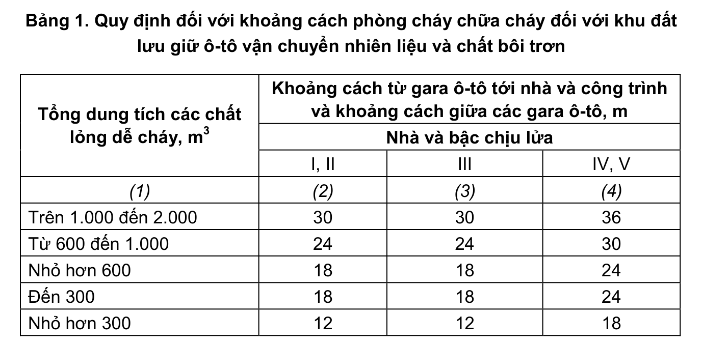

> **Trích dẫn:** mục 2.1.9 QCVN 13:2018/BXD

# 2.1.9 Ô-tô vận chuyển các nhiên liệu và chất bôi trơn chỉ được phép lưu giữ…

Ô-tô vận chuyển các nhiên liệu và chất bôi trơn chỉ được phép lưu giữ trên các bãi hở hoặc trong các nhà một tầng đứng riêng biệt có bậc chịu lửa không nhỏ hơn bậc II thuộc cấp S0. Cho phép các gara ô-tô trên được bố trí liền kề với các tường đặc ngăn cháy loại 1 hoặc 2 của các nhà sản xuất có bậc chịu lửa I, II thuộc cấp S0 (ngoại trừ các nhà hạng nguy hiểm cháy và cháy nổ A và B) khi lưu giữ ô-tô có tổng dung tích chứa nhiên liệu và chất bôi trơn không quá 30 m³.

Trên các bãi hở, việc lưu giữ ô-tô chở nhiên liệu và chất bôi trơn phải chia theo nhóm với số lượng không quá 50 xe và tổng dung tích chứa các chất nêu trên không quá 600 m³. Khoảng cách giữa các nhóm xe này, cũng như khoảng cách tới các khu đất lưu giữ các loại xe khác không được nhỏ hơn 12 m.

Khoảng cách từ các khu đất lưu giữ ô-tô vận chuyển nhiên liệu và chất bôi trơn tới các nhà, công trình, xí nghiệp được lấy theo Bảng 1, còn khoảng cách tới các nhà hành chính và dịch vụ của các xí nghiệp này - không nhỏ hơn 50 m.

**Bảng 1: Quy định đối với khoảng cách phòng cháy chữa cháy đối với khu đất lưu giữ ô-tô vận chuyển nhiên liệu và chất bôi trơn**

| Tổng dung tích các chất lỏng dễ cháy, m³ | Khoảng cách từ gara ô-tô tới nhà và công trình và khoảng cách giữa các gara ô-tô, m — Nhà và bậc chịu lửa I, II | … bậc chịu lửa III | … bậc chịu lửa IV, V |
|---|---|---|---|
| (1) | (2) | (3) | (4) |
| Trên 1.000 đến 2.000 | 30 | 30 | 36 |
| Từ 600 đến 1.000 | 24 | 24 | 30 |
| Nhỏ hơn 600 | 18 | 18 | 24 |
| Đến 300 | 18 | 18 | 24 |
| Nhỏ hơn 300 | 12 | 12 | 18 |
