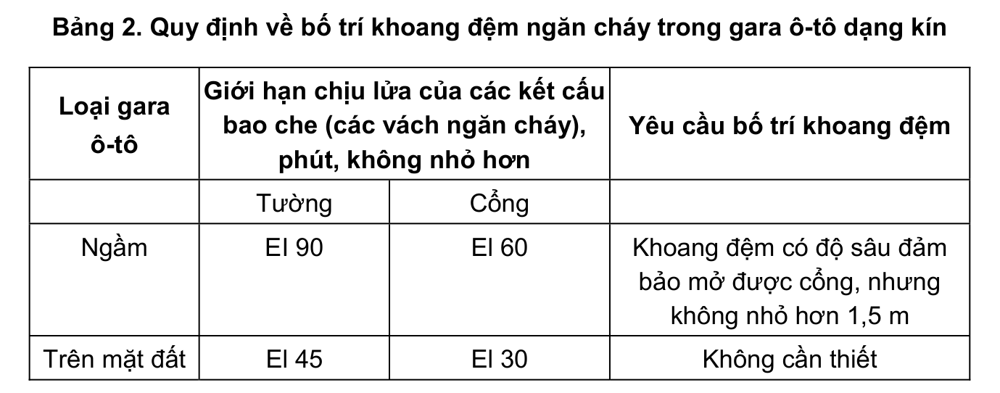

> **Trích dẫn:** mục 2.2.1.12 QCVN 13:2018/BXD

# 2.2.1.12 Trong các gara ô-tô dạng kín, các đường dốc chung cho tất cả các tầng…

Trong các gara ô-tô dạng kín, các đường dốc chung cho tất cả các tầng phải được ngăn cách (cách ly) trên mỗi tầng với các phòng lưu giữ xe bằng các vách, cửa và các khoang đệm ngăn cháy có áp suất không khí dương khi có cháy theo Bảng 2:

**Bảng 2: Quy định về bố trí khoang đệm ngăn cháy trong gara ô-tô dạng kín**

| Loại gara ô-tô | Giới hạn chịu lửa của các kết cấu bao che (các vách ngăn cháy), phút, không nhỏ hơn — Tường | … — Cổng | Yêu cầu bố trí khoang đệm |
|---|---|---|---|
| Ngầm | EI 90 | EI 60 | Khoang đệm có độ sâu đảm bảo mở được cổng, nhưng không nhỏ hơn 1,5 m |
| Trên mặt đất | EI 45 | EI 30 | Không cần thiết |

Các cánh cửa và cổng trong các vách ngăn cháy và các khoang đệm phải được trang bị các thiết bị tự động đóng khi có cháy.

Trong các gara ô-tô một tầng dưới mặt đất, trước các đường dốc không sử dụng làm đường thoát nạn thì không cần bố trí khoang đệm.
