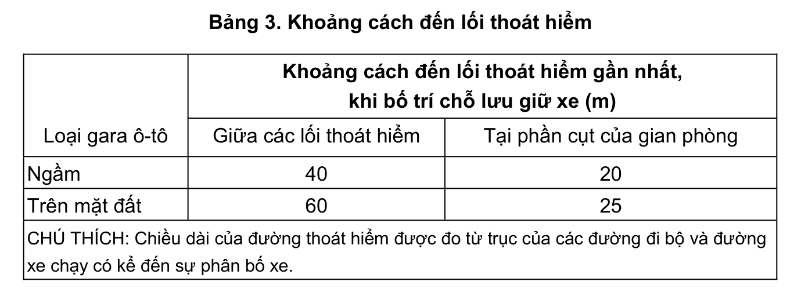

> **Trích dẫn:** mục 2.2.1.14 QCVN 13:2018/BXD

# 2.2.1.14 Từ mỗi tầng của một khoang cháy của gara ô-tô (trừ gara ô-tô cơ khí)…

Từ mỗi tầng của một khoang cháy của gara ô-tô (trừ gara ô-tô cơ khí) phải có không ít hơn hai lối thoát nạn phân tán dẫn trực tiếp ra bên ngoài hoặc vào buồng thang bộ.

Cho phép một trong các lối thoát hiểm bố trí trên đường dốc cách ly. Lối đi theo các thềm của đường dốc trên tầng lửng vào buồng thang bộ được phép xem như là lối thoát hiểm.

Các lối thoát hiểm từ các gian phòng nêu trong mục 2.2.1.3, cho phép đi qua các gian phòng lưu giữ ô-tô. Chỉ cho phép bố trí kho hành lý của khách trên tầng một (tầng đến) của gara ô-tô.

Khoảng cách cho phép từ vị trí đỗ xe xa nhất đến lối thoát hiểm gần nhất được lấy theo Bảng 3.

Các đường dốc trong các gara ô-tô, đồng thời sử dụng làm đường thoát hiểm, phải có vỉa hè rộng không nhỏ hơn 0,8 m mở một phía của đường dốc.

Các cầu thang bộ dùng để làm đường thoát hiểm phải có chiều rộng không nhỏ hơn 1 m.

**Bảng 3: Khoảng cách đến lối thoát hiểm**

| Loại gara ô-tô | Khoảng cách đến lối thoát hiểm gần nhất, khi bố trí chỗ lưu giữ xe (m) — Giữa các lối thoát hiểm | … — Tại phần cụt của gian phòng |
|---|---|---|
| Ngầm | 40 | 20 |
| Trên mặt đất | 60 | 25 |

CHÚ THÍCH: Chiều dài của đường thoát hiểm được đo từ trục của các đường đi bộ và đường xe chạy có kể đến sự phân bố xe.
