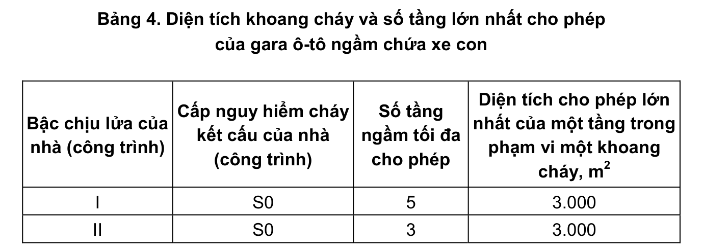

> **Trích dẫn:** mục 2.2.2 QCVN 13:2018/BXD

# 2.2.2 Gara ô-tô ngầm chứa xe con

a) Bậc chịu lửa yêu cầu, số tầng và diện tích cho phép lớn nhất của một tầng trong phạm vi một khoang cháy được lấy theo Bảng 4.

**Bảng 4: Diện tích khoang cháy và số tầng lớn nhất cho phép của gara ô-tô ngầm chứa xe con**

| Bậc chịu lửa của nhà (công trình) | Cấp nguy hiểm cháy kết cấu của nhà (công trình) | Số tầng ngầm tối đa cho phép | Diện tích cho phép lớn nhất của một tầng trong phạm vi một khoang cháy, m² |
|---|---|---|---|
| I | S0 | 5 | 3.000 |
| II | S0 | 3 | 3.000 |

b) Các gian phòng làm việc của nhân viên trực ban và nhân viên phục vụ, cấp nước và chữa cháy bằng bơm, các trạm biến thế (chỉ với biến thế khô), kho hành lý của khách, phòng cho người khuyết tật được phép bố trí không dưới tầng thứ nhất (tầng trên cùng) của tầng hầm công trình. Không quy định việc bố trí các phòng kỹ thuật khác trên các tầng.

Các phòng nêu trên phải được ngăn cách với các phòng lưu giữ ô-tô bằng các vách ngăn cháy loại

> *Ghi chú số hóa: bản in Công báo dừng ở chữ "loại", không ghi số loại vách ngăn cháy. Kho giữ nguyên, không tự điền.*

c) Trong các gara ô-tô ngầm không cho phép phân chia các chỗ đỗ xe thành các khoang riêng biệt bằng các vách ngăn.

d) Trong các gara ô-tô ngầm có hai tầng hầm trở lên, các lối ra từ các tầng hầm vào các buồng thang bộ và các lối ra từ các giếng thang máy phải bố trí đi qua các khoang đệm ngăn cháy có áp suất không khí dương khi có cháy ở từng tầng.

e) Các lối ra vào của các gara ô-tô ngầm phải cách các nhà như sau:

- Đến các lối vào các nhà ở: 100 m

- Đến các gian phòng hành khách của các bến xe, các lối vào của các tổ chức thương mại và thực phẩm công cộng: 150 m

- Đến các cơ quan và xí nghiệp về phục vụ dân sinh và các nhà hành chính: 250 m

- Đến các lối vào công viên, triển lãm và sân vận động: 400 m

CHÚ THÍCH: Khoảng cách từ lối vào đến các công trình có thể xem xét nhỏ hơn giá trị trên khi áp dụng các giải pháp kỹ thuật phù hợp đảm bảo các điều kiện môi trường và an toàn liên quan.

f) Trên các sàn tầng của gara ô-tô ngầm phải có các thiết bị thoát nước chữa cháy. Các đường ống dẫn nước thoát nêu trên phải riêng biệt cho từng tầng hầm. Nước thoát được phép dẫn vào mạng thoát nước mưa hoặc hồ chứa mà không cần làm sạch cục bộ.
