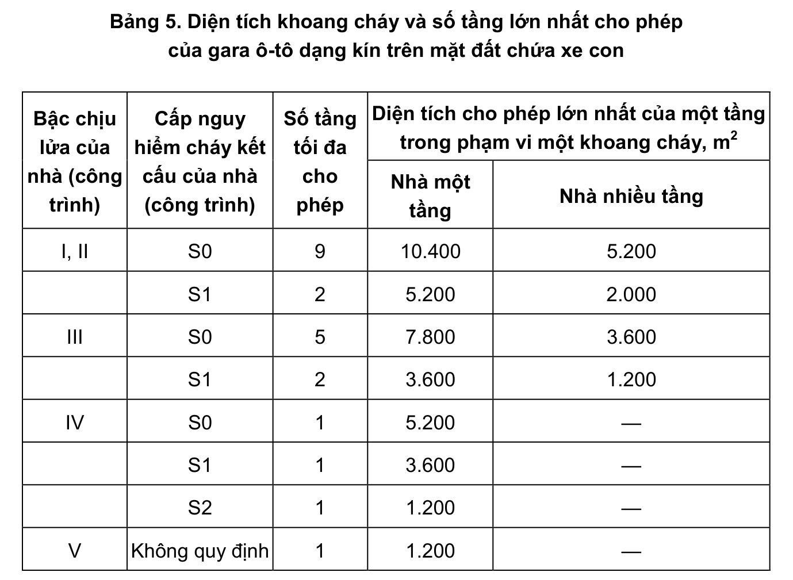

> **Trích dẫn:** mục 2.2.3.1 QCVN 13:2018/BXD

# 2.2.3.1 Bậc chịu lửa yêu cầu, số tầng và diện tích cho phép lớn nhất của một…

Bậc chịu lửa yêu cầu, số tầng và diện tích cho phép lớn nhất của một tầng trong phạm vi một khoang cháy lấy theo Bảng 5.

**Bảng 5: Diện tích khoang cháy và số tầng lớn nhất cho phép của gara ô-tô dạng kín trên mặt đất chứa xe con**

| Bậc chịu lửa của nhà (công trình) | Cấp nguy hiểm cháy kết cấu của nhà (công trình) | Số tầng tối đa cho phép | Diện tích cho phép lớn nhất của một tầng trong phạm vi một khoang cháy, m² — Nhà một tầng | … — Nhà nhiều tầng |
|---|---|---|---|---|
| I, II | S0 | 9 | 10.400 | 5.200 |
| | S1 | 2 | 5.200 | 2.000 |
| III | S0 | 5 | 7.800 | 3.600 |
| | S1 | 2 | 3.600 | 1.200 |
| IV | S0 | 1 | 5.200 | — |
| | S1 | 1 | 3.600 | — |
| | S2 | 1 | 1.200 | — |
| V | Không quy định | 1 | 1.200 | — |
