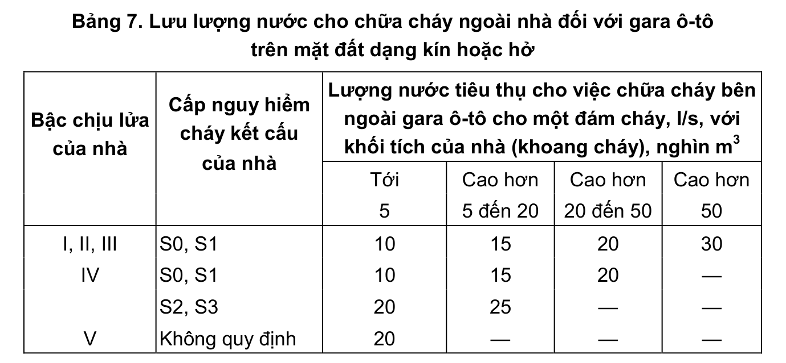

> **Trích dẫn:** mục 2.3.2.5 QCVN 13:2018/BXD

# 2.3.2.5 Lượng nước tiêu thụ tính toán cho việc chữa cháy bên ngoài của các…

Lượng nước tiêu thụ tính toán cho việc chữa cháy bên ngoài của các tòa nhà dùng làm gara ô-tô trên mặt đất dạng kín và dạng hở lấy theo Bảng 7.

Lượng nước tiêu thụ tính toán cho việc chữa cháy bên ngoài của các dạng gara ô-tô khác lấy như sau:

- Gara ô-tô ngầm 2 tầng trở lên: 20 l/s.

- Các gara ô-tô dạng ngăn có lối ra ngoài trời trực tiếp từ từng ngăn với số lượng các ngăn từ 50 đến 200: 5 l/s, lớn hơn 200: 10 l/s.

- Gara ô-tô cơ khí:10 l/s.

- Bãi đỗ xe hở với số lượng xe đến 200: 5 l/s, lớn hơn 200:10 l/s.

**Bảng 7: Lưu lượng nước cho chữa cháy ngoài nhà đối với gara ô-tô trên mặt đất dạng kín hoặc hở**

| Bậc chịu lửa của nhà | Cấp nguy hiểm cháy kết cấu của nhà | Lượng nước tiêu thụ cho việc chữa cháy bên ngoài gara ô-tô cho một đám cháy, l/s, với khối tích của nhà (khoang cháy), nghìn m³ — Tới 5 | … — Cao hơn 5 đến 20 | … — Cao hơn 20 đến 50 | … — Cao hơn 50 |
|---|---|---|---|---|---|
| I, II, III | S0, S1 | 10 | 15 | 20 | 30 |
| IV | S0, S1 | 10 | 15 | 20 | — |
| | S2, S3 | 20 | 25 | — | — |
| V | Không quy định | 20 | — | — | — |
