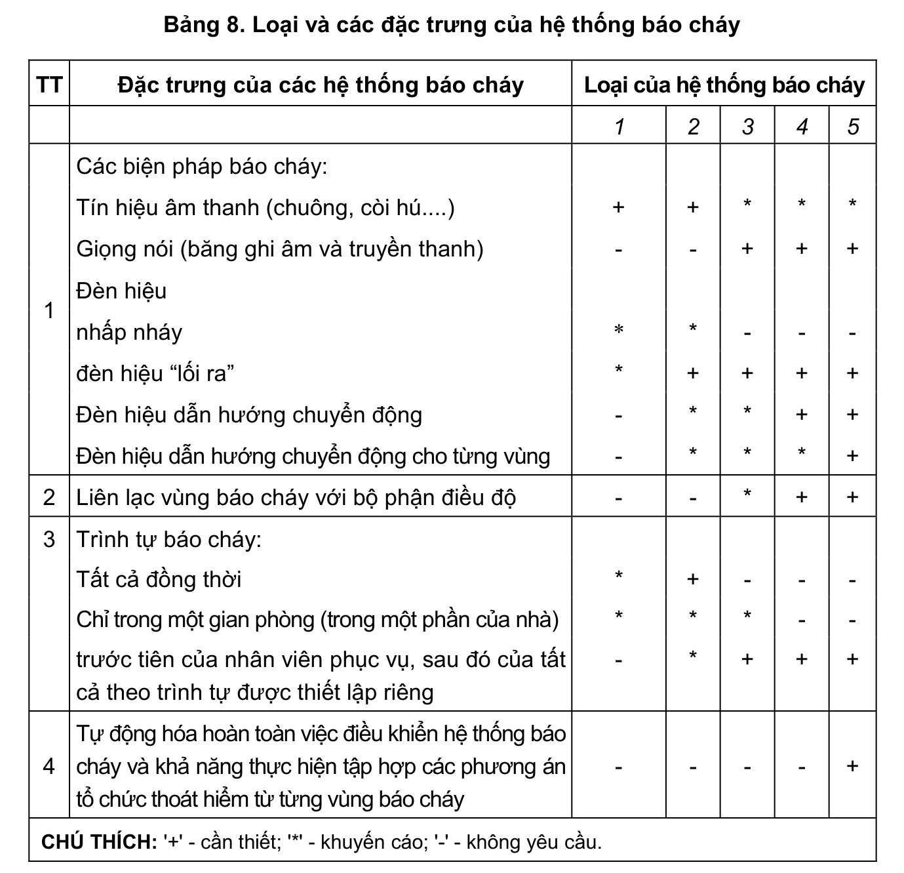

> **Trích dẫn:** mục 2.4.4 QCVN 13:2018/BXD

# 2.4.4 Các lớp phủ chống cháy chuyên dùng và các loại sơn thẩm thấu trên bề…

Các lớp phủ chống cháy chuyên dùng và các loại sơn thẩm thấu trên bề mặt hở của kết cấu phải được phục hồi định kỳ hoặc thay thế khi bị hỏng (không sử dụng được toàn bộ hoặc một phần) hoặc phù hợp với thời hạn sử dụng quy định trong tài liệu kỹ thuật của các loại sơn và lớp phủ này.

**Bảng 8: Loại và các đặc trưng của hệ thống báo cháy**

| TT | Đặc trưng của các hệ thống báo cháy | Loại 1 | Loại 2 | Loại 3 | Loại 4 | Loại 5 |
|---|---|---|---|---|---|---|
| 1 | Các biện pháp báo cháy: | | | | | |
| | Tín hiệu âm thanh (chuông, còi hú....) | + | + | * | * | * |
| | Giọng nói (băng ghi âm và truyền thanh) | - | - | + | + | + |
| | Đèn hiệu | | | | | |
| | nhấp nháy | * | * | - | - | - |
| | đèn hiệu "lối ra" | * | + | + | + | + |
| | Đèn hiệu dẫn hướng chuyển động | - | * | * | + | + |
| | Đèn hiệu dẫn hướng chuyển động cho từng vùng | - | * | * | * | + |
| 2 | Liên lạc vùng báo cháy với bộ phận điều độ | - | - | * | + | + |
| 3 | Trình tự báo cháy: | | | | | |
| | Tất cả đồng thời | * | + | - | - | - |
| | Chỉ trong một gian phòng (trong một phần của nhà) | * | * | * | - | - |
| | trước tiên của nhân viên phục vụ, sau đó của tất cả theo trình tự được thiết lập riêng | - | * | + | + | + |
| 4 | Tự động hóa hoàn toàn việc điều khiển hệ thống báo cháy và khả năng thực hiện tập hợp các phương án tổ chức thoát hiểm từ từng vùng báo cháy | - | - | - | - | + |

CHÚ THÍCH: '+' - cần thiết; '*' - khuyến cáo; '-' - không yêu cầu.
