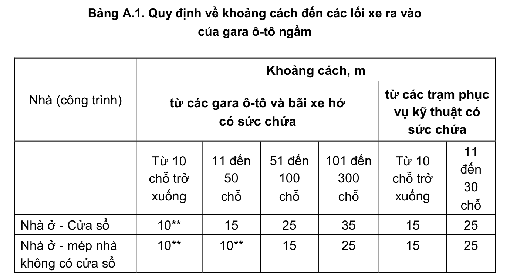
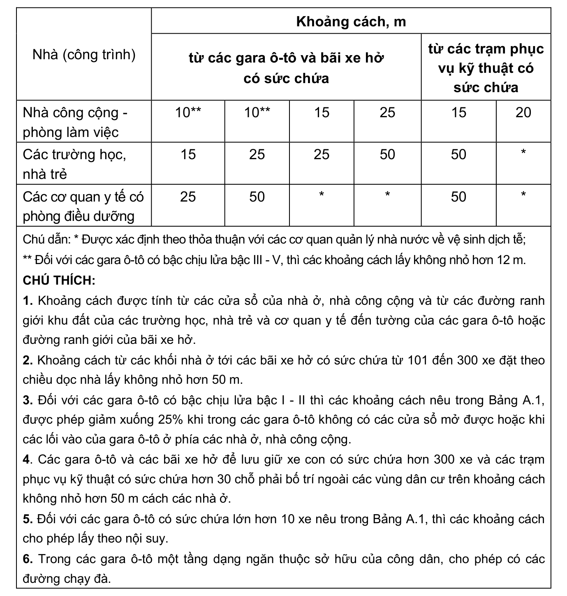

> **Trích dẫn:** mục A.2 QCVN 13:2018/BXD

# A.2 Khoảng cách tối thiểu từ các lối ra vào của các gara ô-tô

## A.2 Khoảng cách tối thiểu từ các lối ra vào của các gara ô-tô

Khoảng cách tối thiểu từ các lối ra vào của các gara ô-tô tới nút giao cắt của đường trục chính -50 m; tới đường nội bộ -20 m; tới các điểm dừng xe của các phương tiện giao thông chở khách -30 m.

Các lối xe ra vào của gara ô-tô ngầm chứa xe con phải đảm bảo khoảng cách đến các cửa sổ của các nhà ở, các gian phòng làm việc của các nhà công cộng và các khu đất của các trường học, nhà trẻ và các cơ quan y tế như trong Bảng A.1.

**Bảng A.1: Quy định về khoảng cách đến các lối xe ra vào của gara ô-tô ngầm**

| Nhà (công trình) | Khoảng cách, m — từ các gara ô-tô và bãi xe hở có sức chứa: Từ 10 chỗ trở xuống | … 11 đến 50 chỗ | … 51 đến 100 chỗ | … 101 đến 300 chỗ | Khoảng cách, m — từ các trạm phục vụ kỹ thuật có sức chứa: Từ 10 chỗ trở xuống | … 11 đến 30 chỗ |
|---|---|---|---|---|---|---|
| Nhà ở - Cửa sổ | 10\*\* | 15 | 25 | 35 | 15 | 25 |
| Nhà ở - mép nhà không có cửa sổ | 10\*\* | 10\*\* | 15 | 25 | 15 | 25 |
| Nhà công cộng - phòng làm việc | 10\*\* | 10\*\* | 15 | 25 | 15 | 20 |
| Các trường học, nhà trẻ | 15 | 25 | 25 | 50 | 50 | \* |
| Các cơ quan y tế có phòng điều dưỡng | 25 | 50 | \* | \* | 50 | \* |

Chú dẫn: \* Được xác định theo thỏa thuận với các cơ quan quản lý nhà nước về vệ sinh dịch tễ;

\*\* Đối với các gara ô-tô có bậc chịu lửa bậc III - V, thì các khoảng cách lấy không nhỏ hơn 12 m.

CHÚ THÍCH:

1. Khoảng cách được tính từ các cửa sổ của nhà ở, nhà công cộng và từ các đường ranh giới khu đất của các trường học, nhà trẻ và cơ quan y tế đến tường của các gara ô-tô hoặc đường ranh giới của bãi xe hở.

2. Khoảng cách từ các khối nhà ở tới các bãi xe hở có sức chứa từ 101 đến 300 xe đặt theo chiều dọc nhà lấy không nhỏ hơn 50 m.

3. Đối với các gara ô-tô có bậc chịu lửa bậc I - II thì các khoảng cách nêu trong Bảng A.1, được phép giảm xuống 25% khi trong các gara ô-tô không có các cửa sổ mở được hoặc khi các lối vào của gara ô-tô ở phía các nhà ở, nhà công cộng.

4. Các gara ô-tô và các bãi xe hở để lưu giữ xe con có sức chứa hơn 300 xe và các trạm phục vụ kỹ thuật có sức chứa hơn 30 chỗ phải bố trí ngoài các vùng dân cư trên khoảng cách không nhỏ hơn 50 m cách các nhà ở.

5. Đối với các gara ô-tô có sức chứa lớn hơn 10 xe nêu trong Bảng A.1, thì các khoảng cách cho phép lấy theo nội suy.

6. Trong các gara ô-tô một tầng dạng ngăn thuộc sở hữu của công dân, cho phép có các đường chạy đà.
