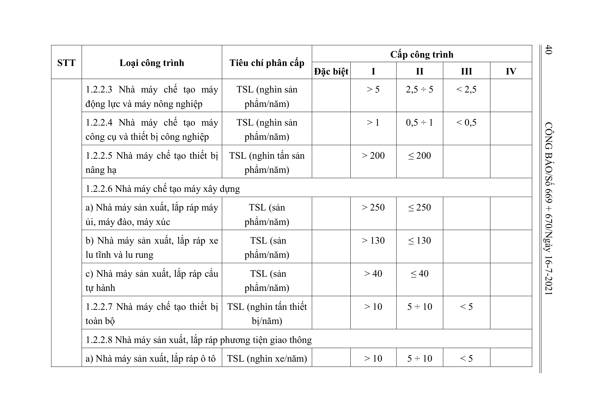
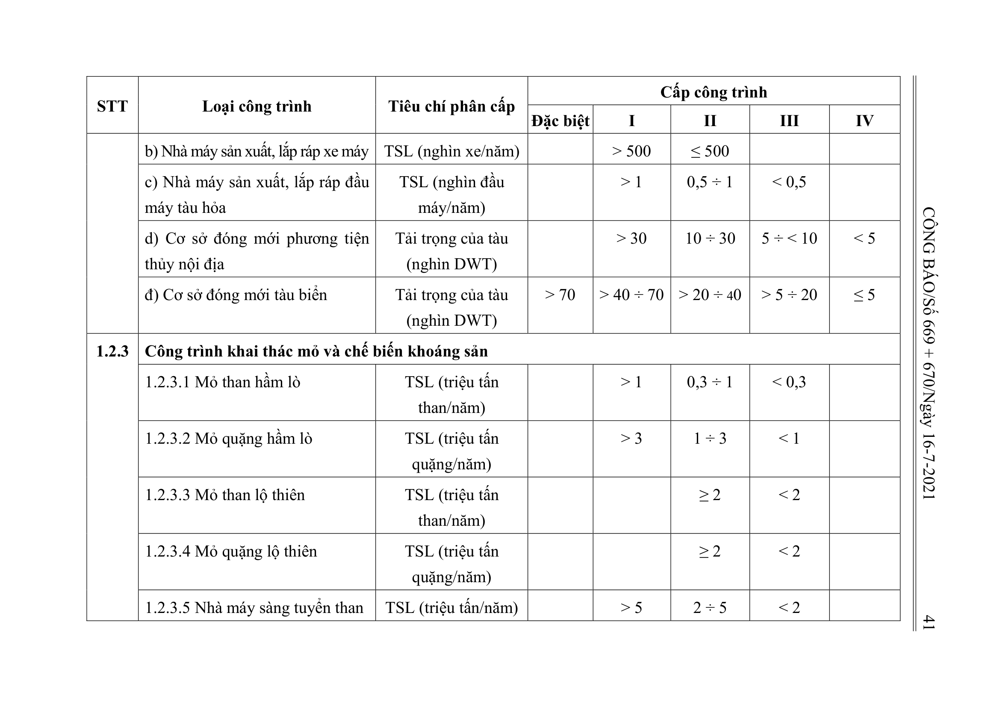
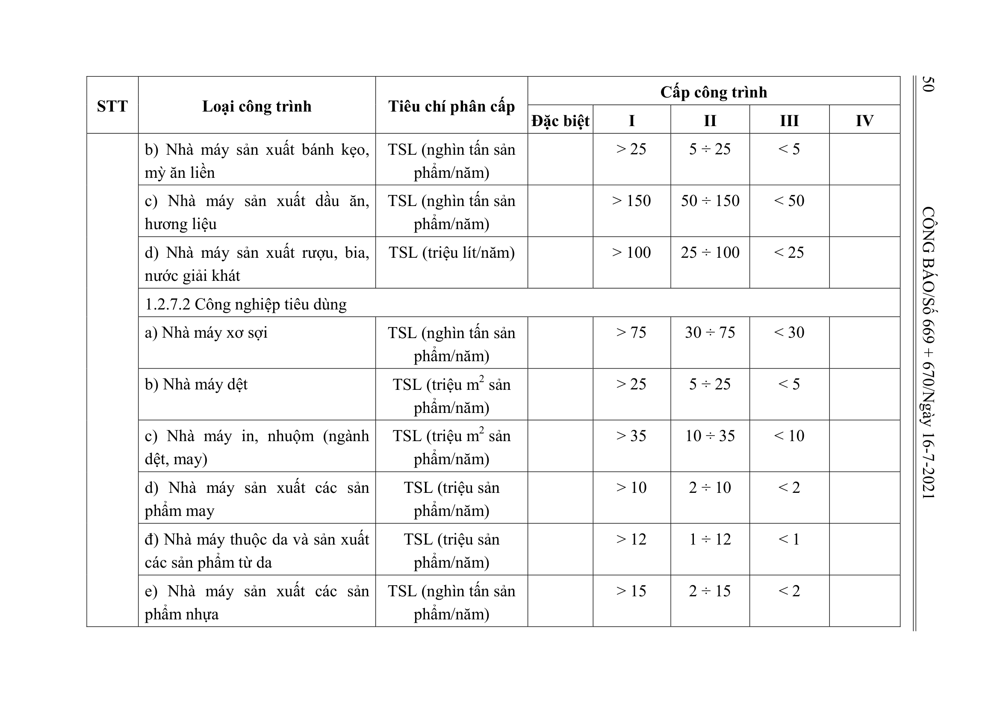
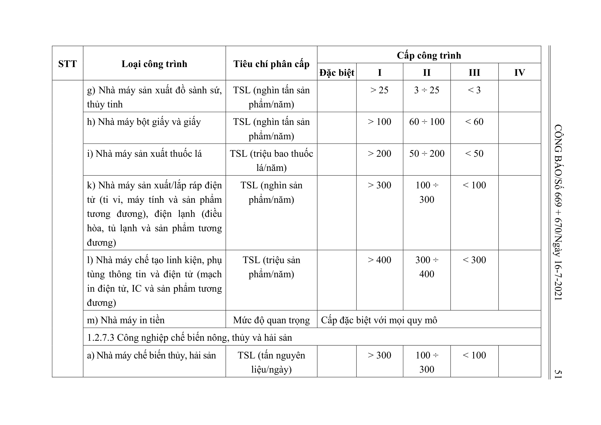
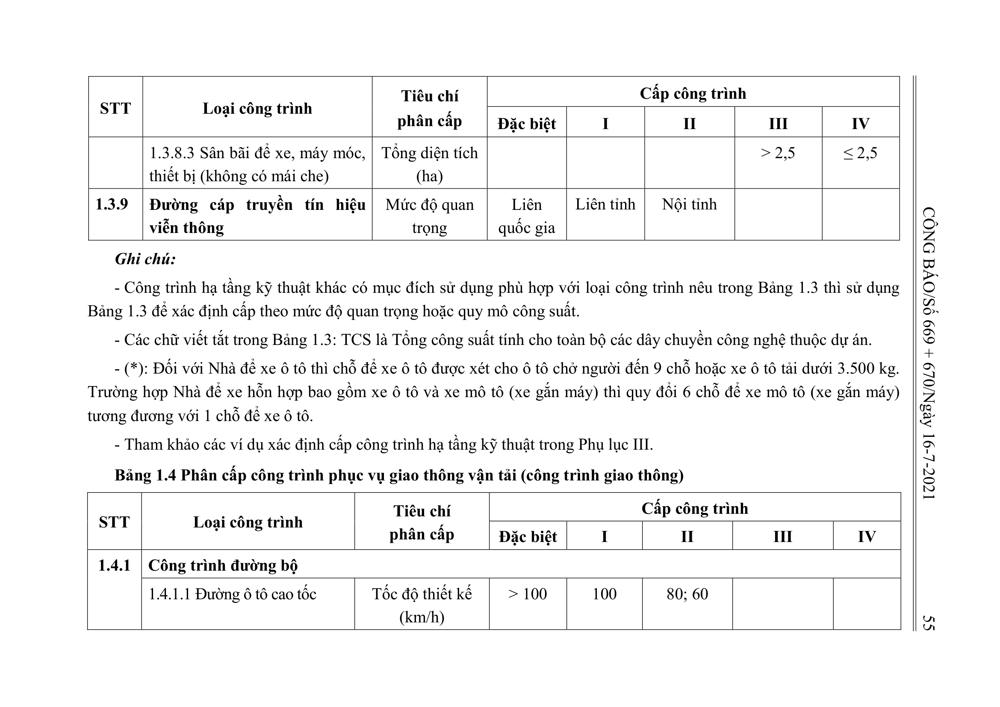
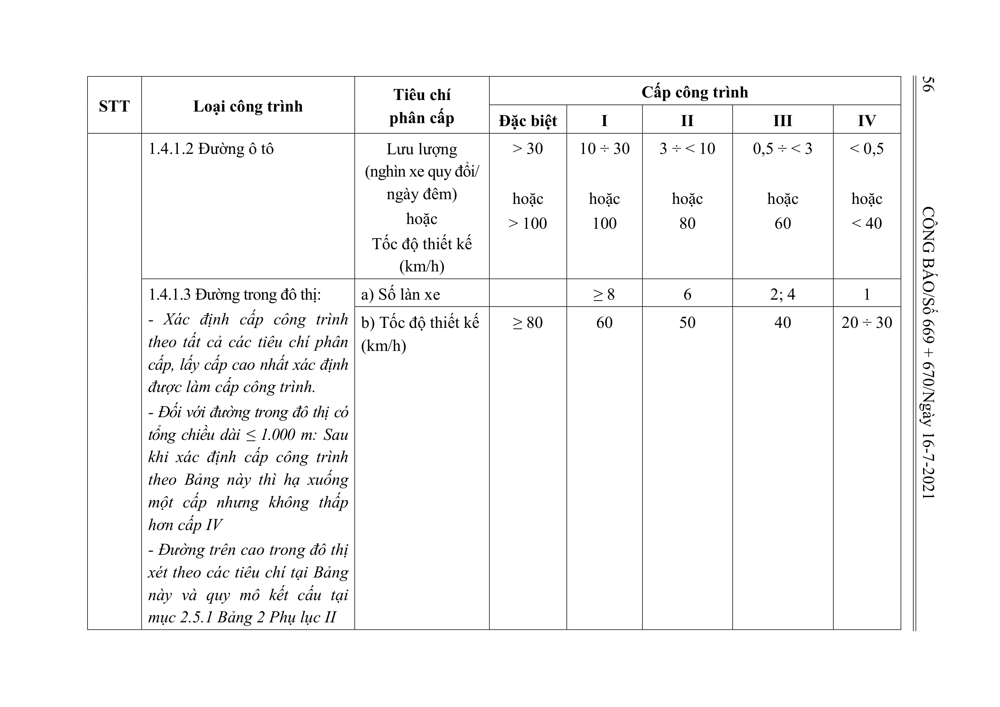
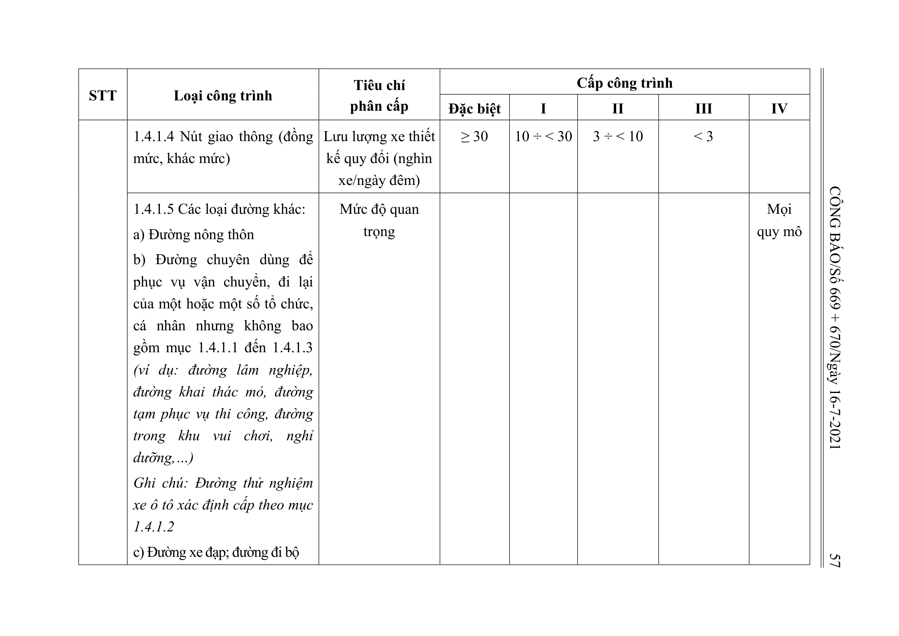

## Bảng 1.1: Phân cấp công trình sử dụng cho mục đích dân dụng (công trình dân dụng)

## Bảng 1.1: nhóm 1.1.1 Công trình giáo dục, đào tạo

| STT | Loại công trình | Tiêu chí phân cấp | Đặc biệt | I | II | III | IV |
| --- | --- | --- | --- | --- | --- | --- | --- |
| 1.1.1 | Công trình giáo dục, đào tạo |  |  |  |  |  |  |
|  | 1.1.1.1 Nhà trẻ, trường mẫu giáo, trường mầm non | Mức độ quan trọng | Cấp III với mọi quy mô |  |  |  |  |
|  | 1.1.1.2 Trường tiểu học | Tổng số học sinh toàn trường |  |  | ≥ 700 | < 700 |  |
|  | 1.1.1.3 Trường trung học cơ sở, trường trung học phổ thông, trường phổ thông có nhiều cấp học | Tổng số học sinh toàn trường |  |  | ≥ 1.350 | < 1.350 |  |
|  | 1.1.1.4 Trường đại học, trường cao đẳng; trường trung học chuyên nghiệp, trường dạy nghề, trường công nhân kỹ thuật, trường nghiệp vụ | Tổng số sinh viên toàn trường |  | > 8.000 | 5.000 ÷ 8.000 | < 5.000 |  |

## Bảng 1.1: nhóm 1.1.2 Công trình y tế

| STT | Loại công trình | Tiêu chí phân cấp | Đặc biệt | I | II | III | IV |
| --- | --- | --- | --- | --- | --- | --- | --- |
| 1.1.2 | Công trình y tế |  |  |  |  |  |  |
|  | 1.1.2.1 Bệnh viện đa khoa, bệnh viện chuyên khoa từ trung ương đến địa phương (Bệnh viện trung ương không thấp hơn cấp I) | Tổng số giường bệnh lưu trú | > 1.000 | 500 ÷ 1.000 | 250 ÷ < 500 | < 250 |  |
|  | 1.1.2.2 Trung tâm thí nghiệm an toàn sinh học (Cấp độ an toàn sinh học xác định theo quy định của ngành y tế) | Cấp độ an toàn sinh học (ATSH) |  | ATSH cấp độ 4 | ATSH cấp độ 3 | ATSH cấp độ 1 và cấp độ 2 |  |

## Bảng 1.1: nhóm 1.1.3 Công trình thể thao

| STT | Loại công trình | Tiêu chí phân cấp | Đặc biệt | I | II | III | IV |
| --- | --- | --- | --- | --- | --- | --- | --- |
| 1.1.3 | Công trình thể thao |  |  |  |  |  |  |
|  | 1.1.3.1 Sân vận động, sân thi đấu các môn thể thao ngoài trời có khán đài (Sân vận động quốc gia, sân thi đấu quốc gia không nhỏ hơn cấp I) | Sức chứa của khán đài (nghìn chỗ) | > 40 | > 20 ÷ 40 | 5 ÷ 20 | < 5 |  |
|  | 1.1.3.2 Nhà thi đấu, tập luyện các môn thể thao có khán đài (Nhà thi đấu thể thao quốc gia không nhỏ hơn cấp I) | Sức chứa của khán đài (nghìn chỗ) | > 7,5 | 5 ÷ 7,5 | 2 ÷ < 5 | < 2 |  |
|  | 1.1.3.3 Sân gôn | Số lỗ |  | ≥ 36 | 18 ÷ < 36 | < 18 |  |
|  | 1.1.3.4 Bể bơi, sân thể thao ngoài trời | Mức độ quan trọng |  |  |  | Đạt chuẩn thi đấu thể thao cấp quốc gia | Hoạt động thể thao phong trào |

## Bảng 1.1: nhóm 1.1.4 Công trình văn hóa

| STT | Loại công trình | Tiêu chí phân cấp | Đặc biệt | I | II | III | IV |
| --- | --- | --- | --- | --- | --- | --- | --- |
| 1.1.4 | Công trình văn hóa |  |  |  |  |  |  |
|  | 1.1.4.1 Trung tâm hội nghị, nhà văn hóa, câu lạc bộ, vũ trường và các công trình văn hóa tập trung đông người khác (Trung tâm hội nghị quốc gia không nhỏ hơn cấp I) | Tổng sức chứa (nghìn người) | > 3 | > 1,2 ÷ 3 | > 0,3 ÷ 1,2 | ≤ 0,3 |  |
|  | 1.1.4.2 Nhà hát, rạp chiếu phim, rạp xiếc | Tổng sức chứa khán giả (nghìn người) | > 3 | > 1,2 ÷ 3 | > 0,3 ÷ 1,2 | ≤ 0,3 |  |
|  | 1.1.4.3 Bảo tàng, thư viện, triển lãm, nhà trưng bày | Mức độ quan trọng |  | Quốc gia | Tỉnh, Ngành | Các trường hợp còn lại |  |

## Bảng 1.1: nhóm 1.1.5 Chợ

| STT | Loại công trình | Tiêu chí phân cấp | Đặc biệt | I | II | III | IV |
| --- | --- | --- | --- | --- | --- | --- | --- |
| 1.1.5 | Chợ | Số điểm kinh doanh |  |  |  | > 400 | ≤ 400 |

## Bảng 1.1: nhóm 1.1.6 Công trình tôn giáo

| STT | Loại công trình | Tiêu chí phân cấp | Đặc biệt | I | II | III | IV |
| --- | --- | --- | --- | --- | --- | --- | --- |
| 1.1.6 | Công trình tôn giáo | Mức độ quan trọng | Cấp III với mọi quy mô |  |  |  |  |

## Bảng 1.1: nhóm 1.1.7 Trụ sở cơ quan nhà nước, tổ chức chính trị, tổ chức chính trị - xã hội

| STT | Loại công trình | Tiêu chí phân cấp | Đặc biệt | I | II | III | IV |
| --- | --- | --- | --- | --- | --- | --- | --- |
| 1.1.7 | Trụ sở cơ quan nhà nước, tổ chức chính trị, tổ chức chính trị - xã hội | Mức độ quan trọng | Nhà Quốc hội, Phủ Chủ tịch, Trụ sở Chính phủ, Trụ sở Trung ương Đảng; các công trình đặc biệt quan trọng khác | Trụ sở làm việc của Tỉnh ủy; HĐND, UBND cấp tỉnh; Bộ, Tổng cục và cấp tương đương; Tòa án nhân dân, Viện kiểm sát nhân dân tối cao, cấp cao | Trụ sở làm việc của Huyện ủy; HĐND, UBND cấp huyện; cấp Cục, cấp Sở và cấp tương đương; Tòa án nhân dân, Viện kiểm sát nhân dân cấp tỉnh | Trụ sở làm việc của Đảng ủy, HĐND, UBND cấp xã; Chi cục và cấp tương đương; Tòa án nhân dân, Viện kiểm sát nhân dân cấp huyện |  |

**Ghi chú:**

- Công trình dân dụng khác có mục đích sử dụng phù hợp với loại công trình nêu trong Bảng 1.1 thì sử dụng Bảng 1.1 để xác định cấp theo mức độ quan trọng hoặc quy mô công suất.
- Tham khảo các ví dụ xác định cấp công trình dân dụng trong Phụ lục III.

## Bảng 1.2: Phân cấp công trình sử dụng cho mục đích sản xuất công nghiệp (công trình công nghiệp)

## Bảng 1.2: nhóm 1.2.1 Công trình sản xuất vật liệu xây dựng, sản phẩm xây dựng

| STT | Loại công trình | Tiêu chí phân cấp | Đặc biệt | I | II | III | IV |
| --- | --- | --- | --- | --- | --- | --- | --- |
| 1.2.1 | Công trình sản xuất vật liệu xây dựng, sản phẩm xây dựng |  |  |  |  |  |  |
|  | 1.2.1.1 Khai thác mỏ khoáng sản làm vật liệu xây dựng (đá vôi xi măng, đất sét xi măng, phụ gia xi măng, cao lanh, fenspat, đất sét chịu lửa, đất sét trắng, cát trắng, đôlômit, đá làm ốp lát, đá vôi làm vôi, đá xây dựng, các loại khoáng sản làm vật liệu xây dựng khác) |  |  |  |  |  |  |
|  | a) Công trình có sử dụng vật liệu nổ | Mức độ quan trọng | Cấp II với mọi quy mô |  |  |  |  |
|  | b) Công trình không sử dụng vật liệu nổ | TCS (triệu m3 sản phẩm/năm) |  |  | ≥ 1 | < 1 |  |
|  | 1.2.1.2 Nhà máy sản xuất clinker, xi măng | TCS (triệu tấn/năm) |  | ≥ 1 | < 1 |  |  |
|  | 1.2.1.3 Trạm nghiền, trạm phân phối xi măng | TCS (triệu tấn/năm) |  | ≥ 0,3 | < 0,3 |  |  |
|  | 1.2.1.4 Nhà máy sản xuất sản phẩm, cấu kiện bê tông thông thường; nhà máy sản xuất gạch bê tông | TCS (nghìn m3 thành phẩm/năm) |  |  | > 150 | ≤ 150 |  |
|  | 1.2.1.5 Nhà máy sản xuất cấu kiện bê tông ly tâm, cấu kiện bê tông ứng lực trước, tấm tường bê tông rỗng đúc sẵn | TCS (nghìn m3 thành phẩm/năm) |  | > 150 | 30 ÷ 150 | < 30 |  |
|  | 1.2.1.6 Nhà máy sản xuất gạch bê tông nhẹ, tấm tường sử dụng bê tông nhẹ | TCS (nghìn m3 thành phẩm/năm) |  | > 200 | 100 ÷ 200 | < 100 |  |
|  | 1.2.1.7 Nhà máy sản xuất gạch, ngói đất sét nung | TCS (triệu viên gạch QTC/năm) |  | > 40 | 20 ÷ 40 | < 20 |  |
|  | 1.2.1.8 Nhà máy sản xuất sản phẩm ốp, lát |  |  |  |  |  |  |
|  | a) Nhà máy sản xuất gạch gốm ốp lát | TCS (triệu m2 sản phẩm/năm) |  | > 5 | 3 ÷ 5 | < 3 |  |
|  | b) Nhà máy sản xuất đá ốp lát nhân tạo | TCS (triệu m2 sản phẩm/năm) |  | > 1 | 0,5 ÷ 1 | < 0,5 |  |
|  | c) Nhà máy sản xuất đá ốp lát tự nhiên | TCS (triệu m2 sản phẩm/năm) |  | > 0,3 | 0,1 ÷ 0,3 | < 0,1 |  |
|  | 1.2.1.9 Nhà máy sản xuất sứ vệ sinh | TCS (triệu sản phẩm/năm) |  | > 1 | 0,3 ÷ 1 | < 0,3 |  |
|  | 1.2.1.10 Nhà máy sản xuất kính xây dựng | TCS (triệu m2 sản phẩm/năm) |  | ≥ 20 | < 20 |  |  |
|  | 1.2.1.11. Nhà máy sản xuất sản phẩm từ kính (kính tôi, kính hộp, kính nhiều lớp...) | TCS (triệu m2 sản phẩm/năm) |  |  | ≥ 0,2 | < 0,2 |  |
|  | 1.2.1.12 Nhà máy sản xuất vôi công nghiệp và các sản phẩm sau vôi | TCS (triệu tấn sản phẩm/năm) |  | > 0,3 | 0,1 ÷ 0,3 | < 0,1 |  |
|  | 1.2.1.13 Nhà máy sản xuất vật liệu chịu lửa | TCS (nghìn tấn sản phẩm/năm |  | > 10 | 5 ÷ 10 | < 5 |  |
|  | 1.2.1.14 Nhà máy sản xuất tấm lợp xi măng cốt sợi | TCS (triệu m2 sản phẩm/năm) |  |  | ≥ 0,3 | < 0,3 |  |
|  | 1.2.1.15 Nhà máy sản xuất vữa khô | TCS (triệu tấn sản phẩm/năm) |  |  | ≥ 0,3 | < 0,3 |  |
|  | 1.2.1.16 Nhà máy sản xuất tấm thạch cao | TCS (triệu m2 sản phẩm/năm) |  | > 20 | 10 ÷ 20 | < 10 |  |

## Bảng 1.2: nhóm 1.2.2 Công trình luyện kim và cơ khí chế tạo

| STT | Loại công trình | Tiêu chí phân cấp | Đặc biệt | I | II | III | IV |
| --- | --- | --- | --- | --- | --- | --- | --- |
| 1.2.2 | Công trình luyện kim và cơ khí chế tạo |  |  |  |  |  |  |
|  | 1.2.2.1 Nhà máy luyện kim |  |  |  |  |  |  |
|  | a) Nhà máy luyện kim mầu | TSL (triệu tấn thành phẩm/năm) |  | > 0,5 | 0,1 ÷ 0,5 | < 0,1 |  |
|  | b) Nhà máy luyện, cán thép | TSL (triệu tấn thành phẩm/năm) |  | > 1 | 0,5 ÷ 1 | < 0,5 |  |
|  | 1.2.2.2 Khu liên hợp gang thép | Dung tích lò cao (nghìn m3) | > 1 | ≤ 1 |  |  |  |
|  | 1.2.2.3 Nhà máy chế tạo máy động lực và máy nông nghiệp | TSL (nghìn sản phẩm/năm) |  | > 5 | 2,5 ÷ 5 | < 2,5 |  |
|  | 1.2.2.4 Nhà máy chế tạo máy công cụ và thiết bị công nghiệp | TSL (nghìn sản phẩm/năm) |  | > 1 | 0,5 ÷ 1 | < 0,5 |  |
|  | 1.2.2.5 Nhà máy chế tạo thiết bị nâng hạ | TSL (nghìn tấn sản phẩm/năm) |  | > 200 | ≤ 200 |  |  |
|  | 1.2.2.6 Nhà máy chế tạo máy xây dựng |  |  |  |  |  |  |
|  | a) Nhà máy sản xuất, lắp ráp máy ủi, máy đào, máy xúc | TSL (sản phẩm/năm) |  | > 250 | ≤ 250 |  |  |
|  | b) Nhà máy sản xuất, lắp ráp xe lu tĩnh và lu rung | TSL (sản phẩm/năm) |  | > 130 | ≤ 130 |  |  |
|  | c) Nhà máy sản xuất, lắp ráp cẩu tự hành | TSL (sản phẩm/năm) |  | > 40 | ≤ 40 |  |  |
|  | 1.2.2.7 Nhà máy chế tạo thiết bị toàn bộ | TSL (nghìn tấn thiết bị/năm) |  | > 10 | 5 ÷ 10 | < 5 |  |
|  | 1.2.2.8 Nhà máy sản xuất, lắp ráp phương tiện giao thông |  |  |  |  |  |  |
|  | a) Nhà máy sản xuất, lắp ráp ô tô | TSL (nghìn xe/năm) |  | > 10 | 5 ÷ 10 | < 5 |  |
|  | b) Nhà máy sản xuất, lắp ráp xe máy | TSL (nghìn xe/năm) |  | > 500 | ≤ 500 |  |  |
|  | c) Nhà máy sản xuất, lắp ráp đầu máy tàu hỏa | TSL (nghìn đầu máy/năm) |  | > 1 | 0,5 ÷ 1 | < 0,5 |  |
|  | d) Cơ sở đóng mới phương tiện thủy nội địa | Tải trọng của tàu (nghìn DWT) |  | > 30 | 10 ÷ 30 | 5 ÷ < 10 | < 5 |
|  | đ) Cơ sở đóng mới tàu biển | Tải trọng của tàu (nghìn DWT) | > 70 | > 40 ÷ 70 | > 20 ÷ 40 | > 5 ÷ 20 | ≤ 5 |

## Bảng 1.2: nhóm 1.2.3 Công trình khai thác mỏ và chế biến khoáng sản

| STT | Loại công trình | Tiêu chí phân cấp | Đặc biệt | I | II | III | IV |
| --- | --- | --- | --- | --- | --- | --- | --- |
| 1.2.3 | Công trình khai thác mỏ và chế biến khoáng sản |  |  |  |  |  |  |
|  | 1.2.3.1 Mỏ than hầm lò | TSL (triệu tấn than/năm) |  | > 1 | 0,3 ÷ 1 | < 0,3 |  |
|  | 1.2.3.2 Mỏ quặng hầm lò | TSL (triệu tấn quặng/năm) |  | > 3 | 1 ÷ 3 | < 1 |  |
|  | 1.2.3.3 Mỏ than lộ thiên | TSL (triệu tấn than/năm) |  |  | ≥ 2 | < 2 |  |
|  | 1.2.3.4 Mỏ quặng lộ thiên | TSL (triệu tấn quặng/năm) |  |  | ≥ 2 | < 2 |  |
|  | 1.2.3.5 Nhà máy sàng tuyển than | TSL (triệu tấn/năm) |  | > 5 | 2 ÷ 5 | < 2 |  |
|  | 1.2.3.6 Nhà máy tuyển/làm giàu quặng (bao gồm cả tuyển quặng bô xít) | TSL (triệu tấn/năm) |  | > 7 | 3 ÷ 7 | < 3 |  |
|  | 1.2.3.7 Công trình sản xuất alumin | Mức độ quan trọng | Cấp I với mọi quy mô |  |  |  |  |

## Bảng 1.2: nhóm 1.2.4 Công trình dầu khí

| STT | Loại công trình | Tiêu chí phân cấp | Đặc biệt | I | II | III | IV |
| --- | --- | --- | --- | --- | --- | --- | --- |
| 1.2.4 | Công trình dầu khí |  |  |  |  |  |  |
|  | 1.2.4.1 Công trình khai thác trên biển (giàn khai thác) | Mức độ quan trọng | Cấp I với mọi quy mô |  |  |  |  |
|  | 1.2.4.2 Công trình lọc dầu | TCS (triệu tấn/năm) | ≥ 10 | < 10 |  |  |  |
|  | 1.2.4.3 Công trình chế biến khí | TCS (triệu m3 khí/ngày) | ≥ 10 | < 10 |  |  |  |
|  | 1.2.4.4 Công trình sản xuất nhiên liệu sinh học | TCS (nghìn tấn sản phẩm/năm) | > 500 | 200 ÷ 500 | < 200 |  |  |
|  | 1.2.4.5 Kho xăng dầu | Tổng dung tích chứa (nghìn m3) | > 100 | 5 ÷ 100 | 0,21 ÷ < 5 | < 0,21 |  |
|  | 1.2.4.6 Kho chứa khí hóa lỏng, trạm chiết nạp khí hóa lỏng | Tổng dung tích chứa (nghìn m3) | > 100 | 5 ÷ 100 | < 5 |  |  |

## Bảng 1.2: nhóm 1.2.5 Công trình năng lượng

| STT | Loại công trình | Tiêu chí phân cấp | Đặc biệt | I | II | III | IV |
| --- | --- | --- | --- | --- | --- | --- | --- |
| 1.2.5 | Công trình năng lượng |  |  |  |  |  |  |
|  | 1.2.5.1 Công trình nhiệt điện | TCS (MW) | > 2.000 | 600 ÷ 2.000 | 50 ÷ < 600 | < 50 |  |
|  | 1.2.5.2 Công trình điện hạt nhân | Mức độ quan trọng | Cấp đặc biệt với mọi quy mô |  |  |  |  |
|  | 1.2.5.3 Công trình thủy điện |  |  |  |  |  |  |
|  | a) Nhà máy | Tổng công suất lắp máy (MW) | > 1.000 | > 50 ÷ 1.000 | > 30 ÷ 50 | ≤ 30 |  |
|  | b) Hồ chứa | Dung tích hồ chứa nước ứng với mực nước dâng bình thường (triệu m3) | > 1.000 | > 200 ÷ 1.000 | > 20 ÷ 200 | ≥ 3 ÷ 20 | < 3 |
|  | c) Đập dâng nước | (Quy mô và đặc điểm của đập) |  |  |  |  |  |
|  | Đập vật liệu đất, đất - đá có chiều cao lớn nhất (m) | A | > 100 | > 70 ÷ 100 | > 25 ÷ 70 | > 10 ÷ 25 | ≤ 10 |
|  |  | B |  | > 35 ÷ 75 | > 15 ÷ 35 | > 8 ÷ 15 | ≤ 8 |
|  |  | C |  |  | > 15 ÷ 25 | > 5 ÷ 15 | ≤ 5 |
|  | Đập bê tông, bê tông cốt thép có chiều cao lớn nhất (m) | A | > 100 | > 60 ÷ 100 | > 25 ÷ 60 | > 10 ÷ 25 | ≤ 10 |
|  |  | B |  | > 25 ÷ 50 | > 10 ÷ 25 | > 5 ÷ 10 | ≤ 5 |
|  |  | C |  |  | > 10 ÷ 20 | > 5 ÷ 10 | ≤ 5 |
|  | Ghi chú: 1. Cấp của công trình thủy điện là cấp cao nhất xác định được theo các tiêu chí phân cấp Nhà máy, Hồ chứa nước và Đập dâng nước (trong đó A, B, C là nhóm địa chất nền điển hình: Nhóm A nền là đá; Nhóm B nền là đất cát, đất hòn thô, đất sét ở trạng thái cứng và nửa cứng; Nhóm C nền là đất sét bão hòa nước ở trạng thái dẻo). Riêng đối với công trình thủy điện tích năng: Sau khi xác định được cấp theo quy định của mục này thì hạ xuống một cấp nhưng không nhỏ hơn cấp III trong mọi trường hợp. 2. Cấp công trình của các công trình trên “Tuyến năng lượng” như Cửa nhận nước, Đường dẫn (kênh, cống, đường hầm), Tháp điều áp, Đường ống áp lực, Kênh xả hoặc Hầm xả nước,… được xác định theo cấp của Nhà máy thủy điện quy định tại điểm a mục 1.2.5.3. 3. Cấp công trình của các công trình trên “Tuyến đầu mối” như Đập dâng nước, Tràn xả mặt, Tràn xả sâu, Tràn sự cố, công trình lấy nước khác,… được xác định theo cấp của Đập dâng nước quy định tại điểm c mục 1.2.5.3. 4. Các công trình liên quan khác như Nhà quản lý vận hành, Tường rào, Đường giao thông,… trong dự án xây dựng công trình thủy điện được xác định cấp công trình tương ứng với loại công trình theo hướng dẫn trong Thông tư này. |  |  |  |  |  |  |
|  | 1.2.5.4 Công trình điện gió | TCS (MW) |  | ≥ 50 | > 15 ÷ < 50 | > 3 ÷ 15 | ≤ 3 |
|  | 1.2.5.5 Công trình điện mặt trời | TCS (MW) |  | ≥ 50 | > 15 ÷ < 50 | > 3 ÷ 15 | ≤ 3 |
|  | 1.2.5.6 Công trình điện địa nhiệt | TCS (MW) |  | > 10 | 5 ÷ 10 | < 5 |  |
|  | 1.2.5.7 Công trình điện thủy triều | TCS (MW) |  | > 50 | 30 ÷ 50 | < 30 |  |
|  | 1.2.5.8 Công trình điện rác | TCS (MW) | > 70 | > 15 ÷ 70 | 5 ÷ 15 | < 5 |  |
|  | 1.2.5.9 Công trình điện sinh khối | TCS (MW) |  | > 30 | 10 ÷ 30 | < 10 |  |
|  | 1.2.5.10 Công trình điện khí biogas | TCS (MW) |  | > 15 | 5 ÷ 15 | < 5 |  |
|  | 1.2.5.11 Đường dây và trạm biến áp | Điện áp (kV) | ≥ 500 | 220 | 110 | > 35 ÷ < 110 | ≤ 35 |
|  | 1.2.5.12 Cửa hàng/Trạm bán lẻ xăng, dầu, khí hóa lỏng; trạm cấp/sạc điện, pin điện. | Mức độ quan trọng | Cấp III với mọi quy mô |  |  |  |  |

## Bảng 1.2: nhóm 1.2.6 Công trình hóa chất

| STT | Loại công trình | Tiêu chí phân cấp | Đặc biệt | I | II | III | IV |
| --- | --- | --- | --- | --- | --- | --- | --- |
| 1.2.6 | Công trình hóa chất |  |  |  |  |  |  |
|  | 1.2.6.1 Công trình sản xuất sản phẩm phân bón và hóa chất bảo vệ thực vật |  |  |  |  |  |  |
|  | a) Công trình sản xuất phân bón đơn, phức hợp (có phản ứng hóa học, bao gồm: Urê, DAP, MAP, SA, NPK phức hợp, supe lân,…) | TSL (nghìn tấn sản phẩm/năm) |  | ≥ 50 | 10 ÷ < 50 | < 10 |  |
|  | b) Công trình sản xuất phân bón khác (trộn, hỗn hợp, phương pháp nhiệt, vi sinh… - không phát sinh các phản ứng hóa học) | TSL (nghìn tấn sản phẩm/năm) |  | ≥ 300 | 100 ÷ < 300 | < 100 |  |
|  | c) Công trình sản xuất, trạm chiết nạp, san chiết đóng gói sản phẩm hóa chất bảo vệ thực vật | TSL (nghìn tấn sản phẩm/năm) |  | > 15 | 10 ÷ 15 | < 10 |  |
|  | 1.2.6.2 Công trình sản xuất sản phẩm hóa chất cơ bản, hóa dầu, hóa dược, hóa mỹ phẩm và hóa chất khác |  |  |  |  |  |  |
|  | a) Công trình sản xuất hóa chất cơ bản (axít, kiềm, clo…), hóa chất nguy hiểm độc hại, hóa chất vô cơ, hữu cơ, hóa chất công nghiệp khác (bao gồm hóa chất tinh khiết, muối, thuốc tuyển quặng apatit…) | TSL (nghìn tấn sản phẩm/năm) |  | ≥ 10 | < 10 |  |  |
|  | b) Công trình sản xuất, kho trạm chiết nạp sản phẩm hóa dầu (nguyên liệu nhựa PP, PE, PVC, PS, ABS, PET, SV, sợi, DOP, SM, VCM, Polystyren, PTA, MEG, BTX, cao su tổng hợp và các sản phẩm khác) | TSL (nghìn tấn sản phẩm/năm) |  | ≥ 50 | < 50 |  |  |
|  | c) Công trình sản xuất sản phẩm hóa dược (chiết xuất, tinh chế hoạt chất thiên nhiên và tổng hợp từ hóa chất) Ghi chú: Không bao gồm công trình sản xuất thuốc và vật tư y tế; sơ chế, bào chế, sản xuất thuốc đông y | Mức độ quan trọng | Cấp I với mọi quy mô |  |  |  |  |
|  | d) Công trình sản xuất các sản phẩm tẩy rửa, hóa mỹ phẩm (kem giặt, bột giặt, nước cọ rửa, xà phòng giặt; dầu gội đầu, sữa tắm, kem đánh răng, xà phòng tắm,…) | TSL (nghìn tấn sản phẩm/năm) |  | ≥ 15 | 10 ÷ < 15 | < 10 |  |
|  | 1.2.6.3 Công trình sản xuất sản phẩm nguồn điện hóa học |  |  |  |  |  |  |
|  | a) Công trình sản xuất pin hóa học | TSL (triệu viên/năm) |  | > 250 | 150 ÷ 250 | < 150 |  |
|  | b) Công trình sản xuất, tái chế ắc quy | TSL (nghìn kWh/năm) |  | > 300 | 100 ÷ 300 | < 100 |  |
|  | c) Công trình sản xuất que hàn | TSL (nghìn tấn sản phẩm/năm) |  |  |  | ≥ 3 | < 3 |
|  | 1.2.6.4 Công trình sản xuất, kho trạm chiết nạp khí công nghiệp (O , N , Ar, CO, CO , He, H , Xe, CH , C H 2 2 2 2 4 2 2 và các khí công nghiệp khác) |  |  |  |  |  |  |
|  | a) Công trình sản xuất khí công nghiệp | TSL (nghìn m3 khí/h) |  | > 15 | 8,5 ÷ 15 | < 8,5 |  |
|  | b) Kho trạm chiết nạp khí công nghiệp | Sức chứa lớn nhất (tấn) |  | ≥ 100 | < 100 |  |  |
|  | 1.2.6.5 Công trình sản xuất sản phẩm cao su |  |  |  |  |  |  |
|  | a) Công trình sản xuất săm, lốp ô tô, máy kéo | TSL (triệu chiếc/năm) |  | > 1 | 0,5 ÷ 1 | < 0,5 |  |
|  | b) Công trình sản xuất săm, lốp xe mô tô, xe đạp | TSL (triệu chiếc/năm) |  |  | > 5 | 1 ÷ 5 | < 1 |
|  | c) Công trình sản xuất băng tải | TSL (nghìn m2 sản phẩm/năm) |  |  | > 500 | 200 ÷ 500 | < 200 |
|  | d) Công trình sản xuất cao su kỹ thuật | TSL (triệu sản phẩm/năm) |  |  | > 1,5 | 0,5 ÷ 1,5 | < 0,5 |
|  | 1.2.6.6 Công trình sản xuất sơn, mực in |  |  |  |  |  |  |
|  | a) Công trình sản xuất sơn | TSL (nghìn tấn sản phẩm/năm) |  | > 100 | > 20 ÷ 100 | 10 ÷ 20 | < 10 |
|  | b) Công trình sản xuất mực in | TSL (nghìn tấn sản phẩm/năm) |  |  | > 20 | 5 ÷ 20 | < 5 |
|  | 1.2.6.7 Công trình tuyển quặng apatit | TSL (nghìn tấn sản phẩm/năm) |  | ≥ 100 | < 100 |  |  |
|  | 1.2.6.8 Công trình sản xuất, chứa vật liệu nổ, tiền chất thuốc nổ |  |  |  |  |  |  |
|  | a) Công trình sản xuất vật liệu nổ công nghiệp, tiền chất thuốc nổ | Mức độ quan trọng | Cấp đặc biệt với mọi quy mô |  |  |  |  |
|  | b) Kho chứa vật liệu nổ công nghiệp |  |  |  |  |  |  |
|  | Kho hầm lò, kho ngầm | Mức độ quan trọng | Cấp I với mọi quy mô |  |  |  |  |
|  | Kho cố định nổi và nửa ngầm | Sức chứa (tấn) |  | > 10 | ≤ 10 |  |  |
|  | Kho lưu động | Mức độ quan trọng | Cấp II với mọi quy mô |  |  |  |  |
|  | c) Kho chứa tiền chất thuốc nổ |  |  |  |  |  |  |
|  | Kho hầm lò, kho ngầm | Mức độ quan trọng | Cấp I với mọi quy mô |  |  |  |  |
|  | Kho cố định nổi và nửa ngầm | Sức chứa (tấn) |  | > 50 | ≤ 50 |  |  |
|  | Kho lưu động | Mức độ quan trọng | Cấp II với mọi quy mô |  |  |  |  |

## Bảng 1.2: nhóm 1.2.7 Công trình công nghiệp nhẹ

| STT | Loại công trình | Tiêu chí phân cấp | Đặc biệt | I | II | III | IV |
| --- | --- | --- | --- | --- | --- | --- | --- |
| 1.2.7 | Công trình công nghiệp nhẹ |  |  |  |  |  |  |
|  | 1.2.7.1 Công nghiệp thực phẩm |  |  |  |  |  |  |
|  | a) Nhà máy sữa | TSL (triệu lít/năm) |  | > 100 | 30 ÷ 100 | < 30 |  |
|  | b) Nhà máy sản xuất bánh kẹo, mỳ ăn liền | TSL (nghìn tấn sản phẩm/năm) |  | > 25 | 5 ÷ 25 | < 5 |  |
|  | c) Nhà máy sản xuất dầu ăn, hương liệu | TSL (nghìn tấn sản phẩm/năm) |  | > 150 | 50 ÷ 150 | < 50 |  |
|  | d) Nhà máy sản xuất rượu, bia, nước giải khát | TSL (triệu lít/năm) |  | > 100 | 25 ÷ 100 | < 25 |  |
|  | 1.2.7.2 Công nghiệp tiêu dùng |  |  |  |  |  |  |
|  | a) Nhà máy xơ sợi | TSL (nghìn tấn sản phẩm/năm) |  | > 75 | 30 ÷ 75 | < 30 |  |
|  | b) Nhà máy dệt | TSL (triệu m2 sản phẩm/năm) |  | > 25 | 5 ÷ 25 | < 5 |  |
|  | c) Nhà máy in, nhuộm (ngành dệt, may) | TSL (triệu m2 sản phẩm/năm) |  | > 35 | 10 ÷ 35 | < 10 |  |
|  | d) Nhà máy sản xuất các sản phẩm may | TSL (triệu sản phẩm/năm) |  | > 10 | 2 ÷ 10 | < 2 |  |
|  | đ) Nhà máy thuộc da và sản xuất các sản phẩm từ da | TSL (triệu sản phẩm/năm) |  | > 12 | 1 ÷ 12 | < 1 |  |
|  | e) Nhà máy sản xuất các sản phẩm nhựa | TSL (nghìn tấn sản phẩm/năm) |  | > 15 | 2 ÷ 15 | < 2 |  |
|  | g) Nhà máy sản xuất đồ sành sứ, thủy tinh | TSL (nghìn tấn sản phẩm/năm) |  | > 25 | 3 ÷ 25 | < 3 |  |
|  | h) Nhà máy bột giấy và giấy | TSL (nghìn tấn sản phẩm/năm) |  | > 100 | 60 ÷ 100 | < 60 |  |
|  | i) Nhà máy sản xuất thuốc lá | TSL (triệu bao thuốc lá/năm) |  | > 200 | 50 ÷ 200 | < 50 |  |
|  | k) Nhà máy sản xuất/lắp ráp điện tử (ti vi, máy tính và sản phẩm tương đương), điện lạnh (điều hòa, tủ lạnh và sản phẩm tương đương) | TSL (nghìn sản phẩm/năm) |  | > 300 | 100 ÷ 300 | < 100 |  |
|  | l) Nhà máy chế tạo linh kiện, phụ tùng thông tin và điện tử (mạch in điện tử, IC và sản phẩm tương đương) | TSL (triệu sản phẩm/năm) |  | > 400 | 300 ÷ 400 | < 300 |  |
|  | m) Nhà máy in tiền | Mức độ quan trọng | Cấp đặc biệt với mọi quy mô |  |  |  |  |
|  | 1.2.7.3 Công nghiệp chế biến nông, thủy và hải sản |  |  |  |  |  |  |
|  | a) Nhà máy chế biến thủy, hải sản | TSL (tấn nguyên liệu/ngày) |  | > 300 | 100 ÷ 300 | < 100 |  |

**Ghi chú:**

- Công trình công nghiệp khác có mục đích sử dụng phù hợp với loại công trình nêu trong Bảng 1.2 thì sử dụng Bảng 1.2 để xác định cấp theo mức độ quan trọng hoặc quy mô công suất.
- Các chữ viết tắt trong Bảng 1.2: TCS là Tổng công suất; TSL là Tổng sản lượng - Tổng công suất (hoặc Tổng sản lượng) được tính cho toàn bộ các dây chuyền công nghệ thuộc dự án; QTC là quy tiêu chuẩn.
- Tham khảo các ví dụ xác định cấp công trình công nghiệp trong Phụ lục III.

## Bảng 1.3: Phân cấp công trình cung cấp cơ sở, tiện ích hạ tầng kỹ thuật (công trình hạ tầng kỹ thuật)

|  | b) Nhà máy chế biến đồ hộp | TSL (tấn nguyên liệu/ngày) |  |  | ≥ 100 | < 100 |  |
|  | c) Nhà máy xay xát, lau bóng gạo | TSL (nghìn tấn sản phẩm/năm) |  | > 200 | 100 ÷ 200 | 1 ÷ < 100 | < 1 |

## Bảng 1.3: nhóm 1.3.1 Công trình cấp nước

| STT | Loại công trình | Tiêu chí phân cấp | Đặc biệt | I | II | III | IV |
| --- | --- | --- | --- | --- | --- | --- | --- |
| 1.3.1 | Công trình cấp nước |  |  |  |  |  |  |
|  | 1.3.1.1 Nhà máy nước, công trình xử lý nước sạch (bao gồm cả công trình xử lý bùn cặn) | TCS (nghìn m3/ngày đêm) |  | ≥ 30 | 10 ÷ < 30 | < 10 |  |
|  | 1.3.1.2 Trạm bơm nước thô, nước sạch hoặc tăng áp (bao gồm cả bể chứa nước nếu có) | TCS (nghìn m3/ngày đêm) |  | ≥ 40 | 12 ÷ < 40 | < 12 |  |

## Bảng 1.3: nhóm 1.3.2 Công trình thoát nước

| STT | Loại công trình | Tiêu chí phân cấp | Đặc biệt | I | II | III | IV |
| --- | --- | --- | --- | --- | --- | --- | --- |
| 1.3.2 | Công trình thoát nước |  |  |  |  |  |  |
|  | 1.3.2.1 Hồ điều hòa | Diện tích (ha) |  | ≥ 20 | 15 ÷ < 20 | 1 ÷ < 15 | < 1 |
|  | 1.3.2.2 Trạm bơm nước mưa (bao gồm cả bể chứa nước nếu có) | TCS (m3/s) |  | ≥ 25 | 10 ÷ < 25 | < 10 |  |
|  | 1.3.2.3 Công trình xử lý nước thải | TCS (nghìn m3/ngày đêm) |  | ≥ 20 | 10 ÷ < 20 | < 10 |  |
|  | 1.3.2.4 Trạm bơm nước thải (bao gồm cả bể chứa nước nếu có) | TCS (m3/h) |  | ≥ 1.200 | 700 ÷ < 1.200 | < 700 |  |
|  | 1.3.2.5 Công trình xử lý bùn | TCS (m3/ngày đêm) |  | ≥ 1.000 | 200 ÷ < 1.000 | < 200 |  |

## Bảng 1.3: nhóm 1.3.3 Công trình xử lý chất thải rắn (CTR)

| STT | Loại công trình | Tiêu chí phân cấp | Đặc biệt | I | II | III | IV |
| --- | --- | --- | --- | --- | --- | --- | --- |
| 1.3.3 | Công trình xử lý chất thải rắn (CTR) |  |  |  |  |  |  |
|  | 1.3.3.1 Cơ sở xử lý CTR thông thường |  |  |  |  |  |  |
|  | a) Trạm trung chuyển | TCS (tấn/ngày đêm) |  | ≥ 500 | 200 ÷ < 500 | 100 ÷ < 200 | < 100 |
|  | b) Cơ sở xử lý CTR | TCS (tấn/ngày đêm) | ≥ 500 | 200 ÷ < 500 | 50 ÷ < 200 | < 50 |  |
|  | 1.3.3.2 Cơ sở xử lý CTR nguy hại | TCS (tấn/ngày đêm) |  | > 100 | 20 ÷ 100 | < 20 |  |

## Bảng 1.3: nhóm 1.3.4 Công viên cây xanh

| STT | Loại công trình | Tiêu chí phân cấp | Đặc biệt | I | II | III | IV |
| --- | --- | --- | --- | --- | --- | --- | --- |
| 1.3.4 | Công viên cây xanh | Diện tích (ha) |  | > 20 | 10 ÷ 20 | 5 ÷ < 10 | < 5 |

## Bảng 1.3: nhóm 1.3.5 Nghĩa trang Nghĩa trang Quốc gia: Cấp I với mọi quy mô.

| STT | Loại công trình | Tiêu chí phân cấp | Đặc biệt | I | II | III | IV |
| --- | --- | --- | --- | --- | --- | --- | --- |
| 1.3.5 | Nghĩa trang Nghĩa trang Quốc gia: Cấp I với mọi quy mô. | Diện tích (ha) |  | > 60 | 30 ÷ 60 | 10 ÷ < 30 | < 10 |

## Bảng 1.3: nhóm 1.3.6 Nhà tang lễ

| STT | Loại công trình | Tiêu chí phân cấp | Đặc biệt | I | II | III | IV |
| --- | --- | --- | --- | --- | --- | --- | --- |
| 1.3.6 | Nhà tang lễ | Mức độ quan trọng | Nhà tang lễ Quốc gia: Cấp I; các trường hợp khác: Cấp II. |  |  |  |  |

## Bảng 1.3: nhóm 1.3.7 Cơ sở hỏa táng

| STT | Loại công trình | Tiêu chí phân cấp | Đặc biệt | I | II | III | IV |
| --- | --- | --- | --- | --- | --- | --- | --- |
| 1.3.7 | Cơ sở hỏa táng | Mức độ quan trọng | Cấp II với mọi quy mô. |  |  |  |  |

## Bảng 1.3: nhóm 1.3.8 Nhà để xe ô tô; sân bãi để xe, máy móc, thiết bị

| STT | Loại công trình | Tiêu chí phân cấp | Đặc biệt | I | II | III | IV |
| --- | --- | --- | --- | --- | --- | --- | --- |
| 1.3.8 | Nhà để xe ô tô; sân bãi để xe, máy móc, thiết bị |  |  |  |  |  |  |
|  | 1.3.8.1 Nhà để xe ô tô ngầm* | Số chỗ để xe ô tô |  | ≥ 500 | 300 ÷ < 500 | < 300 |  |
|  | 1.3.8.2 Nhà để xe ô tô nổi* |  |  | ≥ 1.000 | 500 ÷ < 1.000 | 100 ÷ < 500 | < 100 |

**Ghi chú:**

- Công trình hạ tầng kỹ thuật khác có mục đích sử dụng phù hợp với loại công trình nêu trong Bảng 1.3 thì sử dụng Bảng 1.3 để xác định cấp theo mức độ quan trọng hoặc quy mô công suất.
- Các chữ viết tắt trong Bảng 1.3: TCS là Tổng công suất tính cho toàn bộ các dây chuyền công nghệ thuộc dự án.
- (*): Đối với Nhà để xe ô tô thì chỗ để xe ô tô được xét cho ô tô chở người đến 9 chỗ hoặc xe ô tô tải dưới 3.500 kg. Trường hợp Nhà để xe hỗn hợp bao gồm xe ô tô và xe mô tô (xe gắn máy) thì quy đổi 6 chỗ để xe mô tô (xe gắn máy) tương đương với 1 chỗ để xe ô tô.
- Tham khảo các ví dụ xác định cấp công trình hạ tầng kỹ thuật trong Phụ lục III.

## Bảng 1.4: Phân cấp công trình phục vụ giao thông vận tải (công trình giao thông)

|  | 1.3.8.3 Sân bãi để xe, máy móc, thiết bị (không có mái che) | Tổng diện tích (ha) |  |  |  | > 2,5 | ≤ 2,5 |

## Bảng 1.4: nhóm 1.3.9 Đường cáp truyền tín hiệu viễn thông

| STT | Loại công trình | Tiêu chí phân cấp | Đặc biệt | I | II | III | IV |
| --- | --- | --- | --- | --- | --- | --- | --- |
| 1.3.9 | Đường cáp truyền tín hiệu viễn thông | Mức độ quan trọng | Liên quốc gia | Liên tỉnh | Nội tỉnh |  |  |

## Bảng 1.4: nhóm 1.4.1 Công trình đường bộ

| STT | Loại công trình | Tiêu chí phân cấp | Đặc biệt | I | II | III | IV |
| --- | --- | --- | --- | --- | --- | --- | --- |
| 1.4.1 | Công trình đường bộ |  |  |  |  |  |  |
|  | 1.4.1.1 Đường ô tô cao tốc | Tốc độ thiết kế (km/h) | > 100 | 100 | 80; 60 |  |  |
|  | 1.4.1.2 Đường ô tô | Lưu lượng (nghìn xe quy đổi/ ngày đêm) hoặc Tốc độ thiết kế (km/h) | > 30 hoặc > 100 | 10 ÷ 30 hoặc 100 | 3 ÷ < 10 hoặc 80 | 0,5 ÷ < 3 hoặc 60 | < 0,5 hoặc < 40 |
|  | 1.4.1.3 Đường trong đô thị: - Xác định cấp công trình theo tất cả các tiêu chí phân cấp, lấy cấp cao nhất xác định được làm cấp công trình. - Đối với đường trong đô thị có tổng chiều dài ≤ 1.000 m: Sau khi xác định cấp công trình theo Bảng này thì hạ xuống một cấp nhưng không thấp hơn cấp IV - Đường trên cao trong đô thị xét theo các tiêu chí tại Bảng này và quy mô kết cấu tại mục 2.5.1 Bảng 2 Phụ lục II | a) Số làn xe |  | ≥ 8 | 6 | 2; 4 | 1 |
|  |  | b) Tốc độ thiết kế (km/h) | ≥ 80 | 60 | 50 | 40 | 20 ÷ 30 |
|  | 1.4.1.4 Nút giao thông (đồng mức, khác mức) | Lưu lượng xe thiết kế quy đổi (nghìn xe/ngày đêm) | ≥ 30 | 10 ÷ < 30 | 3 ÷ < 10 | < 3 |  |
|  | 1.4.1.5 Các loại đường khác: a) Đường nông thôn b) Đường chuyên dùng để phục vụ vận chuyển, đi lại của một hoặc một số tổ chức, cá nhân nhưng không bao gồm mục 1.4.1.1 đến 1.4.1.3 (ví dụ: đường lâm nghiệp, đường khai thác mỏ, đường tạm phục vụ thi công, đường trong khu vui chơi, nghỉ dưỡng,…) Ghi chú: Đường thử nghiệm xe ô tô xác định cấp theo mục 1.4.1.2 c) Đường xe đạp; đường đi bộ | Mức độ quan trọng |  |  |  |  | Mọi quy mô |

## Bảng 1.4: nhóm 1.4.2 Công trình đường sắt

| STT | Loại công trình | Tiêu chí phân cấp | Đặc biệt | I | II | III | IV |
| --- | --- | --- | --- | --- | --- | --- | --- |
| 1.4.2 | Công trình đường sắt |  |  |  |  |  |  |
|  | 1.4.2.1 Đường sắt đô thị (bao gồm đường tàu điện ngầm, đường tàu điện đi trên mặt đất, đường tàu điện trên cao, đường sắt một ray tự động dẫn hướng và đường xe điện bánh sắt) | Mức độ quan trọng | Cấp đặc biệt với mọi quy mô |  |  |  |  |
|  | 1.4.2.2 Đường sắt quốc gia, khổ đường 1.435 mm Ghi chú: Đường sắt tốc độ cao là một loại hình của đường sắt quốc gia có tốc độ thiết kế từ 200 km/h trở lên, có khổ đường 1.435 mm, đường đôi, điện khí hóa | Tốc độ thiết kế (km/h) | ≥ 200 | 120 ÷ < 200 | 80 ÷ < 120 | < 80 |  |
|  | 1.4.2.3 Đường sắt quốc gia, khổ đường 1.000 mm; đường lồng, khổ đường (1.435 - 1.000) mm | Tốc độ thiết kế (km/h) |  | 100 ÷ 120 | 60 ÷ < 100 | < 60 |  |
|  | 1.4.2.4 Đường sắt chuyên dụng, khu vực | Tốc độ thiết kế (km/h) |  |  | ≥ 70 | < 70 |  |

## Bảng 1.4: nhóm 1.4.3 Công trình cầu

| STT | Loại công trình | Tiêu chí phân cấp | Đặc biệt | I | II | III | IV |
| --- | --- | --- | --- | --- | --- | --- | --- |
| 1.4.3 | Công trình cầu |  |  |  |  |  |  |
|  | 1.4.3.1 Cầu phao | Lưu lượng quy đổi (xe/ngày đêm) |  | > 3.000 | 1.000 ÷ 3.000 | 700 ÷ < 1.000 | 500 ÷ < 700 |

## Bảng 1.4: nhóm 1.4.4 Công trình đường thủy nội địa

| STT | Loại công trình | Tiêu chí phân cấp | Đặc biệt | I | II | III | IV |
| --- | --- | --- | --- | --- | --- | --- | --- |
| 1.4.4 | Công trình đường thủy nội địa |  |  |  |  |  |  |
|  | 1.4.4.1 Công trình sửa chữa phương tiện thủy nội địa (bến, ụ, triền, đà…) | Tải trọng của tàu (nghìn DWT) |  | > 30 | 10 ÷ 30 | 5 ÷ < 10 | < 5 |
|  | 1.4.4.2 Cảng, bến thủy nội địa |  |  |  |  |  |  |
|  | a) Cảng, bến hàng hóa | Tải trọng của tàu (nghìn DWT) | > 5 | 3 ÷ 5 | 1,5 ÷ < 3 | 0,75 ÷ < 1,5 | < 0,75 |
|  | b) Cảng, bến hành khách | Cỡ phương tiện lớn nhất (ghế) | > 500 | 300 ÷ 500 | 100 ÷ < 300 | 50 ÷ < 100 | < 50 |
|  | 1.4.4.3 Bến phà | Lưu lượng (xe quy đổi/ngày đêm) | > 1.500 | 700 ÷ 1.500 | 400 ÷ < 700 | 200 ÷ < 400 | < 200 |
|  | 1.4.4.4 Âu tàu | Tải trọng của tàu (nghìn DWT) | > 3 | 1,5 ÷ 3 | 0,75 ÷ < 1,5 | 0,2 ÷ < 0,75 | < 0,2 |
|  | 1.4.4.5 Đường thủy có bề rộng (B) và độ sâu (H) nước chạy tàu: |  |  |  |  |  |  |
|  | a) Trên sông, hồ, vịnh và đường ra đảo | Bề rộng B (m) và độ sâu H (m) nước chạy tàu | B > 120 H > 5 | B = 90 ÷ < 120 H = 4 ÷ 5 | B = 70 ÷ < 90 H = 3 ÷ < 4 | B = 50 ÷ < 70 H = 2 ÷ < 3 | B < 50 H < 2 |
|  | b) Trên kênh đào | Bề rộng B (m) và độ sâu H (m) nước chạy tàu | B > 70 H > 5 | B = 50 ÷ < 70 H = 4 ÷ 5 | B = 40 ÷ < 50 H = 3 ÷ < 4 | B = 30 ÷ < 40 H = 2 ÷ < 3 | B < 30 H < 2 |

## Bảng 1.4: nhóm 1.4.5 Công trình hàng hải

| STT | Loại công trình | Tiêu chí phân cấp | Đặc biệt | I | II | III | IV |
| --- | --- | --- | --- | --- | --- | --- | --- |
| 1.4.5 | Công trình hàng hải |  |  |  |  |  |  |
|  | 1.4.5.1 Công trình bến cảng biển; khu chuyển tải; khu neo đậu; khu tránh, trú bão |  |  |  |  |  |  |
|  | a) Bến cảng hàng hóa, công vụ | Tải trọng của tàu (nghìn DWT) | > 70 | > 40 ÷ 70 | > 20 ÷ 40 | > 5 ÷ 20 | ≤ 5 |
|  | b) Bến cảng hành khách | Tổng dung tích của tàu (nghìn GT) | > 150 | > 100 ÷ 150 | > 50 ÷ 100 | > 30 ÷ 50 | ≤ 30 |
|  | c) Khu chuyển tải; khu neo đậu; khu tránh, trú bão | Tải trọng của tàu (nghìn DWT) | > 70 | > 40 ÷ 70 | > 20 ÷ 40 | > 5 ÷ 20 | ≤ 5 |
|  | 1.4.5.2 Cơ sở sửa chữa tàu biển, phương tiện thủy; âu tàu biển, ụ tàu biển và các công trình nâng hạ tàu biển khác (triền, đà, sàn nâng…) | Tải trọng của tàu (nghìn DWT) | > 70 | > 40 ÷ 70 | > 20 ÷ 40 | > 5 ÷ 20 | ≤ 5 |
|  | 1.4.5.3 Luồng hàng hải | Bề rộng luồng một làn B (m) hoặc Chiều sâu chạy tàu H (m) ct | B > 190 hoặc H ≥ 16 ct | 140 < B ≤ 190 hoặc 14 ≤ H ct < 16 | 80 < B ≤ 140 hoặc 8 ≤ H < 14 ct | 50 < B ≤ 80 hoặc 5 ≤ H < 8 ct | B ≤ 50 hoặc H < 5 ct |
|  | 1.4.5.4 Các công trình hàng hải khác: |  |  |  |  |  |  |
|  | a) Phao báo hiệu hàng hải | Đường kính phao D (m) | D ≥ 10 | 5 ≤ D < 10 | 3 ≤ D < 5 | 2 ≤ D < 3 | D < 2 |
|  | b) Công trình chỉnh trị, đê chắn sóng, đê chắn cát, kè hướng dòng, kè bảo vệ bờ | Chiều cao lớn nhất của công trình hoặc độ sâu mực nước H (m) | H > 16 | 12 < H ≤ 16 | 8 < H ≤ 12 | 5 ≤ H ≤ 8 | < 5 |

## Bảng 1.4: nhóm 1.4.6 Công trình hàng không

| STT | Loại công trình | Tiêu chí phân cấp | Đặc biệt | I | II | III | IV |
| --- | --- | --- | --- | --- | --- | --- | --- |
| 1.4.6 | Công trình hàng không |  |  |  |  |  |  |
|  | 1.4.6.1 Nhà ga hàng không (Nhà ga chính) | Lượt hành khách (triệu khách/năm) | ≥ 10 | < 10 |  |  |  |
|  | 1.4.6.2 Khu bay | Cấp sân bay theo quy định của Tổ chức hàng không dân dụng quốc tế (ICAO) | Sân bay cấp từ 4E trở lên | Sân bay cấp thấp hơn 4E |  |  |  |

**Ghi chú:**

- Công trình giao thông khác có mục đích sử dụng phù hợp với loại công trình nêu trong Bảng 1.4 thì sử dụng Bảng 1.4 để xác định cấp theo mức độ quan trọng hoặc quy mô công suất.
- Tham khảo các ví dụ xác định cấp công trình giao thông trong Phụ lục III.

## Bảng 1.5: Phân cấp công trình phục vụ nông nghiệp và phát triển nông thôn (công trình nông nghiệp và phát triển nông thôn)

|  | 1.4.6.3 Các công trình bảo đảm hoạt động bay (Đài kiểm soát không lưu, Trung tâm kiểm soát đường dài, Trung tâm kiểm soát tiếp cận, Trạm radar sơ cấp/thứ cấp; không bao gồm mục 1.4.6.2 và mục 1.4.6.4) | Mức độ quan trọng | Cảng hàng không quốc tế | Cảng hàng không, sân bay nội địa |  |  |  |
|  | 1.4.6.4 Hăng ga máy bay | Mức độ quan trọng | Cấp I với mọi quy mô. |  |  |  |  |
|  |  |  | Đặc biệt | Cấp I | Cấp II | Cấp III | Cấp IV |

## Bảng 1.5: nhóm 1.5.1 Công trình thủy lợi

| STT | Loại công trình | Tiêu chí phân cấp | Đặc biệt | I | II | III | IV |
| --- | --- | --- | --- | --- | --- | --- | --- |
| 1.5.1 | Công trình thủy lợi |  |  |  |  |  |  |
|  | 1.5.1.1 Công trình cấp nước (cho diện tích được tưới) hoặc tiêu thoát (cho diện tích tự nhiên khu tiêu) | Diện tích (nghìn ha) |  | > 50 | > 10 ÷ 50 | > 2 ÷ 10 | ≤ 2 |
|  |  |  | Đặc biệt | Cấp I | Cấp II | Cấp III | Cấp IV |
|  | 1.5.1.2 Hồ chứa nước ứng với mực nước dâng bình thường | Dung tích (triệu m3) | > 1.000 | > 200 ÷ 1.000 | > 20 ÷ 200 | ≥ 3 ÷ 20 | < 3 |
|  | 1.5.1.3 Công trình cấp nguồn nước chưa xử lý cho các ngành sử dụng nước khác | Lưu lượng (m3/s) | > 20 | > 10 ÷ 20 | > 2 ÷ 10 | ≤ 2 |  |

## Bảng 1.5: nhóm 1.5.2 Công trình đê điều: Xác định cấp theo Quyết định phân cấp của Bộ Nông nghiệp và Phát triển nông thôn được Chính phủ ủy quyền t

| STT | Loại công trình | Tiêu chí phân cấp | Đặc biệt | I | II | III | IV |
| --- | --- | --- | --- | --- | --- | --- | --- |
| 1.5.2 | Công trình đê điều: Xác định cấp theo Quyết định phân cấp của Bộ Nông nghiệp và Phát triển nông thôn được Chính phủ ủy quyền theo khoản 2 Điều 2 Nghị định số 113/2007/NĐ-CP ngày 28/6/2007 của Chính phủ quy định chi tiết và hướng dẫn thi hành một số điều của Luật Đê điều. |  |  |  |  |  |  |

**Ghi chú:**

- Công trình nông nghiệp và phát triển nông thôn (NN&PTNT) khác có mục đích sử dụng phù hợp với loại công trình nêu trong Bảng 1.5 thì sử dụng Bảng 1.5 để xác định cấp theo mức độ quan trọng hoặc quy mô công suất.
- Đối với cơ sở chăn nuôi, trồng trọt, lâm nghiệp, diêm nghiệp, thủy sản, xây dựng nông thôn mới và các công trình NN&PTNT khác, do tính đặc thù, trong các dự án đầu tư xây dựng các công trình này thường bao gồm các loại công trình như: Công trình dân dụng, công trình công nghiệp, công trình giao thông, công trình thủy lợi, công trình hạ tầng kỹ thuật. v.v… vì vậy khi phân cấp công trình sẽ tùy thuộc vào từng trường hợp cụ thể để vận dụng phân cấp cho phù hợp trên cơ sở nguyên tắc phân cấp quy định tại Thông tư này.
- Tham khảo các ví dụ xác định cấp công trình NN&PTNT trong Phụ lục III.
