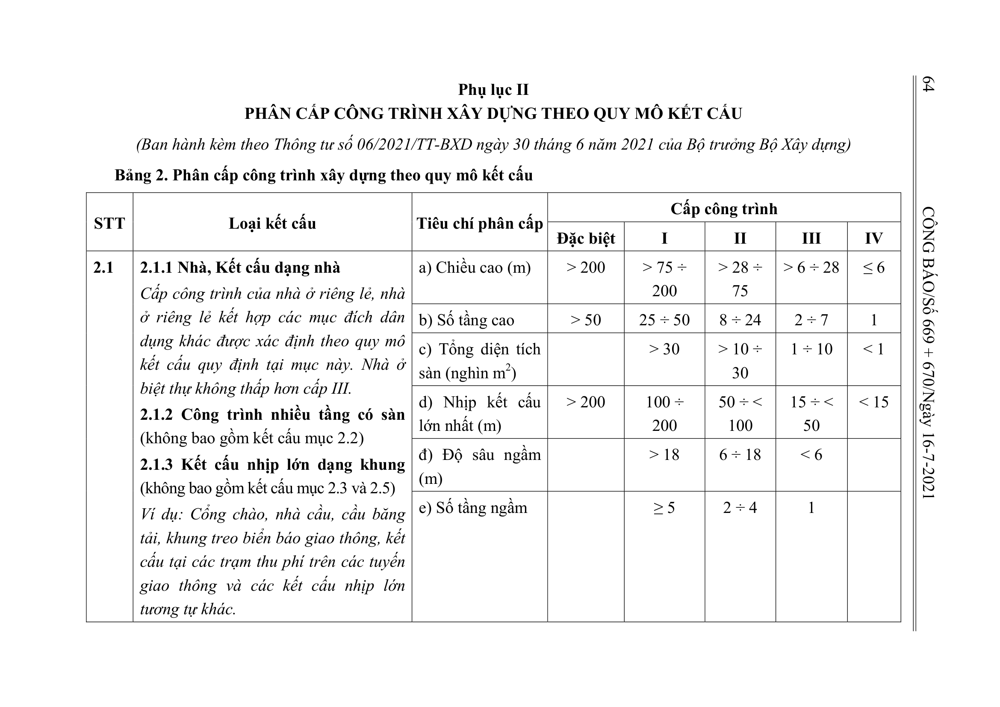
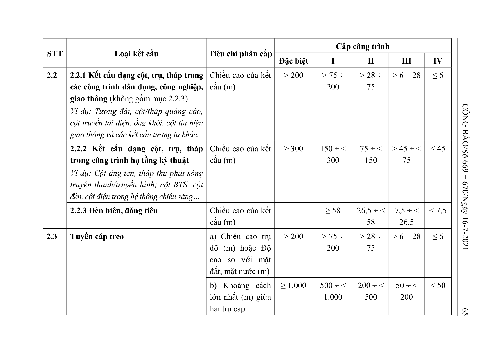
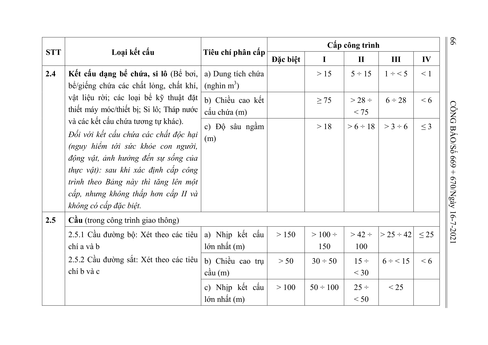
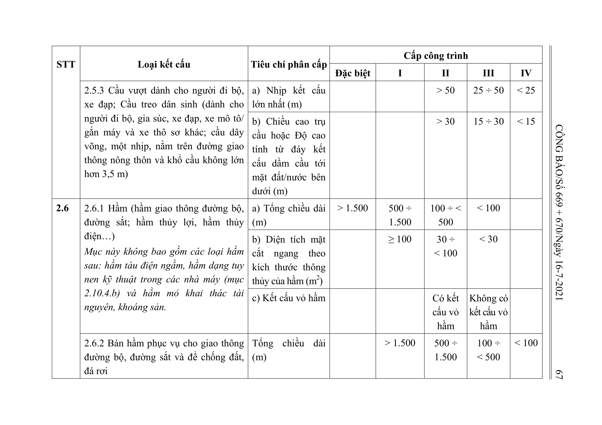
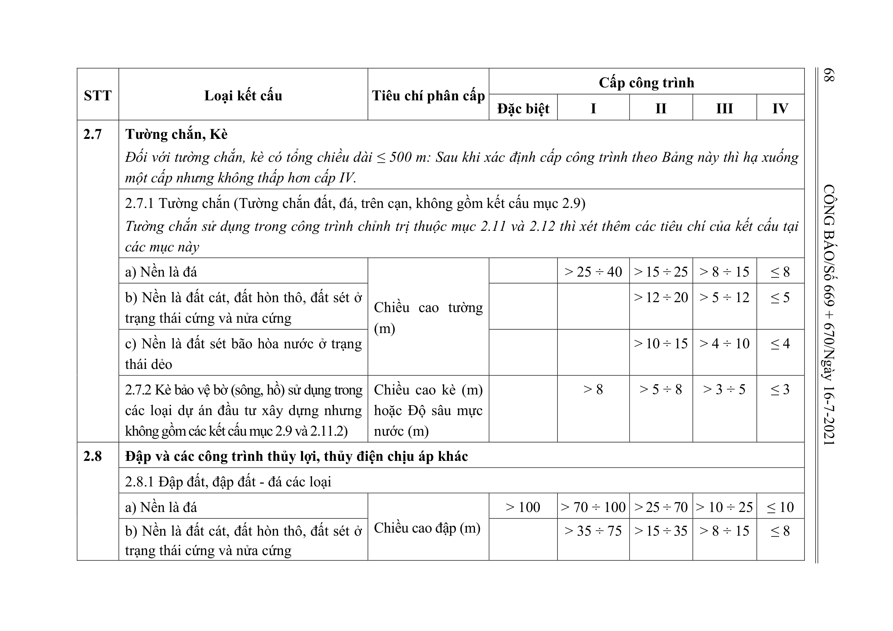
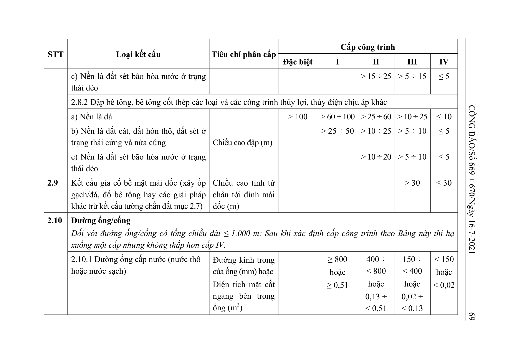
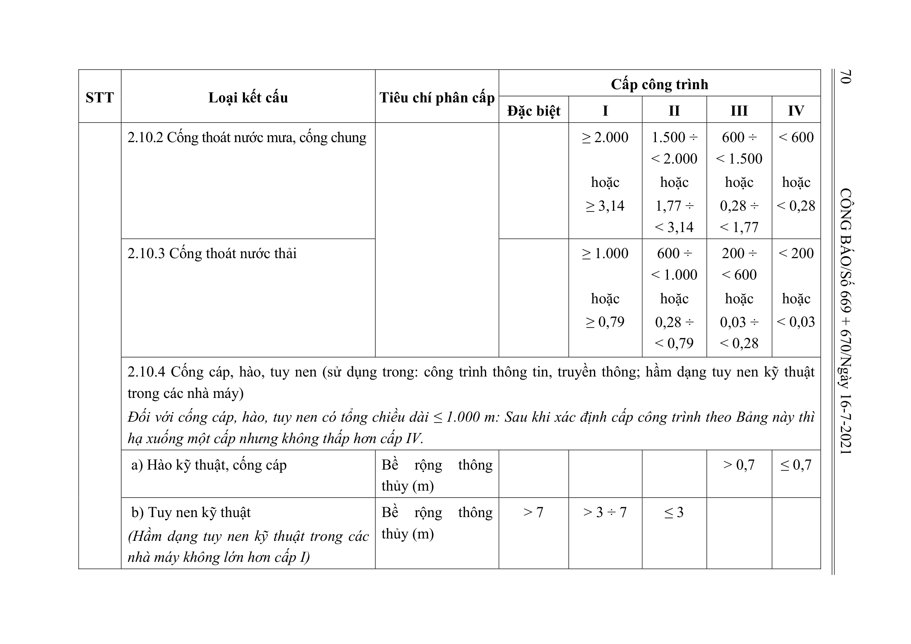
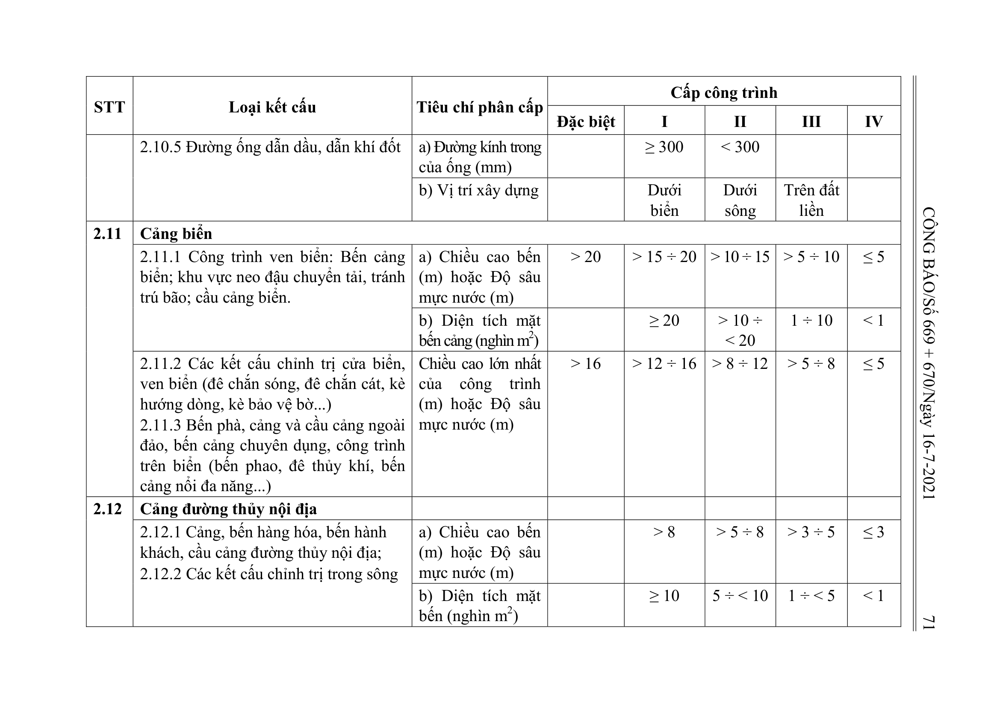

## Bảng 2: Phân cấp công trình xây dựng theo quy mô kết cấu

## Bảng 2: nhóm 2.1 2.1.1 Nhà, Kết cấu dạng nhà Cấp công trình của nhà ở riêng lẻ, nhà ở riêng lẻ kết hợp các mục đích dân dụng khác được xác định the

| STT | Loại kết cấu | Tiêu chí phân cấp | Đặc biệt | I | II | III | IV |
| --- | --- | --- | --- | --- | --- | --- | --- |
| 2.1 | 2.1.1 Nhà, Kết cấu dạng nhà Cấp công trình của nhà ở riêng lẻ, nhà ở riêng lẻ kết hợp các mục đích dân dụng khác được xác định theo quy mô kết cấu quy định tại mục này. Nhà ở biệt thự không thấp hơn cấp III. 2.1.2 Công trình nhiều tầng có sàn (không bao gồm kết cấu mục 2.2) 2.1.3 Kết cấu nhịp lớn dạng khung (không bao gồm kết cấu mục 2.3 và 2.5) Ví dụ: Cổng chào, nhà cầu, cầu băng tải, khung treo biển báo giao thông, kết cấu tại các trạm thu phí trên các tuyến giao thông và các kết cấu nhịp lớn tương tự khác. | a) Chiều cao (m) | > 200 | > 75 ÷ 200 | > 28 ÷ 75 | > 6 ÷ 28 | ≤ 6 |
|  |  | b) Số tầng cao | > 50 | 25 ÷ 50 | 8 ÷ 24 | 2 ÷ 7 | 1 |
|  |  | c) Tổng diện tích sàn (nghìn m2) |  | > 30 | > 10 ÷ 30 | 1 ÷ 10 | < 1 |
|  |  | d) Nhịp kết cấu lớn nhất (m) | > 200 | 100 ÷ 200 | 50 ÷ < 100 | 15 ÷ < 50 | < 15 |
|  |  | đ) Độ sâu ngầm (m) |  | > 18 | 6 ÷ 18 | < 6 |  |
|  |  | e) Số tầng ngầm |  | ≥ 5 | 2 ÷ 4 | 1 |  |

## Bảng 2: nhóm 2.2 2.2.1 Kết cấu dạng cột, trụ, tháp trong các công trình dân dụng, công nghiệp, giao thông (không gồm mục 2.2.3) Ví dụ: Tượng đài, c

| STT | Loại kết cấu | Tiêu chí phân cấp | Đặc biệt | I | II | III | IV |
| --- | --- | --- | --- | --- | --- | --- | --- |
| 2.2 | 2.2.1 Kết cấu dạng cột, trụ, tháp trong các công trình dân dụng, công nghiệp, giao thông (không gồm mục 2.2.3) Ví dụ: Tượng đài, cột/tháp quảng cáo, cột truyền tải điện, ống khói, cột tín hiệu giao thông và các kết cấu tương tự khác. | Chiều cao của kết cấu (m) | > 200 | > 75 ÷ 200 | > 28 ÷ 75 | > 6 ÷ 28 | ≤ 6 |
|  | 2.2.2 Kết cấu dạng cột, trụ, tháp trong công trình hạ tầng kỹ thuật Ví dụ: Cột ăng ten, tháp thu phát sóng truyền thanh/truyền hình; cột BTS; cột đèn, cột điện trong hệ thống chiếu sáng… | Chiều cao của kết cấu (m) | ≥ 300 | 150 ÷ < 300 | 75 ÷ < 150 | > 45 ÷ < 75 | ≤ 45 |
|  | 2.2.3 Đèn biển, đăng tiêu | Chiều cao của kết cấu (m) |  | ≥ 58 | 26,5 ÷ < 58 | 7,5 ÷ < 26,5 | < 7,5 |

## Bảng 2: nhóm 2.3 Tuyến cáp treo

| STT | Loại kết cấu | Tiêu chí phân cấp | Đặc biệt | I | II | III | IV |
| --- | --- | --- | --- | --- | --- | --- | --- |
| 2.3 | Tuyến cáp treo | a) Chiều cao trụ đỡ (m) hoặc Độ cao so với mặt đất, mặt nước (m) | > 200 | > 75 ÷ 200 | > 28 ÷ 75 | > 6 ÷ 28 | ≤ 6 |
|  |  | b) Khoảng cách lớn nhất (m) giữa hai trụ cáp | ≥ 1.000 | 500 ÷ < 1.000 | 200 ÷ < 500 | 50 ÷ < 200 | < 50 |

## Bảng 2: nhóm 2.4 Kết cấu dạng bể chứa, si lô (Bể bơi, bể/giếng chứa các chất lỏng, chất khí, vật liệu rời; các loại bể kỹ thuật đặt thiết máy móc/t

| STT | Loại kết cấu | Tiêu chí phân cấp | Đặc biệt | I | II | III | IV |
| --- | --- | --- | --- | --- | --- | --- | --- |
| 2.4 | Kết cấu dạng bể chứa, si lô (Bể bơi, bể/giếng chứa các chất lỏng, chất khí, vật liệu rời; các loại bể kỹ thuật đặt thiết máy móc/thiết bị; Si lô; Tháp nước và các kết cấu chứa tương tự khác). Đối với kết cấu chứa các chất độc hại (nguy hiểm tới sức khỏe con người, động vật, ảnh hưởng đến sự sống của thực vật): sau khi xác định cấp công trình theo Bảng này thì tăng lên một cấp, nhưng không thấp hơn cấp II và không có cấp đặc biệt. | a) Dung tích chứa (nghìn m3) |  | > 15 | 5 ÷ 15 | 1 ÷ < 5 | < 1 |
|  |  | b) Chiều cao kết cấu chứa (m) |  | ≥ 75 | > 28 ÷ < 75 | 6 ÷ 28 | < 6 |
|  |  | c) Độ sâu ngầm (m) |  | > 18 | > 6 ÷ 18 | > 3 ÷ 6 | ≤ 3 |

## Bảng 2: nhóm 2.5 Cầu (trong công trình giao thông)

| STT | Loại kết cấu | Tiêu chí phân cấp | Đặc biệt | I | II | III | IV |
| --- | --- | --- | --- | --- | --- | --- | --- |
| 2.5 | Cầu (trong công trình giao thông) |  |  |  |  |  |  |
|  | 2.5.1 Cầu đường bộ: Xét theo các tiêu chí a và b 2.5.2 Cầu đường sắt: Xét theo các tiêu chí b và c | a) Nhịp kết cấu lớn nhất (m) | > 150 | > 100 ÷ 150 | > 42 ÷ 100 | > 25 ÷ 42 | ≤ 25 |
|  |  | b) Chiều cao trụ cầu (m) | > 50 | 30 ÷ 50 | 15 ÷ < 30 | 6 ÷ < 15 | < 6 |
|  |  | c) Nhịp kết cấu lớn nhất (m) | > 100 | 50 ÷ 100 | 25 ÷ < 50 | < 25 |  |
|  | 2.5.3 Cầu vượt dành cho người đi bộ, xe đạp; Cầu treo dân sinh (dành cho người đi bộ, gia súc, xe đạp, xe mô tô/ gắn máy và xe thô sơ khác; cầu dây võng, một nhịp, nằm trên đường giao thông nông thôn và khổ cầu không lớn hơn 3,5 m) | a) Nhịp kết cấu lớn nhất (m) |  |  | > 50 | 25 ÷ 50 | < 25 |
|  |  | b) Chiều cao trụ cầu hoặc Độ cao tính từ đáy kết cấu dầm cầu tới mặt đất/nước bên dưới (m) |  |  | > 30 | 15 ÷ 30 | < 15 |

## Bảng 2: nhóm 2.6 2.6.1 Hầm (hầm giao thông đường bộ, đường sắt; hầm thủy lợi, hầm thủy điện…) Mục này không bao gồm các loại hầm sau: hầm tàu điện 

| STT | Loại kết cấu | Tiêu chí phân cấp | Đặc biệt | I | II | III | IV |
| --- | --- | --- | --- | --- | --- | --- | --- |
| 2.6 | 2.6.1 Hầm (hầm giao thông đường bộ, đường sắt; hầm thủy lợi, hầm thủy điện…) Mục này không bao gồm các loại hầm sau: hầm tàu điện ngầm, hầm dạng tuy nen kỹ thuật trong các nhà máy (mục 2.10.4.b) và hầm mỏ khai thác tài nguyên, khoáng sản. | a) Tổng chiều dài (m) | > 1.500 | 500 ÷ 1.500 | 100 ÷ < 500 | < 100 |  |
|  |  | b) Diện tích mặt cắt ngang theo kích thước thông thủy của hầm (m2) |  | ≥ 100 | 30 ÷ < 100 | < 30 |  |
|  |  | c) Kết cấu vỏ hầm |  |  | Có kết cấu vỏ hầm | Không có kết cấu vỏ hầm |  |
|  | 2.6.2 Bán hầm phục vụ cho giao thông đường bộ, đường sắt và để chống đất, đá rơi | Tổng chiều dài (m) |  | > 1.500 | 500 ÷ 1.500 | 100 ÷ < 500 | < 100 |

## Bảng 2: nhóm 2.7 Tường chắn, Kè Đối với tường chắn, kè có tổng chiều dài ≤ 500 m: Sau khi xác định cấp công trình theo Bảng này thì hạ xuống một cấ

| STT | Loại kết cấu | Tiêu chí phân cấp | Đặc biệt | I | II | III | IV |
| --- | --- | --- | --- | --- | --- | --- | --- |
| 2.7 | Tường chắn, Kè Đối với tường chắn, kè có tổng chiều dài ≤ 500 m: Sau khi xác định cấp công trình theo Bảng này thì hạ xuống một cấp nhưng không thấp hơn cấp IV. |  |  |  |  |  |  |
|  | 2.7.1 Tường chắn (Tường chắn đất, đá, trên cạn, không gồm kết cấu mục 2.9) Tường chắn sử dụng trong công trình chỉnh trị thuộc mục 2.11 và 2.12 thì xét thêm các tiêu chí của kết cấu tại các mục này |  |  |  |  |  |  |
|  | a) Nền là đá | Chiều cao tường (m) |  | > 25 ÷ 40 | > 15 ÷ 25 | > 8 ÷ 15 | ≤ 8 |
|  | b) Nền là đất cát, đất hòn thô, đất sét ở trạng thái cứng và nửa cứng |  |  |  | > 12 ÷ 20 | > 5 ÷ 12 | ≤ 5 |
|  | c) Nền là đất sét bão hòa nước ở trạng thái dẻo |  |  |  | > 10 ÷ 15 | > 4 ÷ 10 | ≤ 4 |
|  | 2.7.2 Kè bảo vệ bờ (sông, hồ) sử dụng trong các loại dự án đầu tư xây dựng nhưng không gồm các kết cấu mục 2.9 và 2.11.2) | Chiều cao kè (m) hoặc Độ sâu mực nước (m) |  | > 8 | > 5 ÷ 8 | > 3 ÷ 5 | ≤ 3 |

## Bảng 2: nhóm 2.8 Đập và các công trình thủy lợi, thủy điện chịu áp khác

| STT | Loại kết cấu | Tiêu chí phân cấp | Đặc biệt | I | II | III | IV |
| --- | --- | --- | --- | --- | --- | --- | --- |
| 2.8 | Đập và các công trình thủy lợi, thủy điện chịu áp khác |  |  |  |  |  |  |
|  | 2.8.1 Đập đất, đập đất - đá các loại |  |  |  |  |  |  |
|  | a) Nền là đá | Chiều cao đập (m) | > 100 | > 70 ÷ 100 | > 25 ÷ 70 | > 10 ÷ 25 | ≤ 10 |
|  | b) Nền là đất cát, đất hòn thô, đất sét ở trạng thái cứng và nửa cứng |  |  | > 35 ÷ 75 | > 15 ÷ 35 | > 8 ÷ 15 | ≤ 8 |
|  | c) Nền là đất sét bão hòa nước ở trạng thái dẻo |  |  |  | > 15 ÷ 25 | > 5 ÷ 15 | ≤ 5 |
|  | 2.8.2 Đập bê tông, bê tông cốt thép các loại và các công trình thủy lợi, thủy điện chịu áp khác |  |  |  |  |  |  |
|  | a) Nền là đá | Chiều cao đập (m) | > 100 | > 60 ÷ 100 | > 25 ÷ 60 | > 10 ÷ 25 | ≤ 10 |
|  | b) Nền là đất cát, đất hòn thô, đất sét ở trạng thái cứng và nửa cứng |  |  | > 25 ÷ 50 | > 10 ÷ 25 | > 5 ÷ 10 | ≤ 5 |
|  | c) Nền là đất sét bão hòa nước ở trạng thái dẻo |  |  |  | > 10 ÷ 20 | > 5 ÷ 10 | ≤ 5 |

## Bảng 2: nhóm 2.9 Kết cấu gia cố bề mặt mái dốc (xây ốp gạch/đá, đổ bê tông hay các giải pháp khác trừ kết cấu tường chắn đất mục 2.7)

| STT | Loại kết cấu | Tiêu chí phân cấp | Đặc biệt | I | II | III | IV |
| --- | --- | --- | --- | --- | --- | --- | --- |
| 2.9 | Kết cấu gia cố bề mặt mái dốc (xây ốp gạch/đá, đổ bê tông hay các giải pháp khác trừ kết cấu tường chắn đất mục 2.7) | Chiều cao tính từ chân tới đỉnh mái dốc (m) |  |  |  | > 30 | ≤ 30 |

## Bảng 2: nhóm 2.10 Đường ống/cống Đối với đường ống/cống có tổng chiều dài ≤ 1.000 m: Sau khi xác định cấp công trình theo Bảng này thì hạ xuống một

| STT | Loại kết cấu | Tiêu chí phân cấp | Đặc biệt | I | II | III | IV |
| --- | --- | --- | --- | --- | --- | --- | --- |
| 2.10 | Đường ống/cống Đối với đường ống/cống có tổng chiều dài ≤ 1.000 m: Sau khi xác định cấp công trình theo Bảng này thì hạ xuống một cấp nhưng không thấp hơn cấp IV. |  |  |  |  |  |  |
|  | 2.10.1 Đường ống cấp nước (nước thô hoặc nước sạch) | Đường kính trong của ống (mm) hoặc Diện tích mặt cắt ngang bên trong ống (m2) |  | ≥ 800 hoặc ≥ 0,51 | 400 ÷ < 800 hoặc 0,13 ÷ < 0,51 | 150 ÷ < 400 hoặc 0,02 ÷ < 0,13 | < 150 hoặc < 0,02 |
|  | 2.10.2 Cống thoát nước mưa, cống chung |  |  | ≥ 2.000 hoặc ≥ 3,14 | 1.500 ÷ < 2.000 hoặc 1,77 ÷ < 3,14 | 600 ÷ < 1.500 hoặc 0,28 ÷ < 1,77 | < 600 hoặc < 0,28 |
|  | 2.10.3 Cống thoát nước thải |  |  | ≥ 1.000 hoặc ≥ 0,79 | 600 ÷ < 1.000 hoặc 0,28 ÷ < 0,79 | 200 ÷ < 600 hoặc 0,03 ÷ < 0,28 | < 200 hoặc < 0,03 |
|  | 2.10.4 Cống cáp, hào, tuy nen (sử dụng trong: công trình thông tin, truyền thông; hầm dạng tuy nen kỹ thuật trong các nhà máy) Đối với cống cáp, hào, tuy nen có tổng chiều dài ≤ 1.000 m: Sau khi xác định cấp công trình theo Bảng này thì hạ xuống một cấp nhưng không thấp hơn cấp IV. |  |  |  |  |  |  |
|  | a) Hào kỹ thuật, cống cáp | Bề rộng thông thủy (m) |  |  |  | > 0,7 | ≤ 0,7 |
|  | b) Tuy nen kỹ thuật (Hầm dạng tuy nen kỹ thuật trong các nhà máy không lớn hơn cấp I) | Bề rộng thông thủy (m) | > 7 | > 3 ÷ 7 | ≤ 3 |  |  |
|  | 2.10.5 Đường ống dẫn dầu, dẫn khí đốt | a) Đường kính trong của ống (mm) |  | ≥ 300 | < 300 |  |  |
|  |  | b) Vị trí xây dựng |  | Dưới biển | Dưới sông | Trên đất liền |  |

## Bảng 2: nhóm 2.11 Cảng biển

| STT | Loại kết cấu | Tiêu chí phân cấp | Đặc biệt | I | II | III | IV |
| --- | --- | --- | --- | --- | --- | --- | --- |
| 2.11 | Cảng biển |  |  |  |  |  |  |
|  | 2.11.1 Công trình ven biển: Bến cảng biển; khu vực neo đậu chuyển tải, tránh trú bão; cầu cảng biển. | a) Chiều cao bến (m) hoặc Độ sâu mực nước (m) | > 20 | > 15 ÷ 20 | > 10 ÷ 15 | > 5 ÷ 10 | ≤ 5 |
|  |  | b) Diện tích mặt bến cảng (nghìn m2) |  | ≥ 20 | > 10 ÷ < 20 | 1 ÷ 10 | < 1 |
|  | 2.11.2 Các kết cấu chỉnh trị cửa biển, ven biển (đê chắn sóng, đê chắn cát, kè hướng dòng, kè bảo vệ bờ...) 2.11.3 Bến phà, cảng và cầu cảng ngoài đảo, bến cảng chuyên dụng, công trình trên biển (bến phao, đê thủy khí, bến cảng nổi đa năng...) | Chiều cao lớn nhất của công trình (m) hoặc Độ sâu mực nước (m) | > 16 | > 12 ÷ 16 | > 8 ÷ 12 | > 5 ÷ 8 | ≤ 5 |

## Bảng 2: nhóm 2.12 Cảng đường thủy nội địa

| STT | Loại kết cấu | Tiêu chí phân cấp | Đặc biệt | I | II | III | IV |
| --- | --- | --- | --- | --- | --- | --- | --- |
| 2.12 | Cảng đường thủy nội địa |  |  |  |  |  |  |
|  | 2.12.1 Cảng, bến hàng hóa, bến hành khách, cầu cảng đường thủy nội địa; 2.12.2 Các kết cấu chỉnh trị trong sông | a) Chiều cao bến (m) hoặc Độ sâu mực nước (m) |  | > 8 | > 5 ÷ 8 | > 3 ÷ 5 | ≤ 3 |
|  |  | b) Diện tích mặt bến (nghìn m2) |  | ≥ 10 | 5 ÷ < 10 | 1 ÷ < 5 | < 1 |

## Bảng 2: nhóm 2.13 Âu tàu

| STT | Loại kết cấu | Tiêu chí phân cấp | Đặc biệt | I | II | III | IV |
| --- | --- | --- | --- | --- | --- | --- | --- |
| 2.13 | Âu tàu | Độ sâu mực nước (m) | > 20 | > 15 ÷ 20 | > 10 ÷ 15 | > 5 ÷ 10 | ≤ 5 |

## Bảng 2: nhóm 2.14 Kết cấu quy mô nhỏ, lẻ khác

| STT | Loại kết cấu | Tiêu chí phân cấp | Đặc biệt | I | II | III | IV |
| --- | --- | --- | --- | --- | --- | --- | --- |
| 2.14 | Kết cấu quy mô nhỏ, lẻ khác |  |  |  |  |  |  |
|  | 2.14.1 Phục vụ cho lắp đặt các trò chơi mạo hiểm có ảnh hưởng đến an toàn cộng đồng (tàu lượn, tháp, trụ thép, máng trượt nước, kết cấu thép đỡ thiết bị trò chơi,...) | Tổng chiều cao bao gồm công trình và phần thiết bị công nghệ gắn vào công trình (m) |  |  | > 15 | ≤ 15 |  |
|  | 2.14.2 Hàng rào, tường rào; Lan can can bảo vệ và kết cấu tương tự khác | Chiều cao (m) |  |  |  | > 6 | ≤ 6 |
|  | 2.14.3 Khối xây gạch/đá/bê tông hay tấm bê tông để làm các kết cấu nhỏ lẻ như bồn hoa, bia, mộ, mốc quan trắc (trên đất liền)… và các kết cấu có quy mô nhỏ, lẻ khác: cấp IV. |  |  |  |  |  |  |

b) Cao độ mặt đất hoặc cao độ mặt đất đặt công trình: Cao độ lấy theo quy hoạch được duyệt (tại những khu vực chưa có quy hoạch, lấy theo cao độ thiết kế hoặc cao độ mặt đất hiện trạng với công trình hiện hữu).
c) Tầng trên mặt đất: Tầng mà cao độ mặt sàn của nó cao hơn hoặc bằng cao độ mặt đất đặt công trình.
d) Tầng hầm (hoặc tầng ngầm): Tầng mà hơn một nửa chiều cao của nó nằm dưới cao độ mặt đất đặt công trình.
đ) Tầng nửa/bán hầm (hoặc tầng nửa/bán ngầm): Tầng mà một nửa chiều cao của nó nằm trên hoặc bằng cao độ mặt đất đặt công trình.
e) Tầng lửng: Tầng trung gian giữa các tầng mà sàn của nó (sàn lửng) nằm giữa sàn của hai tầng có công năng sử dụng chính hoặc nằm giữa mái công trình và sàn tầng có công năng sử dụng chính ngay bên dưới; tầng lửng có diện tích sàn nhỏ hơn diện tích sàn xây dựng tầng có công năng sử dụng chính ngay bên dưới.
g) Tầng áp mái: Tầng nằm bên trong không gian của mái dốc mà toàn bộ hoặc một phần mặt đứng của nó được tạo bởi bề mặt mái nghiêng hoặc mái gấp, trong đó tường đứng (nếu có) không cao quá mặt sàn 1,5 m.
h) Tầng tum hoặc tầng mái tum: Tầng trên cùng của tòa nhà sử dụng cho các mục đích bao che lồng cầu thang, giếng thang máy, các thiết bị công trình (nếu có) và phục vụ mục đích lên sàn mái và cứu nạn cứu hộ.
i) Tầng kỹ thuật: Tầng sử dụng để bố trí các thiết bị kỹ thuật của tòa nhà (có thể kết hợp bố trí gian lánh nạn trong tầng kỹ thuật).
k) Độ sâu ngầm: Chiều sâu tính từ cốt mặt đất đặt công trình tới mặt trên của sàn tầng hầm sâu nhất.
l) Nhịp kết cấu lớn nhất của nhà/công trình: Khoảng cách lớn nhất giữa tim của các trụ (cột, tường) liền kề, được dùng để đỡ kết cấu nằm ngang (dầm, sàn không dầm, giàn mái, giàn cầu, cáp treo…). Riêng đối với kết cấu công xôn, lấy giá trị nhịp bằng 50% giá trị quy định trong Bảng 2.
m) Tổng diện tích sàn của nhà/công trình: Tổng diện tích sàn của tất cả các tầng, bao gồm cả các tầng hầm, tầng nửa hầm, tầng lửng, tầng kỹ thuật, tầng áp mái và tầng tum. Diện tích sàn của một tầng là diện tích sàn xây dựng của tầng đó, gồm cả tường bao (hoặc phần tường chung thuộc về nhà) và diện tích mặt bằng của lôgia, ban công, cầu thang, giếng thang máy, hộp kỹ thuật, ống khói.

3. Cách xác định Chiều cao của công trình/kết cấu:
a) Đối với công trình/kết cấu thuộc mục 2.1: Chiều cao được tính từ cao độ mặt đất đặt công trình tới điểm cao nhất của công trình (kể cả tầng tum hoặc mái dốc). Đối với công trình/kết cấu đặt trên mặt đất có các cao độ mặt đất khác nhau thì chiều cao tính từ cao độ mặt đất thấp nhất. Nếu trên đỉnh công trình có các thiết bị kỹ thuật như cột ăng ten, cột thu sét, thiết bị sử dụng năng lượng mặt trời, bể nước kim loại,… thì chiều cao của các thiết bị này không tính vào chiều cao công trình.
b) Đối với kết cấu thuộc mục 2.2: Chiều cao của kết cấu được tính từ cao độ mặt đất tới điểm cao nhất của công trình. Đối với công trình có cao độ mặt đất khác nhau thì chiều cao tính từ cao độ mặt đất thấp nhất. Chiều cao của kết cấu trong một số trường hợp riêng được quy định như sau: + Đối với kết cấu trụ/tháp/cột đỡ các thiết bị thuộc mục 2.2.1: Chiều cao của kết cấu được tính bằng tổng chiều cao của trụ/tháp/cột đỡ thiết bị và thiết bị đặt trên trụ/tháp/cột đỡ; + Đối với các kết cấu được lắp đặt trên các công trình hiện hữu thuộc mục 2.2.2: Chiều cao của kết cấu được tính từ chân tới đỉnh của kết cấu được lắp đặt (ví dụ: cột BTS chiều dài 12m, đặt trên nóc nhà 3 tầng hiện hữu, chiều cao kết cấu của cột BTS này được tính là 12m).
c) Đối với kết cấu thuộc mục 2.3:
- Chiều cao trụ đỡ: Khoảng cách từ mặt trên của bệ đỡ (móng đỡ) trụ đến đỉnh trụ;
- Độ cao so với mặt đất, mặt nước: Khoảng cách từ cáp treo tới mặt đất hoặc mặt nước (mực nước trung bình năm) bên dưới;
d) Đối với kết cấu chứa thuộc mục 2.4: Chiều cao kết cấu chứa xác định tương tự với mục 2.1
đ) Đối với kết cấu thuộc mục 2.5: Chiều cao trụ cầu là khoảng cách từ mặt trên bệ đỡ trụ (móng đỡ) đến đỉnh trụ;
e) Đối với kết cấu tường chắn, kè thuộc mục 2.7:
- Chiều cao tường: Tính từ mặt nền đất phía thấp hơn đến đỉnh tường chắn;
- Chiều cao kè: Tính bằng tổng của phần kết cấu bên dưới và bên trên mặt nước.

g) Đối với kết cấu đập thuộc mục 2.8:
- Kết cấu đập thuộc mục 2.8.1: Chiều cao đập tính từ mặt nền thấp nhất sau khi dọn móng (không kể phần chiều cao chân khay) đến đỉnh đập;
- Kết cấu đập thuộc mục 2.8.2: Chiều cao đập tính từ đáy chân khay thấp nhất đến đỉnh đập.
h) Đối với kết cấu thuộc mục 2.14.2: Chiều cao tính từ mặt đất tới đỉnh công trình/kết cấu.
4. Cách xác định Số tầng cao của công trình thuộc mục 2.1: Số tầng cao của công trình: Tổng của tất cả các tầng trên mặt đất và tầng nửa/bán hầm nhưng không bao gồm tầng áp mái. Một số trường hợp riêng sau đây, tầng tum và các tầng lửng không tính vào Số tầng cao:
- Tầng tum không tính vào số tầng cao của công trình khi sàn mái tum có diện tích không vượt quá 30% diện tích của sàn mái.
- Tầng lửng không tính vào số tầng cao của công trình trong các trường hợp sau: + Nhà ở riêng lẻ, nhà ở riêng lẻ kết hợp các mục đích dân dụng khác: Tầng lửng có diện tích sàn không vượt quá 65% diện tích sàn xây dựng của tầng có công năng sử dụng chính ngay bên dưới và chỉ cho phép có một tầng lửng không tính vào số tầng cao của nhà. + Nhà chung cư, nhà chung cư hỗn hợp: Duy nhất 01 tầng lửng không tính vào số tầng cao của công trình khi tầng lửng chỉ bố trí sử dụng làm khu kỹ thuật (ví dụ: sàn kỹ thuật đáy bể bơi, sàn đặt máy phát điện, hoặc các thiết bị công trình khác), có diện tích sàn xây dựng không vượt quá 10% diện tích sàn xây dựng của tầng ngay bên dưới và không vượt quá 300m2. + Các công trình khác: Tầng lửng chỉ bố trí sử dụng làm khu kỹ thuật, có diện tích sàn không vượt quá 10% diện tích sàn xây dựng của tầng có công năng sử dụng chính ngay bên dưới.
5. Đối với Kênh thoát nước hở (công trình hạ tầng kỹ thuật): Xác định cấp công trình theo kết cấu gia cố của bờ kênh hoặc mái kênh (chọn loại phù hợp với mục 2.7 hoặc mục 2.9 trong Bảng 2).
6. Tham khảo các ví dụ xác định cấp công trình theo loại và quy mô kết cấu trong Phụ lục III.
