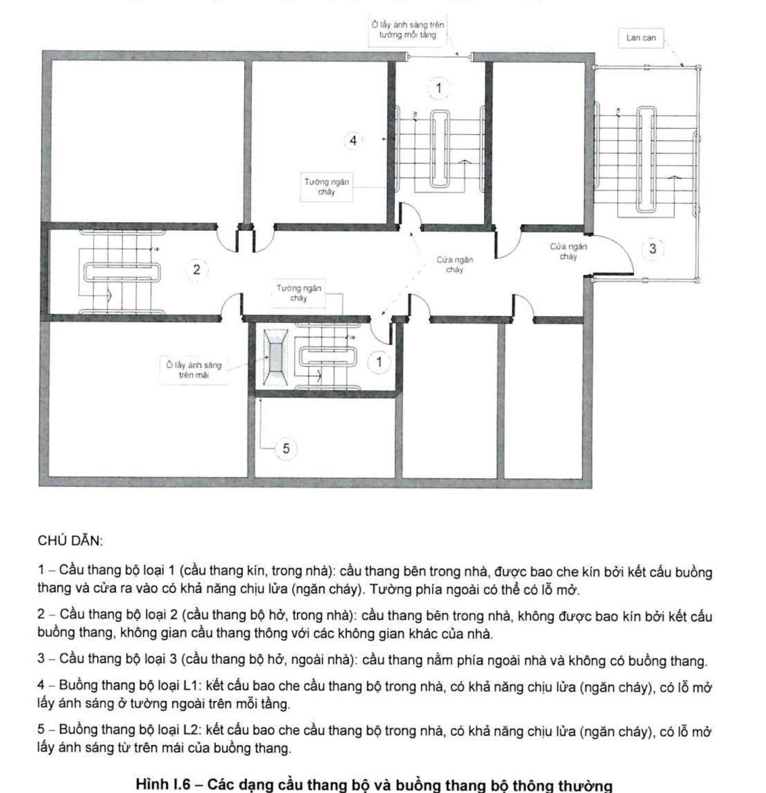

# Phụ lục I — CÁC HÌNH MINH HỌA

*(tham khảo)*

> **CÁCH DÙNG:** Phụ lục này **mang tính tham khảo**, không phải quy định bắt
> buộc. Nó minh họa bằng hình vẽ cho các điều khoản 2.4.2, 3.2.2, 3.2.8 và
> 3.4.10 của phần chính. Khi cần trích dẫn ràng buộc pháp lý thì trích điều
> khoản gốc ở phần chính, còn hình ở đây dùng để hiểu ý đồ của điều khoản đó.
>
> Các hình dưới đây là **ảnh cắt nguyên bản từ văn bản gốc**, không vẽ lại.

## I.1 Ngăn cách lối ra thoát nạn của tầng hầm với lối ra thoát nạn của các tầng xuống khi bố trí chung trong một buồng thang bộ (xem 3.2.2)

![Hình I.1 QCVN 06:2022/BXD — lối ra thoát nạn từ tầng hầm lên được bố trí thoát trực tiếp ra bên ngoài. Gồm a) hình ảnh tổng thể phối cảnh cắt và b) mặt bằng. Hình chỉ rõ: vách ngăn cháy loại 1 ngăn chia phần buồng thang từ tầng hầm 1 lên với phần buồng thang từ các tầng trên xuống; cầu thang bộ từ các tầng trên chỉ xuống đến sàn tầng 1; cầu thang bộ từ tầng hầm 1 chỉ lên đến sàn tầng 1; lối ra thoát nạn của phần buồng thang từ tầng hầm lên dẫn trực tiếp ra bên ngoài; lối ra thoát nạn của phần buồng thang từ các tầng trên ra sảnh tầng 1; mặt sàn tầng 1 là cao trình thoát nạn ra ngoài](hinh/hinh-i-01-loi-ra-thoat-nan-tang-ham-thoat-truc-tiep-ra-ngoai.png)

**Hình I.1 – Lối ra thoát nạn từ tầng hầm lên được bố trí thoát trực tiếp ra bên ngoài**

**Hình I.2 – Lối ra thoát nạn từ tầng hầm lên được bố trí thoát vào sảnh tầng 1 sau đó có lối đi riêng để thoát ra bên ngoài**

## I.2 Bố trí phân tán các lối ra thoát nạn (xem 3.2.8)

**Hình I.3 – Bố trí phân tán các buồng thang bộ thoát nạn**

![Hình I.4 QCVN 06:2022/BXD — nguyên tắc nửa đường chéo mặt bằng khi bố trí phân tán các lối ra thoát nạn. a) Bố trí phân tán lối ra thoát nạn của một gian phòng, một phần nhà hoặc một tầng nhà với khoảng cách giữa hai lối ra L lớn hơn hoặc bằng một nửa đường chéo D. b) Bố trí phân tán lối ra thoát nạn của các gian phòng nằm trong một gian phòng khác, dùng đường chéo d của gian phòng nằm trong. c) Xác định khoảng phân tán của các lối ra thoát nạn trong một số trường hợp mặt bằng phức tạp — mặt bằng lục giác, chữ L, hình thang và mặt bằng bậc. d) Trường hợp toàn nhà được bảo vệ bằng hệ thống sprinkler, có thể giảm khoảng phân tán của lối ra thoát nạn xuống L lớn hơn hoặc bằng một phần ba D](hinh/hinh-i-04-nguyen-tac-nua-duong-cheo-mat-bang.png)

**Hình I.4 – Nguyên tắc nửa đường chéo mặt bằng khi bố trí phân tán các lối ra thoát nạn**

![Hình I.5 QCVN 06:2022/BXD — nguyên tắc bảo đảm khoảng phân tán giữa các lối ra thoát nạn đối với mặt bằng một tầng nhà. a) Nếu khoảng phân tán của lối ra thoát nạn L nhỏ hơn hoặc bằng một nửa đường chéo D và toàn nhà không được bảo vệ bằng hệ thống sprinkler thì không được coi là có 2 lối ra thoát nạn; hình gợi ý vị trí nên bố trí buồng thang bộ thoát nạn ở hai góc xa nhau của mặt bằng. b) Nếu đường thoát nạn là một hành lang được bảo vệ bằng các bộ phận ngăn cháy theo đúng quy định thì khoảng phân tán của các lối ra thoát nạn có thể được đo dọc theo hành lang này; mặt bằng lõi thang máy có tường ngăn cháy bảo vệ hành lang và các cửa ngăn cháy](hinh/hinh-i-05-khoang-phan-tan-giua-cac-loi-ra-thoat-nan-mot-tang-nha.png)

**Hình I.5 – Nguyên tắc bảo đảm khoảng phân tán giữa các lối ra thoát nạn đối với mặt bằng một tầng nhà**

## I.3 Cầu thang và buồng thang bộ trên đường thoát nạn

### I.3.1 Các loại cầu thang và buồng thang bộ thông thường (xem 2.4.2)

**CHÚ DẪN:**

1 – Cầu thang bộ loại 1 (cầu thang kín, trong nhà): cầu thang bên trong nhà, được bao che kín bởi kết cấu buồng thang và cửa ra vào có khả năng chịu lửa (ngăn cháy). Tường phía ngoài có thể có lỗ mở.

2 – Cầu thang bộ loại 2 (cầu thang bộ hở, trong nhà): cầu thang bên trong nhà, không được bao kín bởi kết cấu buồng thang, không gian cầu thang thông với các không gian khác của nhà.

3 – Cầu thang bộ loại 3 (cầu thang bộ hở, ngoài nhà): cầu thang nằm phía ngoài nhà và không có buồng thang.

4 – Buồng thang bộ loại L1: kết cấu bao che cầu thang bộ trong nhà, có khả năng chịu lửa (ngăn cháy), có lỗ mở lấy ánh sáng ở tường ngoài trên mỗi tầng.

5 – Buồng thang bộ loại L2: kết cấu bao che cầu thang bộ trong nhà, có khả năng chịu lửa (ngăn cháy), có lỗ mở lấy ánh sáng từ trên mái của buồng thang.

**Hình I.6 – Các dạng cầu thang bộ và buồng thang bộ thông thường**

### I.3.2 Một số buồng thang bộ không nhiễm khói loại N1

**Nguyên tắc chung:**

1. Nếu *b* < 1,2 m, không quy định khoảng cách *a*
2. Nếu *b* > 1,2 m và < 4,0 m, có thể lấy *a* ≥ *b*
3. Nếu *b* ≥ 4,0 M, lấy *a* ≥ 4,0

Ngoài ra, các yêu cầu sau vẫn phải đảm bảo:

4. *c* ≥ 1,2 m
5. *d* ≥ 2,0 m
6. *e* ≥ 1,2 m

**Hình I.7 – Bố trí buồng thang bộ loại N1 (xem 3.4.10 a))**

![Hình I.8 a và b QCVN 06:2022/BXD — khoảng đệm không nhiễm khói dẫn vào buồng thang bộ loại N1. a) Khoảng đệm không nhiễm khói là một ban công: vào buồng thang đi qua một ban công, ghi kích thước lớn hơn hoặc bằng 1,2 m tại hai vị trí và lớn hơn hoặc bằng 2,0 m tới lan can hoặc tường lửng, có cửa ngăn cháy. b) Khoảng đệm không nhiễm khói là một lôgia: vào buồng thang bộ đi qua khoang đệm không nhiễm khói là lôgia diện tích không nhỏ hơn 4,0 mét vuông, ghi kích thước lớn hơn hoặc bằng 1,2 m, lớn hơn hoặc bằng 1,5 m và lớn hơn hoặc bằng 2,0 m tới lan can hoặc tường lửng](hinh/hinh-i-08a-khoang-dem-khong-nhiem-khoi-ban-cong-va-logia.png)

**Hình I.8 – Khoảng đệm không nhiễm khói dẫn vào buồng thang bộ loại N1**

![Hình I.8 c và d QCVN 06:2022/BXD tiếp theo — c) Khoảng đệm không nhiễm khói là một sảnh chung nằm ở biên của nhà, bảo đảm yêu cầu về thông gió tự nhiên: mặt bằng hai khối căn hộ A và B, thang thoát nạn ở giữa, các cửa ngăn cháy, kích thước lớn hơn hoặc bằng 2,0 m và lớn hơn hoặc bằng 1,5 m, lan can hoặc tường lửng, sảnh thông gió tự nhiên. d) Khoảng đệm không nhiễm khói qua một sảnh chung nằm sâu trong mặt bằng nhưng có không gian đủ rộng để bảo đảm yêu cầu về thông gió tự nhiên: diện tích mặt thoáng lớn hơn hoặc bằng 93 mét vuông, kích thước lớn hơn hoặc bằng 6,0 m, lỗ thông gió của lan can hoặc tường lửng có diện tích không nhỏ hơn 15 % diện tích sảnh ngăn khói, tường ngăn cháy và cửa ngăn cháy](hinh/hinh-i-08b-khoang-dem-khong-nhiem-khoi-sanh-chung-thong-gio-tu-nhien.png)

**Hình I.8 *(tiếp theo)***

![Hình I.8 e và f QCVN 06:2022/BXD tiếp theo — e) Khoảng đệm không nhiễm khói là một sảnh có thông gió tự nhiên với khoang lõm: khoang lõm đứng rộng lớn hơn hoặc bằng 6 m và diện tích mặt thoáng lớn hơn hoặc bằng 93 mét vuông; sảnh ngăn khói thông với khoang lõm có diện tích lớn hơn hoặc bằng 6 mét vuông, kích thước mỗi chiều lớn hơn hoặc bằng 2 m; lỗ thông gió diện tích không nhỏ hơn 15 % diện tích sảnh ngăn khói; tường ngăn cháy và các cửa ngăn cháy. f) Khoảng đệm không nhiễm khói là một sảnh ngăn khói có thông gió tự nhiên qua giếng đứng: giếng thông gió đứng rộng lớn hơn hoặc bằng 6 m, diện tích mặt thoáng lớn hơn hoặc bằng 93 mét vuông, chức năng xem 3.4.10 c)](hinh/hinh-i-08c-khoang-dem-khong-nhiem-khoi-khoang-lom-va-gieng-dung.png)

**Hình I.8 *(tiếp theo)***

![Hình I.8 g, h và i QCVN 06:2022/BXD tiếp theo — g) Khoảng đệm không nhiễm khói là một sảnh chung nằm giữa các khối nhà và bảo đảm điều kiện lưu thông của không khí qua sảnh nhờ những lỗ thông trên hai tường đối diện: mặt bằng bốn căn hộ A, B, C, D hai bên, thang thoát nạn ở giữa, hai luồng thông gió tự nhiên với kích thước lớn hơn hoặc bằng 1,5 m, lan can hoặc tường lửng, các cửa ngăn cháy. h) Khoảng đệm không nhiễm khói đi theo hành lang bên: mặt bằng dãy phòng có hành lang bên mở ra không gian bên ngoài, hai đầu là cầu thang. i) Khoảng đệm không nhiễm khói đi theo hành lang bên: thang thoát nạn ở giữa, hai bên cách không gian trong nhà một khoảng lớn hơn hoặc bằng 1,5 m, cửa ngăn cháy, hành lang bên mở ra không gian bên ngoài](hinh/hinh-i-08d-khoang-dem-khong-nhiem-khoi-sanh-giua-khoi-nha-va-hanh-lang-ben.png)

**Hình I.8 *(tiếp theo)***

**Hình I.8 *(kết thúc)***

### I.3.3 Buồng thang bộ không nhiễm khói loại N2 và N3

![Hình I.9 QCVN 06:2022/BXD — các buồng thang bộ không nhiễm khói loại N2 và N3, hai mặt cắt đặt cạnh nhau. a) Buồng thang bộ không nhiễm khói loại N2: buồng thang có áp suất không khí dương, gió vào từ giếng thông gió thổi trực tiếp vào buồng thang, tường ngăn cháy và cửa ngăn cháy. b) Buồng thang bộ không nhiễm khói loại N3: trong buồng thang không cần có áp suất không khí dương, thay vào đó khoang đệm có áp suất không khí dương với gió vào từ giếng thông gió, bên cạnh là giếng kỹ thuật, tường ngăn cháy và hai cửa ngăn cháy](hinh/hinh-i-09-buong-thang-bo-khong-nhiem-khoi-n2-n3.png)

**Hình I.9 – Các buồng thang bộ không nhiễm khói loại N2 và N3**
