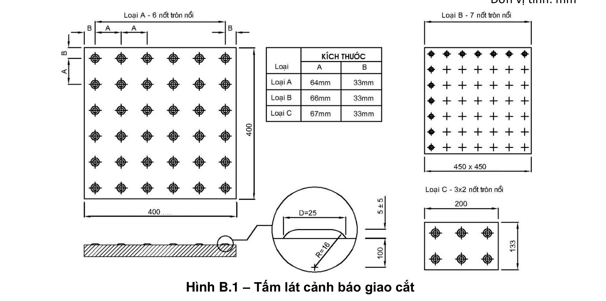
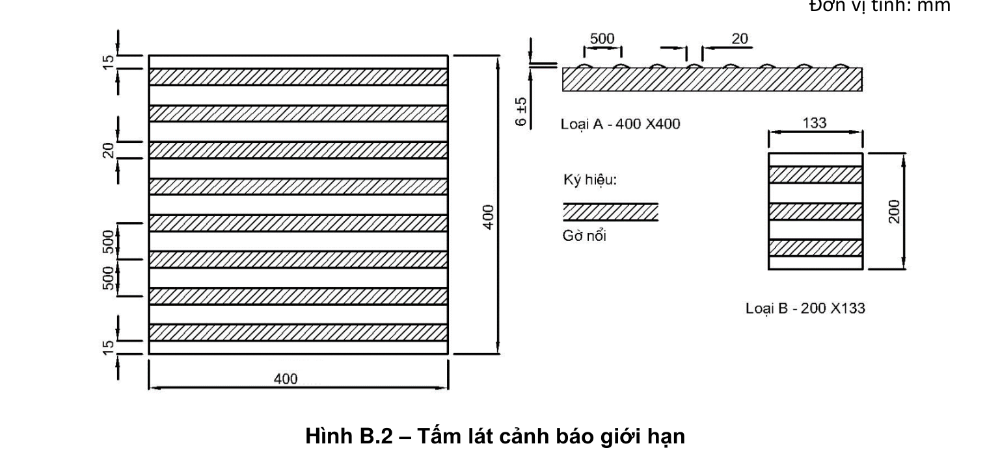
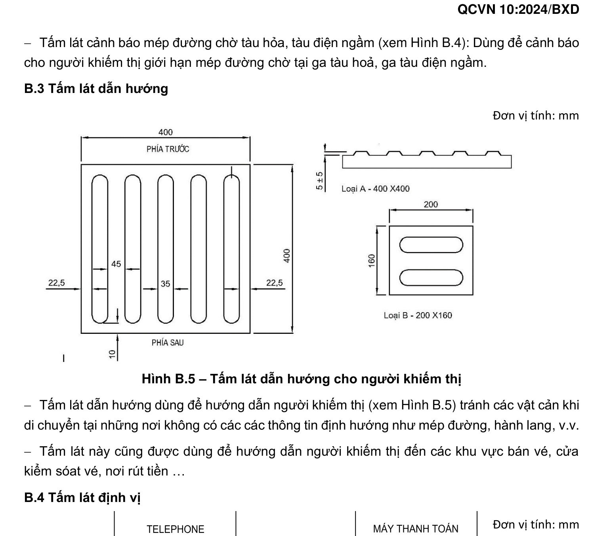
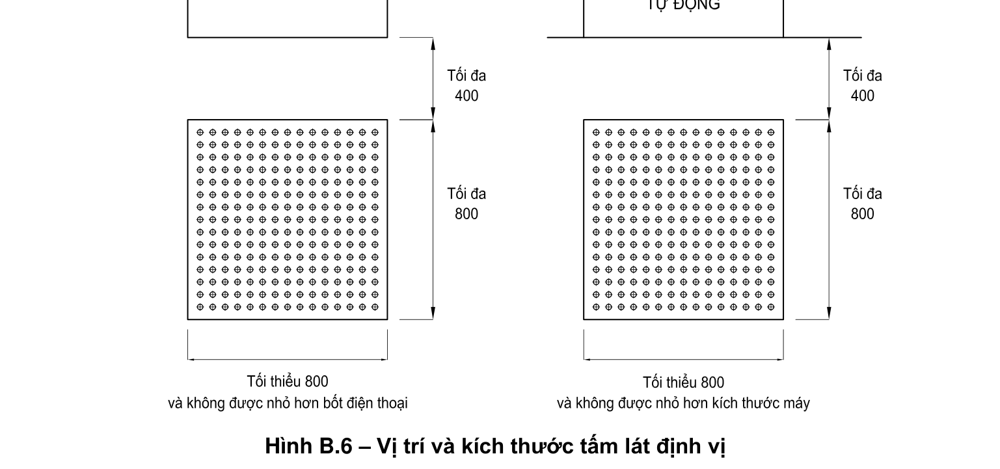

# Phụ lục B — ĐẶC ĐIỂM KỸ THUẬT CỦA CÁC TẤM LÁT NỔI TRỢ GIÚP CHO NGƯỜI KHIẾM THỊ

> Viện dẫn tại mục 2.8.2 QCVN 10:2024/BXD về vị trí lắp đặt bốn loại tấm lát nổi: cảnh báo giao cắt, cảnh báo giới hạn, dẫn hướng và định vị.

## B.1 Tấm lát cảnh báo

**Hình B.1 – Tấm lát cảnh báo giao cắt** — *Đơn vị tính: mm*

- **Tấm lát cảnh báo giao cắt** (xem Hình B.1): Dùng để cảnh báo cho người khiếm thị dừng lại tại nơi giao cắt không có chênh lệch cao độ giữa lối đi bộ và đường dành cho các phương tiện giao thông; tại vị trí đường dốc của lối đi bộ xuống đường dành cho phương tiện giao thông và tại vị trí đường giao thông được nâng cốt lên bằng với lối đi bộ.

**Hình B.2 – Tấm lát cảnh báo giới hạn** — *Đơn vị tính: mm*

- **Tấm lát cảnh báo giới hạn** (xem Hình B.2): Dùng để cảnh báo cho người khiếm thị khi phía trước có các nguy hiểm như: điểm bắt đầu và kết thúc của cầu thang; nơi có sự thay đổi cao độ; nơi lối đi bộ song song với đường dành cho các phương tiện giao thông; vị trí chờ tàu điện nổi trên cao.

## B.2 Tấm lát cảnh báo mép đường chờ tại các bến đỗ

**Hình B.3 – Tấm lát cảnh báo mép đường chờ tàu điện trên phố** — *Đơn vị tính: mm*

- **Tấm lát cảnh báo mép đường chờ tàu điện trên phố** (xem Hình B.3): Dùng để cảnh báo cho người khiếm thị giới hạn mép đường chờ tại ga tàu điện nổi trên phố (ga có đường ray chạy trên đường phố, người đi bộ có thể đi ngang qua hoặc đi dọc đường ray mà không có sự giới hạn, hạn chế hay có hàng rào bảo vệ).

**Hình B.4 – Tấm lát cảnh báo mép đường chờ tàu hỏa, tàu điện ngầm** — *Đơn vị tính: mm*

- **Tấm lát cảnh báo mép đường chờ tàu hỏa, tàu điện ngầm** (xem Hình B.4): Dùng để cảnh báo cho người khiếm thị giới hạn mép đường chờ tại ga tàu hoả, ga tàu điện ngầm.

## B.3 Tấm lát dẫn hướng

**Hình B.5 – Tấm lát dẫn hướng cho người khiếm thị** — *Đơn vị tính: mm*

- Tấm lát dẫn hướng dùng để hướng dẫn người khiếm thị (xem Hình B.5) tránh các vật cản khi di chuyển tại những nơi không có các thông tin định hướng như mép đường, hành lang, v.v.
- Tấm lát này cũng được dùng để hướng dẫn người khiếm thị đến các khu vực bán vé, cửa kiểm soát vé, nơi rút tiền…

## B.4 Tấm lát định vị

**Hình B.6 – Vị trí và kích thước tấm lát định vị** — *Đơn vị tính: mm*

- **Tấm lát định vị** (xem Hình B.6): Dùng để thông báo cho người khiếm thị về vị trí của các tiện nghi phục vụ công cộng: bố trí ở phía trước bốt điện thoại, hòm thư, quầy vé bảng thông tin (bằng chữ nổi hoặc âm thanh), máy thanh toán tự động, máy rút tiền tự động, khu vệ sinh, phòng chờ, quầy vé và trước lối vào các công trình.
- Quy cách bề mặt tấm lát định vị sử dụng gờ nổi như tấm lát cảnh báo giao cắt.
