# Phụ lục A — QUY ĐỊNH VỀ TRANG BỊ HỆ THỐNG BÁO CHÁY TỰ ĐỘNG, THIẾT BỊ BÁO CHÁY ĐỘC LẬP VÀ HỆ THỐNG CHỮA CHÁY TỰ ĐỘNG, THIẾT BỊ CHỮA CHÁY TỰ ĐỘNG KÍCH HOẠT

*(Quy định)*

> **Cách dùng** (theo mục 1.5.9 QCVN 10:2025/BCA): xác định yêu cầu trang bị theo thứ tự —
> **Bảng A.1** cho toàn bộ nhà → **Bảng A.2** cho từng hạng mục/khu vực → **Bảng A.3** cho gian phòng trong nhà → **Bảng A.4** cho thiết bị.
>
> Xem thêm mục 1.5.11 về các khu vực **không** phải trang bị (khu vực quy trình ướt, hồ bơi, phòng tắm, phòng vệ sinh, gian phòng hạng E, hành lang bên, cầu thang bộ, khoang đệm ngăn cháy, khu vực không có nguy hiểm về cháy).

## Bảng A.1 - Đối với nhà

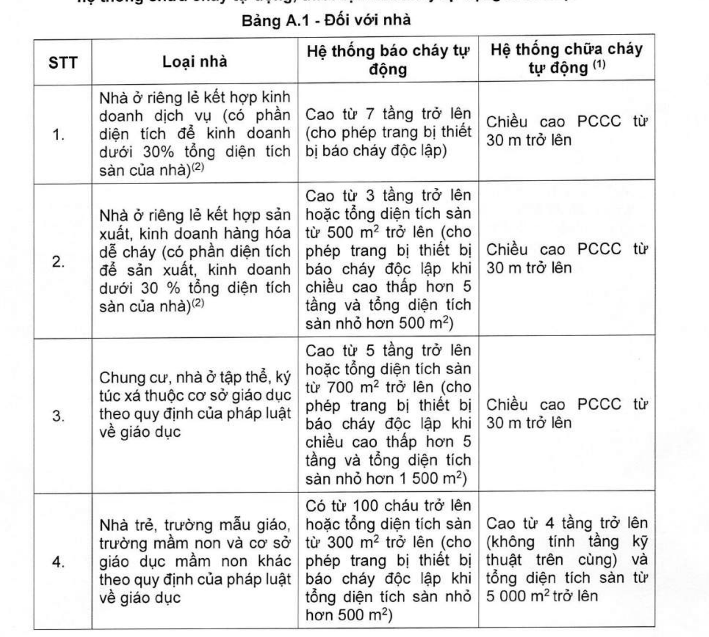
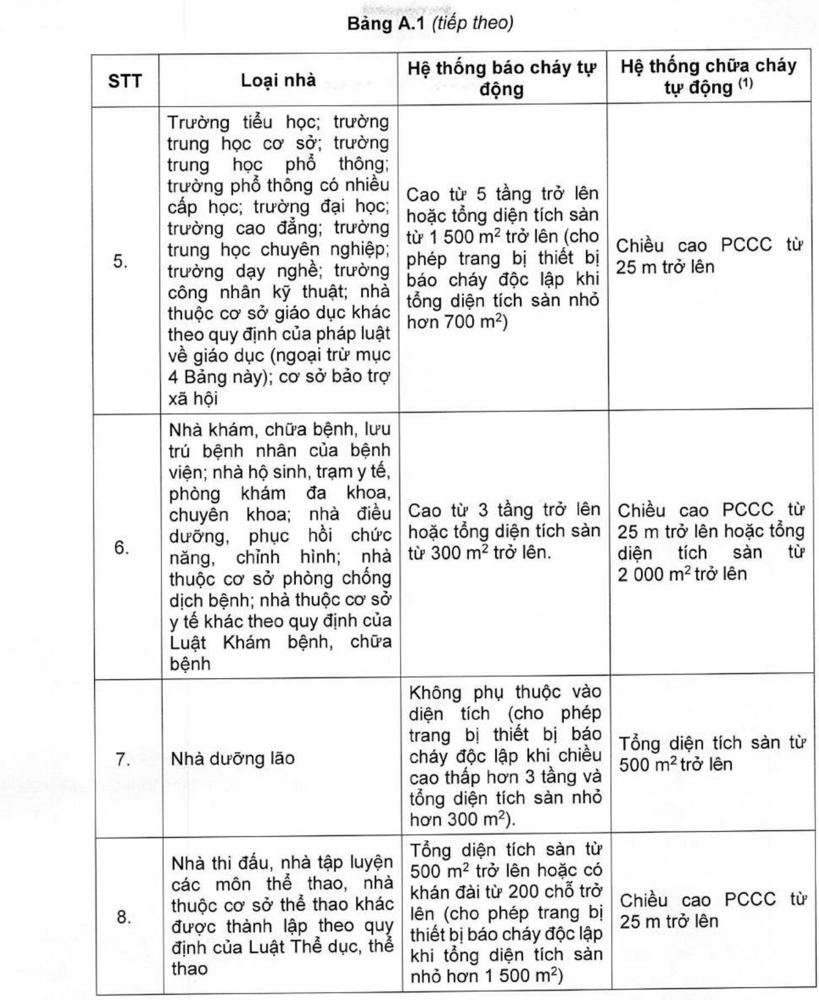
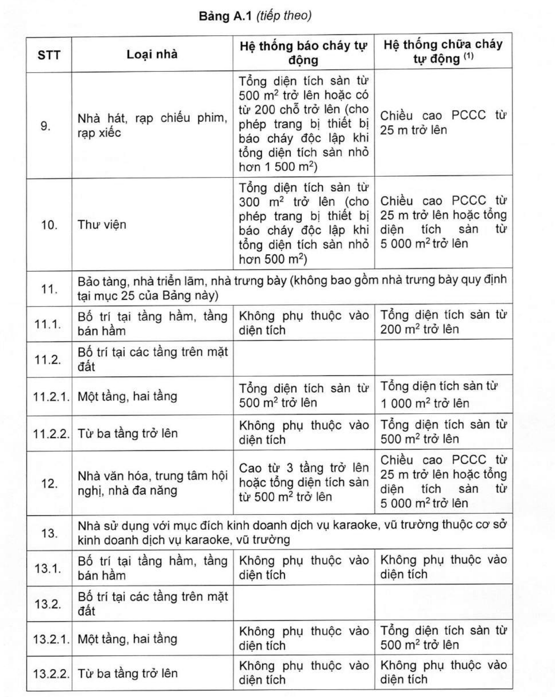
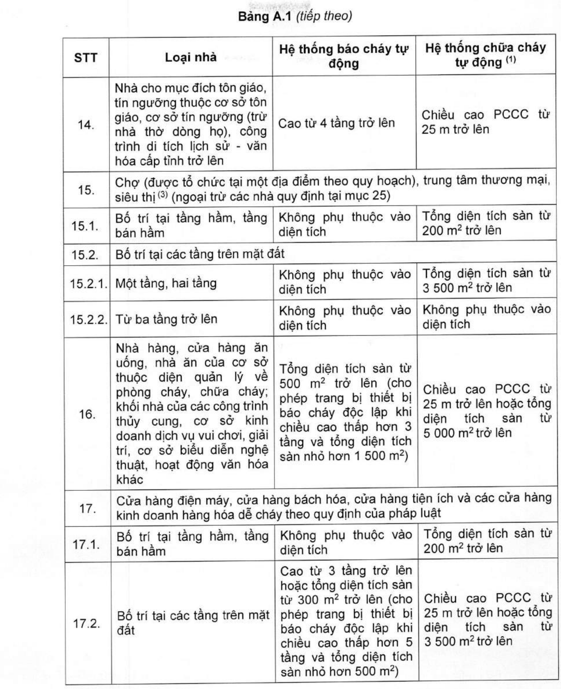
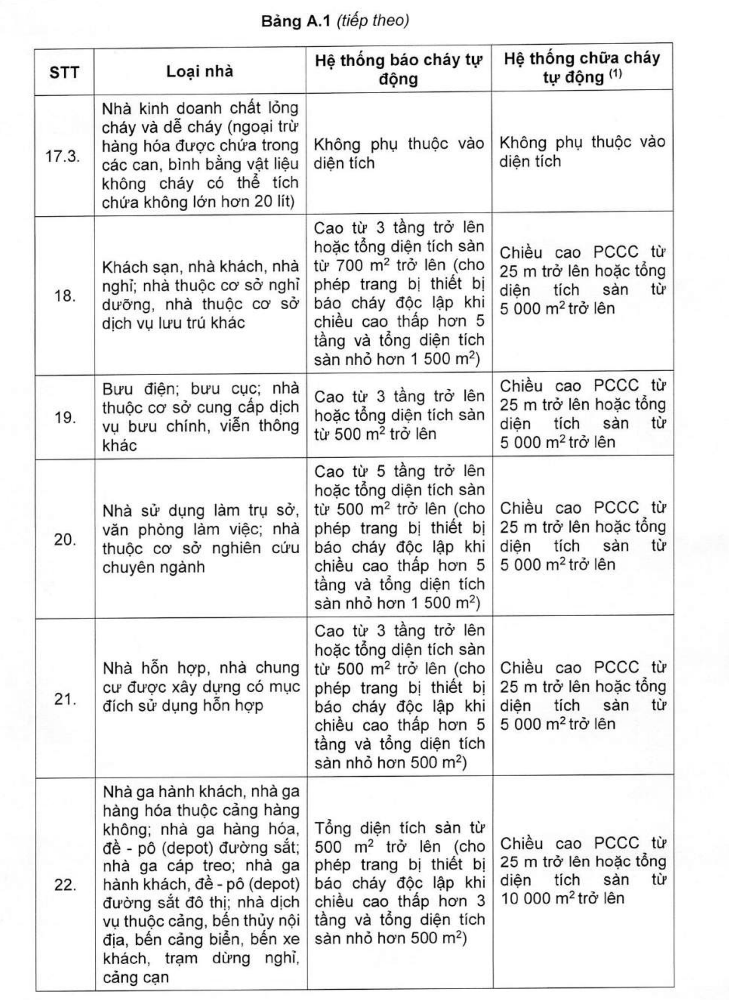
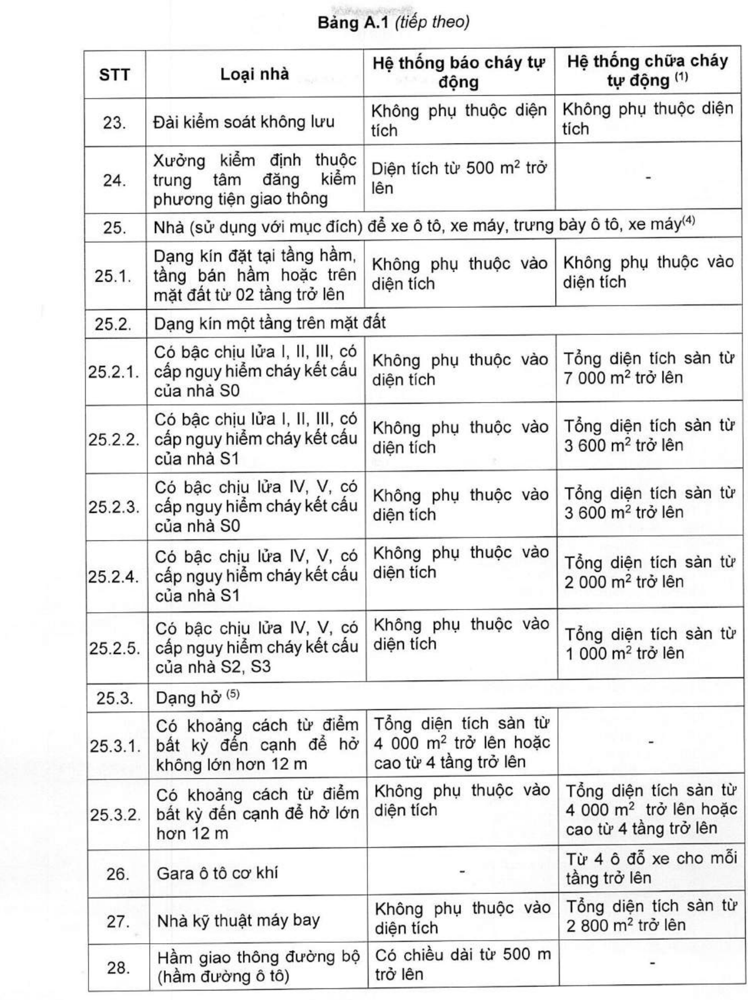
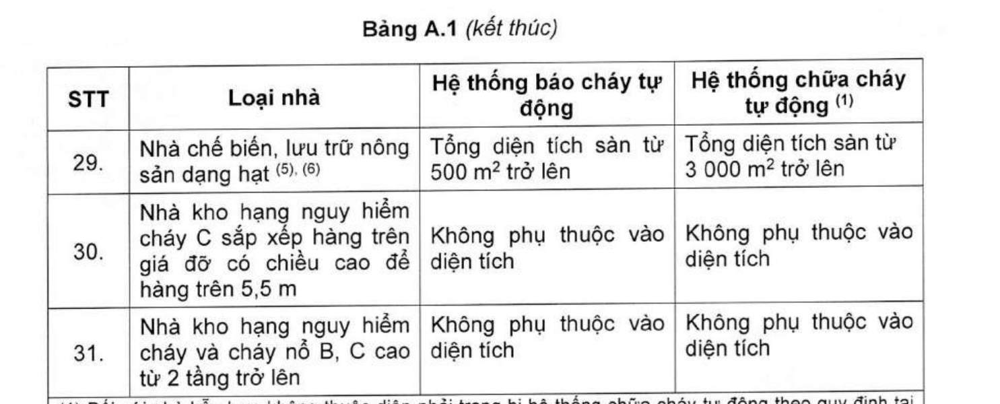
| STT | Loại nhà | Hệ thống báo cháy tự động | Hệ thống chữa cháy tự động ⁽¹⁾ |
|---|---|---|---|
| 1 | Nhà ở riêng lẻ kết hợp kinh doanh dịch vụ (có phần diện tích để kinh doanh dưới 30 % tổng diện tích sàn của nhà) ⁽²⁾ | Cao từ 7 tầng trở lên (cho phép trang bị thiết bị báo cháy độc lập) | Chiều cao PCCC từ 30 m trở lên |
| 2 | Nhà ở riêng lẻ kết hợp sản xuất, kinh doanh hàng hóa dễ cháy (có phần diện tích để sản xuất, kinh doanh dưới 30 % tổng diện tích sàn của nhà) ⁽²⁾ | Cao từ 3 tầng trở lên hoặc tổng diện tích sàn từ 500 m² trở lên (cho phép trang bị thiết bị báo cháy độc lập khi chiều cao thấp hơn 5 tầng và tổng diện tích sàn nhỏ hơn 500 m²) | Chiều cao PCCC từ 30 m trở lên |
| 3 | Chung cư, nhà ở tập thể, ký túc xá thuộc cơ sở giáo dục theo quy định của pháp luật về giáo dục | Cao từ 5 tầng trở lên hoặc tổng diện tích sàn từ 700 m² trở lên (cho phép trang bị thiết bị báo cháy độc lập khi chiều cao thấp hơn 5 tầng và tổng diện tích sàn nhỏ hơn 1 500 m²) | Chiều cao PCCC từ 30 m trở lên |
| 4 | Nhà trẻ, trường mẫu giáo, trường mầm non và cơ sở giáo dục mầm non khác theo quy định của pháp luật về giáo dục | Có từ 100 cháu trở lên hoặc tổng diện tích sàn từ 300 m² trở lên (cho phép trang bị thiết bị báo cháy độc lập khi tổng diện tích sàn nhỏ hơn 500 m²) | Cao từ 4 tầng trở lên (không tính tầng kỹ thuật trên cùng) và tổng diện tích sàn từ 5 000 m² trở lên |
| 5 | Trường tiểu học; trường trung học cơ sở; trường trung học phổ thông; trường phổ thông có nhiều cấp học; trường đại học; trường cao đẳng; trường trung học chuyên nghiệp; trường dạy nghề; trường công nhân kỹ thuật; nhà thuộc cơ sở giáo dục khác theo quy định của pháp luật về giáo dục (ngoại trừ mục 4 Bảng này); cơ sở bảo trợ xã hội | Cao từ 5 tầng trở lên hoặc tổng diện tích sàn từ 1 500 m² trở lên (cho phép trang bị thiết bị báo cháy độc lập khi tổng diện tích sàn nhỏ hơn 700 m²) | Chiều cao PCCC từ 25 m trở lên |
| 6 | Nhà khám, chữa bệnh, lưu trú bệnh nhân của bệnh viện; nhà hộ sinh, trạm y tế, phòng khám đa khoa, chuyên khoa; nhà điều dưỡng, phục hồi chức năng, chỉnh hình; nhà thuộc cơ sở phòng chống dịch bệnh; nhà thuộc cơ sở y tế khác theo quy định của Luật Khám bệnh, chữa bệnh | Cao từ 3 tầng trở lên hoặc tổng diện tích sàn từ 300 m² trở lên | Chiều cao PCCC từ 25 m trở lên hoặc tổng diện tích sàn từ 2 000 m² trở lên |
| 7 | Nhà dưỡng lão | Không phụ thuộc vào diện tích (cho phép trang bị thiết bị báo cháy độc lập khi chiều cao thấp hơn 3 tầng và tổng diện tích sàn nhỏ hơn 300 m²) | Tổng diện tích sàn từ 500 m² trở lên |
| 8 | Nhà thi đấu, nhà tập luyện các môn thể thao, nhà thuộc cơ sở thể thao khác được thành lập theo quy định của Luật Thể dục, thể thao | Tổng diện tích sàn từ 500 m² trở lên hoặc có khán đài từ 200 chỗ trở lên (cho phép trang bị thiết bị báo cháy độc lập khi tổng diện tích sàn nhỏ hơn 1 500 m²) | Chiều cao PCCC từ 25 m trở lên |
| 9 | Nhà hát, rạp chiếu phim, rạp xiếc | Tổng diện tích sàn từ 500 m² trở lên hoặc có từ 200 chỗ trở lên (cho phép trang bị thiết bị báo cháy độc lập khi tổng diện tích sàn nhỏ hơn 1 500 m²) | Chiều cao PCCC từ 25 m trở lên |
| 10 | Thư viện | Tổng diện tích sàn từ 300 m² trở lên (cho phép trang bị thiết bị báo cháy độc lập khi tổng diện tích sàn nhỏ hơn 500 m²) | Chiều cao PCCC từ 25 m trở lên hoặc tổng diện tích sàn từ 5 000 m² trở lên |
| **11** | **Bảo tàng, nhà triển lãm, nhà trưng bày** (không bao gồm nhà trưng bày quy định tại mục 25 của Bảng này) | | |
| 11.1 | Bố trí tại tầng hầm, tầng bán hầm | Không phụ thuộc vào diện tích | Tổng diện tích sàn từ 200 m² trở lên |
| 11.2 | Bố trí tại các tầng trên mặt đất | | |
| 11.2.1 | — Một tầng, hai tầng | Tổng diện tích sàn từ 500 m² trở lên | Tổng diện tích sàn từ 1 000 m² trở lên |
| 11.2.2 | — Từ ba tầng trở lên | Không phụ thuộc vào diện tích | Tổng diện tích sàn từ 500 m² trở lên |
| 12 | Nhà văn hóa, trung tâm hội nghị, nhà đa năng | Cao từ 3 tầng trở lên hoặc tổng diện tích sàn từ 500 m² trở lên | Chiều cao PCCC từ 25 m trở lên hoặc tổng diện tích sàn từ 5 000 m² trở lên |
| **13** | **Nhà sử dụng với mục đích kinh doanh dịch vụ karaoke, vũ trường thuộc cơ sở kinh doanh dịch vụ karaoke, vũ trường** | | |
| 13.1 | Bố trí tại tầng hầm, tầng bán hầm | Không phụ thuộc vào diện tích | Không phụ thuộc vào diện tích |
| 13.2 | Bố trí tại các tầng trên mặt đất | | |
| 13.2.1 | — Một tầng, hai tầng | Không phụ thuộc vào diện tích | Tổng diện tích sàn từ 500 m² trở lên |
| 13.2.2 | — Từ ba tầng trở lên | Không phụ thuộc vào diện tích | Không phụ thuộc vào diện tích |
| 14 | Nhà cho mục đích tôn giáo, tín ngưỡng thuộc cơ sở tôn giáo, cơ sở tín ngưỡng (trừ nhà thờ dòng họ), công trình di tích lịch sử - văn hóa cấp tỉnh trở lên | Cao từ 4 tầng trở lên | Chiều cao PCCC từ 25 m trở lên |
| **15** | **Chợ** (được tổ chức tại một địa điểm theo quy hoạch), **trung tâm thương mại, siêu thị** ⁽³⁾ (ngoại trừ các nhà quy định tại mục 25) | | |
| 15.1 | Bố trí tại tầng hầm, tầng bán hầm | Không phụ thuộc vào diện tích | Tổng diện tích sàn từ 200 m² trở lên |
| 15.2 | Bố trí tại các tầng trên mặt đất | | |
| 15.2.1 | — Một tầng, hai tầng | Không phụ thuộc vào diện tích | Tổng diện tích sàn từ 3 500 m² trở lên |
| 15.2.2 | — Từ ba tầng trở lên | Không phụ thuộc vào diện tích | Không phụ thuộc vào diện tích |
| 16 | Nhà hàng, cửa hàng ăn uống, nhà ăn của cơ sở thuộc diện quản lý về phòng cháy, chữa cháy; khối nhà của các công trình thủy cung, cơ sở kinh doanh dịch vụ vui chơi, giải trí, cơ sở biểu diễn nghệ thuật, hoạt động văn hóa khác | Tổng diện tích sàn từ 500 m² trở lên (cho phép trang bị thiết bị báo cháy độc lập khi chiều cao thấp hơn 3 tầng và tổng diện tích sàn nhỏ hơn 1 500 m²) | Chiều cao PCCC từ 25 m trở lên hoặc tổng diện tích sàn từ 5 000 m² trở lên |
| **17** | **Cửa hàng điện máy, cửa hàng bách hóa, cửa hàng tiện ích và các cửa hàng kinh doanh hàng hóa dễ cháy theo quy định của pháp luật** | | |
| 17.1 | Bố trí tại tầng hầm, tầng bán hầm | Không phụ thuộc vào diện tích | Tổng diện tích sàn từ 200 m² trở lên |
| 17.2 | Bố trí tại các tầng trên mặt đất | Cao từ 3 tầng trở lên hoặc tổng diện tích sàn từ 300 m² trở lên (cho phép trang bị thiết bị báo cháy độc lập khi chiều cao thấp hơn 5 tầng và tổng diện tích sàn nhỏ hơn 500 m²) | Chiều cao PCCC từ 25 m trở lên hoặc tổng diện tích sàn từ 3 500 m² trở lên |
| 17.3 | Nhà kinh doanh chất lỏng cháy và dễ cháy (ngoại trừ hàng hóa được chứa trong các can, bình bằng vật liệu không cháy có thể tích chứa không lớn hơn 20 lít) | Không phụ thuộc vào diện tích | Không phụ thuộc vào diện tích |
| 18 | Khách sạn, nhà khách, nhà nghỉ; nhà thuộc cơ sở nghỉ dưỡng, nhà thuộc cơ sở dịch vụ lưu trú khác | Cao từ 3 tầng trở lên hoặc tổng diện tích sàn từ 700 m² trở lên (cho phép trang bị thiết bị báo cháy độc lập khi chiều cao thấp hơn 5 tầng và tổng diện tích sàn nhỏ hơn 1 500 m²) | Chiều cao PCCC từ 25 m trở lên hoặc tổng diện tích sàn từ 5 000 m² trở lên |
| 19 | Bưu điện; bưu cục; nhà thuộc cơ sở cung cấp dịch vụ bưu chính, viễn thông khác | Cao từ 3 tầng trở lên hoặc tổng diện tích sàn từ 500 m² trở lên | Chiều cao PCCC từ 25 m trở lên hoặc tổng diện tích sàn từ 5 000 m² trở lên |
| 20 | Nhà sử dụng làm trụ sở, văn phòng làm việc; nhà thuộc cơ sở nghiên cứu chuyên ngành | Cao từ 5 tầng trở lên hoặc tổng diện tích sàn từ 500 m² trở lên (cho phép trang bị thiết bị báo cháy độc lập khi chiều cao thấp hơn 5 tầng và tổng diện tích sàn nhỏ hơn 1 500 m²) | Chiều cao PCCC từ 25 m trở lên hoặc tổng diện tích sàn từ 5 000 m² trở lên |
| 21 | Nhà hỗn hợp, nhà chung cư được xây dựng có mục đích sử dụng hỗn hợp | Cao từ 3 tầng trở lên hoặc tổng diện tích sàn từ 500 m² trở lên (cho phép trang bị thiết bị báo cháy độc lập khi chiều cao thấp hơn 5 tầng và tổng diện tích sàn nhỏ hơn 500 m²) | Chiều cao PCCC từ 25 m trở lên hoặc tổng diện tích sàn từ 5 000 m² trở lên |
| 22 | Nhà ga hành khách, nhà ga hàng hóa thuộc cảng hàng không; nhà ga hàng hóa, đề-pô (depot) đường sắt; nhà ga cáp treo; nhà ga hành khách, đề-pô (depot) đường sắt đô thị; nhà dịch vụ thuộc cảng, bến thủy nội địa, bến cảng biển, bến xe khách, trạm dừng nghỉ, cảng cạn | Tổng diện tích sàn từ 500 m² trở lên (cho phép trang bị thiết bị báo cháy độc lập khi chiều cao thấp hơn 3 tầng và tổng diện tích sàn nhỏ hơn 500 m²) | Chiều cao PCCC từ 25 m trở lên hoặc tổng diện tích sàn từ 10 000 m² trở lên |
| 23 | Đài kiểm soát không lưu | Không phụ thuộc diện tích | Không phụ thuộc diện tích |
| 24 | Xưởng kiểm định thuộc trung tâm đăng kiểm phương tiện giao thông | Diện tích từ 500 m² trở lên | – |
| **25** | **Nhà (sử dụng với mục đích) để xe ô tô, xe máy, trưng bày ô tô, xe máy** ⁽⁴⁾ | | |
| 25.1 | Dạng kín đặt tại tầng hầm, tầng bán hầm hoặc trên mặt đất từ 02 tầng trở lên | Không phụ thuộc vào diện tích | Không phụ thuộc vào diện tích |
| 25.2 | Dạng kín một tầng trên mặt đất | | |
| 25.2.1 | — Có bậc chịu lửa I, II, III, có cấp nguy hiểm cháy kết cấu của nhà S0 | Không phụ thuộc vào diện tích | Tổng diện tích sàn từ 7 000 m² trở lên |
| 25.2.2 | — Có bậc chịu lửa I, II, III, có cấp nguy hiểm cháy kết cấu của nhà S1 | Không phụ thuộc vào diện tích | Tổng diện tích sàn từ 3 600 m² trở lên |
| 25.2.3 | — Có bậc chịu lửa IV, V, có cấp nguy hiểm cháy kết cấu của nhà S0 | Không phụ thuộc vào diện tích | Tổng diện tích sàn từ 3 600 m² trở lên |
| 25.2.4 | — Có bậc chịu lửa IV, V, có cấp nguy hiểm cháy kết cấu của nhà S1 | Không phụ thuộc vào diện tích | Tổng diện tích sàn từ 2 000 m² trở lên |
| 25.2.5 | — Có bậc chịu lửa IV, V, có cấp nguy hiểm cháy kết cấu của nhà S2, S3 | Không phụ thuộc vào diện tích | Tổng diện tích sàn từ 1 000 m² trở lên |
| 25.3 | Dạng hở ⁽⁵⁾ | | |
| 25.3.1 | — Có khoảng cách từ điểm bất kỳ đến cạnh để hở không lớn hơn 12 m | Tổng diện tích sàn từ 4 000 m² trở lên hoặc cao từ 4 tầng trở lên | – |
| 25.3.2 | — Có khoảng cách từ điểm bất kỳ đến cạnh để hở lớn hơn 12 m | Không phụ thuộc vào diện tích | Tổng diện tích sàn từ 4 000 m² trở lên hoặc cao từ 4 tầng trở lên |
| 26 | Gara ô tô cơ khí | – | Từ 4 ô đỗ xe cho mỗi tầng trở lên |
| 27 | Nhà kỹ thuật máy bay | Không phụ thuộc vào diện tích | Tổng diện tích sàn từ 2 800 m² trở lên |
| 28 | Hầm giao thông đường bộ (hầm đường ô tô) | Có chiều dài từ 500 m trở lên | – |
| 29 | Nhà chế biến, lưu trữ nông sản dạng hạt ⁽⁵⁾ ⁽⁶⁾ | Tổng diện tích sàn từ 500 m² trở lên | Tổng diện tích sàn từ 3 000 m² trở lên |
| 30 | Nhà kho hạng nguy hiểm cháy C sắp xếp hàng trên giá đỡ có chiều cao để hàng trên 5,5 m | Không phụ thuộc vào diện tích | Không phụ thuộc vào diện tích |
| 31 | Nhà kho hạng nguy hiểm cháy và cháy nổ B, C cao từ 2 tầng trở lên | Không phụ thuộc vào diện tích | Không phụ thuộc vào diện tích |

**Chú thích của Bảng A.1:**

⁽¹⁾ Đối với nhà hỗn hợp không thuộc diện phải trang bị hệ thống chữa cháy tự động theo quy định tại Bảng A.1 nhưng phần công năng bất kỳ của nhà có quy mô thuộc diện phải trang bị hệ thống chữa cháy tự động theo Bảng A.1 thì phải trang bị hệ thống chữa cháy tự động cho phần nhà đó.

Khi bố trí kinh doanh karaoke, vũ trường trong nhà hỗn hợp nhưng phần kinh doanh karaoke, vũ trường của nhà có quy mô thuộc diện phải trang bị hệ thống chữa cháy tự động theo Bảng A.1 hoặc kinh doanh karaoke, vũ trường được bố trí từ tầng 3 trở lên thì phải trang bị hệ thống chữa cháy tự động cho toàn bộ nhà.

Cho phép bố trí trang bị hệ thống chữa cháy tự động đóng gói (Package) thay cho hệ thống chữa cháy tự động trong các công trình quy định tại Phụ lục A TCVN 13926.

⁽²⁾ Cho phép chỉ trang bị hệ thống báo cháy tự động hoặc thiết bị báo cháy độc lập tại khu vực sản xuất, kinh doanh, tuy nhiên tại mỗi tầng của nhà phải có thiết bị cảnh báo âm thanh kết nối liên động với hệ thống báo cháy tự động hoặc thiết bị báo cháy độc lập.

Đối với nhà ở riêng lẻ kết hợp kinh doanh dịch vụ, nhà ở riêng lẻ kết hợp sản xuất, kinh doanh hàng hóa dễ cháy có phần diện tích để sản xuất, kinh doanh từ 30 % đến 70 % tổng diện tích sàn của nhà trở lên thì việc trang bị hệ thống báo cháy tự động, thiết bị báo cháy độc lập và hệ thống chữa cháy tự động như đối với nhà hỗn hợp; trường hợp phần diện tích để sản xuất, kinh doanh trên 70 % tổng diện tích sàn của nhà thì việc trang bị hệ thống báo cháy tự động, thiết bị báo cháy độc lập và hệ thống chữa cháy tự động thực hiện theo công năng sản xuất, kinh doanh.

⁽³⁾ Cho phép không lắp đặt hệ thống chữa cháy tự động tại các khu vực trưng bày xoong nồi, thiết bị, hàng hóa, vật liệu không cháy; khu vực lưu trữ và chế biến để bán thịt, cá, trái cây và rau quả (trong bao bì không cháy).

⁽⁴⁾ Cho phép không bố trí hệ thống chữa cháy tự động trong các nhà để xe ngầm một tầng hầm được xây dựng bên dưới khu đất trống khi sức chứa không quá 25 chỗ.

Trong các nhà để xe ô tô một hoặc hai tầng dạng ngăn (ngăn cách tối thiểu bằng vách ngăn cháy loại 1 có lối ra ngoài trời trực tiếp từ từng ngăn chứa), cho phép không trang bị hệ thống báo cháy tự động và hệ thống chữa cháy tự động, với điều kiện mỗi ngăn không quá 2 xe.

Cho phép không trang bị hệ thống báo cháy tự động, hệ thống chữa cháy tự động đối với nhà lưu giữ, trưng bày xe máy cao không quá 02 tầng và tổng diện tích sàn không quá 1 000 m².

⁽⁵⁾ Nhà dạng hở: nhà không có tường bao che ngoài. Nhà cũng được coi là hở nếu công trình có hai cạnh đối diện dài nhất được để hở. Cạnh được coi là được để hở nếu tổng diện tích sàn phần để hở dọc theo cạnh này chiếm không ít hơn 50 % diện tích mặt ngoài của nó ở trên từng tầng.

⁽⁶⁾ Không yêu cầu trang bị hệ thống báo cháy tự động, hệ thống chữa cháy tự động đối với nhà dạng hở để chế biến, lưu trữ nông sản dạng hạt.

> CHÚ THÍCH 1: Các nhà thuộc mục 6, 10, 12, 16, 20, 21 có bậc chịu lửa IV-V phải trang bị hệ thống báo cháy tự động khi tổng diện tích sàn từ 200 m² trở lên và phải trang bị hệ thống chữa cháy tự động khi tổng diện tích sàn từ 1 200 m² trở lên.
>
> CHÚ THÍCH 2: Nhà điều trị nội trú có tổng diện tích sàn từ 3 000 m² trở lên, nhà khám, chữa bệnh của bệnh viện tâm thần có tổng diện tích sàn từ 3 000 m² trở lên, nhà dưỡng lão khi có tổng diện tích sàn từ 3 000 m² trở lên và các nhà dân dụng có chiều cao PCCC từ 75 m trở lên phải trang bị hệ thống báo cháy địa chỉ khi xây dựng mới.

## Bảng A.2 - Đối với hạng mục/khu vực

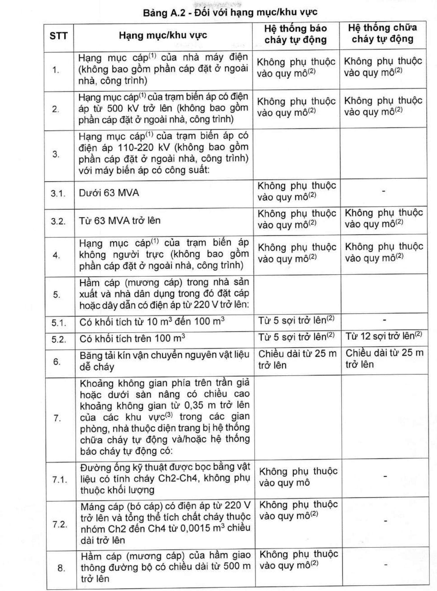
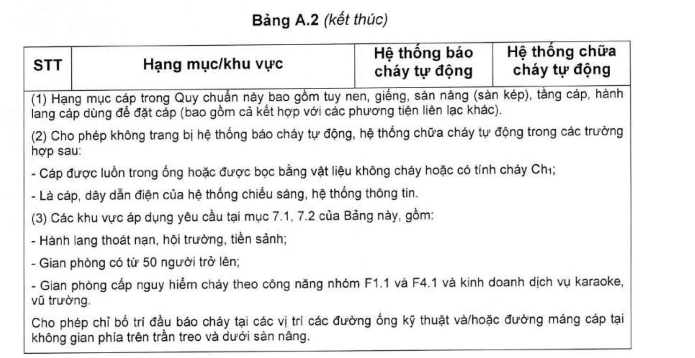
| STT | Hạng mục/khu vực | Hệ thống báo cháy tự động | Hệ thống chữa cháy tự động |
|---|---|---|---|
| 1 | Hạng mục cáp ⁽¹⁾ của nhà máy điện (không bao gồm phần cáp đặt ở ngoài nhà, công trình) | Không phụ thuộc vào quy mô ⁽²⁾ | Không phụ thuộc vào quy mô ⁽²⁾ |
| 2 | Hạng mục cáp ⁽¹⁾ của trạm biến áp có điện áp từ 500 kV trở lên (không bao gồm phần cáp đặt ở ngoài nhà, công trình) | Không phụ thuộc vào quy mô ⁽²⁾ | Không phụ thuộc vào quy mô ⁽²⁾ |
| **3** | **Hạng mục cáp ⁽¹⁾ của trạm biến áp có điện áp 110-220 kV** (không bao gồm phần cáp đặt ở ngoài nhà, công trình) với máy biến áp có công suất: | | |
| 3.1 | — Dưới 63 MVA | Không phụ thuộc vào quy mô ⁽²⁾ | – |
| 3.2 | — Từ 63 MVA trở lên | Không phụ thuộc vào quy mô ⁽²⁾ | Không phụ thuộc vào quy mô ⁽²⁾ |
| 4 | Hạng mục cáp ⁽¹⁾ của trạm biến áp không người trực (không bao gồm phần cáp đặt ở ngoài nhà, công trình) | Không phụ thuộc vào quy mô ⁽²⁾ | Không phụ thuộc vào quy mô ⁽²⁾ |
| **5** | **Hầm cáp (mương cáp) trong nhà sản xuất và nhà dân dụng** trong đó đặt cáp hoặc dây dẫn có điện áp từ 220 V trở lên: | | |
| 5.1 | — Có khối tích từ 10 m³ đến 100 m³ | Từ 5 sợi trở lên ⁽²⁾ | – |
| 5.2 | — Có khối tích trên 100 m³ | Từ 5 sợi trở lên ⁽²⁾ | Từ 12 sợi trở lên ⁽²⁾ |
| 6 | Băng tải kín vận chuyển nguyên vật liệu dễ cháy | Chiều dài từ 25 m trở lên | Chiều dài từ 25 m trở lên |
| **7** | **Khoảng không gian phía trên trần giả hoặc dưới sàn nâng** có chiều cao khoảng không gian từ 0,35 m trở lên của các khu vực ⁽³⁾ trong các gian phòng, nhà thuộc diện trang bị hệ thống chữa cháy tự động và/hoặc hệ thống báo cháy tự động có: | | |
| 7.1 | — Đường ống kỹ thuật được bọc bằng vật liệu có tính cháy Ch2-Ch4, không phụ thuộc khối lượng | Không phụ thuộc vào quy mô | – |
| 7.2 | — Máng cáp (bó cáp) có điện áp từ 220 V trở lên và tổng thể tích chất cháy thuộc nhóm Ch2 đến Ch4 từ 0,0015 m³ chiều dài trở lên | Không phụ thuộc vào quy mô ⁽²⁾ | – |
| 8 | Hầm cáp (mương cáp) của hầm giao thông đường bộ có chiều dài từ 500 m trở lên | Không phụ thuộc vào quy mô ⁽²⁾ | – |

**Chú thích của Bảng A.2:**

⁽¹⁾ Hạng mục cáp trong Quy chuẩn này bao gồm tuy nen, giếng, sàn nâng (sàn kép), tầng cáp, hành lang cáp dùng để đặt cáp (bao gồm cả kết hợp với các phương tiện liên lạc khác).

⁽²⁾ Cho phép không trang bị hệ thống báo cháy tự động, hệ thống chữa cháy tự động trong các trường hợp sau:

- Cáp được luồn trong ống hoặc được bọc bằng vật liệu không cháy hoặc có tính cháy Ch₁;
- Là cáp, dây dẫn điện của hệ thống chiếu sáng, hệ thống thông tin.

⁽³⁾ Các khu vực áp dụng yêu cầu tại mục 7.1, 7.2 của Bảng này, gồm:

- Hành lang thoát nạn, hội trường, tiền sảnh;
- Gian phòng có từ 50 người trở lên;
- Gian phòng cấp nguy hiểm cháy theo công năng nhóm F1.1 và F4.1 và kinh doanh dịch vụ karaoke, vũ trường.

Cho phép chỉ bố trí đầu báo cháy tại các vị trí các đường ống kỹ thuật và/hoặc đường máng cáp tại không gian phía trên trần treo và dưới sàn nâng.

## Bảng A.3 - Đối với gian phòng

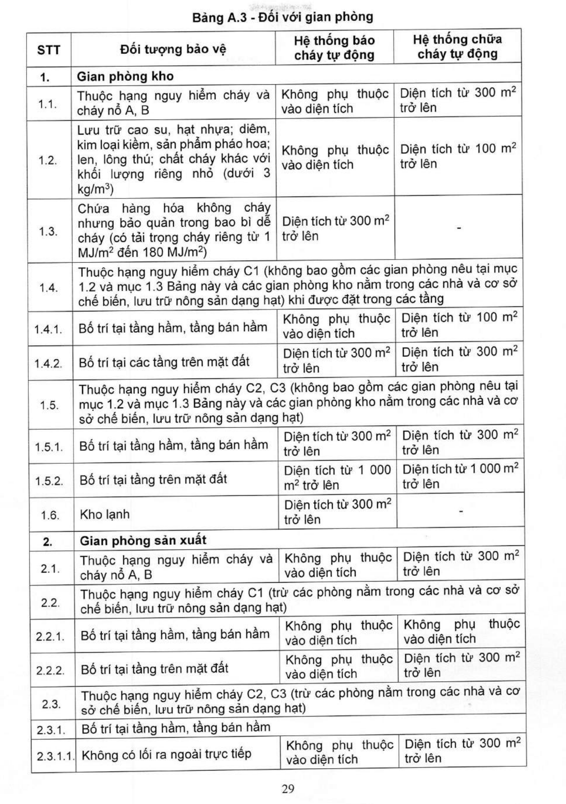
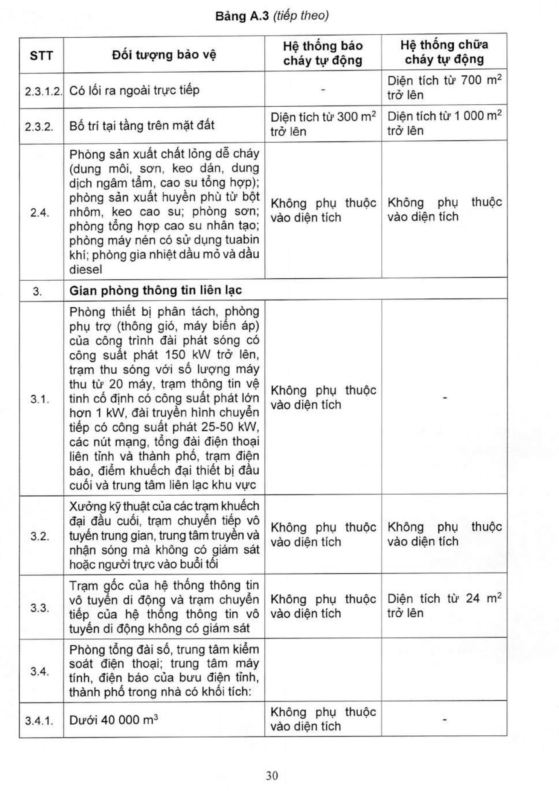
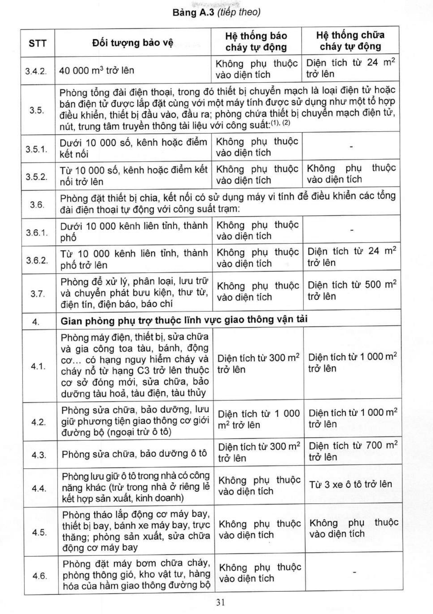
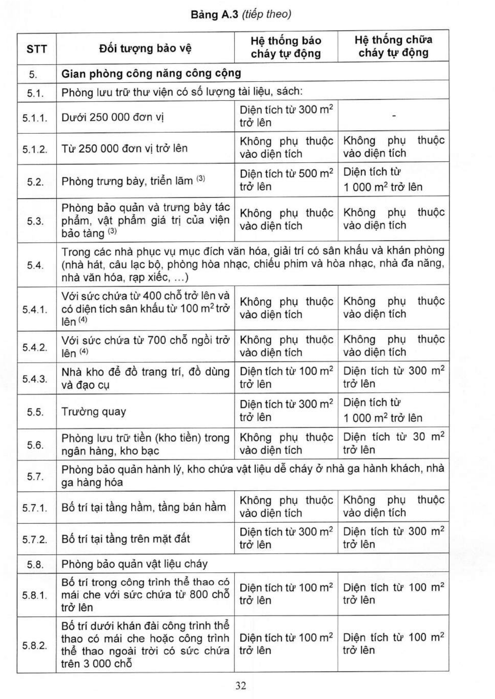
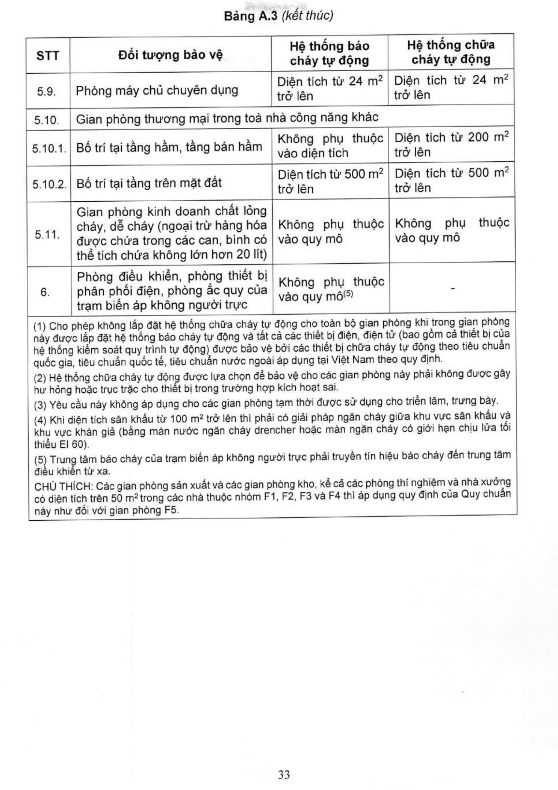
| STT | Đối tượng bảo vệ | Hệ thống báo cháy tự động | Hệ thống chữa cháy tự động |
|---|---|---|---|
| **1** | **Gian phòng kho** | | |
| 1.1 | Thuộc hạng nguy hiểm cháy và cháy nổ A, B | Không phụ thuộc vào diện tích | Diện tích từ 300 m² trở lên |
| 1.2 | Lưu trữ cao su, hạt nhựa; diêm, kim loại kiềm, sản phẩm pháo hoa; len, lông thú; chất cháy khác với khối lượng riêng nhỏ (dưới 3 kg/m³) | Không phụ thuộc vào diện tích | Diện tích từ 100 m² trở lên |
| 1.3 | Chứa hàng hóa không cháy nhưng bảo quản trong bao bì dễ cháy (có tải trọng cháy riêng từ 1 MJ/m² đến 180 MJ/m²) | Diện tích từ 300 m² trở lên | – |
| **1.4** | **Thuộc hạng nguy hiểm cháy C1** (không bao gồm các gian phòng nêu tại mục 1.2 và mục 1.3 Bảng này và các gian phòng kho nằm trong các nhà và cơ sở chế biến, lưu trữ nông sản dạng hạt) khi được đặt trong các tầng | | |
| 1.4.1 | — Bố trí tại tầng hầm, tầng bán hầm | Không phụ thuộc vào diện tích | Diện tích từ 100 m² trở lên |
| 1.4.2 | — Bố trí tại các tầng trên mặt đất | Diện tích từ 300 m² trở lên | Diện tích từ 300 m² trở lên |
| **1.5** | **Thuộc hạng nguy hiểm cháy C2, C3** (không bao gồm các gian phòng nêu tại mục 1.2 và mục 1.3 Bảng này và các gian phòng kho nằm trong các nhà và cơ sở chế biến, lưu trữ nông sản dạng hạt) | | |
| 1.5.1 | — Bố trí tại tầng hầm, tầng bán hầm | Diện tích từ 300 m² trở lên | Diện tích từ 300 m² trở lên |
| 1.5.2 | — Bố trí tại tầng trên mặt đất | Diện tích từ 1 000 m² trở lên | Diện tích từ 1 000 m² trở lên |
| 1.6 | Kho lạnh | Diện tích từ 300 m² trở lên | – |
| **2** | **Gian phòng sản xuất** | | |
| 2.1 | Thuộc hạng nguy hiểm cháy và cháy nổ A, B | Không phụ thuộc vào diện tích | Diện tích từ 300 m² trở lên |
| **2.2** | **Thuộc hạng nguy hiểm cháy C1** (trừ các phòng nằm trong các nhà và cơ sở chế biến, lưu trữ nông sản dạng hạt) | | |
| 2.2.1 | — Bố trí tại tầng hầm, tầng bán hầm | Không phụ thuộc vào diện tích | Không phụ thuộc vào diện tích |
| 2.2.2 | — Bố trí tại tầng trên mặt đất | Không phụ thuộc vào diện tích | Diện tích từ 300 m² trở lên |
| **2.3** | **Thuộc hạng nguy hiểm cháy C2, C3** (trừ các phòng nằm trong các nhà và cơ sở chế biến, lưu trữ nông sản dạng hạt) | | |
| 2.3.1 | — Bố trí tại tầng hầm, tầng bán hầm | | |
| 2.3.1.1 | — — Không có lối ra ngoài trực tiếp | Không phụ thuộc vào diện tích | Diện tích từ 300 m² trở lên |
| 2.3.1.2 | — — Có lối ra ngoài trực tiếp | – | Diện tích từ 700 m² trở lên |
| 2.3.2 | — Bố trí tại tầng trên mặt đất | Diện tích từ 300 m² trở lên | Diện tích từ 1 000 m² trở lên |
| 2.4 | Phòng sản xuất chất lỏng dễ cháy (dung môi, sơn, keo dán, dung dịch ngâm tẩm, cao su tổng hợp); phòng sản xuất huyền phù từ bột nhôm, keo cao su; phòng sơn; phòng tổng hợp cao su nhân tạo; phòng máy nén có sử dụng tuabin khí; phòng gia nhiệt dầu mỏ và dầu diesel | Không phụ thuộc vào diện tích | Không phụ thuộc vào diện tích |
| **3** | **Gian phòng thông tin liên lạc** | | |
| 3.1 | Phòng thiết bị phân tách, phòng phụ trợ (thông gió, máy biến áp) của công trình đài phát sóng có công suất phát 150 kW trở lên, trạm thu sóng với số lượng máy thu từ 20 máy, trạm thông tin vệ tinh cố định có công suất phát lớn hơn 1 kW, đài truyền hình chuyển tiếp có công suất phát 25-50 kW, các nút mạng, tổng đài điện thoại liên tỉnh và thành phố, trạm điện báo, điểm khuếch đại thiết bị đầu cuối và trung tâm liên lạc khu vực | Không phụ thuộc vào diện tích | – |
| 3.2 | Xưởng kỹ thuật của các trạm khuếch đại đầu cuối, trạm chuyển tiếp vô tuyến trung gian, trung tâm truyền và nhận sóng mà không có giám sát hoặc người trực vào buổi tối | Không phụ thuộc vào diện tích | Không phụ thuộc vào diện tích |
| 3.3 | Trạm gốc của hệ thống thông tin vô tuyến di động và trạm chuyển tiếp của hệ thống thông tin vô tuyến di động không có giám sát | Không phụ thuộc vào diện tích | Diện tích từ 24 m² trở lên |
| **3.4** | **Phòng tổng đài số, trung tâm kiểm soát điện thoại; trung tâm máy tính, điện báo của bưu điện tỉnh, thành phố** trong nhà có khối tích: | | |
| 3.4.1 | — Dưới 40 000 m³ | Không phụ thuộc vào diện tích | – |
| 3.4.2 | — 40 000 m³ trở lên | Không phụ thuộc vào diện tích | Diện tích từ 24 m² trở lên |
| **3.5** | **Phòng tổng đài điện thoại**, trong đó thiết bị chuyển mạch là loại điện tử hoặc bán điện tử được lắp đặt cùng với một máy tính được sử dụng như một tổ hợp điều khiển, thiết bị đầu vào, đầu ra; phòng chứa thiết bị chuyển mạch điện tử, nút, trung tâm truyền thông tài liệu với công suất: ⁽¹⁾ ⁽²⁾ | | |
| 3.5.1 | — Dưới 10 000 số, kênh hoặc điểm kết nối | Không phụ thuộc vào diện tích | – |
| 3.5.2 | — Từ 10 000 số, kênh hoặc điểm kết nối trở lên | Không phụ thuộc vào diện tích | Không phụ thuộc vào diện tích |
| **3.6** | **Phòng đặt thiết bị chia, kết nối có sử dụng máy vi tính để điều khiển các tổng đài điện thoại tự động** với công suất trạm: | | |
| 3.6.1 | — Dưới 10 000 kênh liên tỉnh, thành phố | Không phụ thuộc vào diện tích | – |
| 3.6.2 | — Từ 10 000 kênh liên tỉnh, thành phố trở lên | Không phụ thuộc vào diện tích | Diện tích từ 24 m² trở lên |
| 3.7 | Phòng để xử lý, phân loại, lưu trữ và chuyển phát bưu kiện, thư từ, điện tín, điện báo, báo chí | Không phụ thuộc vào diện tích | Diện tích từ 500 m² trở lên |
| **4** | **Gian phòng phụ trợ thuộc lĩnh vực giao thông vận tải** | | |
| 4.1 | Phòng máy điện, thiết bị, sửa chữa và gia công toa tàu, bánh, động cơ... có hạng nguy hiểm cháy và cháy nổ từ hạng C3 trở lên thuộc cơ sở đóng mới, sửa chữa, bảo dưỡng tàu hoả, tàu điện, tàu thủy | Diện tích từ 300 m² trở lên | Diện tích từ 1 000 m² trở lên |
| 4.2 | Phòng sửa chữa, bảo dưỡng, lưu giữ phương tiện giao thông cơ giới đường bộ (ngoại trừ ô tô) | Diện tích từ 1 000 m² trở lên | Diện tích từ 1 000 m² trở lên |
| 4.3 | Phòng sửa chữa, bảo dưỡng ô tô | Diện tích từ 300 m² trở lên | Diện tích từ 700 m² trở lên |
| 4.4 | Phòng lưu giữ ô tô trong nhà có công năng khác (trừ trong nhà ở riêng lẻ kết hợp sản xuất, kinh doanh) | Không phụ thuộc vào diện tích | Từ 3 xe ô tô trở lên |
| 4.5 | Phòng tháo lắp động cơ máy bay, thiết bị bay, bánh xe máy bay, trực thăng; phòng sản xuất, sửa chữa động cơ máy bay | Không phụ thuộc vào diện tích | Không phụ thuộc vào diện tích |
| 4.6 | Phòng đặt máy bơm chữa cháy, phòng thông gió, kho vật tư, hàng hóa của hầm giao thông đường bộ | Không phụ thuộc vào diện tích | – |
| **5** | **Gian phòng công năng công cộng** | | |
| **5.1** | **Phòng lưu trữ thư viện** có số lượng tài liệu, sách: | | |
| 5.1.1 | — Dưới 250 000 đơn vị | Diện tích từ 300 m² trở lên | – |
| 5.1.2 | — Từ 250 000 đơn vị trở lên | Không phụ thuộc vào diện tích | Không phụ thuộc vào diện tích |
| 5.2 | Phòng trưng bày, triển lãm ⁽³⁾ | Diện tích từ 500 m² trở lên | Diện tích từ 1 000 m² trở lên |
| 5.3 | Phòng bảo quản và trưng bày tác phẩm, vật phẩm giá trị của viện bảo tàng ⁽³⁾ | Không phụ thuộc vào diện tích | Không phụ thuộc vào diện tích |
| **5.4** | **Trong các nhà phục vụ mục đích văn hóa, giải trí có sân khấu và khán phòng** (nhà hát, câu lạc bộ, phòng hòa nhạc, chiếu phim và hòa nhạc, nhà đa năng, nhà văn hóa, rạp xiếc, ...) | | |
| 5.4.1 | — Với sức chứa từ 400 chỗ trở lên và có diện tích sân khấu từ 100 m² trở lên ⁽⁴⁾ | Không phụ thuộc vào diện tích | Không phụ thuộc vào diện tích |
| 5.4.2 | — Với sức chứa từ 700 chỗ ngồi trở lên ⁽⁴⁾ | Không phụ thuộc vào diện tích | Không phụ thuộc vào diện tích |
| 5.4.3 | — Nhà kho để đồ trang trí, đồ dùng và đạo cụ | Diện tích từ 100 m² trở lên | Diện tích từ 300 m² trở lên |
| 5.5 | Trường quay | Diện tích từ 300 m² trở lên | Diện tích từ 1 000 m² trở lên |
| 5.6 | Phòng lưu trữ tiền (kho tiền) trong ngân hàng, kho bạc | Không phụ thuộc vào diện tích | Diện tích từ 30 m² trở lên |
| **5.7** | **Phòng bảo quản hành lý, kho chứa vật liệu dễ cháy ở nhà ga hành khách, nhà ga hàng hóa** | | |
| 5.7.1 | — Bố trí tại tầng hầm, tầng bán hầm | Không phụ thuộc vào diện tích | Không phụ thuộc vào diện tích |
| 5.7.2 | — Bố trí tại tầng trên mặt đất | Diện tích từ 300 m² trở lên | Diện tích từ 300 m² trở lên |
| **5.8** | **Phòng bảo quản vật liệu cháy** | | |
| 5.8.1 | — Bố trí trong công trình thể thao có mái che với sức chứa từ 800 chỗ trở lên | Diện tích từ 100 m² trở lên | Diện tích từ 100 m² trở lên |
| 5.8.2 | — Bố trí dưới khán đài công trình thể thao có mái che hoặc công trình thể thao ngoài trời có sức chứa trên 3 000 chỗ | Diện tích từ 100 m² trở lên | Diện tích từ 100 m² trở lên |
| 5.9 | Phòng máy chủ chuyên dụng | Diện tích từ 24 m² trở lên | Diện tích từ 24 m² trở lên |
| **5.10** | **Gian phòng thương mại trong toà nhà công năng khác** | | |
| 5.10.1 | — Bố trí tại tầng hầm, tầng bán hầm | Không phụ thuộc vào diện tích | Diện tích từ 200 m² trở lên |
| 5.10.2 | — Bố trí tại tầng trên mặt đất | Diện tích từ 500 m² trở lên | Diện tích từ 500 m² trở lên |
| 5.11 | Gian phòng kinh doanh chất lỏng cháy, dễ cháy (ngoại trừ hàng hóa được chứa trong các can, bình có thể tích chứa không lớn hơn 20 lít) | Không phụ thuộc vào quy mô | Không phụ thuộc vào quy mô |
| 6 | Phòng điều khiển, phòng thiết bị phân phối điện, phòng ắc quy của trạm biến áp không người trực | Không phụ thuộc vào quy mô ⁽⁵⁾ | – |

**Chú thích của Bảng A.3:**

⁽¹⁾ Cho phép không lắp đặt hệ thống chữa cháy tự động cho toàn bộ gian phòng khi trong gian phòng này được lắp đặt hệ thống báo cháy tự động và tất cả các thiết bị điện, điện tử (bao gồm cả thiết bị của hệ thống kiểm soát quy trình tự động) được bảo vệ bởi các thiết bị chữa cháy tự động theo tiêu chuẩn quốc gia, tiêu chuẩn quốc tế, tiêu chuẩn nước ngoài áp dụng tại Việt Nam theo quy định.

⁽²⁾ Hệ thống chữa cháy tự động được lựa chọn để bảo vệ cho các gian phòng này phải không được gây hư hỏng hoặc trục trặc cho thiết bị trong trường hợp kích hoạt sai.

⁽³⁾ Yêu cầu này không áp dụng cho các gian phòng tạm thời được sử dụng cho triển lãm, trưng bày.

⁽⁴⁾ Khi diện tích sân khấu từ 100 m² trở lên thì phải có giải pháp ngăn cháy giữa khu vực sân khấu và khu vực khán giả (bằng màn nước ngăn cháy drencher hoặc màn ngăn cháy có giới hạn chịu lửa tối thiểu EI 60).

⁽⁵⁾ Trung tâm báo cháy của trạm biến áp không người trực phải truyền tín hiệu báo cháy đến trung tâm điều khiển từ xa.

> CHÚ THÍCH: Các gian phòng sản xuất và các gian phòng kho, kể cả các phòng thí nghiệm và nhà xưởng có diện tích trên 50 m² trong các nhà thuộc nhóm F1, F2, F3 và F4 thì áp dụng quy định của Quy chuẩn này như đối với gian phòng F5.

## Bảng A.4 - Đối với thiết bị

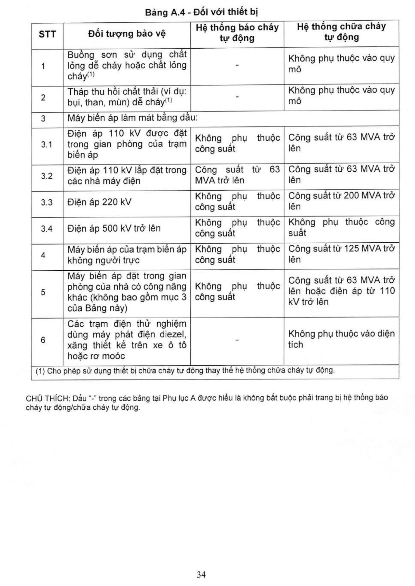

| STT | Đối tượng bảo vệ | Hệ thống báo cháy tự động | Hệ thống chữa cháy tự động |
|---|---|---|---|
| 1 | Buồng sơn sử dụng chất lỏng dễ cháy hoặc chất lỏng cháy ⁽¹⁾ | – | Không phụ thuộc vào quy mô |
| 2 | Tháp thu hồi chất thải (ví dụ: bụi, than, mùn) dễ cháy ⁽¹⁾ | – | Không phụ thuộc vào quy mô |
| **3** | **Máy biến áp làm mát bằng dầu:** | | |
| 3.1 | — Điện áp 110 kV được đặt trong gian phòng của trạm biến áp | Không phụ thuộc công suất | Công suất từ 63 MVA trở lên |
| 3.2 | — Điện áp 110 kV lắp đặt trong các nhà máy điện | Công suất từ 63 MVA trở lên | Công suất từ 63 MVA trở lên |
| 3.3 | — Điện áp 220 kV | Không phụ thuộc công suất | Công suất từ 200 MVA trở lên |
| 3.4 | — Điện áp 500 kV trở lên | Không phụ thuộc công suất | Không phụ thuộc công suất |
| 4 | Máy biến áp của trạm biến áp không người trực | Không phụ thuộc công suất | Công suất từ 125 MVA trở lên |
| 5 | Máy biến áp đặt trong gian phòng của nhà có công năng khác (không bao gồm mục 3 của Bảng này) | Không phụ thuộc công suất | Công suất từ 63 MVA trở lên hoặc điện áp từ 110 kV trở lên |
| 6 | Các trạm điện thử nghiệm dùng máy phát điện diezel, xăng thiết kế trên xe ô tô hoặc rơ moóc | – | Không phụ thuộc vào diện tích |

⁽¹⁾ Cho phép sử dụng thiết bị chữa cháy tự động thay thế hệ thống chữa cháy tự động.

> CHÚ THÍCH: Dấu "–" trong các bảng tại Phụ lục A được hiểu là **không bắt buộc** phải trang bị hệ thống báo cháy tự động/chữa cháy tự động.
