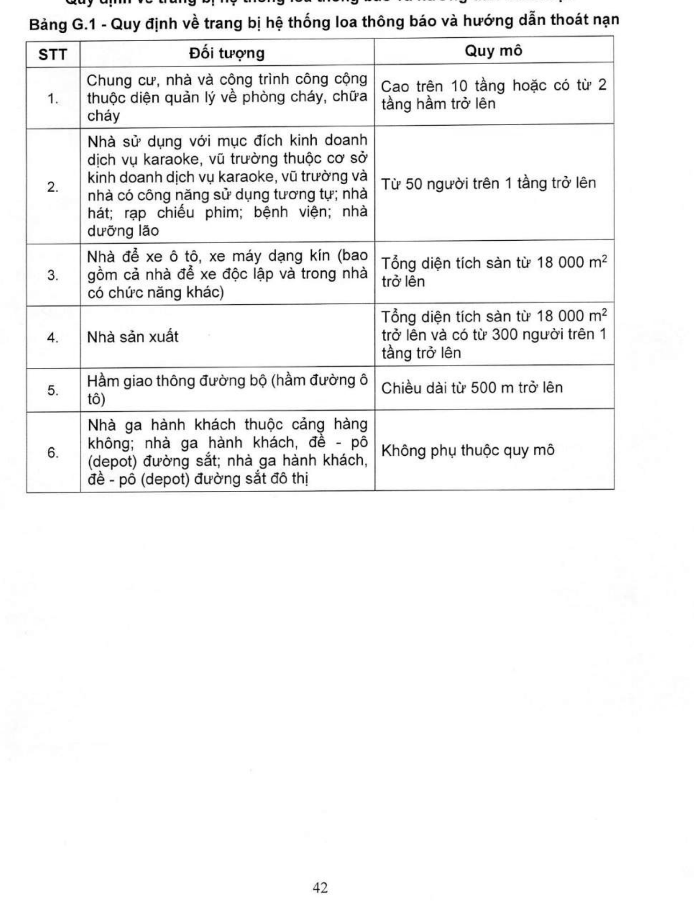

# Phụ lục G — QUY ĐỊNH VỀ TRANG BỊ HỆ THỐNG LOA THÔNG BÁO VÀ HƯỚNG DẪN THOÁT NẠN

*(Quy định)*

> Yêu cầu thiết kế, lắp đặt xem mục **H.4** (mục 2.2.5 QCVN 10:2025/BCA).

## Bảng G.1 - Quy định về trang bị hệ thống loa thông báo và hướng dẫn thoát nạn

| STT | Đối tượng | Quy mô |
|---|---|---|
| 1 | Chung cư, nhà và công trình công cộng thuộc diện quản lý về phòng cháy, chữa cháy | Cao trên 10 tầng hoặc có từ 2 tầng hầm trở lên |
| 2 | Nhà sử dụng với mục đích kinh doanh dịch vụ karaoke, vũ trường thuộc cơ sở kinh doanh dịch vụ karaoke, vũ trường và nhà có công năng sử dụng tương tự; nhà hát; rạp chiếu phim; bệnh viện; nhà dưỡng lão | Từ 50 người trên 1 tầng trở lên |
| 3 | Nhà để xe ô tô, xe máy dạng kín (bao gồm cả nhà để xe độc lập và trong nhà có chức năng khác) | Tổng diện tích sàn từ 18 000 m² trở lên |
| 4 | Nhà sản xuất | Tổng diện tích sàn từ 18 000 m² trở lên và có từ 300 người trên 1 tầng trở lên |
| 5 | Hầm giao thông đường bộ (hầm đường ô tô) | Chiều dài từ 500 m trở lên |
| 6 | Nhà ga hành khách thuộc cảng hàng không; nhà ga hành khách, đề-pô (depot) đường sắt; nhà ga hành khách, đề-pô (depot) đường sắt đô thị | Không phụ thuộc quy mô |
